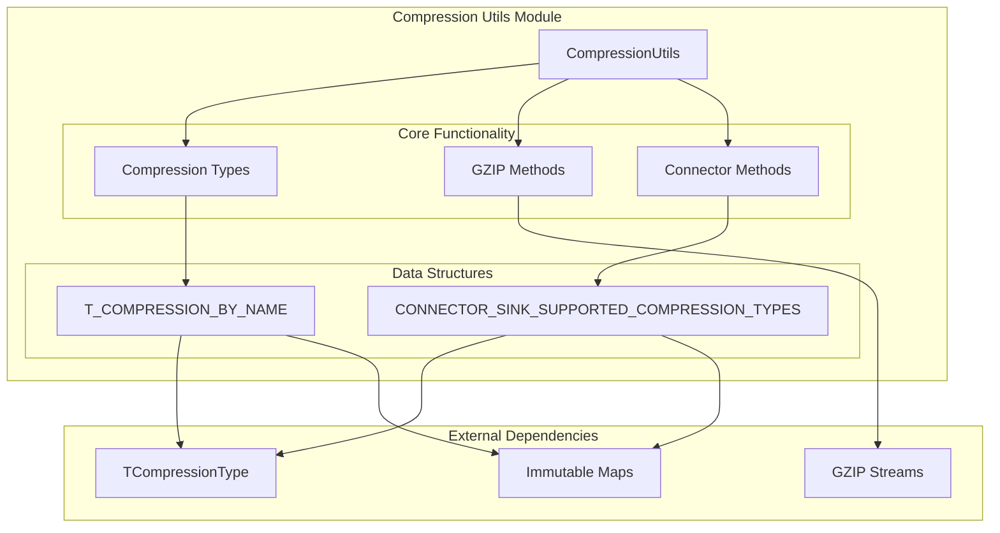
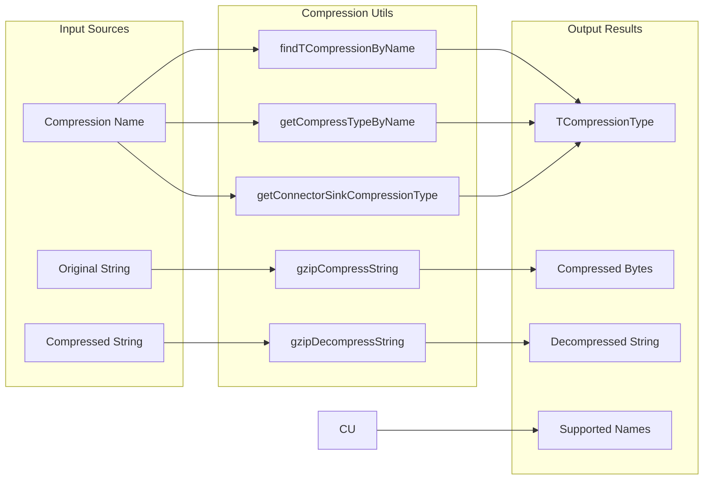

# Compression Utils Module

## Introduction

The `compression_utils` module provides a centralized utility library for handling data compression operations within the StarRocks system. It serves as a unified interface for managing different compression algorithms, converting between compression type names and their corresponding Thrift representations, and providing specialized compression/decompression functionality for specific formats like GZIP.

## Module Overview

The compression utilities module is a critical component of the StarRocks common utilities layer, providing essential compression functionality that is used throughout the system for data storage, transmission, and processing optimization.

## Core Components

### CompressionUtils Class

The `CompressionUtils` class is the main utility class that provides static methods for compression-related operations. It serves as a central hub for:

- Compression type name resolution and validation
- Thrift compression type mapping
- GZIP compression and decompression operations
- Connector-specific compression type support

## Architecture

### Component Structure



### Data Flow Architecture



## Key Features

### 1. Compression Type Management

The module maintains comprehensive mappings between compression type names and their corresponding Thrift representations:

- **Supported Compression Types**: NO_COMPRESSION, AUTO, LZ4, LZ4_FRAME, SNAPPY, ZLIB, ZSTD, GZIP, DEFLATE, BZIP2
- **Case-insensitive lookups** for improved usability
- **Validation mechanisms** to ensure only supported compression types are used

### 2. GZIP Compression Support

Specialized GZIP compression functionality for string data:

- **Compression**: String to byte array conversion with GZIP
- **Decompression**: Byte array to string conversion with automatic format detection
- **Validation**: GZIP format detection for compressed data

### 3. Connector-Specific Compression

Tailored compression support for different connector types:

- **Connector Sink Support**: Specialized compression types for data export
- **Flexible Naming**: Support for multiple naming conventions (NO_COMPRESSION, UNCOMPRESSED, NONE)
- **Optional Returns**: Safe handling of unsupported compression types

## API Reference

### Compression Type Methods

#### `findTCompressionByName(String name)`
Returns the TCompressionType corresponding to the input name, or null if invalid.

#### `getCompressTypeByName(String name)`
Returns TCompressionType for supported compression types (LZ4, ZLIB, ZSTD, SNAPPY), null otherwise.

#### `getConnectorSinkCompressionType(String name)`
Returns Optional<TCompressionType> for connector sink supported compression types.

#### `getSupportedCompressionNames()`
Returns a list of all supported compression type names.

### GZIP Methods

#### `gzipCompressString(String origStr)`
Compresses a string using GZIP format and returns the compressed byte array.

#### `gzipDecompressString(byte[] compressedStr)`
Decompresses a GZIP-compressed byte array back to the original string.

#### `isGzipCompressed(byte[] compressedStr)`
Checks if the provided byte array contains GZIP-compressed data.

## Usage Examples

### Basic Compression Type Lookup

```java
// Find compression type by name
TCompressionType type = CompressionUtils.findTCompressionByName("GZIP");
if (type != null) {
    // Use the compression type
}

// Get supported compression type (limited set)
TCompressionType supportedType = CompressionUtils.getCompressTypeByName("LZ4");
```

### GZIP Compression Operations

```java
// Compress a string
String originalData = "Large amount of text data";
byte[] compressedData = CompressionUtils.gzipCompressString(originalData);

// Decompress the data
String decompressedData = CompressionUtils.gzipDecompressString(compressedData);

// Check if data is GZIP compressed
boolean isCompressed = CompressionUtils.isGzipCompressed(compressedData);
```

### Connector-Specific Operations

```java
// Get connector sink compression type
Optional<TCompressionType> connectorType = 
    CompressionUtils.getConnectorSinkCompressionType("SNAPPY");

connectorType.ifPresent(type -> {
    // Use the connector-specific compression type
});
```

## Integration with Other Modules

### Storage Engine Integration

The compression utilities module integrates with the [storage_engine](storage_engine.md) module to provide compression support for:

- **Data Storage**: Compression algorithms for storing data efficiently
- **Data Transfer**: Compression for network transmission optimization
- **Backup Operations**: Compression for backup and restore processes

### Query Execution Integration

Integration with the [query_execution](query_execution.md) module enables:

- **Result Set Compression**: Compression of query results for network transmission
- **Intermediate Data**: Compression of intermediate query processing data
- **Spill to Disk**: Compression for data spilling operations

### Connector Framework Integration

The module supports the [connectors](connectors.md) framework by providing:

- **Export Compression**: Compression support for data export operations
- **Format-Specific Compression**: Support for connector-specific compression requirements
- **Cross-Platform Compatibility**: Standardized compression type handling

## Performance Considerations

### Compression Algorithm Selection

Different compression algorithms offer varying trade-offs between compression ratio and speed:

- **LZ4**: Fast compression with moderate compression ratio
- **ZSTD**: Good balance between compression ratio and speed
- **GZIP**: Higher compression ratio but slower processing
- **SNAPPY**: Very fast compression with reasonable compression ratio

### Memory Management

The module implements efficient memory management:

- **Stream-based Processing**: Uses streaming APIs to handle large data sets
- **Buffer Management**: Optimized buffer sizes for different operations
- **Resource Cleanup**: Proper resource management with try-with-resources patterns

## Error Handling

### Exception Management

The module handles various error scenarios:

- **Invalid Compression Types**: Returns null or Optional.empty() for unsupported types
- **IO Exceptions**: Propagates IOException for compression/decompression failures
- **Null Safety**: Handles null inputs gracefully

### Validation

Comprehensive validation is performed:

- **Input Validation**: Checks for null or empty inputs
- **Format Validation**: Validates GZIP format before decompression
- **Type Validation**: Ensures only supported compression types are used

## Dependencies

### External Libraries

- **Google Guava**: Immutable collections and string utilities
- **Java ZIP API**: GZIP compression and decompression
- **StarRocks Thrift**: TCompressionType definitions

### Internal Dependencies

- **Common Utilities**: Part of the broader common utilities framework
- **Thrift Definitions**: Integration with StarRocks Thrift types
- **Connector Framework**: Support for connector-specific operations

## Future Enhancements

### Planned Features

- **Additional Compression Algorithms**: Support for emerging compression formats
- **Performance Optimization**: Enhanced performance for large-scale operations
- **Streaming API**: Support for streaming compression/decompression
- **Compression Analytics**: Metrics and monitoring for compression operations

### Extensibility

The module is designed for extensibility:

- **Plugin Architecture**: Support for custom compression algorithms
- **Configuration-Driven**: Runtime configuration of compression preferences
- **Modular Design**: Easy addition of new compression types and methods