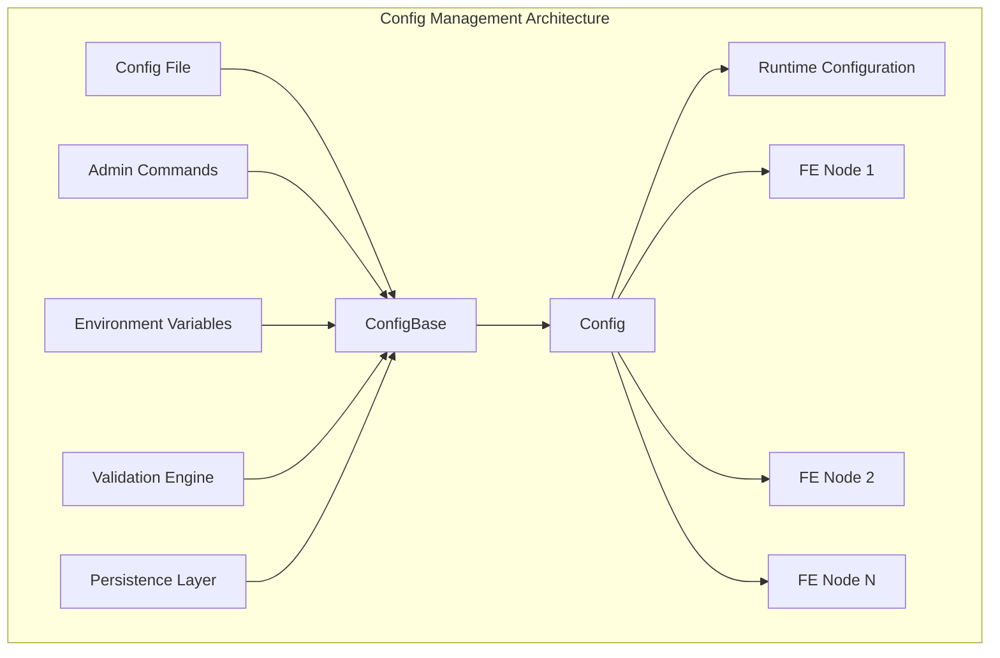
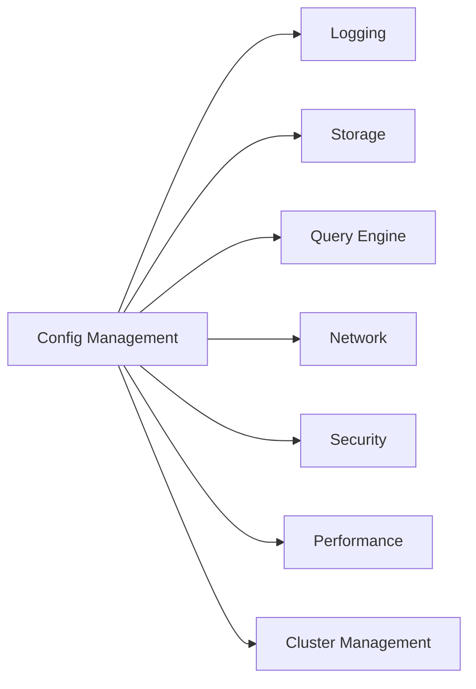
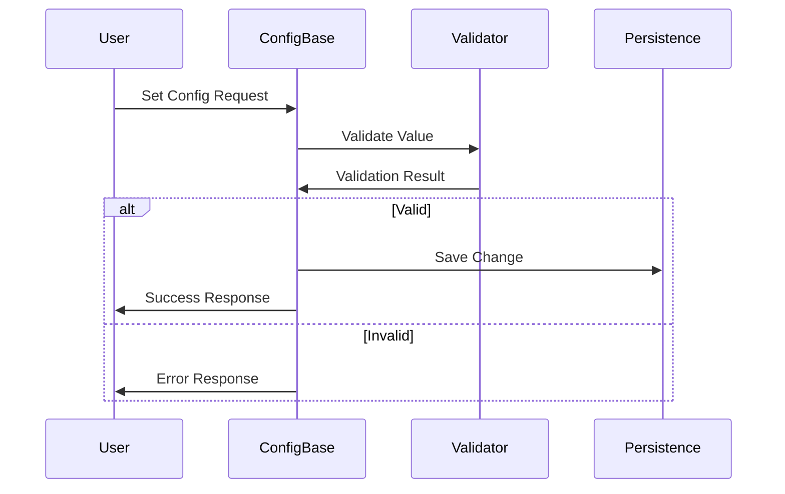

# Config Management Module

## Overview

The config_management module is a critical component of StarRocks that provides centralized configuration management for the entire system. It handles the loading, validation, persistence, and runtime modification of system configurations across all Frontend (FE) nodes in the cluster.

## Purpose

This module serves as the single source of truth for system-wide configuration parameters, enabling:
- **Centralized Configuration**: Manage all system parameters from a unified location
- **Dynamic Updates**: Modify configurations at runtime without system restart
- **Cluster Consistency**: Ensure configuration consistency across all FE nodes
- **Validation**: Validate configuration values before application
- **Persistence**: Maintain configuration changes across system restarts

## Architecture



## Core Components

### Config Class
The main configuration class that extends ConfigBase and contains all system configuration parameters. It provides:
- **Static Configuration Fields**: Over 500+ configuration parameters
- **Type Safety**: Strongly typed configuration values
- **Default Values**: Sensible defaults for all parameters
- **Documentation**: Inline comments explaining each configuration

### ConfigBase Class
The base class that provides core configuration management functionality:
- **Configuration Loading**: Load from properties files
- **Environment Variable Substitution**: Support for ${VAR} syntax
- **Validation**: Type checking and value validation
- **Persistence**: Save changes back to configuration files
- **Cluster Synchronization**: Propagate changes across FE nodes

## Key Features

### 1. Configuration Categories
The module manages configurations across multiple categories:



### 2. Runtime Modification
- **Mutable Configurations**: Over 200+ parameters can be changed at runtime
- **Admin Commands**: Use `ADMIN SET CONFIG` to modify configurations
- **Cluster-wide Propagation**: Changes automatically sync to all FE nodes
- **Validation**: Ensure new values are valid before application

### 3. Persistence Mechanism
- **File-based Storage**: Configurations stored in fe.conf
- **Change Tracking**: Maintain history of configuration changes
- **User Attribution**: Track who made configuration changes
- **Backup Support**: Automatic backup of configuration files

## Configuration Validation

The module implements comprehensive validation:



## Sub-modules

The config_management module contains several specialized sub-modules:

### 1. [Configuration Validation](config_validation.md)
Handles validation of configuration values, type checking, and constraint enforcement. This sub-module ensures that all configuration values meet the required criteria before being applied to the system.

### 2. [Configuration Persistence](config_persistence.md)
Manages saving configuration changes to disk and maintaining configuration history. This sub-module handles the persistence layer, ensuring that configuration changes are safely stored and can be recovered if needed.

### 3. [Cluster Synchronization](cluster_sync.md)
Ensures configuration consistency across all Frontend nodes in the cluster. This sub-module handles the propagation of configuration changes to all FE nodes, maintaining cluster-wide consistency.

## Usage Examples

### Basic Configuration Access
```java
// Access configuration value
int maxConnections = Config.qe_max_connection;
String logLevel = Config.sys_log_level;
```

### Runtime Configuration Update
```sql
-- Update configuration at runtime
ADMIN SET FRONTEND CONFIG ("qe_max_connection" = "8192");
```

### Configuration with Persistence
```sql
-- Update and persist configuration
ADMIN SET FRONTEND CONFIG ("sys_log_level" = "DEBUG") PERSISTENT;
```

## Integration Points

The config_management module integrates with:
- **[frontend_server](frontend_server.md)**: Provides configuration to all FE services
- **[query_execution](query_execution.md)**: Query engine configuration parameters
- **[storage_engine](storage_engine.md)**: Storage-related configurations
- **[sql_parser_optimizer](sql_parser_optimizer.md)**: SQL processing configurations

## Best Practices

### 1. Configuration Naming
- Use descriptive names that indicate purpose
- Follow consistent naming conventions
- Group related configurations with common prefixes

### 2. Default Values
- Provide sensible defaults for all configurations
- Document the impact of each configuration
- Consider different deployment scenarios

### 3. Validation
- Implement proper type checking
- Add range validation for numeric values
- Validate interdependencies between configurations

### 4. Documentation
- Document all configurations with clear comments
- Provide examples of valid values
- Explain the impact of configuration changes

## Performance Considerations

- **Memory Usage**: Configuration objects are kept in memory
- **Access Pattern**: Static fields provide fast access
- **Synchronization**: Thread-safe for concurrent access
- **Validation Overhead**: Minimal impact on performance

## Security Features

- **Access Control**: Only authorized users can modify configurations
- **Audit Trail**: Track all configuration changes
- **Validation**: Prevent invalid or dangerous configurations
- **Encryption**: Support for encrypted sensitive configurations

## Monitoring and Maintenance

- **Configuration Health**: Monitor for invalid configurations
- **Change Tracking**: Track configuration changes over time
- **Performance Metrics**: Monitor configuration access patterns
- **Backup/Restore**: Support for configuration backup and restore

## Related Documentation

- [Frontend Server](frontend_server.md) - Main server components
- [Query Execution](query_execution.md) - Query processing configurations
- [Storage Engine](storage_engine.md) - Storage configurations
- [SQL Parser & Optimizer](sql_parser_optimizer.md) - SQL processing configurations