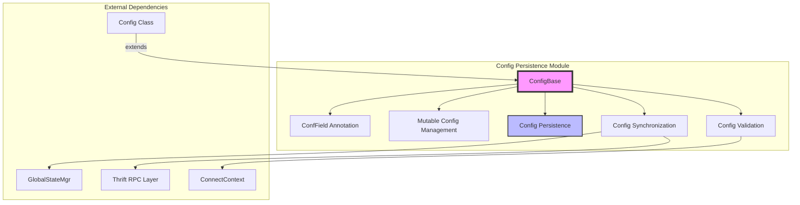
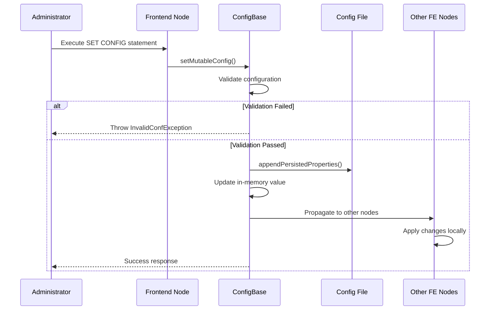
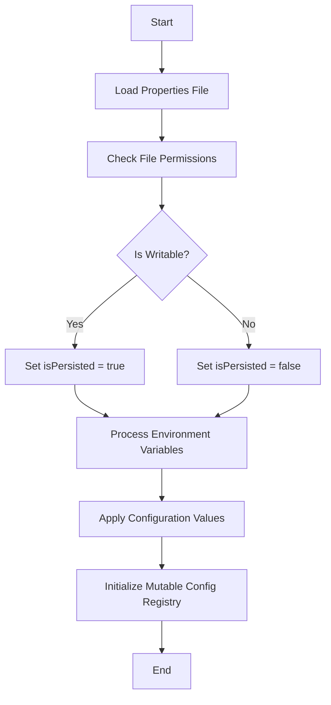

# Config Persistence Module

## Introduction

The Config Persistence module is a critical component of StarRocks' configuration management system, responsible for managing the persistence and synchronization of mutable configuration parameters across the cluster. This module ensures that configuration changes made at runtime are properly saved, synchronized across all Frontend nodes, and maintained across system restarts.

## Core Functionality

The Config Persistence module provides three primary capabilities:

1. **Runtime Configuration Management**: Allows modification of configuration parameters without requiring system restart
2. **Configuration Persistence**: Saves configuration changes to disk for durability across restarts
3. **Cluster-wide Synchronization**: Propagates configuration changes across all Frontend nodes in the cluster

## Architecture

### Component Structure



### Key Components

#### 1. ConfigBase Class
The foundation class that provides configuration management capabilities:
- **Field Discovery**: Automatically discovers all configuration fields annotated with `@ConfField`
- **Type Conversion**: Handles conversion between string values and various data types (primitives, arrays)
- **Environment Variable Substitution**: Supports `${ENV_VAR}` syntax for dynamic configuration
- **Validation**: Validates configuration values before application

#### 2. ConfField Annotation
Defines metadata for configuration parameters:
```java
@Retention(RetentionPolicy.RUNTIME)
public @interface ConfField {
    boolean mutable() default false;    // Whether config can be changed at runtime
    String comment() default "";       // Description of the configuration
    String[] aliases() default {};     // Alternative names for backward compatibility
}
```

#### 3. Mutable Configuration Management
Tracks and manages runtime-modifiable configurations:
- Maintains a registry of all mutable configuration fields
- Supports alias resolution for backward compatibility
- Provides thread-safe access to configuration values

#### 4. Configuration Persistence
Handles saving configuration changes to disk:
- **File Format Preservation**: Maintains original configuration file formatting
- **Audit Trail**: Adds comments indicating who made changes and when
- **Atomic Updates**: Ensures configuration file integrity during updates

## Data Flow

### Configuration Change Process



### Configuration Loading Process



## Key Features

### 1. Runtime Configuration Updates
- **Thread Safety**: All configuration updates are synchronized
- **Validation**: Comprehensive validation before applying changes
- **Rollback**: Failed updates don't affect running system
- **Audit Logging**: Complete audit trail of all configuration changes

### 2. Configuration Persistence
- **Format Preservation**: Maintains original file formatting and comments
- **Atomic Updates**: Uses file locking to prevent corruption
- **Backup Safety**: Creates safe updates without data loss
- **User Tracking**: Records which user made each change

### 3. Cluster Synchronization
- **Automatic Propagation**: Changes automatically sync to all Frontend nodes
- **Error Handling**: Graceful handling of node failures during sync
- **Consistency**: Ensures all nodes have consistent configuration
- **Timeout Management**: Configurable timeouts for synchronization operations

## Configuration Types Supported

### Primitive Types
- `short`, `int`, `long`
- `double`, `boolean`
- `String`

### Array Types
- `short[]`, `int[]`, `long[]`
- `double[]`, `boolean[]`
- `String[]`

### Special Handling
- **Authentication Chain**: Special validation for authentication configurations
- **Environment Variables**: Runtime substitution using `${VAR}` syntax
- **Aliases**: Backward compatibility through configuration name aliases

## Error Handling

### Validation Errors
- **Type Mismatch**: Validates data types before assignment
- **Range Validation**: Ensures values are within acceptable ranges
- **Format Validation**: Validates string formats and patterns
- **Dependency Validation**: Checks inter-configuration dependencies

### Persistence Errors
- **File Access**: Handles read/write permission issues
- **Disk Space**: Manages insufficient disk space scenarios
- **File Corruption**: Detects and handles corrupted configuration files
- **Concurrent Access**: Manages simultaneous configuration updates

### Synchronization Errors
- **Network Failures**: Handles network connectivity issues
- **Node Failures**: Manages unresponsive Frontend nodes
- **Timeout Handling**: Configurable timeouts for cluster operations
- **Partial Failures**: Handles partial cluster update successes

## Integration Points

### Frontend Server Integration
- **GlobalStateMgr**: Integrates with cluster state management
- **ConnectContext**: Provides user context for audit logging
- **Thrift RPC**: Uses RPC layer for cluster communication

### Configuration Management Integration
- **Config Class**: Extends ConfigBase for application-specific configurations
- **Admin Commands**: Integrates with administrative command interface
- **Monitoring**: Provides configuration state for system monitoring

## Security Considerations

### Access Control
- **User Authentication**: Requires authenticated user for configuration changes
- **Authorization**: Checks user permissions before allowing changes
- **Audit Trail**: Complete audit log of all configuration modifications

### Data Protection
- **File Permissions**: Respects file system permissions
- **Secure Transmission**: Uses secure RPC for cluster synchronization
- **Validation**: Prevents injection of malicious configuration values

## Performance Characteristics

### Scalability
- **Memory Efficient**: Minimal memory overhead for configuration storage
- **Fast Lookup**: O(1) configuration value access
- **Lazy Loading**: Configurations loaded only when needed

### Synchronization Performance
- **Parallel Updates**: Supports concurrent updates to different configurations
- **Batch Operations**: Efficient batch processing for multiple changes
- **Network Optimization**: Minimal network traffic for synchronization

## Best Practices

### Configuration Design
1. **Use Appropriate Types**: Choose correct data types for configuration values
2. **Add Comments**: Provide clear descriptions using `@ConfField(comment = "...")`
3. **Consider Mutability**: Carefully decide which configurations should be mutable
4. **Use Aliases**: Maintain backward compatibility when renaming configurations

### Runtime Management
1. **Validate Changes**: Always validate configuration changes before applying
2. **Test in Staging**: Test configuration changes in non-production environments
3. **Monitor Impact**: Monitor system behavior after configuration changes
4. **Document Changes**: Maintain documentation of configuration change history

### Cluster Operations
1. **Check Node Health**: Ensure all nodes are healthy before making changes
2. **Plan for Failures**: Have rollback procedures for failed updates
3. **Monitor Synchronization**: Verify successful propagation to all nodes
4. **Handle Timeouts**: Configure appropriate timeouts for large clusters

## Related Modules

- **[config_management](config_management.md)**: Parent module for configuration validation and management
- **[frontend_server](frontend_server.md)**: Integrates configuration persistence with Frontend server operations
- **[common_config](common_config.md)**: Provides the base configuration framework

## Conclusion

The Config Persistence module is essential for StarRocks' operational flexibility, enabling runtime configuration management while ensuring data durability and cluster consistency. Its robust design handles the complexities of distributed configuration management while maintaining system stability and performance.