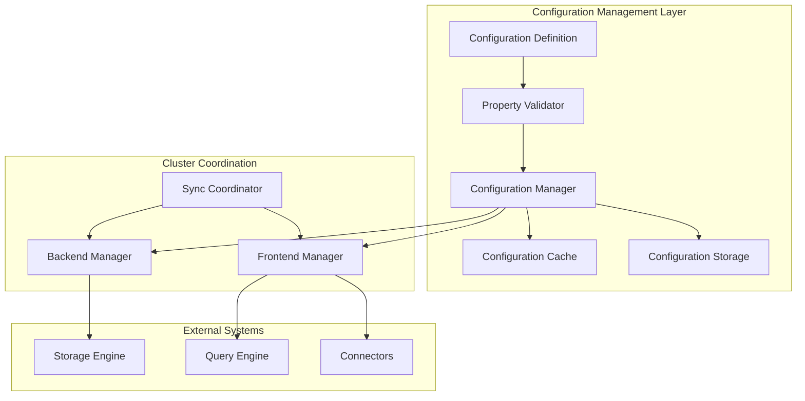
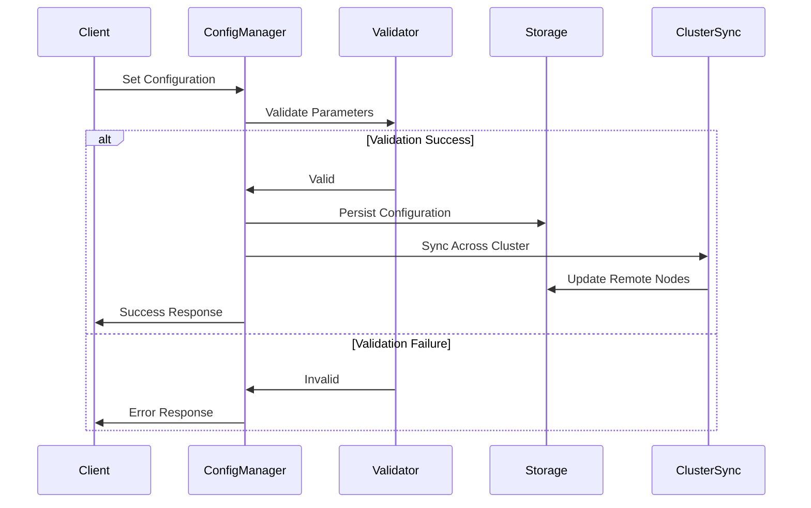
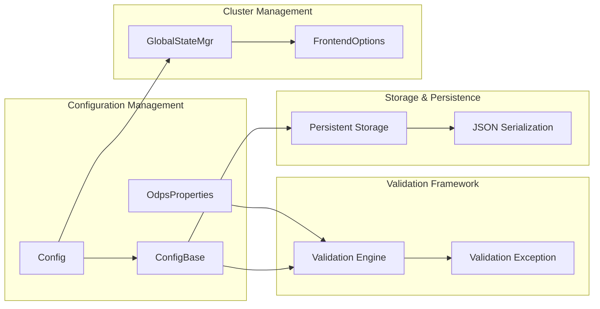
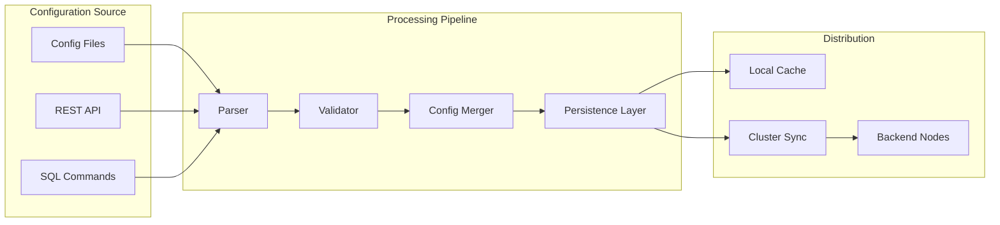
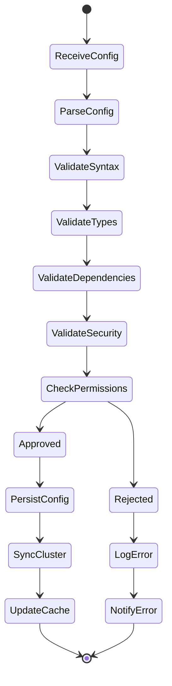

# Configuration Management Module

## Introduction

The configuration_management module provides a comprehensive framework for managing system-wide configuration parameters in StarRocks. This module handles configuration validation, persistence, synchronization across cluster nodes, and dynamic configuration updates. It serves as the central nervous system for all configurable aspects of the database, from storage engine parameters to query execution settings.

## Core Functionality

### Configuration Definition and Validation

The module implements a robust configuration system that supports:

- **Type-safe configuration parameters** with compile-time validation
- **Default value management** with fallback mechanisms
- **Required parameter enforcement** with comprehensive validation
- **Dynamic configuration updates** without system restart
- **Cluster-wide configuration synchronization**

### Key Components

#### Property Management System

The core `Property` class provides a fluent API for defining configuration parameters:

```java
static class Property {
    private final String key;
    
    Property(String key) {
        this.key = key;
    }
    
    Property withDefaultValue(Object defaultValue) {
        DEFAULT_VALUES.put(key, defaultValue.toString());
        return this;
    }
    
    Property noDefaultValue() {
        DEFAULT_VALUES.put(key, "");
        return this;
    }
    
    Property isRequired() {
        REQUIRED_PROPERTIES.add(key);
        return this;
    }
}
```

This builder pattern allows for intuitive configuration definition while maintaining type safety and validation capabilities.

#### Configuration Categories

The module manages several distinct configuration categories:

1. **Authentication & Security**: Access credentials, encryption settings, security policies
2. **Storage Configuration**: Cache settings, split policies, endpoint configurations
3. **Performance Tuning**: Row counts, cache sizes, expiration times
4. **Connector-Specific**: ODPS, Hive, Iceberg, and other connector configurations

## Architecture

### High-Level Architecture



### Configuration Flow



### Component Dependencies



## Configuration Categories

### ODPS Connector Configuration

The module provides comprehensive configuration management for ODPS (MaxCompute) connector:

```java
public class OdpsProperties {
    // Authentication
    public static final String ACCESS_ID = "odps.access.id";
    public static final String ACCESS_KEY = "odps.access.key";
    public static final String ENDPOINT = "odps.endpoint";
    public static final String PROJECT = "odps.project";
    
    // Performance & Tuning
    public static final String SPLIT_POLICY = "odps.split.policy";
    public static final String SPLIT_ROW_COUNT = "odps.split.row.count";
    public static final String TUNNEL_ENDPOINT = "odps.tunnel.endpoint";
    public static final String TUNNEL_QUOTA = "odps.tunnel.quota";
    
    // Caching Configuration
    public static final String ENABLE_TABLE_CACHE = "odps.cache.table.enable";
    public static final String TABLE_CACHE_EXPIRE_TIME = "odps.cache.table.expire";
    public static final String TABLE_CACHE_SIZE = "odps.cache.table.size";
    public static final String ENABLE_PARTITION_CACHE = "odps.cache.partition.enable";
    public static final String PARTITION_CACHE_EXPIRE_TIME = "odps.cache.partition.expire";
    public static final String PARTITION_CACHE_SIZE = "odps.cache.partition.size";
}
```

### Validation Framework

The configuration management integrates with a comprehensive validation framework:

- **Type Validation**: Ensures configuration values match expected data types
- **Range Validation**: Validates numeric parameters within acceptable ranges
- **Dependency Validation**: Checks inter-parameter dependencies
- **Security Validation**: Validates sensitive configuration parameters
- **Format Validation**: Ensures proper format for URLs, endpoints, and identifiers

## Integration Points

### Frontend Server Integration

The configuration management module integrates with the frontend server through:

- **GlobalStateMgr**: Central state management for cluster-wide configuration
- **FrontendOptions**: Server startup and initialization configuration
- **Session Variables**: Per-session configuration overrides

### Storage Engine Integration

Configuration parameters directly impact storage engine behavior:

- **Cache Management**: Table and partition cache configuration
- **Split Policies**: Data partitioning and distribution strategies
- **Connection Management**: Endpoint and quota configurations

### Query Execution Integration

Query execution components leverage configuration for:

- **Runtime Parameters**: Execution-time configuration adjustments
- **Resource Management**: Memory and CPU allocation settings
- **Performance Tuning**: Query optimization parameters

## Data Flow

### Configuration Update Flow



### Validation Process



## Key Features

### Dynamic Configuration Updates

The module supports runtime configuration changes without system restart:

- **Hot Reload**: Immediate application of configuration changes
- **Rollback Support**: Ability to revert problematic configurations
- **A/B Testing**: Support for configuration experimentation
- **Gradual Rollout**: Phased deployment of configuration changes

### Security and Compliance

Configuration management incorporates security best practices:

- **Credential Management**: Secure handling of access keys and passwords
- **Audit Logging**: Comprehensive logging of configuration changes
- **Access Control**: Role-based configuration modification permissions
- **Encryption**: Sensitive configuration parameter encryption

### Performance Optimization

The module includes performance optimization features:

- **Configuration Caching**: Efficient caching of frequently accessed configurations
- **Lazy Loading**: On-demand loading of configuration parameters
- **Batch Updates**: Efficient processing of multiple configuration changes
- **Memory Management**: Optimized memory usage for large configuration sets

## Error Handling and Recovery

### Validation Error Handling

The module implements comprehensive error handling:

- **Validation Exceptions**: Detailed error messages for invalid configurations
- **Missing Parameter Detection**: Clear identification of required parameters
- **Type Mismatch Handling**: Graceful handling of type conversion errors
- **Dependency Violation Reporting**: Clear reporting of inter-parameter conflicts

### Recovery Mechanisms

- **Default Fallback**: Automatic fallback to default values
- **Last Known Good**: Recovery to last known working configuration
- **Configuration Backup**: Automatic backup of configuration states
- **Emergency Override**: Administrative override capabilities

## Monitoring and Observability

### Configuration Metrics

The module provides comprehensive monitoring:

- **Configuration Change Tracking**: Audit trail of all configuration modifications
- **Validation Success/Failure Rates**: Monitoring of configuration validation performance
- **Synchronization Status**: Cluster-wide configuration consistency monitoring
- **Performance Impact**: Tracking of configuration changes on system performance

### Integration with Monitoring Systems

- **Prometheus Integration**: Export configuration metrics to Prometheus
- **Grafana Dashboards**: Pre-built dashboards for configuration monitoring
- **Alert Management**: Automated alerts for configuration issues
- **Log Integration**: Comprehensive logging for troubleshooting

## Best Practices

### Configuration Design

1. **Use Descriptive Names**: Clear, self-documenting configuration parameter names
2. **Provide Sensible Defaults**: Default values that work for most use cases
3. **Document Dependencies**: Clear documentation of inter-parameter relationships
4. **Implement Validation**: Comprehensive validation for all parameters
5. **Plan for Migration**: Support for configuration schema evolution

### Operational Guidelines

1. **Test Configuration Changes**: Always test configuration changes in non-production environments
2. **Use Gradual Rollout**: Implement changes gradually across the cluster
3. **Monitor Impact**: Continuously monitor the impact of configuration changes
4. **Maintain Backups**: Keep backups of working configuration states
5. **Document Changes**: Maintain comprehensive documentation of configuration modifications

## Related Modules

- [Connector Framework](connector_framework.md) - For connector-specific configuration management
- [Frontend Server](frontend_server.md) - For cluster-wide configuration coordination
- [Storage Engine](storage_engine.md) - For storage-related configuration parameters
- [Query Execution](query_execution.md) - For query execution configuration settings

## Summary

The configuration_management module serves as the central configuration hub for StarRocks, providing a robust, scalable, and secure framework for managing all system parameters. Its comprehensive validation, dynamic update capabilities, and tight integration with other system components make it essential for maintaining optimal system performance and reliability. The module's design supports both operational simplicity and advanced configuration management scenarios, making it suitable for deployments ranging from small development clusters to large-scale production environments.