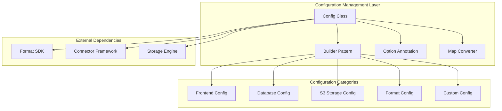
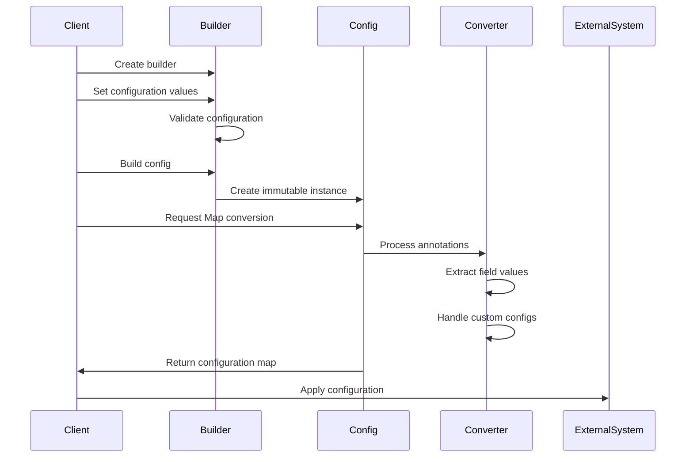

# Configuration Management Module

## Introduction

The Configuration Management module provides a centralized and extensible framework for managing system-wide configuration parameters across the StarRocks ecosystem. This module implements a builder pattern-based configuration system that supports both standard and custom configuration options, with built-in support for various storage backends, authentication mechanisms, and format-specific settings.

The module serves as the foundation for configuring different components of the system, including frontend connections, database access, cloud storage integrations, and format-specific parameters for data processing operations.

## Architecture Overview



## Core Components

### Config Class

The `Config` class is the central configuration container that encapsulates all system configuration parameters. It provides:

- **Immutable Configuration**: All configuration parameters are final and set during construction
- **Type Safety**: Strongly typed configuration fields with appropriate null handling
- **Annotation-Based Metadata**: Uses custom `@Option` annotations to map fields to configuration keys
- **Flexible Conversion**: Provides conversion to Map format for integration with external systems

### Builder Pattern Implementation

The `Builder` class implements the builder pattern to provide:

- **Fluent Interface**: Method chaining for intuitive configuration setup
- **Default Values**: Sensible defaults for optional parameters (e.g., `unreleasedWarningThreshold = 128`)
- **Validation**: Runtime validation during build process
- **Immutability**: Creates immutable Config instances

### Option Annotation System

The `@Option` annotation provides:

- **Configuration Key Mapping**: Maps Java field names to external configuration keys
- **Runtime Reflection**: Enables dynamic configuration processing
- **Documentation**: Self-documenting configuration through annotation values

## Configuration Categories

### Frontend Configuration

Manages connection parameters for StarRocks frontend services:

- **HTTP URL**: `starrocks.fe.http.url` - REST API endpoint
- **JDBC URL**: `starrocks.fe.jdbc.url` - JDBC connection string

### Database Configuration

Handles database connection and authentication:

- **Database**: `starrocks.database` - Target database name
- **Username**: `starrocks.user` - Authentication username
- **Password**: `starrocks.password` - Authentication password

### Format-Specific Configuration

Controls data format processing behavior:

- **Query Plan**: `starrocks.format.query_plan` - Query execution plan
- **Column UID**: `starrocks.format.using_column_uid` - Column identification mode
- **Warning Threshold**: `starrocks.format.unreleased_warning_threshold` - Resource cleanup warnings

### S3 Storage Configuration

Manages Amazon S3 and compatible storage integrations:

- **Endpoint**: `fs.s3a.endpoint` - S3 service endpoint
- **Region**: `fs.s3a.endpoint.region` - AWS region configuration
- **SSL**: `fs.s3a.connection.ssl.enabled` - Secure connection settings
- **Path Style**: `fs.s3a.path.style.access` - URL path format
- **Credentials**: `fs.s3a.access.key` and `fs.s3a.secret.key` - Authentication keys

### Custom Configuration

Supports extensible custom parameters through:

- **Dynamic Properties**: Runtime custom configuration additions
- **Type Safety**: Object-based value storage with string conversion
- **Conflict Detection**: Prevents duplicate configuration keys

## Data Flow Architecture



## Integration Points

### Format SDK Integration

The configuration management module integrates with the Format SDK through:

- **Format-Specific Settings**: Query plans, column handling, and processing options
- **Reader/Writer Configuration**: Parameters for data format readers and writers
- **Conversion Settings**: Arrow format conversion and JNI wrapper configuration

### Connector Framework Integration

Provides configuration support for:

- **Storage Connectors**: S3, Azure Blob, HDFS, and other storage systems
- **Database Connectors**: JDBC connections and metadata access
- **Cloud Credentials**: Secure credential management and rotation

### Storage Engine Integration

Supports storage-related configurations:

- **Lake Storage**: Configuration for lake-based table storage
- **Compaction Policies**: Settings for data compaction strategies
- **Metadata Management**: Configuration for metadata storage and retrieval

## Key Features

### Type Safety and Validation

- **Compile-time Safety**: Strong typing prevents configuration errors
- **Runtime Validation**: Builder validates configuration consistency
- **Null Handling**: Proper null value handling throughout the system

### Extensibility

- **Custom Configuration**: Support for application-specific configuration parameters
- **Annotation System**: Easy addition of new configuration options
- **Plugin Architecture**: Integration with external configuration sources

### Security

- **Credential Management**: Secure handling of passwords and access keys
- **Immutable Configuration**: Prevents runtime configuration tampering
- **Audit Trail**: Configuration changes can be tracked and audited

### Performance

- **Lazy Initialization**: Configuration processed only when needed
- **Caching Support**: Map conversion results can be cached
- **Reflection Optimization**: Efficient annotation processing

## Usage Patterns

### Basic Configuration

```java
Config config = Config.newBuilder()
    .feHttpUrl("http://localhost:8030")
    .feJdbcUrl("jdbc:mysql://localhost:9030")
    .database("test_db")
    .username("user")
    .password("password")
    .build();
```

### Advanced Configuration with Custom Options

```java
Config config = Config.newBuilder()
    .feHttpUrl("http://localhost:8030")
    .s3Endpoint("s3.amazonaws.com")
    .s3AccessKey("access-key")
    .s3SecretKey("secret-key")
    .customConfig("custom.param", "value")
    .customConfig("another.param", 123)
    .build();
```

### Configuration Conversion

```java
Config config = // ... build configuration
Map<String, String> configMap = config.toMap();
// Use configMap with external systems
```

## Error Handling

The module implements comprehensive error handling:

- **IllegalStateException**: Thrown for configuration resolution errors
- **Duplicate Detection**: Prevents configuration key conflicts
- **Access Control**: Handles reflection access issues gracefully

## Dependencies

The Configuration Management module has dependencies on:

- **Apache Commons Collections**: For Map utilities (`MapUtils`)
- **Java Reflection API**: For annotation processing
- **Format SDK**: For format-specific configuration integration
- **Connector Framework**: For storage and database connectivity

## Related Modules

- [Format Support](format_support.md) - Format-specific configuration and processing
- [Connectors](connectors.md) - External system integration configuration
- [Storage Engine](storage_engine.md) - Storage-related configuration management
- [Frontend Server](frontend_server.md) - Frontend service configuration

## Future Enhancements

Potential improvements to the configuration management system:

1. **Configuration Validation Framework**: Schema-based validation for complex configurations
2. **Dynamic Configuration Updates**: Runtime configuration updates without restart
3. **Configuration Profiles**: Predefined configuration sets for different deployment scenarios
4. **Configuration Encryption**: Enhanced security for sensitive configuration parameters
5. **Configuration Versioning**: Support for configuration schema evolution and migration