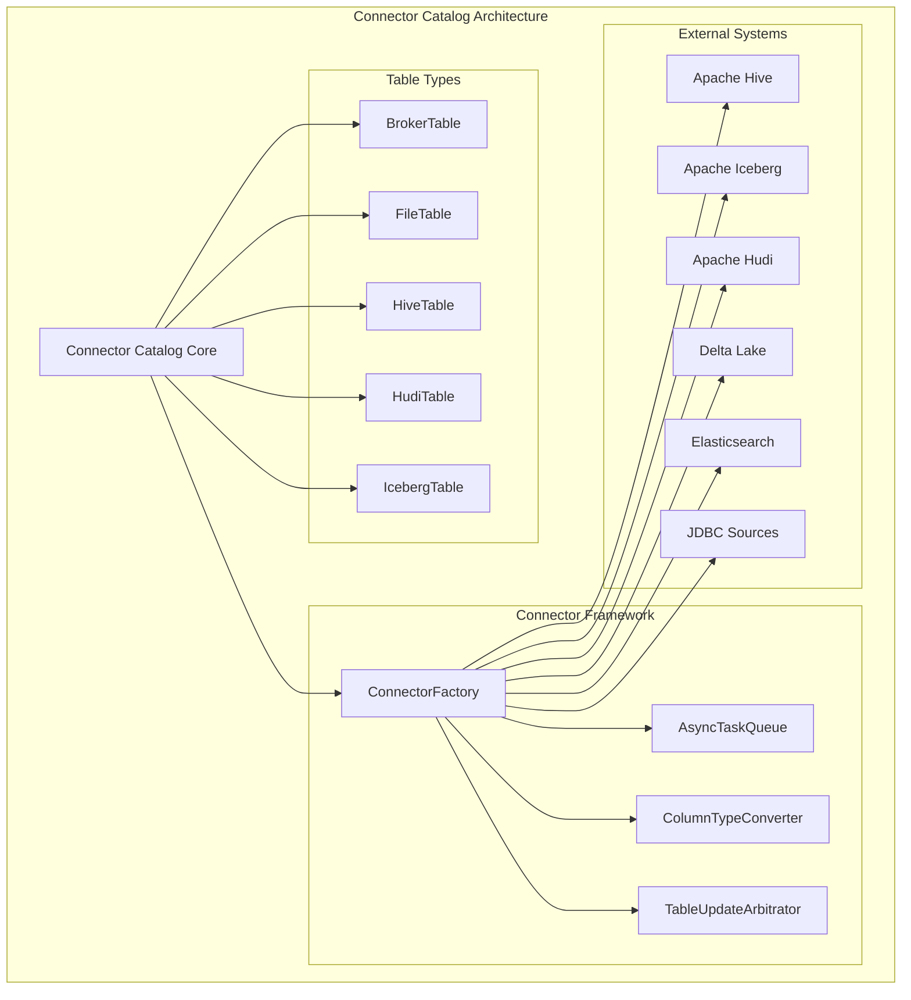
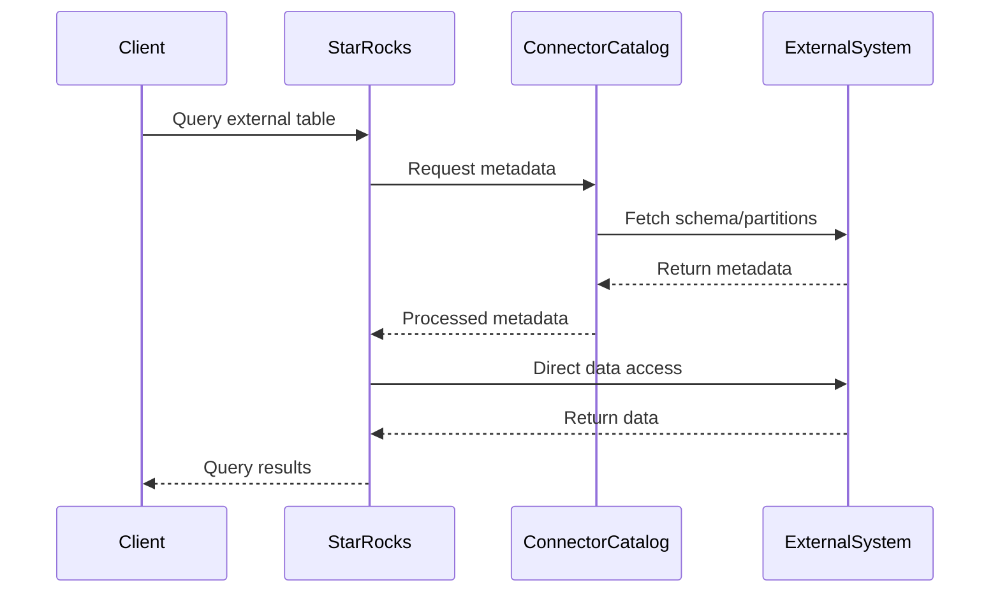

# Connector Catalog Module

## Overview

The connector_catalog module serves as the central hub for managing external data source connectors in StarRocks. It provides a unified interface for accessing and managing various external data sources including Hive, Iceberg, Hudi, Delta Lake, JDBC, Elasticsearch, and other big data systems. This module enables StarRocks to seamlessly integrate with external data lakes and warehouses, allowing users to query data across different storage systems without data movement.

## Purpose and Core Functionality

The primary purpose of the connector_catalog module is to:

1. **Provide unified access** to diverse external data sources through a consistent catalog interface
2. **Manage metadata synchronization** between StarRocks and external systems
3. **Enable federated querying** across multiple data sources
4. **Handle data type conversions** between different systems
5. **Support partition management** and optimization for external tables
6. **Facilitate authentication and authorization** for external data access

## Architecture Overview



## Core Components

### Table Abstractions

The module provides specialized table implementations for different external systems:

- **[BrokerTable](broker_table.md)**: Manages file-based data access through broker services
- **[FileTable](file_table.md)**: Direct file system access for various file formats
- **[HiveTable](hive_table.md)**: Integration with Apache Hive metastore and tables
- **[HudiTable](hudi_table.md)**: Support for Apache Hudi tables with incremental data processing
- **[IcebergTable](iceberg_table.md)**: Integration with Apache Iceberg table format

Each table type is documented in detail in its respective sub-module documentation.

### Connector Framework

The connector framework provides the infrastructure for managing external connections:

- **ConnectorFactory**: Creates and manages connector instances
- **AsyncTaskQueue**: Handles asynchronous operations for metadata operations
- **ColumnTypeConverter**: Manages data type mappings between systems
- **TableUpdateArbitrator**: Coordinates concurrent table updates

## Data Flow Architecture



## Integration Points

The connector_catalog module integrates with several other StarRocks modules:

- **[sql_parser_optimizer](sql_parser_optimizer.md)**: SQL parsing and query optimization for external tables
- **[storage_engine](storage_engine.md)**: Storage layer integration for external data access
- **[query_execution](query_execution.md)**: Query execution coordination for federated queries
- **[frontend_server](frontend_server.md)**: Metadata management and catalog services

## Supported External Systems

### Data Lake Connectors
- **Apache Hive**: Full integration with Hive metastore and HDFS
- **Apache Iceberg**: Modern table format with ACID properties
- **Apache Hudi**: Incremental data processing with change data capture
- **Delta Lake**: Lakehouse architecture with transaction support

### Database Connectors
- **JDBC**: Generic connector for any JDBC-compliant database
- **Elasticsearch**: Search and analytics engine integration
- **Kudu**: Fast analytics on fast data
- **ODPS**: Alibaba Cloud MaxCompute integration

### File System Support
- **HDFS**: Hadoop Distributed File System
- **S3**: Amazon Simple Storage Service
- **Azure Blob**: Microsoft Azure storage
- **Google Cloud Storage**: GCP object storage
- **Local Files**: Direct file system access

## Key Features

### Metadata Management
- Automatic schema discovery and synchronization
- Partition pruning and statistics collection
- Incremental metadata updates
- Version-aware metadata caching

### Query Optimization
- Predicate pushdown to external systems
- Partition elimination based on query filters
- Column pruning for reduced data transfer
- Cost-based optimization for external data

### Security Integration
- Unified authentication across connectors
- Authorization integration with external systems
- Credential management and rotation
- Audit logging for external data access

### Performance Features
- Parallel data scanning across partitions
- Adaptive query execution based on data characteristics
- Connection pooling for external systems
- Caching of frequently accessed metadata

## Configuration and Usage

### Creating External Catalogs

```sql
-- Create a Hive catalog
CREATE EXTERNAL CATALOG hive_catalog
PROPERTIES (
    "type" = "hive",
    "hive.metastore.uris" = "thrift://hive-metastore:9083"
);

-- Create an Iceberg catalog
CREATE EXTERNAL CATALOG iceberg_catalog
PROPERTIES (
    "type" = "iceberg",
    "iceberg.catalog.type" = "hive",
    "hive.metastore.uris" = "thrift://hive-metastore:9083"
);
```

### Accessing External Tables

```sql
-- Query external tables directly
SELECT * FROM hive_catalog.db.table;

-- Create external tables
CREATE EXTERNAL TABLE external_table
PROPERTIES (
    "path" = "s3://bucket/path/",
    "format" = "parquet"
);
```

## Performance Considerations

### Metadata Caching
- Metadata is cached to reduce external system calls
- Cache invalidation based on external system changes
- Configurable cache TTL for different metadata types

### Query Planning
- Statistics collection from external systems
- Cost-based optimization for external data access
- Adaptive execution based on data volume and distribution

### Network Optimization
- Connection pooling for reduced connection overhead
- Parallel data transfer with configurable parallelism
- Compression support for network data transfer

## Monitoring and Troubleshooting

### Metrics Collection
- Connector-specific performance metrics
- Query execution statistics for external data
- Metadata operation latencies
- Error rates and retry statistics

### Logging and Debugging
- Detailed logging for connector operations
- Query execution plans for external data access
- Metadata synchronization logs
- Authentication and authorization events

## Future Enhancements

### Planned Features
- Additional connector support (Snowflake, BigQuery, Redshift)
- Enhanced predicate pushdown capabilities
- Improved statistics collection and usage
- Better integration with cloud-native storage systems

### Performance Improvements
- Advanced caching strategies
- Smarter query routing based on data locality
- Enhanced parallel processing capabilities
- Better integration with StarRocks' vectorized execution engine

## Related Documentation

### Sub-module Documentation
- [BrokerTable Documentation](broker_table.md)
- [FileTable Documentation](file_table.md)
- [HiveTable Documentation](hive_table.md)
- [HudiTable Documentation](hudi_table.md)
- [IcebergTable Documentation](iceberg_table.md)

### Related Modules
- [Connector Framework](connector_framework.md)
- [Hive Integration](hive_connector.md)
- [Iceberg Integration](iceberg_connector.md)
- [Hudi Integration](hudi_connector.md)
- [Delta Lake Integration](delta_lake_connector.md)
- [JDBC Connector](jdbc_connector.md)
- [Elasticsearch Connector](elasticsearch_connector.md)
- [SQL Parser & Optimizer](sql_parser_optimizer.md)
- [Storage Engine](storage_engine.md)
- [Query Execution](query_execution.md)
- [Frontend Server](frontend_server.md)