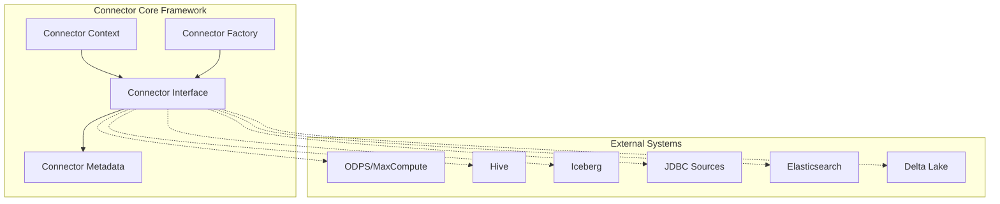
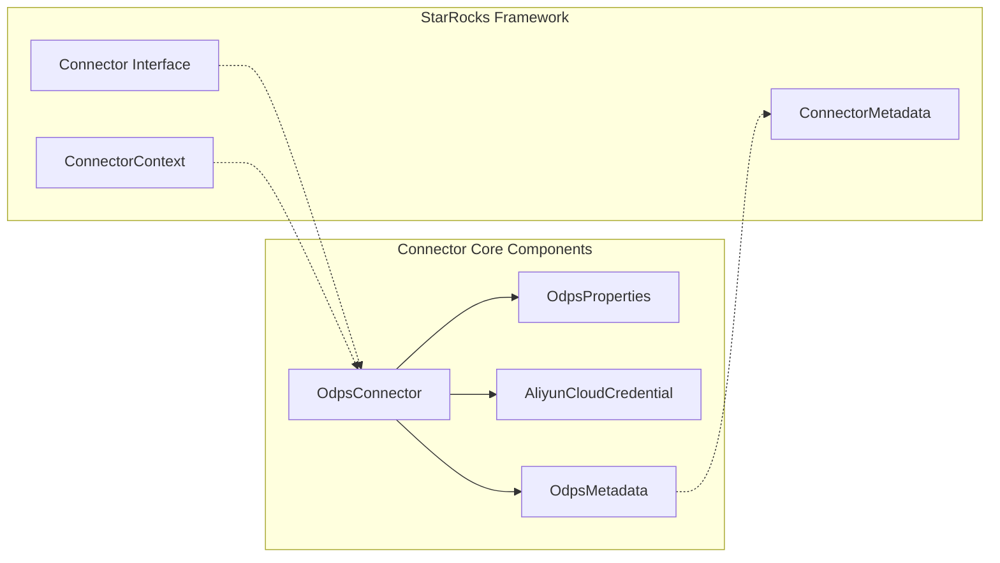
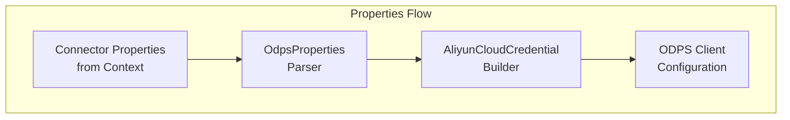
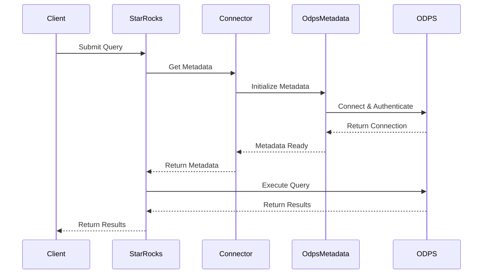
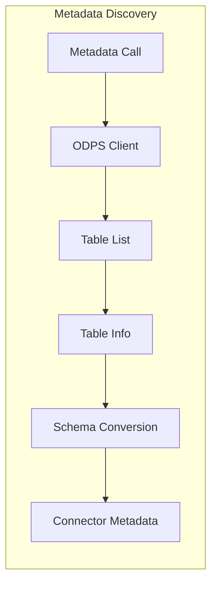
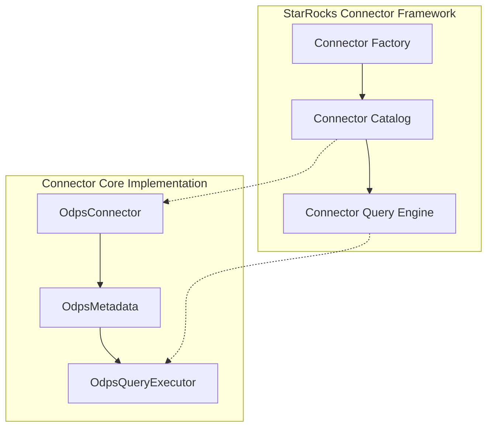

# Connector Core Module Documentation

## Introduction

The connector_core module serves as the foundational framework for integrating external data sources and systems with StarRocks. It provides a unified interface and abstraction layer that enables seamless connectivity to various data storage systems, databases, and cloud services. This module is essential for StarRocks' federated query capabilities, allowing users to query data across multiple heterogeneous data sources without data movement or duplication.

## Module Architecture

### Core Architecture Overview



### Component Relationships



## Core Components

### OdpsConnector

The `OdpsConnector` is the primary implementation of the Connector interface for Alibaba Cloud's ODPS (MaxCompute) service. It serves as the entry point for establishing connections to ODPS data sources and managing the lifecycle of these connections.

**Key Responsibilities:**
- Initialize and configure ODPS client connections
- Manage authentication credentials using AliyunCloudCredential
- Provide access to ODPS metadata through OdpsMetadata
- Handle connection lifecycle and error management

**Core Dependencies:**
- `ConnectorContext`: Provides configuration and catalog information
- `OdpsProperties`: Manages ODPS-specific configuration properties
- `AliyunCloudCredential`: Handles cloud authentication
- `OdpsMetadata`: Provides metadata operations for ODPS tables

### Connector Properties Management



### Authentication and Security

The connector implements a robust authentication mechanism through the `AliyunCloudCredential` class, which securely manages access credentials for cloud services. The authentication flow includes:

1. **Credential Extraction**: Properties are parsed from the connector configuration
2. **Account Creation**: AliyunAccount is created with access credentials
3. **ODPS Client Initialization**: The ODPS client is configured with the authenticated account
4. **Project Context**: Default project is set for the ODPS connection

## Data Flow Architecture

### Query Execution Flow



### Metadata Discovery Process



## Integration with StarRocks Ecosystem

### Connector Framework Integration

The connector_core module integrates seamlessly with StarRocks' broader connector framework:



### Query Planning and Optimization

The connector participates in StarRocks' query planning process by:

1. **Schema Discovery**: Providing table schemas and column information
2. **Partition Information**: Exposing partition metadata for query optimization
3. **Statistics**: Supplying table statistics for cost-based optimization
4. **Predicate Pushdown**: Supporting filter pushdown to reduce data transfer

## Supported Data Sources

### Current Implementations

Based on the module tree, the connector_core framework supports integration with:

- **ODPS/MaxCompute**: Alibaba Cloud's big data platform
- **Hive**: Apache Hive data warehouse software
- **Iceberg**: Apache Iceberg table format
- **Delta Lake**: Delta Lake storage layer
- **JDBC Sources**: Any JDBC-compliant database
- **Elasticsearch**: Search and analytics engine
- **Kudu**: Apache Kudu storage
- **Paimon**: Apache Paimon table store

### Extensibility

The connector framework is designed for extensibility, allowing new data sources to be integrated by implementing the core Connector interface and related abstractions.

## Configuration and Deployment

### Connector Configuration

Connectors are configured through StarRocks' catalog system, with properties specific to each data source:

```properties
# Example ODPS Connector Configuration
catalog.odps.type=odps
catalog.odps.access_id=your_access_id
catalog.odps.access_key=your_access_key
catalog.odps.endpoint=your_endpoint
catalog.odps.project=your_project
```

### Deployment Considerations

- **Network Connectivity**: Ensure network access to external data sources
- **Authentication**: Proper credential management and rotation
- **Performance**: Consider network latency and data transfer costs
- **Security**: Implement appropriate access controls and encryption

## Performance and Optimization

### Query Optimization Strategies

1. **Predicate Pushdown**: Push filters to the source system
2. **Projection Pushdown**: Only retrieve required columns
3. **Partition Pruning**: Eliminate unnecessary partition scans
4. **Parallel Execution**: Leverage source system parallelism
5. **Caching**: Cache metadata and frequently accessed data

### Monitoring and Metrics

The connector framework provides comprehensive monitoring capabilities:

- Connection health and availability
- Query performance metrics
- Data transfer statistics
- Error rates and types
- Resource utilization

## Error Handling and Resilience

### Error Categories

1. **Connection Errors**: Network issues, authentication failures
2. **Query Errors**: Syntax errors, permission issues
3. **Data Errors**: Type mismatches, data corruption
4. **System Errors**: Resource exhaustion, timeouts

### Recovery Mechanisms

- Automatic retry with exponential backoff
- Connection pooling and health checks
- Graceful degradation for partial failures
- Comprehensive error reporting and logging

## Security Considerations

### Authentication and Authorization

- Secure credential storage and management
- Support for various authentication methods (OAuth, API keys, certificates)
- Integration with enterprise identity systems
- Fine-grained access control

### Data Security

- Encryption in transit and at rest
- Data masking and anonymization
- Audit logging and compliance
- Network security and isolation

## Future Enhancements

### Planned Improvements

1. **Enhanced Performance**: Better query optimization and caching
2. **More Connectors**: Support for additional data sources
3. **Real-time Integration**: Streaming data support
4. **Advanced Security**: Enhanced authentication and encryption
5. **AI/ML Integration**: Intelligent query optimization

### Community Contributions

The connector framework welcomes community contributions for:
- New connector implementations
- Performance improvements
- Bug fixes and stability enhancements
- Documentation and examples

## Related Documentation

- [Storage Engine Module](storage_engine.md) - For underlying storage integration
- [Query Execution Module](query_execution.md) - For query processing details
- [Frontend Server Module](frontend_server.md) - For catalog and metadata management
- [SQL Parser and Optimizer Module](sql_parser_optimizer.md) - For query planning

## References

- [StarRocks Connector Framework Design](https://docs.starrocks.io)
- [ODPS/MaxCompute Documentation](https://www.alibabacloud.com/help/maxcompute)
- [Apache Hive Connector Guide](https://docs.starrocks.io)
- [Iceberg Integration Documentation](https://docs.starrocks.io)