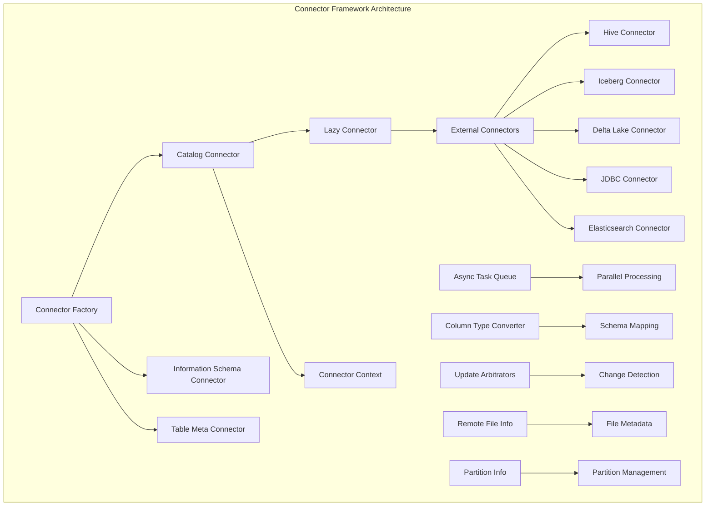
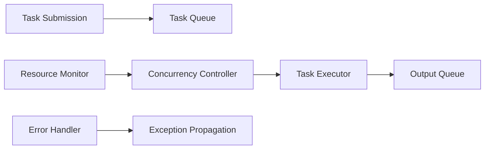
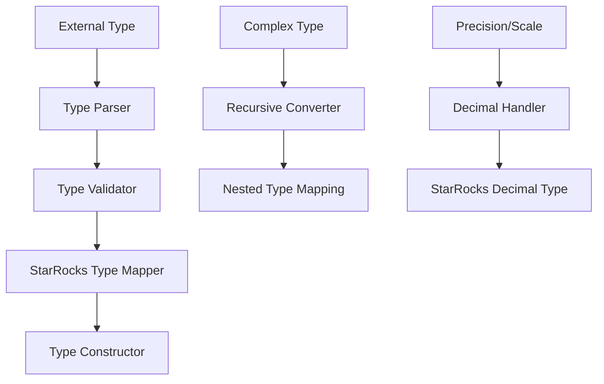

# Connector Framework Module Documentation

## Overview

The **Connector Framework** module serves as the central integration layer for StarRocks' external data source connectivity. It provides a unified architecture for connecting to, managing, and querying data from various external systems including data lakes, databases, and cloud storage platforms. This framework enables StarRocks to function as a federated query engine, seamlessly accessing data across heterogeneous storage systems.

## Purpose and Core Functionality

The Connector Framework module is designed to:

1. **Provide Unified Data Access**: Abstract the complexity of different external storage systems through a common interface
2. **Enable Federated Querying**: Allow SQL queries to span multiple external data sources transparently
3. **Support Schema Evolution**: Handle dynamic schema changes in external systems
4. **Optimize Performance**: Implement connector-specific optimizations and pushdown capabilities
5. **Ensure Data Consistency**: Provide mechanisms for detecting data changes and maintaining consistency

## Architecture Overview

## Core Components

### 1. Connector Factory System
The `ConnectorFactory` serves as the central factory for creating connector instances. It manages the lifecycle of connectors and provides a standardized way to instantiate different connector types based on configuration context. See [Connector Factory Documentation](connector_factory.md) for detailed implementation information.

**Key Responsibilities:**
- Connector instantiation and initialization
- Configuration binding and validation
- Exception handling during connector creation
- Support for lazy connector initialization

### 2. Asynchronous Task Management
The `AsyncTaskQueue` component provides sophisticated asynchronous task execution capabilities essential for handling large-scale data operations across external systems. See [Async Task Queue Documentation](async_task_queue.md) for implementation details.

**Key Features:**
- **Dynamic Concurrency Control**: Automatically adjusts the number of concurrent tasks based on system load and output queue size
- **Task Chaining**: Supports hierarchical task execution with subtask generation
- **Error Handling**: Comprehensive exception management with task-level error isolation
- **Resource Management**: Configurable limits on running tasks and output queue size
- **Performance Optimization**: Built-in concurrency tuner for optimal throughput

### 3. Schema and Type Conversion
The `ColumnTypeConverter` handles the complex task of mapping data types between StarRocks' internal type system and various external storage formats. See [Column Type Converter Documentation](column_type_converter.md) for detailed type mapping information.

**Supported Type Systems:**
- **Hive**: Complete support for Hive primitive and complex types
- **Iceberg**: Native Iceberg type mapping with precision handling
- **Delta Lake**: Delta Lake kernel type conversion
- **Hudi**: Avro schema-based type conversion
- **Paimon**: Paimon data type visitor pattern conversion
- **Kudu**: Kudu column schema mapping

**Complex Type Support:**
- Arrays with nested type preservation
- Maps with key-value type validation
- Structs with field name and type mapping
- Union types with null handling

### 4. Data Change Detection
The framework implements sophisticated mechanisms for detecting data changes in external systems through the `TableUpdateArbitrator` hierarchy. See [Update Arbitrators Documentation](update_arbitrators.md) for detailed change detection strategies.

**Arbitration Strategies:**
- **Directory-Based**: For HDFS-like systems, monitors directory modification times
- **Object-Based**: For object storage systems, tracks file-level metadata changes
- **Partition-Aware**: Handles partitioned tables with configurable partition limits

### 5. Remote File Information Management
The `RemoteFileInfo` and `GetRemoteFilesParams` components manage metadata about files in external storage systems. See [Remote File Management Documentation](remote_file_management.md) for detailed file handling capabilities.

**Capabilities:**
- File format detection and validation
- Partition-aware file organization
- Predicate pushdown support
- Version range filtering
- Column statistics enablement

### 6. Connector Table Information
The `ConnectorTableInfo` component manages metadata about connector tables and their relationships. See [Connector Table Info Documentation](connector_table_info.md) for table metadata management details.

**Features:**
- Materialized view relationship tracking
- Metadata persistence and updates
- Table information inspection
- Concurrent metadata management

## Sub-modules and Specializations

### Async Task Queue System
The asynchronous task management system provides the foundation for parallel data processing across external connectors. See [Async Task Queue Documentation](async_task_queue.md) for detailed information.

**Architecture:**

**Key Features:**
- Single consumer design for output consistency
- Configurable task size computation
- Exponential backoff for partition processing
- Thread-safe concurrent operations

### Column Type Conversion Engine
The type conversion engine handles the complexity of mapping between different data type systems. See [Column Type Converter Documentation](column_type_converter.md) for detailed information.

**Conversion Pipeline:**

**Supported Conversions:**
- Primitive type mapping with validation
- Complex type decomposition and reconstruction
- Precision and scale preservation for decimal types
- Logical type handling (dates, timestamps, etc.)

### Update Detection Mechanisms
The framework provides multiple strategies for detecting changes in external data sources. See [Update Arbitrators Documentation](update_arbitrators.md) for detailed information.

**Directory-Based Strategy:**
- Monitors directory modification timestamps
- Efficient for HDFS and similar file systems
- Partition-level change detection

**Object-Based Strategy:**
- Tracks individual file metadata
- Suitable for object storage systems (S3, OSS)
- File count and modification time tracking

## Integration with External Systems

### Hive Integration
- Metastore API compatibility
- Partition pruning and pushdown
- SerDe support for various file formats
- HiveQL compatibility layer

### Iceberg Integration
- Snapshot-based querying
- Schema evolution support
- Partition spec handling
- Manifest file processing

### Delta Lake Integration
- Delta log processing
- Column mapping support (ID and name-based)
- Time travel capabilities
- Optimistic concurrency control

### JDBC Integration
- Generic database connectivity
- SQL dialect translation
- Connection pooling
- Transaction support

## Performance Optimizations

### Parallel Processing
The framework leverages the `AsyncTaskQueue` for parallel data processing, with automatic concurrency tuning based on system load and output queue pressure.

### Predicate Pushdown
Supports predicate pushdown to external systems where possible, reducing data transfer and improving query performance.

### Metadata Caching
Implements intelligent caching of metadata to reduce repeated external system calls, with cache invalidation based on change detection.

### Partition Pruning
Leverages partition information to eliminate unnecessary file scans, significantly improving query performance on partitioned tables.

## Error Handling and Resilience

### Exception Management
- Task-level error isolation in async operations
- Graceful degradation for unsupported features
- Comprehensive error reporting with context
- Retry mechanisms for transient failures

### Consistency Guarantees
- Change detection mechanisms ensure data consistency
- Transaction support where available
- Snapshot isolation for concurrent operations

## Configuration and Extensibility

### Connector Configuration
Each connector type supports specific configuration options through the `ConnectorConfig` system, allowing fine-tuning of behavior and performance characteristics.

### Plugin Architecture
The framework supports dynamic connector loading and registration, enabling third-party connector development and integration.

## Monitoring and Observability

### Metrics Collection
- Task execution statistics
- Connector performance metrics
- Error rate tracking
- Resource utilization monitoring

### Logging and Debugging
- Comprehensive logging at multiple levels
- Debug information for troubleshooting
- Performance profiling capabilities

## Security Considerations

### Authentication
- Support for various authentication mechanisms per connector type
- Credential management and rotation
- Secure connection establishment

### Authorization
- Integration with StarRocks' authorization system
- Fine-grained access control
- Audit logging for security events

## Future Enhancements

### Planned Features
- Additional connector types (MongoDB, Cassandra, etc.)
- Enhanced pushdown capabilities
- Improved caching strategies
- Better integration with cloud-native services

### Performance Improvements
- Adaptive query optimization
- Enhanced parallel processing
- Smarter data locality awareness
- Advanced caching mechanisms

## Related Documentation

- [Storage Engine Module](storage_engine.md) - For underlying storage integration
- [Query Execution Module](query_execution.md) - For query processing integration
- [SQL Parser and Optimizer](sql_parser_optimizer.md) - For query planning and optimization
- [Frontend Server](frontend_server.md) - For metadata management and coordination
- [Connectors Module](connectors.md) - For specific connector implementations

The Connector Framework module represents a critical component of StarRocks' federated query capabilities, providing the foundation for seamless integration with diverse external data sources while maintaining performance, consistency, and reliability.