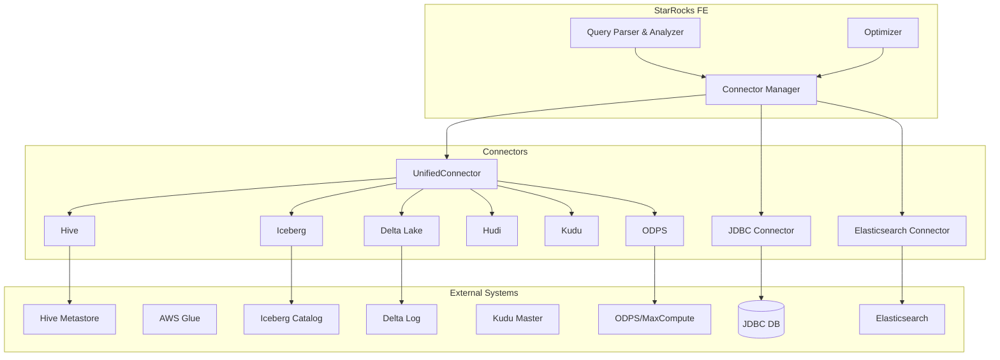
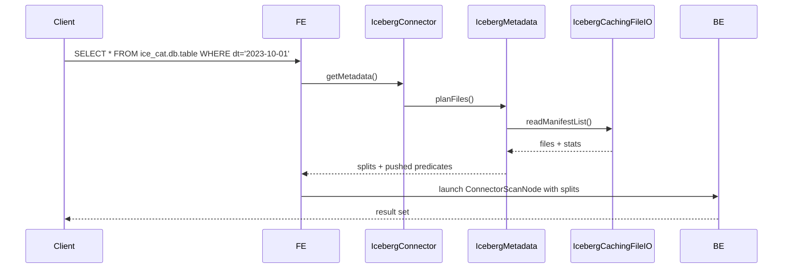

# Connectors Module Overview

## Purpose

The `connectors` module serves as StarRocks' unified gateway to external data sources. It provides a pluggable architecture that enables the query engine to read from—and in some cases write to—dozens of storage systems and table formats without data migration. By abstracting storage-specific APIs behind a common connector interface, the module delivers:

* **Federated querying** across Hive, Iceberg, Delta Lake, Hudi, Kudu, Paimon, ODPS, JDBC databases, Elasticsearch and more  
* **Transparent predicate push-down**, partition pruning, column pruning and vectorized reads for optimal performance  
* **Consistent security, credential and catalog management** regardless of the underlying system  
* **Extensibility**—new sources can be added by implementing the connector SPI

## High-Level Architecture

The module is organized into three layers:

1. **Connector SPI** – defines the contracts (`Connector`, `ConnectorMetadata`, `ConnectorScanNode`, etc.)  
2. **Connector implementations** – one per source/format; each ships its own metadata, split generation and scanner logic  
3. **Helper & utility libraries** – type converters, partition traits, statistics, credential providers, etc.

## Core Components

| Component | Path | Responsibility |
|-----------|------|----------------|
| **UnifiedConnector** | `connector.unified` | Single entry-point that delegates to Hive/Iceberg/Hudi/Delta/Kudu/Paimon sub-connectors based on table type |
| **HiveConnector** + **HiveGlueSupport** | `connector.hive` | Hive tables on HDFS/S3/OSS via Hive Metastore or AWS Glue |
| **IcebergConnector** | `connector.iceberg` | Iceberg tables on any Iceberg catalog (Hive, Glue, REST, JDBC) |
| **DeltaLakeConnector** | `connector.delta` | Delta Lake tables on cloud storage |
| **HudiConnector** | `connector.hudi` | Copy-on-write and merge-on-read Hudi tables |
| **KuduConnector** | `connector.kudu` | Apache Kudu tables with predicate push-down |
| **ODPSConnector** | `connector.odps` | Alibaba Cloud MaxCompute (ODPS) tables |
| **JDBCConnector** | `connector.jdbc` | Any JDBC-compliant database (MySQL, PostgreSQL, Oracle, SQL Server …) |
| **ElasticsearchConnector** | `connector.elasticsearch` | Elasticsearch indices as external tables |
| **PartitionTraits** | `connector.partitiontraits` | Strategy-per-source for partition pruning, PCT refresh, partition key creation |
| **TrinoParser** | `connector.parser.trino` | Translates Trino SQL dialect to StarRocks AST for cross-engine compatibility |
| **MetadataTable** | `connector.metadata` | Exposes connector-specific metadata as queryable system tables |
| **StatisticsUtils** | `connector.statistics` | Collects and converts per-connector table/column stats for the optimizer |

## Key Design Patterns

* **Delegation / Strategy**: `UnifiedConnector` forwards calls to the real connector chosen at runtime  
* **Visitor**: `ScalarOperatorToXXXExpr` converters push predicates down to each engine’s native representation  
* **Factory**: `ConnectorFactory` and `MetadataTableFactoryProvider` create the right implementation based on catalog properties  
* **Builder**: `MetadataTable.Builder`, `IcebergGetRemoteFilesParams.Builder`, etc. for immutable config objects  
* **Traits**: `PartitionTraits` hierarchy encapsulates source-specific partition behaviour behind a common interface

## Data Flow Example (Iceberg Query)

## References to Related Modules

* **[storage_engine](../storage_engine.md)** – low-level file readers (Parquet, ORC), zone-maps, bloom filters, vectorized scanners  
* **[query_execution](../query_execution.md)** – `ConnectorScanNode`, scan operator scheduling, runtime filters  
* **[frontend_server](../frontend_server.md#connector_framework)** – catalog mgmt, credential vending, cloud configuration  
* **[java_extensions](../java_extensions.md)** – JVM-side scanners for Hive, Hudi, Iceberg metadata tables, JDBC bridge, UDFs  

## Extension Points

New sources can be added by:

1. Implementing the `Connector` SPI  
2. Providing a `ConnectorFactory` and registering it in `ConnectorFactoryProvider`  
3. Adding corresponding `PartitionTraits` if the source is partitioned  
4. (Optional) Adding a Java-extension scanner if custom JVM logic is required  

The connectors module is continuously expanded to cover emerging lake-house formats and SaaS data sources while maintaining backward compatibility and consistent performance characteristics.