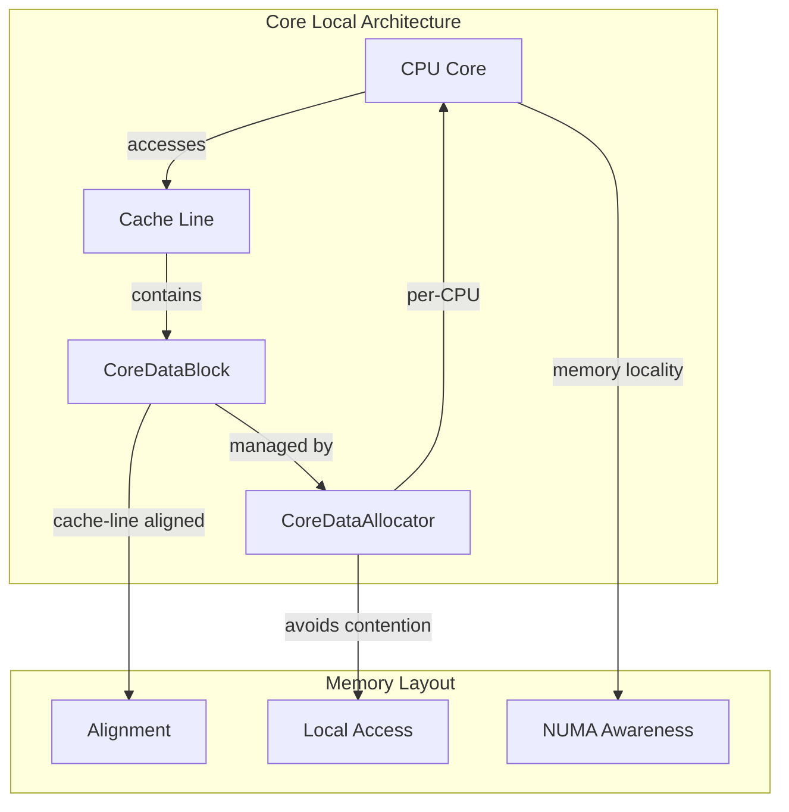

# Core Local Storage Sub-module

## Overview

The Core Local Storage sub-module provides per-CPU data management capabilities, enabling efficient lock-free operations and cache-friendly data access patterns. This sub-module is essential for high-performance concurrent programming and NUMA-aware memory allocation.

## Core Components

### CoreDataAllocatorImpl Template

The `CoreDataAllocatorImpl` template class provides type-safe, per-CPU data allocation:

```cpp
template <size_t ELEMENT_BYTES>
class CoreDataAllocatorImpl : public CoreDataAllocator {
public:
    void* get_or_create(size_t id) override;
private:
    static constexpr int ELEMENTS_PER_BLOCK = BLOCK_SIZE / ELEMENT_BYTES;
    SpinLock _lock;
    std::vector<CoreDataBlock*> _blocks;
};
```

## Architecture



## Key Features

### 1. Cache-Line Alignment
- All data blocks are cache-line aligned (64-byte boundaries)
- Minimizes false sharing between CPU cores
- Optimizes memory access patterns
- Reduces cache coherence traffic

### 2. Per-CPU Data Distribution
- Each CPU core gets its own data blocks
- Eliminates lock contention between cores
- Enables truly parallel data access
- NUMA-aware memory allocation

### 3. Dynamic Block Allocation
- Blocks are allocated on-demand
- Scales with the number of CPU cores
- Memory-efficient for sparse data
- Automatic cleanup on destruction

## Implementation Details

### Block Structure

```cpp
struct alignas(CACHE_LINE_SIZE) CoreDataBlock {
    void* at(size_t offset) { return data + offset; }
    char data[BLOCK_SIZE];  // 4096 bytes
    
    static void* operator new(size_t nbytes) {
        void* p = nullptr;
        if (posix_memalign(&p, alignof(CoreDataBlock), nbytes) == 0) {
            return p;
        }
        throw std::bad_alloc();
    }
};
```

### Allocation Strategy

The allocator uses a two-level indexing scheme:

1. **Block Index**: `id / ELEMENTS_PER_BLOCK`
2. **Element Offset**: `(id % ELEMENTS_PER_BLOCK) * ELEMENT_BYTES`

This provides O(1) access time while maintaining cache locality.

## Usage Patterns

### Per-CPU Counters
```cpp
// Example: Per-CPU statistics collection
CoreDataAllocator* alloc = CoreDataAllocatorFactory::instance()
    ->get_allocator(cpu_id, sizeof(uint64_t));
uint64_t* counter = static_cast<uint64_t*>(alloc->get_or_create(counter_id));
(*counter)++;
```

### NUMA-Aware Data Structures
```cpp
// Example: NUMA-local data storage
for (int cpu = 0; cpu < num_cpus; ++cpu) {
    CoreDataAllocator* alloc = CoreDataAllocatorFactory::instance()
        ->get_allocator(cpu, sizeof(DataStructure));
    DataStructure* local_data = static_cast<DataStructure*>(
        alloc->get_or_create(data_id));
    // Process data on local NUMA node
}
```

## Performance Characteristics

- **Access Time**: O(1) for data retrieval
- **Memory Overhead**: Minimal per-allocation overhead
- **Scalability**: Linear scaling with CPU core count
- **Cache Efficiency**: Cache-line optimized access patterns

## Thread Safety

- Spinlock protection for block allocation
- Lock-free access to allocated data
- Thread-safe factory operations
- No contention for per-CPU data access

## Memory Management

- Aligned memory allocation using `posix_memalign`
- Automatic cleanup of allocated blocks
- RAII-based resource management
- Exception-safe allocation patterns

## NUMA Considerations

- Cache-line alignment for optimal memory access
- Per-CPU allocation reduces NUMA node crossing
- Local memory access patterns
- Scalable memory allocation strategy

## Integration Points

The Core Local Storage sub-module integrates with:
- Performance counters and statistics
- Per-CPU data structures
- Lock-free algorithms
- NUMA-aware memory allocation

This sub-module provides the foundation for high-performance, scalable data structures that can efficiently utilize modern multi-core and NUMA systems.