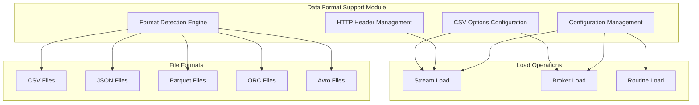
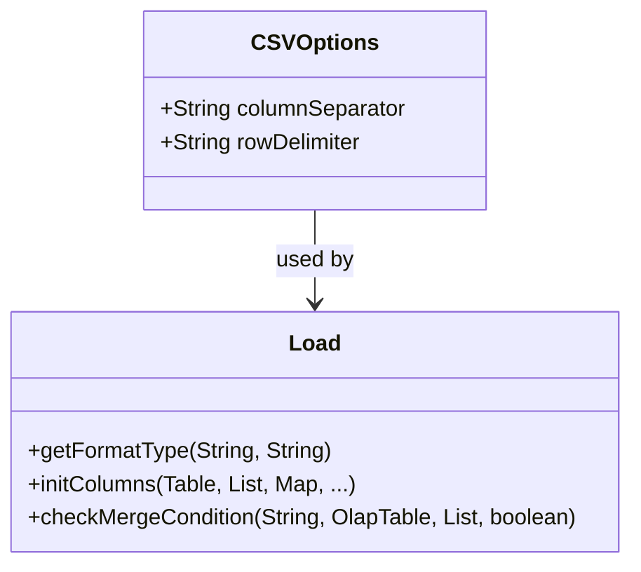
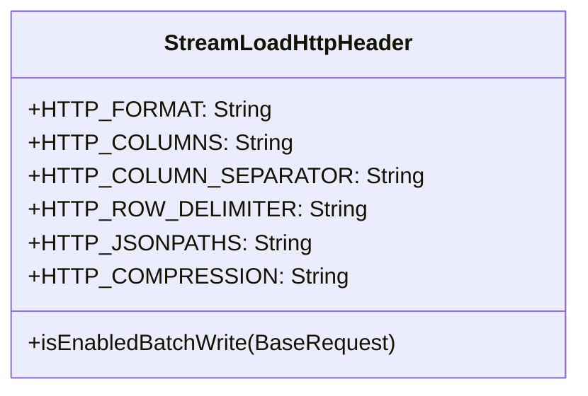
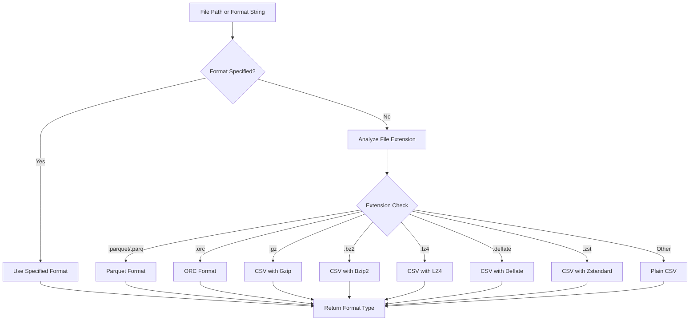
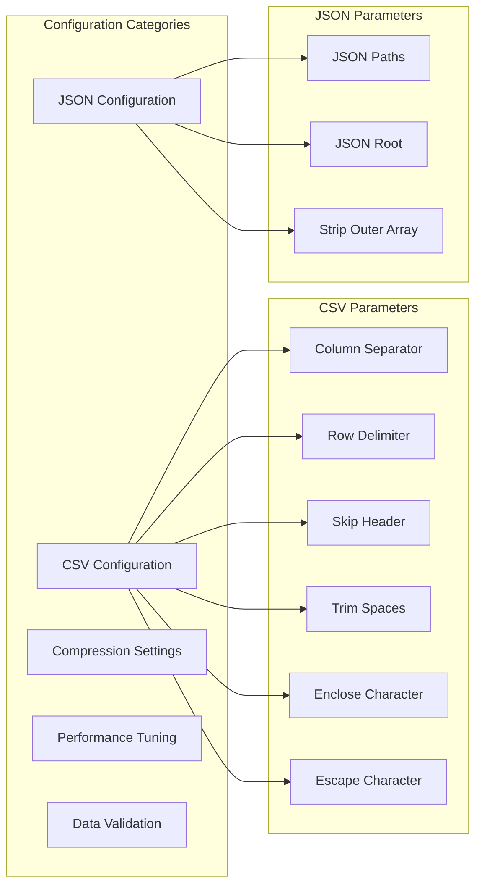
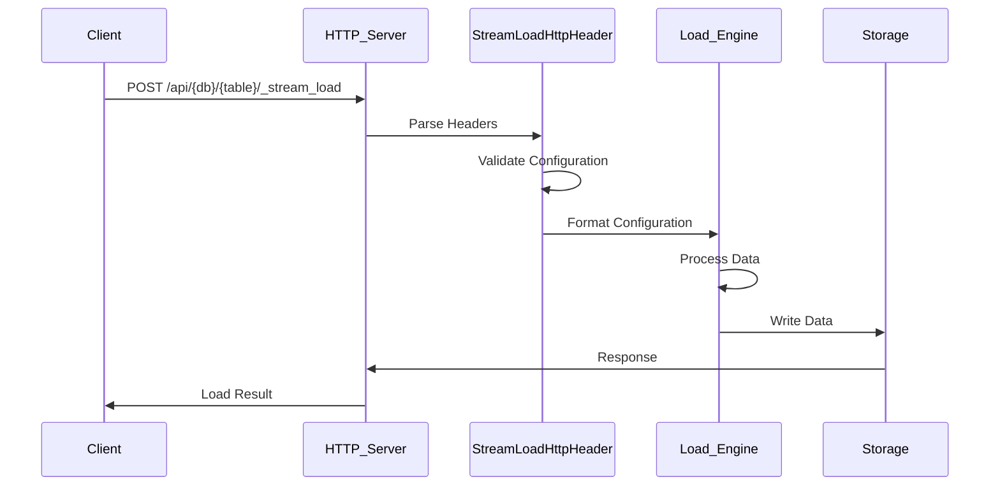
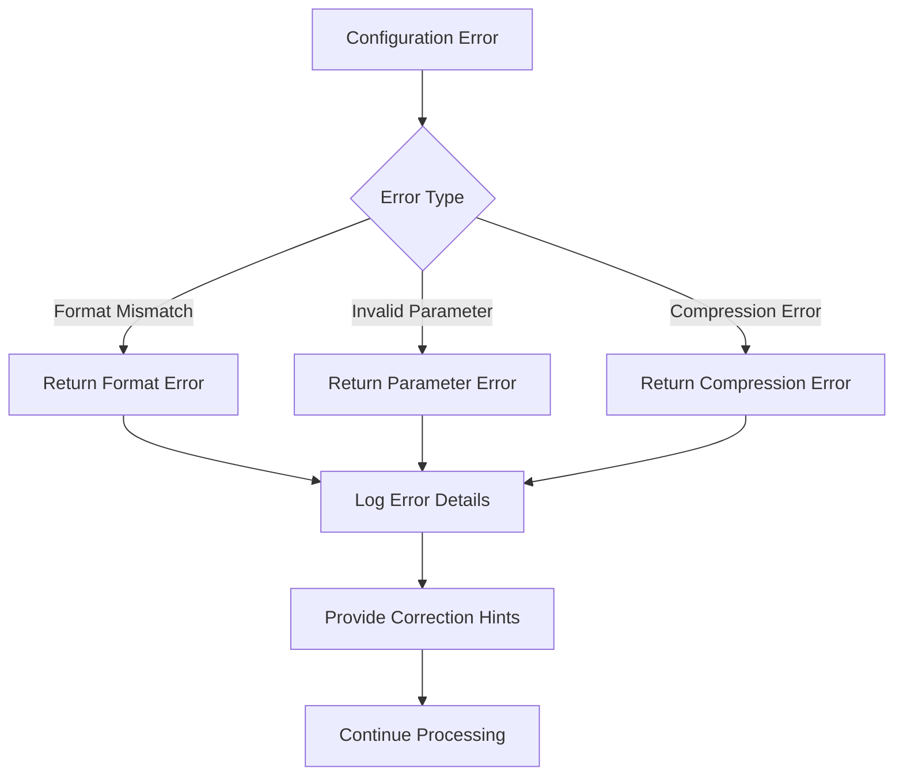
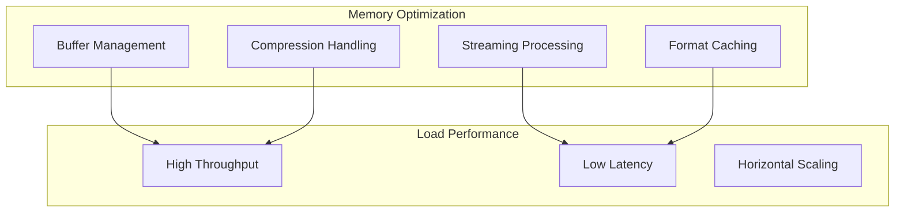

# Data Format Support Module

## Introduction

The data_format_support module is a critical component of StarRocks' data ingestion system that handles the parsing, validation, and configuration of various data formats during load operations. This module provides the foundation for supporting multiple file formats including CSV, JSON, Parquet, ORC, and Avro, ensuring seamless data integration from diverse sources.

The module serves as the bridge between external data sources and StarRocks' internal data processing pipeline, managing format-specific configurations, header parsing, and format detection based on file extensions and user specifications.

## Architecture Overview



## Core Components

### CSVOptions Configuration Class

The `CSVOptions` class provides essential configuration parameters for CSV file processing:



**Key Features:**
- Configurable column separation characters (default: tab character `\t`)
- Configurable row delimiters (default: newline character `\n`)
- Integration with format detection logic
- Support for various CSV dialects and encodings

### StreamLoadHttpHeader Management

The `StreamLoadHttpHeader` class manages HTTP headers for stream load operations:



**Header Categories:**
- **Format Headers**: Control data format specification
- **CSV Headers**: Manage CSV-specific parameters
- **JSON Headers**: Handle JSON path and structure configuration
- **Batch Write Headers**: Enable and configure batch processing
- **Compression Headers**: Specify compression types

## Format Detection Engine

### Automatic Format Detection

The format detection system automatically identifies file formats based on:



### Supported File Formats

| Format | Extension | MIME Type | Compression Support |
|--------|-----------|-----------|-------------------|
| CSV | `.csv` | text/csv | Gzip, Bzip2, LZ4, Deflate, Zstandard |
| JSON | `.json` | application/json | Gzip, Bzip2, LZ4, Deflate, Zstandard |
| Parquet | `.parquet`, `.parq` | application/octet-stream | Built-in compression |
| ORC | `.orc` | application/octet-stream | Built-in compression |
| Avro | `.avro` | application/avro | Built-in compression |

## Configuration Management

### Load Configuration Parameters

The module supports extensive configuration options for different load scenarios:



## Integration with Load Operations

### Stream Load Integration



### Broker Load Integration

The data format support module integrates with broker load operations through:
- Format specification in load statements
- Configuration validation during job planning
- Runtime format detection and processing

## Error Handling and Validation

### Configuration Validation

The module implements comprehensive validation for:
- Format compatibility checks
- Header parameter validation
- Compression type verification
- Character encoding validation

### Error Recovery



## Performance Optimization

### Batch Processing Support

The module supports batch write operations for improved performance:
- Configurable batch sizes
- Asynchronous commit options
- Parallel processing controls
- Memory management optimization

### Memory Management



## Security Considerations

### Data Validation

- Input sanitization for all format parameters
- File extension validation
- Compression bomb protection
- Memory usage limits

### Access Control

- Header-based authentication integration
- Format-specific permission checks
- Audit logging for configuration changes

## Dependencies

### Internal Dependencies

- **[load_export.md](load_export.md)**: Integrates with load operations for data ingestion
- **[storage_engine.md](storage_engine.md)**: Provides format support for storage operations
- **[query_execution.md](query_execution.md)**: Supports format-specific query processing

### External Dependencies

- Apache Thrift for serialization
- Compression libraries (Gzip, Bzip2, LZ4, Zstandard)
- JSON processing libraries
- Parquet and ORC format libraries

## Usage Examples

### CSV Configuration

```sql
-- Stream load with CSV format
 curl -X POST \
   -H "format: csv" \
   -H "column_separator: ," \
   -H "row_delimiter: \n" \
   -H "skip_header: 1" \
   -T data.csv \
   http://fe-host:8030/api/db/table/_stream_load
```

### JSON Configuration

```sql
-- Stream load with JSON format
curl -X POST \
  -H "format: json" \
  -H "jsonpaths: [\"$.id\", \"$.name\", \"$.value\"]" \
  -H "strip_outer_array: true" \
  -T data.json \
  http://fe-host:8030/api/db/table/_stream_load
```

### Format Detection

```java
// Automatic format detection based on file extension
TFileFormatType formatType = Load.getFormatType(null, "data.parquet");
// Returns: TFileFormatType.FORMAT_PARQUET

TFileFormatType formatType2 = Load.getFormatType(null, "data.csv.gz");
// Returns: TFileFormatType.FORMAT_CSV_GZ
```

## Future Enhancements

### Planned Features

- **Additional Format Support**: XML, Protocol Buffers
- **Enhanced Compression**: Brotli, LZMA support
- **Schema Evolution**: Automatic schema detection and mapping
- **Performance Monitoring**: Format-specific performance metrics
- **Intelligent Caching**: Format-aware caching strategies

### Optimization Roadmap

- Zero-copy data processing for supported formats
- Vectorized format parsing for improved performance
- Adaptive compression selection based on data characteristics
- Machine learning-based format optimization

## Conclusion

The data_format_support module is a foundational component that enables StarRocks to handle diverse data formats efficiently and reliably. Through its comprehensive configuration management, automatic format detection, and seamless integration with load operations, the module provides the flexibility and performance required for modern data integration scenarios. The modular design ensures easy extensibility for future format support while maintaining backward compatibility and performance standards.