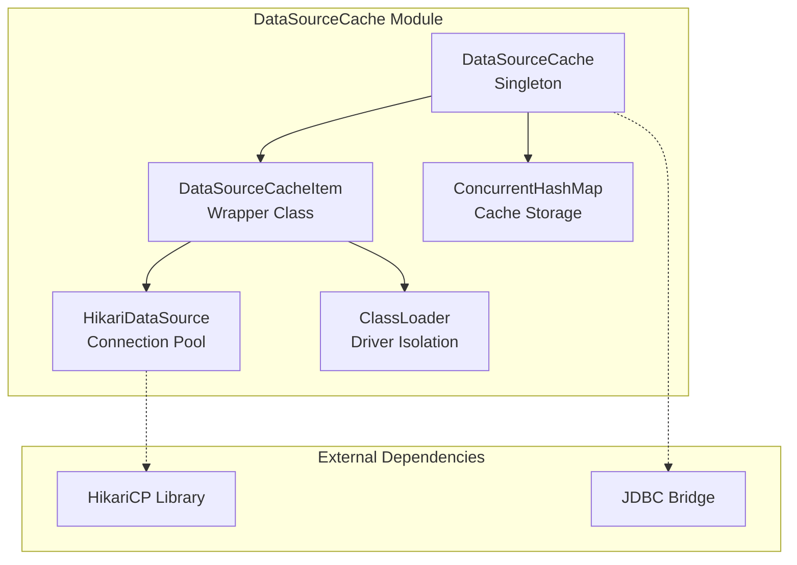
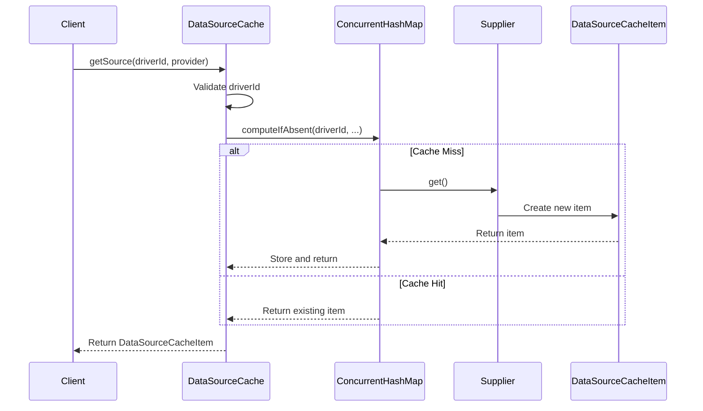
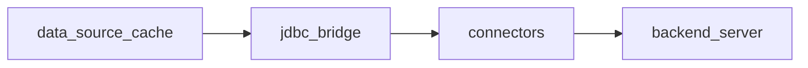

# Data Source Cache Module Documentation

## Overview

The Data Source Cache module provides a centralized caching mechanism for JDBC data sources in the StarRocks system. It implements a thread-safe singleton pattern to manage and reuse HikariCP connection pools, optimizing database connection management across the system.

## Purpose and Core Functionality

The primary purpose of this module is to:
- **Cache JDBC Data Sources**: Maintain a centralized cache of HikariDataSource instances to avoid repeated connection pool creation
- **ClassLoader Isolation**: Support proper class loading isolation for different JDBC drivers
- **Thread-Safe Access**: Provide concurrent access to cached data sources using ConcurrentHashMap
- **Resource Optimization**: Reduce connection overhead by reusing existing data source configurations

## Architecture

### Component Structure



### Key Components

#### 1. DataSourceCache (Singleton)
- **Purpose**: Central cache manager for all data sources
- **Pattern**: Thread-safe singleton implementation
- **Storage**: Uses ConcurrentHashMap for concurrent access
- **Key Features**:
  - Lazy initialization of cache entries
  - Supplier-based creation pattern
  - Null safety validation

#### 2. DataSourceCacheItem (Wrapper Class)
- **Purpose**: Encapsulates data source with its associated class loader
- **Components**:
  - `HikariDataSource`: The actual connection pool
  - `ClassLoader`: For proper JDBC driver isolation
- **Benefits**: Ensures proper resource management and class loading isolation

## Data Flow



## Implementation Details

### Thread Safety
- Uses `ConcurrentHashMap` for thread-safe concurrent access
- Singleton pattern ensures single instance across the JVM
- `computeIfAbsent` method provides atomic cache operations

### Error Handling
- Validates driver ID for null/empty values
- Checks for null return values from suppliers
- Throws appropriate exceptions with descriptive messages

### Memory Management
- Cache entries persist for the lifetime of the JVM
- No automatic eviction policy (cache grows indefinitely)
- Relies on system restart for cache cleanup

## Integration with System

### Module Dependencies


### Related Components
- **JDBC Bridge**: Uses DataSourceCache for connection management
- **Connector Framework**: Leverages cached data sources for external table access
- **Backend Server**: Ultimately uses cached connections for query execution

## Usage Patterns

### Basic Usage
```java
// Get cache instance
DataSourceCache cache = DataSourceCache.getInstance();

// Retrieve or create data source
DataSourceCacheItem item = cache.getSource(driverId, () -> {
    HikariDataSource ds = createDataSource(config);
    return new DataSourceCacheItem(ds, classLoader);
});

// Use the data source
HikariDataSource dataSource = item.getHikariDataSource();
```

### Supplier Pattern Benefits
- Lazy initialization of expensive resources
- Thread-safe creation of cache entries
- Encapsulation of creation logic

## Performance Considerations

### Advantages
- **Connection Reuse**: Eliminates overhead of creating new connection pools
- **Memory Efficiency**: Single instance per driver ID across the system
- **Thread Performance**: ConcurrentHashMap provides excellent concurrency

### Potential Limitations
- **No Eviction**: Cache can grow indefinitely
- **Memory Leaks**: Improper driver management could lead to class loader leaks
- **Startup Cost**: First access incurs full connection pool creation cost

## Configuration and Monitoring

### Current State
- No external configuration options
- No monitoring or metrics exposed
- No cache size limits or eviction policies

### Recommendations
- Consider adding cache size monitoring
- Implement cache eviction for unused entries
- Add metrics for cache hit/miss ratios

## Security Considerations

### ClassLoader Isolation
- Proper isolation between different JDBC drivers
- Prevents class conflicts in multi-driver environments
- Supports secure driver loading

### Connection Security
- Relies on HikariCP's built-in security features
- No additional security layer provided by cache
- Connection credentials managed at data source level

## Future Enhancements

### Potential Improvements
1. **Cache Eviction**: Implement LRU or TTL-based eviction
2. **Metrics**: Add JMX monitoring for cache statistics
3. **Configuration**: External configuration for cache behavior
4. **Health Checks**: Validate cached data source health
5. **Graceful Shutdown**: Proper cleanup of cached resources

### Integration Opportunities
- Connect to system monitoring framework
- Integrate with connection pool health checks
- Support for dynamic cache configuration

## References

- [JDBC Bridge Module](jdbc_bridge.md) - Uses DataSourceCache for connection management
- [Connector Framework](connectors.md) - Leverages cached data sources
- [Backend Server](backend_server.md) - Ultimate consumer of cached connections
- [HikariCP Documentation](https://github.com/brettwooldridge/HikariCP) - Underlying connection pool implementation