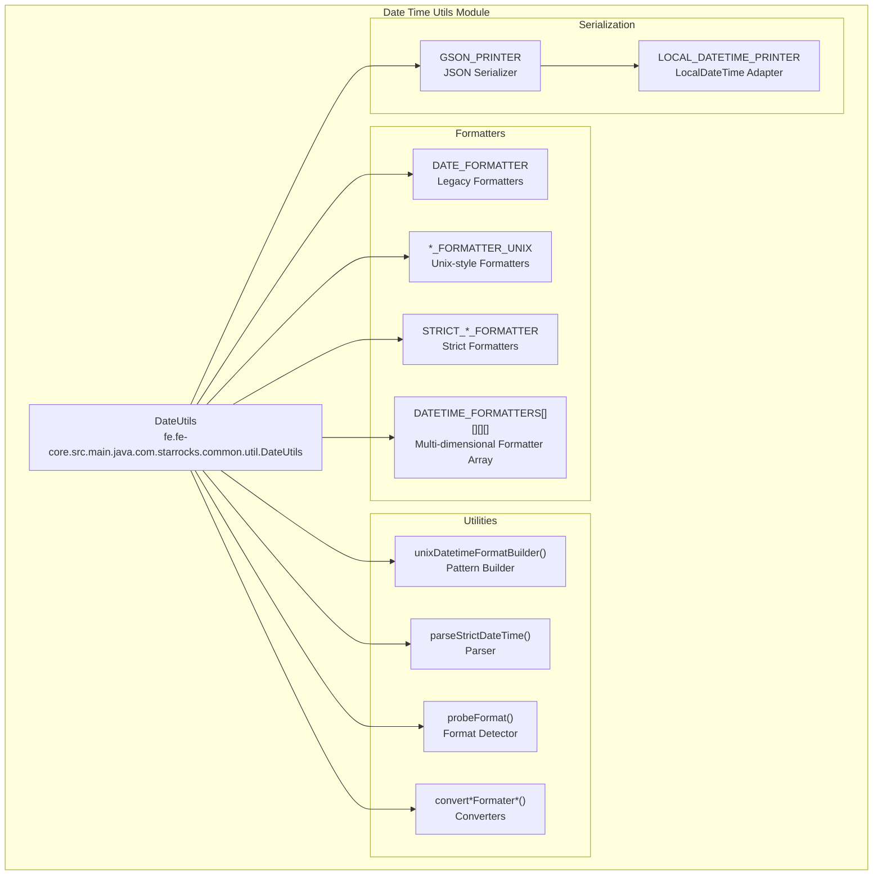
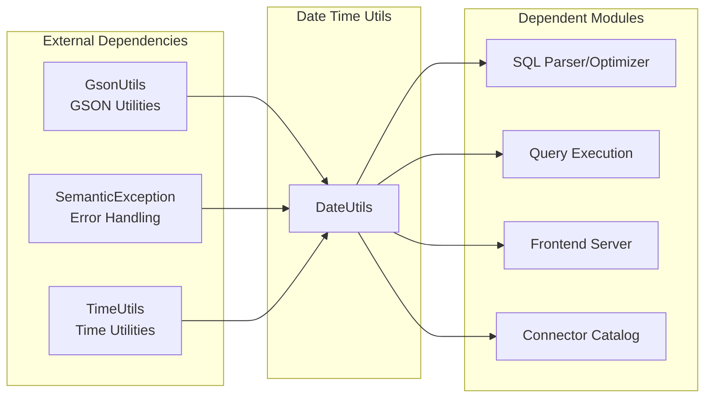
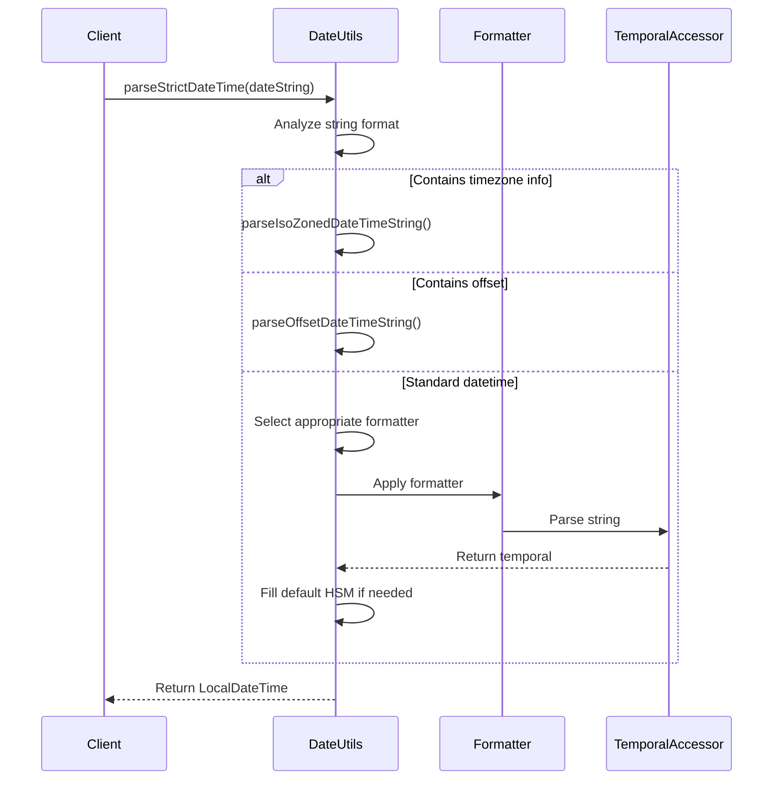
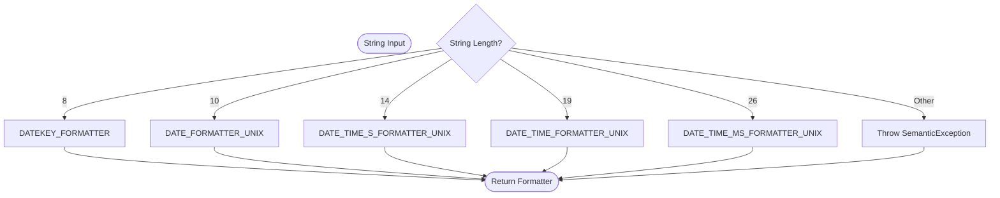

# Date Time Utils Module

## Introduction

The `date_time_utils` module provides comprehensive date and time handling utilities for the StarRocks database system. It serves as a centralized utility module for parsing, formatting, and manipulating date-time values across the entire system, ensuring consistent date-time handling throughout the platform.

## Module Overview

The module is built around the `DateUtils` class, which provides a robust set of utilities for:
- Date and time parsing with multiple format support
- Date and time formatting with various output patterns
- Unix-style date format pattern conversion
- Timezone-aware date-time operations
- JSON serialization of date-time objects
- Legacy format compatibility

## Architecture

### Core Component Architecture



### System Integration



## Core Components

### DateUtils Class

The `DateUtils` class is the primary utility class that provides static methods for date-time operations. It maintains a comprehensive set of formatters and utilities for handling various date-time formats used throughout the StarRocks system.

#### Key Features:
- **Multi-format Support**: Supports both legacy Java formatters and Unix-style formatters
- **Strict Parsing**: Provides strict date-time parsing with comprehensive validation
- **Format Detection**: Automatically detects date-time format from string patterns
- **Timezone Handling**: Supports timezone-aware date-time operations
- **JSON Integration**: Provides GSON serialization support for date-time objects

## Data Flow

### Date-Time Parsing Flow



### Format Detection Flow



## Key Functionalities

### 1. Date-Time Formatting

The module provides multiple formatting options:

- **Legacy Formatters**: Traditional Java pattern-based formatters (deprecated)
- **Unix-style Formatters**: MySQL-compatible Unix date format patterns
- **Strict Formatters**: Validating formatters with strict parsing rules
- **Custom Formatters**: Dynamic formatter creation based on Unix patterns

### 2. Date-Time Parsing

Comprehensive parsing capabilities:

- **Automatic Format Detection**: Probes string format and selects appropriate parser
- **Timezone-aware Parsing**: Handles ISO zoned date-time and offset date-time strings
- **Flexible Input**: Supports various date-time formats with automatic format recognition
- **Default Value Handling**: Fills missing hour/second/minute with default values

### 3. Unix Pattern Support

Extensive Unix date format pattern support:

- **Date Components**: Year (%Y, %y), Month (%m, %c), Day (%d, %e)
- **Time Components**: Hour (%H, %k, %h, %I, %l), Minute (%i), Second (%S, %s)
- **Special Formats**: Week (%v, %u), Day of year (%j), Microseconds (%f)
- **Composite Formats**: Time (%T), Complete datetime patterns

### 4. JSON Serialization

Built-in JSON support:

- **GSON Integration**: Custom GSON printer with date-time serialization
- **LocalDateTime Adapter**: Specialized serializer for LocalDateTime objects
- **Exclusion Strategies**: Respects hidden annotation exclusion strategies

## Usage Patterns

### Basic Date-Time Operations

```java
// Format current date-time
String formatted = DateUtils.formatDateTimeUnix(LocalDateTime.now());

// Parse date-time string
LocalDateTime dateTime = DateUtils.parseStrictDateTime("2023-12-25 10:30:00");

// Convert epoch milliseconds
LocalDateTime fromEpoch = DateUtils.fromEpochMillis(System.currentTimeMillis(), ZoneId.systemDefault());
```

### Format Detection and Conversion

```java
// Auto-detect format
DateTimeFormatter formatter = DateUtils.probeFormat("2023-12-25");

// Convert between formats
String dateKey = DateUtils.convertDateFormaterToDateKeyFormater("2023-12-25");
String seconds = DateUtils.convertDateTimeFormaterToSecondFormater("2023-12-25 10:30:00");
```

### Custom Unix Pattern Formatting

```java
// Create custom formatter
DateTimeFormatter customFormatter = DateUtils.unixDatetimeFormatter("%Y-%m-%d %H:%i:%s");

// Format with custom pattern
String formatted = LocalDateTime.now().format(customFormatter);
```

## Error Handling

The module implements comprehensive error handling:

- **SemanticException**: Thrown for format detection failures
- **IllegalArgumentException**: Thrown for invalid date strings or unsupported patterns
- **DateTimeParseException**: Handled internally with fallback mechanisms

## Performance Considerations

### Optimizations

1. **Static Formatter Cache**: Pre-initialized formatters for common patterns
2. **Multi-dimensional Array**: Efficient formatter selection using array indexing
3. **Lazy Initialization**: Formatters created on-demand for custom patterns
4. **String Pooling**: Reuses common date-time string patterns

### Memory Management

- **Immutable Formatters**: All formatters are immutable and thread-safe
- **Static Constants**: Common formatters shared across the system
- **Efficient Parsing**: Minimal object creation during parsing operations

## Integration Points

### Related Modules

The `date_time_utils` module integrates with various system components:

- **[SQL Parser/Optimizer](../sql_parser_optimizer.md)**: Date-time literal parsing and optimization
- **[Query Execution](../query_execution.md)**: Runtime date-time operations and filtering
- **[Frontend Server](../frontend_server.md)**: Session-level date-time handling and configuration
- **[Connector Catalog](../connectors.md)**: External system date-time format conversion
- **[Storage Engine](../storage_engine.md)**: Date-time column storage and indexing

### Dependencies

- **Java Time API**: Built on Java 8+ time API (java.time package)
- **GSON**: JSON serialization support
- **System Utilities**: Timezone and system time utilities

## Configuration

The module respects system-wide date-time configurations:

- **System Timezone**: Uses system default timezone for operations
- **Locale Settings**: Respects system locale for date-time formatting
- **SQL Mode**: Adapts to MySQL-compatible SQL mode settings

## Thread Safety

All components in the `date_time_utils` module are thread-safe:

- **Immutable Formatters**: All DateTimeFormatter instances are immutable
- **Static Methods**: All utility methods are stateless
- **No Shared State**: No mutable shared state between operations

## Future Enhancements

Potential areas for enhancement:

1. **Additional Format Patterns**: Support for more Unix date format specifiers
2. **Performance Optimization**: Further optimization for high-frequency operations
3. **Extended Timezone Support**: Enhanced timezone handling capabilities
4. **Internationalization**: Better support for locale-specific date formats

## Conclusion

The `date_time_utils` module provides a robust, comprehensive solution for date-time handling in StarRocks. Its flexible architecture, extensive format support, and seamless integration with the system make it an essential utility for consistent date-time operations across the platform.