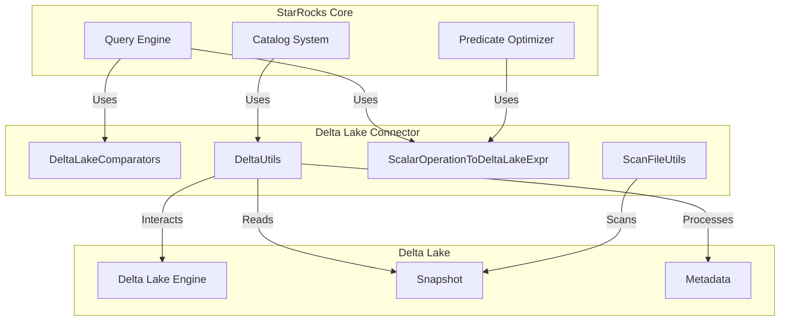
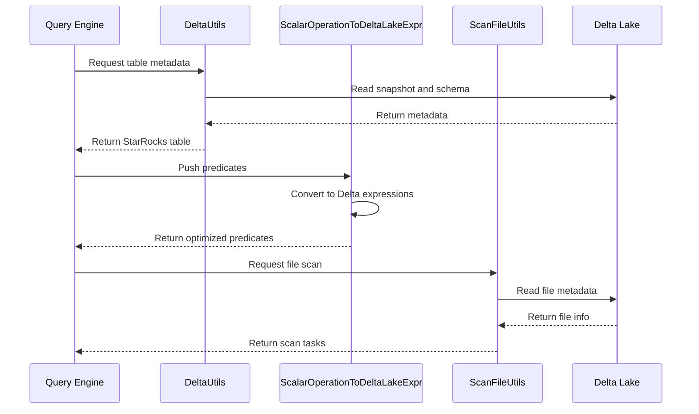

# Delta Lake Connector Module

## Overview

The Delta Lake Connector module provides StarRocks with the capability to query and analyze Delta Lake tables stored in cloud object storage. This module implements a comprehensive connector that bridges StarRocks' query engine with Delta Lake's transaction log-based table format, enabling efficient data lake analytics.

## Purpose

The primary purpose of this module is to:
- Enable StarRocks to read and query Delta Lake tables
- Provide seamless integration with Delta Lake's ACID transaction capabilities
- Support predicate pushdown for efficient query execution
- Handle Delta Lake's column mapping and partitioning schemes
- Convert between StarRocks and Delta Lake type systems

## Architecture

## Core Components

### 1. DeltaLakeComparators
Provides type-specific comparators for Delta Lake data types, enabling proper sorting and comparison operations across different data types in Delta Lake tables.

**Key Responsibilities:**
- Type-safe comparison operations for all Delta Lake data types
- Natural ordering implementation for primitive types
- Type validation and error handling

**Detailed Documentation:** [Type Comparison System](type_comparison.md)

### 2. DeltaUtils
Central utility class for converting Delta Lake metadata and schema information into StarRocks-compatible table structures.

**Key Responsibilities:**
- Protocol and metadata validation
- Schema conversion from Delta Lake to StarRocks format
- Column mapping handling (ID and name-based)
- Partition column extraction
- File format determination

**Detailed Documentation:** [Schema Conversion](schema_conversion.md)

### 3. ScalarOperationToDeltaLakeExpr
Implements predicate pushdown by converting StarRocks scalar operators into Delta Lake expressions, enabling efficient filtering at the storage level.

**Key Responsibilities:**
- Scalar operator to Delta Lake predicate conversion
- Type casting and literal value extraction
- Partition column optimization
- Complex predicate handling (AND, OR, NOT)

**Detailed Documentation:** [Predicate Conversion](predicate_conversion.md)

### 4. ScanFileUtils
Provides utilities for scanning Delta Lake files and extracting metadata information during query execution.

**Key Responsibilities:**
- File statistics extraction
- Row count estimation
- Column statistics retrieval
- Partition value mapping
- File scan task creation

**Detailed Documentation:** [File Scanning](file_scanning.md)

## Data Flow

## Integration Points

### With StarRocks Catalog System
The connector integrates with StarRocks' catalog system through the DeltaUtils class, which converts Delta Lake table metadata into StarRocks table objects that can be registered and queried.

### With Query Optimizer
ScalarOperationToDeltaLakeExpr works with the query optimizer to push down predicates to the storage layer, reducing data transfer and improving query performance.

### With Storage Engine
ScanFileUtils interfaces with the storage engine to provide file-level statistics and metadata needed for query planning and execution.

## Type System Mapping

The connector handles conversion between Delta Lake and StarRocks type systems:

| Delta Lake Type | StarRocks Type |
|----------------|----------------|
| BOOLEAN | BOOLEAN |
| BYTE | TINYINT |
| SMALLINT | SMALLINT |
| INTEGER | INT |
| LONG | BIGINT |
| FLOAT | FLOAT |
| DOUBLE | DOUBLE |
| DECIMAL | DECIMAL |
| STRING | VARCHAR |
| DATE | DATE |
| TIMESTAMP | DATETIME |
| BINARY | UNKNOWN_TYPE |

## Column Mapping Support

The connector supports Delta Lake's column mapping modes:
- **ID-based mapping**: Uses column IDs for schema evolution
- **Name-based mapping**: Uses physical column names
- **None**: Direct column name mapping

## Performance Optimizations

1. **Predicate Pushdown**: Converts StarRocks predicates to Delta Lake expressions
2. **Partition Pruning**: Eliminates unnecessary partition scans
3. **Statistics Utilization**: Uses file-level statistics for query planning
4. **Column Pruning**: Only reads required columns

## Error Handling

The module implements comprehensive error handling for:
- Missing protocol or metadata information
- Unsupported data types
- Schema conversion failures
- File format mismatches

## Dependencies

This module depends on:
- [connector_framework.md](connector_framework.md) - For connector infrastructure
- [sql_parser_optimizer.md](sql_parser_optimizer.md) - For predicate processing
- [storage_engine.md](storage_engine.md) - For file scanning operations

## Future Enhancements

Potential areas for improvement:
- Support for Delta Lake time travel queries
- Write path implementation for Delta Lake tables
- Enhanced statistics collection
- Support for Delta Lake generated columns
- Integration with Delta Lake's column mapping evolution