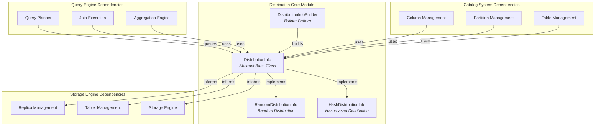
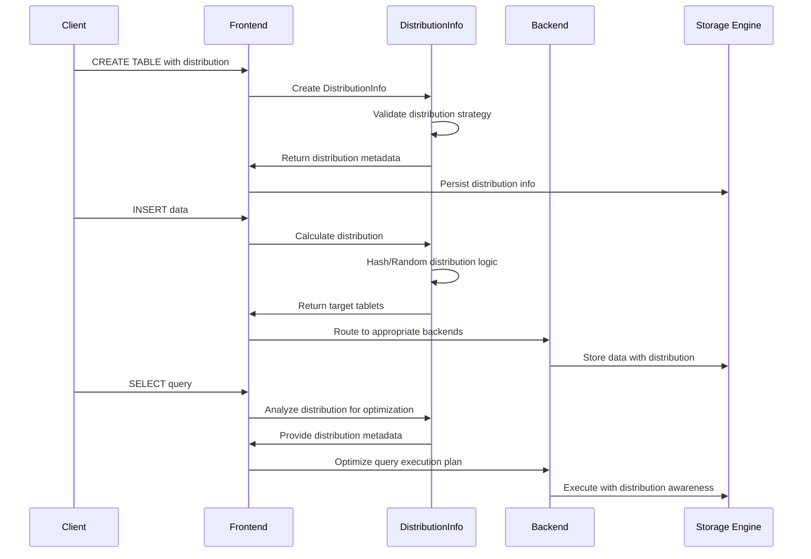
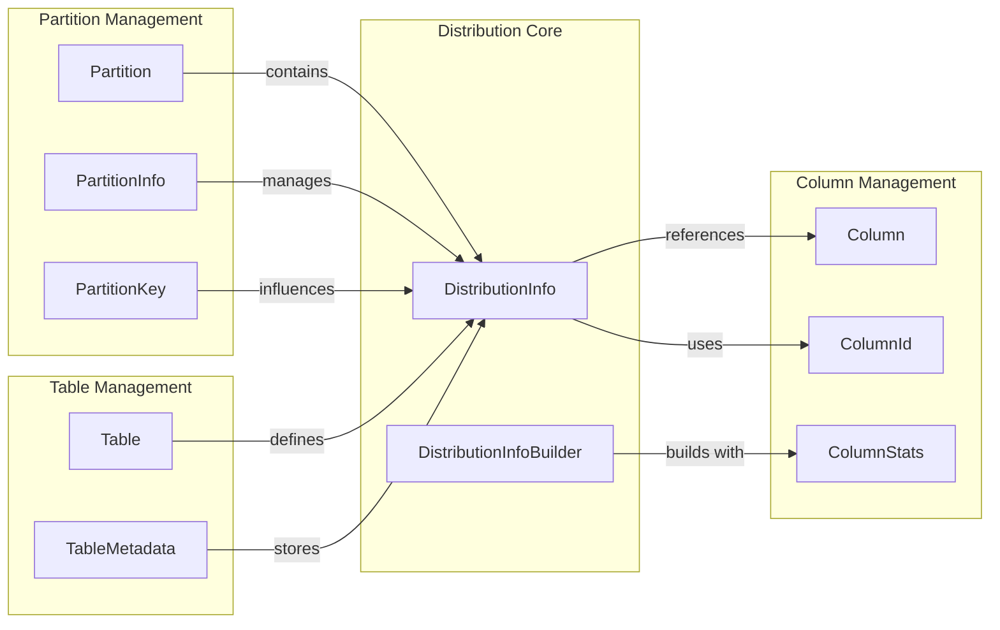
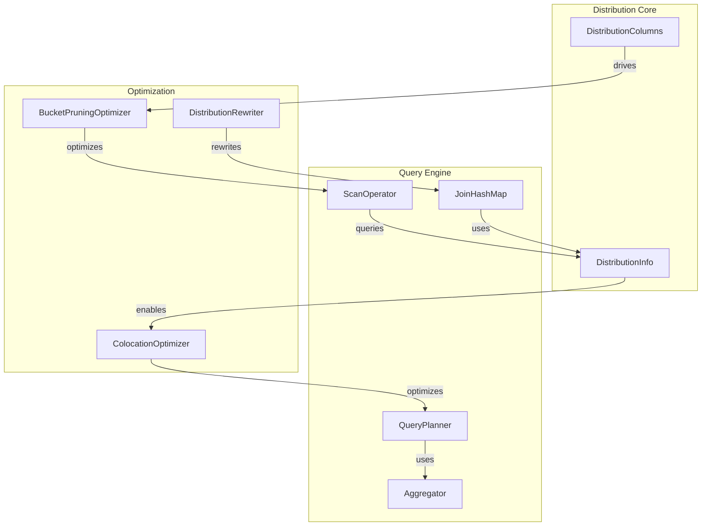
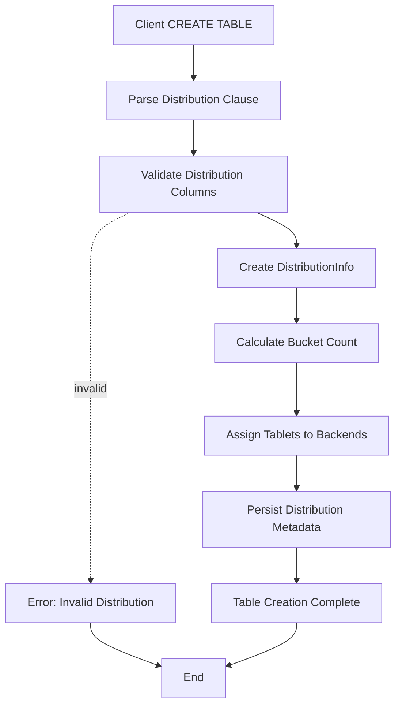
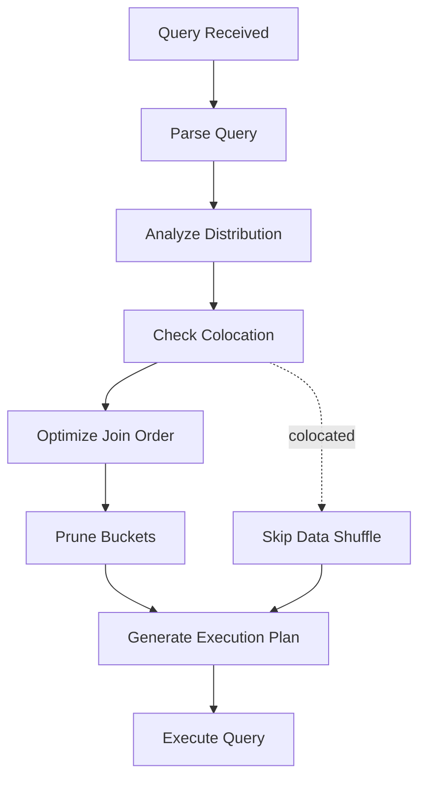

# Distribution Core Module Documentation

## Introduction

The distribution_core module is a fundamental component of StarRocks' catalog system that manages data distribution strategies across the cluster. It provides the abstract foundation and concrete implementations for how data is distributed across tablets and nodes, directly impacting query performance, data locality, and load balancing.

This module sits at the intersection of the catalog management system and the storage engine, defining how table data is physically organized and distributed across the cluster infrastructure.

## Architecture Overview



## Core Components

### DistributionInfo (Abstract Base Class)

The `DistributionInfo` abstract class serves as the foundation for all distribution strategies in StarRocks. It defines the contract that concrete distribution implementations must follow and provides common functionality for distribution management.

**Key Responsibilities:**
- Define distribution type enumeration (HASH, RANDOM)
- Provide serialization/deserialization support
- Establish the interface for distribution column management
- Support colocation requirements for distributed computing

**Core Interface:**
```java
public abstract class DistributionInfo implements Writable {
    // Distribution type management
    public enum DistributionInfoType { HASH, RANDOM }
    
    // Core distribution properties
    protected DistributionInfoType type;
    protected String typeStr;
    
    // Abstract methods for concrete implementations
    public abstract int getBucketNum();
    public abstract boolean supportColocate();
    public abstract List<ColumnId> getDistributionColumns();
    public abstract DistributionInfo copy();
}
```

### Distribution Strategies

#### Hash Distribution
Hash distribution is the primary strategy for ensuring data locality and efficient query processing. It distributes data based on hash values of specified columns, ensuring that rows with the same distribution key values are colocated.

**Use Cases:**
- Join operations on distribution keys
- Aggregation operations
- Colocated analytics workloads

#### Random Distribution  
Random distribution provides uniform data distribution across tablets without considering specific column values. This strategy is useful when no natural distribution key exists or when uniform distribution is desired.

**Use Cases:**
- Tables without clear distribution patterns
- Uniform load distribution requirements
- Initial data loading scenarios

## Data Flow Architecture



## Component Interactions

### Catalog Integration



### Query Optimization Integration



## Key Features

### 1. Distribution Strategy Flexibility
The module supports multiple distribution strategies through a plugin architecture, allowing different distribution algorithms to be implemented and deployed based on workload requirements.

### 2. Colocation Support
Built-in support for data colocation ensures that related data is stored together, enabling efficient distributed joins and aggregations without data shuffling.

### 3. Dynamic Distribution Management
Supports dynamic modification of distribution strategies through the catalog system, allowing tables to adapt to changing workload patterns.

### 4. Query Optimization Integration
Deep integration with the query optimizer enables distribution-aware query planning, including bucket pruning, colocation optimization, and join order optimization.

### 5. Serialization and Persistence
Robust serialization support ensures distribution metadata is consistently persisted across the cluster and can be recovered during system restarts.

## Process Flows

### Table Creation with Distribution



### Query Execution with Distribution Optimization



## Dependencies and Integration Points

### Upstream Dependencies
- **Column Management Module**: Provides column metadata and statistics used for distribution decisions
- **Type System Module**: Ensures distribution columns have compatible types
- **Catalog Persistence Layer**: Stores and retrieves distribution metadata

### Downstream Dependencies
- **Storage Engine**: Uses distribution information for data placement and retrieval
- **Query Execution Engine**: Leverages distribution for query optimization and execution
- **Tablet Management System**: Creates and manages tablets based on distribution strategy

### Related Modules
- [column_management](column_management.md): Column metadata and statistics
- [partition_management](partition_management.md): Partition-level distribution coordination
- [table_management](table_management.md): Table-level distribution configuration
- [query_execution](query_execution.md): Distribution-aware query processing
- [storage_engine](storage_engine.md): Physical data storage based on distribution

## Configuration and Management

### Distribution Configuration
Distribution strategies are configured during table creation through SQL DDL statements:

```sql
-- Hash Distribution Example
CREATE TABLE users (
    user_id BIGINT,
    name VARCHAR(100),
    email VARCHAR(200)
)
DISTRIBUTED BY HASH(user_id) BUCKETS 32;

-- Random Distribution Example  
CREATE TABLE logs (
    log_id BIGINT,
    timestamp DATETIME,
    message TEXT
)
DISTRIBUTED BY RANDOM BUCKETS 64;
```

### Runtime Management
The distribution core module provides runtime APIs for:
- Distribution metadata inspection
- Distribution strategy validation
- Bucket count optimization
- Colocation analysis

## Performance Considerations

### Distribution Key Selection
Choosing appropriate distribution keys is critical for performance:
- High cardinality columns for even distribution
- Frequently joined columns for colocation benefits
- Query filter columns for bucket pruning

### Bucket Count Tuning
Optimal bucket counts depend on:
- Cluster size and capacity
- Data volume and growth projections
- Query concurrency requirements
- Storage engine characteristics

### Colocation Optimization
Colocation strategies should consider:
- Join frequency and patterns
- Data skew potential
- Load balancing requirements
- Schema evolution implications

## Future Enhancements

### Planned Features
1. **Adaptive Distribution**: Automatic distribution strategy adjustment based on workload analysis
2. **Multi-dimensional Distribution**: Support for composite distribution keys
3. **Distribution Hints**: Query-level distribution hints for optimization override
4. **Distribution Analytics**: Comprehensive distribution performance analytics and recommendations

### Scalability Improvements
- Distributed distribution metadata management
- Incremental distribution strategy changes
- Support for extremely large bucket counts
- Cross-cluster distribution coordination

This documentation provides a comprehensive overview of the distribution_core module, its architecture, and its role within the StarRocks system. The module's flexible design enables efficient data distribution strategies that adapt to diverse workload requirements while maintaining system performance and scalability.