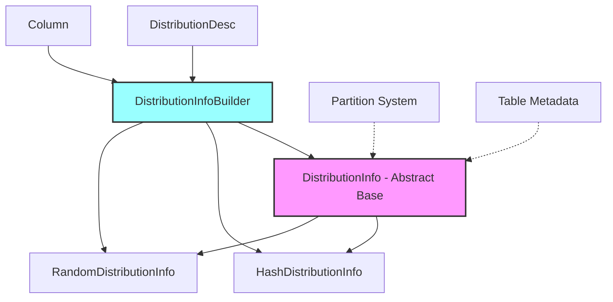

# Distribution Management Module

## Overview

The Distribution Management module is a core component of StarRocks' catalog system that handles data distribution strategies across the cluster. It provides the foundation for determining how data is distributed across tablets and nodes, which is crucial for query performance, data locality, and load balancing.

## Purpose

This module is responsible for:
- **Data Distribution Strategy**: Managing how table data is distributed across the cluster
- **Distribution Information**: Storing and managing distribution metadata for tables
- **Distribution Building**: Creating distribution configurations from SQL statements
- **Colocation Support**: Enabling tables with the same distribution to be colocated for optimal join performance

## Architecture



## Core Components

### 1. DistributionInfo (Abstract Base Class)
The foundation class that defines the contract for all distribution types. See [Distribution Core](distribution_core.md) for detailed documentation.

**Key Responsibilities:**
- **Type Management**: Handles distribution type (HASH, RANDOM)
- **Bucket Configuration**: Manages the number of buckets for data distribution
- **Column Support**: Defines which columns participate in distribution
- **Colocation Support**: Enables tables to be colocated based on distribution
- **Serialization**: Provides persistence capabilities for distribution metadata

### 2. DistributionInfoBuilder
A centralized builder that creates distribution configurations. See [Distribution Builder](distribution_builder.md) for detailed documentation.

**Key Responsibilities:**
- **Type-Specific Creation**: Handles both hash and random distribution creation
- **Validation**: Ensures distribution columns meet requirements
- **Column Resolution**: Maps column names to actual column objects
- **Error Handling**: Provides detailed error messages for invalid configurations

## Distribution Types

### Hash Distribution
- **Purpose**: Distributes data based on hash values of specified columns
- **Use Cases**: 
  - Tables with frequent joins on distribution columns
  - Large tables requiring even data distribution
  - Tables benefiting from colocation optimization
- **Requirements**:
  - Distribution columns must be key columns
  - Column types must support distribution operations

### Random Distribution
- **Purpose**: Distributes data randomly across buckets
- **Use Cases**:
  - Small dimension tables
  - Tables without specific join patterns
  - Simple distribution without column dependencies

## Integration Points

### Catalog System Integration
The distribution management module integrates with:
- **Table Metadata**: Each table contains distribution information
- **Partition System**: Distribution works in conjunction with partitioning
- **Column Management**: Validates distribution column eligibility
- **Schema Management**: Ensures distribution compatibility with schema changes

### Query Optimization
Distribution information is used by:
- **Query Planner**: For join order optimization
- **Colocation Engine**: To determine optimal data placement
- **Load Balancing**: To ensure even data distribution

## Key Features

### Colocation Support
- Enables tables with identical distribution to be stored together
- Optimizes join performance by reducing data movement
- Automatically managed by the colocation engine

### Type Safety
- Validates distribution column types
- Ensures compatibility with distribution operations
- Provides clear error messages for invalid configurations

### Persistence
- Distribution metadata is serialized and persisted
- Supports metadata recovery and replication
- Maintains consistency across cluster nodes

## Usage Patterns

### Table Creation
```sql
-- Hash distribution
CREATE TABLE users (
    user_id BIGINT,
    name VARCHAR(100),
    age INT
) DISTRIBUTED BY HASH(user_id) BUCKETS 10;

-- Random distribution
CREATE TABLE countries (
    country_id INT,
    country_name VARCHAR(100)
) DISTRIBUTED BY RANDOM BUCKETS 5;
```

### Colocation Groups
Tables with the same distribution can form colocation groups for optimized joins:
```sql
-- These tables can be colocated if they have the same distribution
CREATE TABLE orders (order_id BIGINT, user_id BIGINT) DISTRIBUTED BY HASH(user_id) BUCKETS 10;
CREATE TABLE user_profiles (user_id BIGINT, profile_data VARCHAR(1000)) DISTRIBUTED BY HASH(user_id) BUCKETS 10;
```

## Related Documentation

- [Column Management](column_management.md) - For distribution column requirements
- [Partition Management](partition_management.md) - For partitioning and distribution interaction
- [Table Structure](table_structure.md) - For overall table metadata organization
- [Catalog System](catalog.md) - For broader catalog integration

## Performance Considerations

### Distribution Column Selection
- Choose columns frequently used in joins
- Select columns with good cardinality
- Avoid columns with high skew

### Bucket Count
- More buckets provide finer granularity
- Too many buckets can increase metadata overhead
- Consider data size and query patterns

### Colocation Benefits
- Reduces network traffic during joins
- Improves query performance
- Requires identical distribution across tables