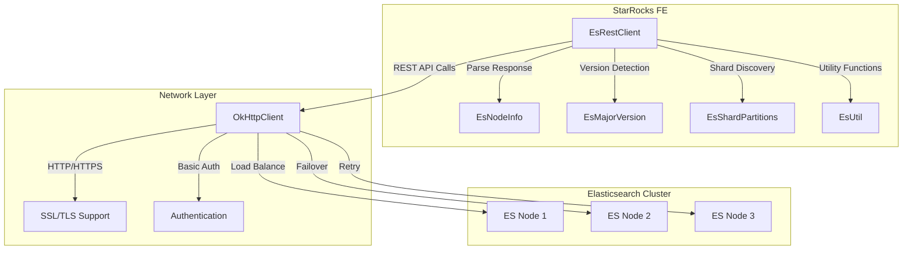
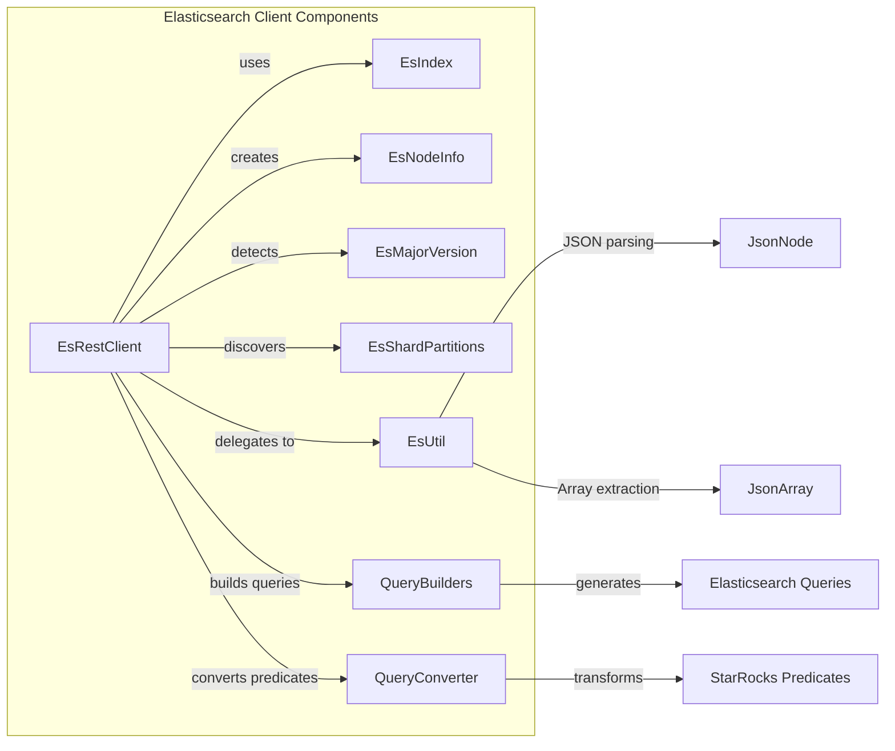
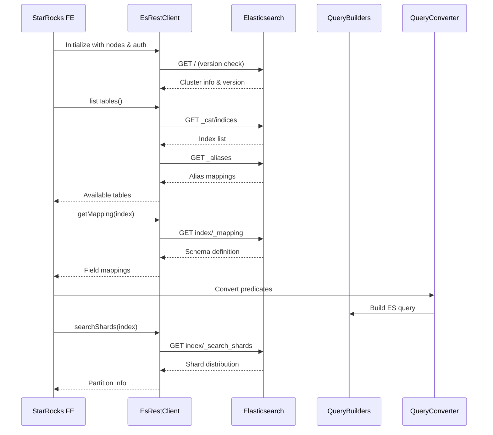
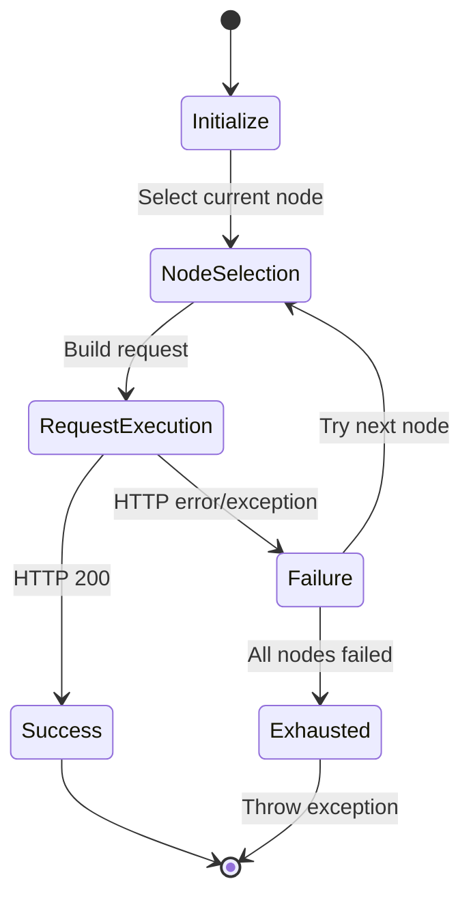

# Elasticsearch Client Module Documentation

## Overview

The Elasticsearch Client module provides a comprehensive REST client implementation for interfacing with Elasticsearch clusters within the StarRocks ecosystem. This module serves as a critical bridge between StarRocks and Elasticsearch, enabling seamless data access, schema discovery, and query execution capabilities.

## Purpose and Core Functionality

The Elasticsearch Client module is designed to:

- **Establish secure connections** to Elasticsearch clusters with support for SSL/TLS encryption and authentication
- **Discover cluster topology** and node information for optimal query routing
- **Retrieve schema information** including index mappings and field definitions
- **Execute search operations** with shard-aware partitioning for distributed query processing
- **Manage table metadata** by exposing Elasticsearch indices as StarRocks external tables
- **Handle failover scenarios** through intelligent node selection and retry mechanisms

## Architecture

### High-Level Architecture



### Component Relationships



## Core Components

### EsRestClient

The primary client class that manages all interactions with Elasticsearch clusters:

- **Multi-node support**: Maintains a list of Elasticsearch nodes for load balancing and failover
- **SSL/TLS encryption**: Configurable secure communication with certificate validation bypass options
- **Authentication**: Built-in support for basic authentication using HTTP Authorization headers
- **Retry mechanism**: Automatic failover to alternative nodes on connection failures
- **Connection pooling**: Efficient HTTP connection management through OkHttpClient

#### Key Methods:

- `getMapping(String indexName)`: Retrieves index mapping definitions
- `searchShards(String indexName)`: Discovers shard distribution for query optimization
- `version()`: Detects Elasticsearch cluster version for compatibility
- `listTables()`: Enumerates available indices and aliases as StarRocks tables
- `getHttpNodes()`: Discovers cluster topology and HTTP-enabled nodes

### EsIndex

A simple data structure representing an Elasticsearch index:

```java
public static class EsIndex {
    private String index;
    public String getIndex() {
        return index;
    }
}
```

### Supporting Components

- **EsNodeInfo**: Represents Elasticsearch node information including HTTP capabilities
- **EsMajorVersion**: Handles version detection and compatibility checking
- **EsShardPartitions**: Manages shard partitioning information for distributed queries
- **EsUtil**: Provides utility functions for JSON parsing and data extraction

## Data Flow

### Query Execution Flow



### Connection Management Flow



## Integration with StarRocks

### Connector Framework Integration

The Elasticsearch Client integrates with StarRocks' connector framework through:

- **ElasticsearchConnector**: Main connector implementation that uses EsRestClient
- **QueryBuilders**: Generates Elasticsearch-specific query DSL from StarRocks predicates
- **QueryConverter**: Transforms StarRocks expressions to Elasticsearch query format
- **EsUtil**: Provides schema mapping and data type conversion utilities

### External Table Support

Elasticsearch indices are exposed as StarRocks external tables through:

1. **Schema Discovery**: Automatic detection of field types and mappings
2. **Partition Pruning**: Shard-based partitioning for query optimization
3. **Predicate Pushdown**: Conversion of StarRocks filters to Elasticsearch queries
4. **Column Projection**: Selective field retrieval to minimize data transfer

## Security Features

### Authentication

- **Basic Authentication**: HTTP Basic Auth with configurable credentials
- **Header-based**: Uses standard HTTP Authorization headers
- **Credential Management**: Secure storage and handling of authentication data

### SSL/TLS Support

- **Certificate Validation**: Configurable SSL certificate verification
- **Trust All Certificates**: Option to bypass certificate validation for development
- **Hostname Verification**: Configurable hostname verification for SSL connections
- **Custom Trust Managers**: Support for custom certificate trust chains

## Error Handling and Resilience

### Retry Mechanism

- **Node Failover**: Automatic switching to alternative nodes on failure
- **Exhaustive Retry**: Attempts all available nodes before failing
- **Exception Preservation**: Maintains original exception context for debugging

### Error Scenarios

- **Connection Failures**: Network connectivity issues and timeouts
- **Authentication Errors**: Invalid credentials or authorization failures
- **Index Not Found**: Missing or deleted Elasticsearch indices
- **Version Incompatibility**: Unsupported Elasticsearch cluster versions

## Performance Optimization

### Connection Pooling

- **OkHttpClient Integration**: Leverages efficient HTTP connection pooling
- **Timeout Configuration**: Configurable read timeouts for optimal performance
- **Keep-Alive Support**: Persistent connections to reduce connection overhead

### Query Optimization

- **Shard Awareness**: Distributes queries based on shard location
- **Predicate Pushdown**: Minimizes data transfer by pushing filters to Elasticsearch
- **Column Pruning**: Retrieves only required fields to reduce network traffic

## Configuration

### Client Configuration

```java
// Basic configuration
String[] nodes = {"http://es-node1:9200", "http://es-node2:9200"};
String authUser = "elastic";
String authPassword = "password";
boolean sslEnabled = true;

// Create client
EsRestClient client = new EsRestClient(nodes, authUser, authPassword, sslEnabled);
```

### Network Configuration

- **Read Timeout**: 10 seconds default for HTTP requests
- **SSL Socket Factory**: Custom SSL configuration for secure connections
- **Hostname Verification**: Configurable for different deployment scenarios

## Dependencies

### Internal Dependencies

- **StarRocks Connector Framework**: Integration with connector infrastructure
- **Exception Handling**: StarRocksConnectorException for error reporting
- **JSON Processing**: Jackson library for JSON parsing and manipulation

### External Dependencies

- **OkHttp**: HTTP client library for REST API communication
- **Jackson**: JSON processing library for response parsing
- **Apache HTTP Components**: HTTP header constants and utilities

## Monitoring and Observability

### Logging

- **Request Tracing**: Detailed logging of HTTP requests and responses
- **Error Logging**: Comprehensive error information for troubleshooting
- **Performance Metrics**: Request timing and node performance tracking

### Health Checks

- **Version Detection**: Automatic cluster version monitoring
- **Node Availability**: Continuous monitoring of node health status
- **Connection Validation**: Periodic connection testing and validation

## Future Enhancements

### Planned Features

- **Advanced Authentication**: Support for OAuth2 and API key authentication
- **Connection Caching**: Persistent connection pools for improved performance
- **Bulk Operations**: Support for bulk indexing and search operations
- **Async Operations**: Non-blocking asynchronous query execution
- **Metrics Integration**: Enhanced monitoring and performance metrics

### Scalability Improvements

- **Load Balancing**: Intelligent query distribution across cluster nodes
- **Circuit Breakers**: Automatic failure detection and recovery mechanisms
- **Resource Management**: Memory and connection pool optimization

## Related Documentation

- [Elasticsearch Connector](elasticsearch_connector.md) - Main connector implementation
- [Query Builders](elasticsearch_connector.md#querybuilders) - Query generation components
- [Connector Framework](connector_framework.md) - General connector infrastructure
- [External Tables](frontend_server.md#connector_catalog) - External table management