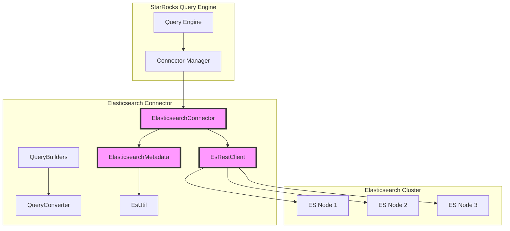
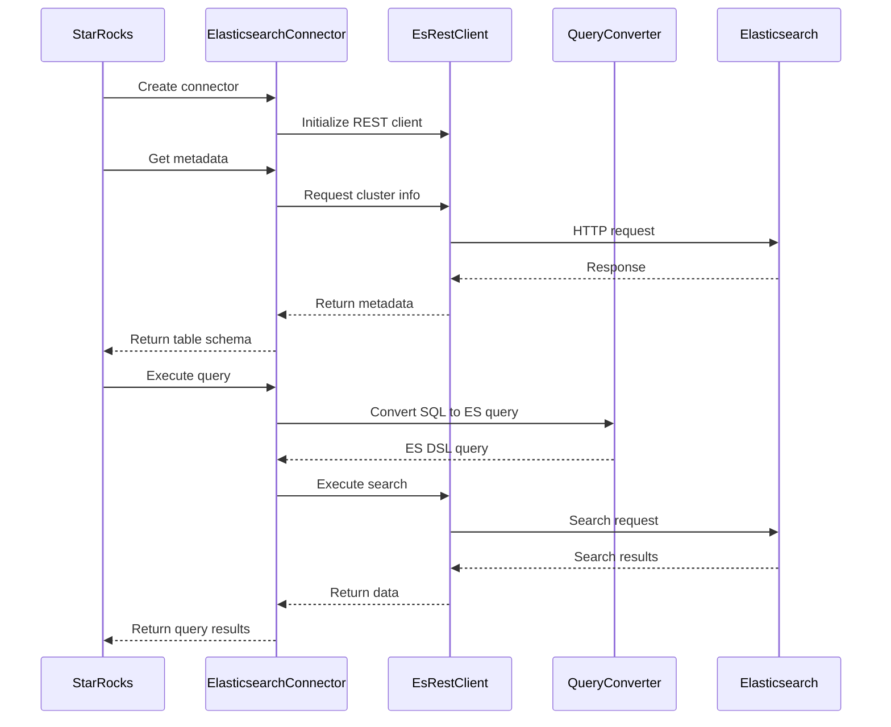

# Elasticsearch Connector Module

## Overview

The Elasticsearch Connector module provides seamless integration between StarRocks and Elasticsearch, enabling users to query Elasticsearch indices as external tables. This module implements the StarRocks connector framework to provide unified access to Elasticsearch data sources with support for query pushdown, schema mapping, and efficient data retrieval.

## Purpose

The primary purpose of the Elasticsearch Connector is to:
- Enable StarRocks to access and query Elasticsearch indices as external tables
- Provide efficient query pushdown capabilities to minimize data transfer
- Handle schema conversion between Elasticsearch mapping and StarRocks types
- Support authentication and secure connections to Elasticsearch clusters
- Implement failover mechanisms for high availability

## Architecture



## Core Components

### 1. ElasticsearchConnector
The main connector implementation that integrates with StarRocks' connector framework. It manages the lifecycle of the Elasticsearch connection and provides metadata access.

**Key Responsibilities:**
- Initialize and configure the Elasticsearch connection
- Provide metadata access through ElasticsearchMetadata
- Handle connector lifecycle management
- Support SSL/TLS connections

### 2. EsRestClient
A robust HTTP client for communicating with Elasticsearch clusters, providing failover capabilities and connection pooling.

**Key Features:**
- Multi-node failover support
- SSL/TLS encryption
- Authentication support (Basic Auth)
- Connection pooling and timeout management
- Automatic node selection and retry mechanisms

### 3. QueryBuilders
A comprehensive query building framework that constructs Elasticsearch DSL queries from StarRocks expressions.

**Supported Query Types:**
- Term queries for exact matches
- Range queries for numeric and date ranges
- Wildcard queries for pattern matching
- Bool queries for complex boolean logic
- Exists queries for null checking
- Terms queries for IN operations

### 4. QueryConverter
Converts StarRocks SQL expressions into Elasticsearch queries, enabling query pushdown for optimal performance.

**Conversion Capabilities:**
- Binary predicates (EQ, NE, GT, GE, LT, LE)
- Compound predicates (AND, OR, NOT)
- NULL predicates
- LIKE predicates with wildcard conversion
- IN predicates
- Function calls (esquery)

### 5. EsUtil
Utility class providing helper functions for Elasticsearch integration, including schema conversion and JSON parsing.

**Key Functions:**
- Type conversion from Elasticsearch to StarRocks
- JSON parsing and manipulation
- Partition and distribution analysis
- Column schema extraction

## Data Flow



## Type Mapping

The connector automatically maps Elasticsearch data types to StarRocks types:

| Elasticsearch Type | StarRocks Type |
|-------------------|-----------------|
| null | NULL |
| boolean | BOOLEAN |
| byte | TINYINT |
| short | SMALLINT |
| integer | INT |
| long | BIGINT |
| unsigned_long | LARGEINT |
| float | FLOAT |
| half_float | FLOAT |
| double | DOUBLE |
| scaled_float | DOUBLE |
| date | DATETIME |
| nested | JSON |
| object | JSON |
| keyword | VARCHAR |
| text | VARCHAR |
| ip | VARCHAR |

## Query Pushdown

The connector supports extensive query pushdown capabilities to minimize data transfer and improve performance:

### Supported Pushdown Operations
- **Comparison operators**: =, !=, >, >=, <, <=
- **Logical operators**: AND, OR, NOT
- **Pattern matching**: LIKE (converted to wildcard queries)
- **NULL checking**: IS NULL, IS NOT NULL
- **Range queries**: BETWEEN, IN operations
- **Custom queries**: esquery() function for raw Elasticsearch DSL

### Pushdown Process
1. SQL expressions are parsed and analyzed
2. Convertible expressions are identified and marked for pushdown
3. Non-convertible expressions are processed locally in StarRocks
4. Elasticsearch queries are constructed and executed
5. Results are filtered locally if necessary

## Configuration

### Basic Configuration
```properties
# Elasticsearch nodes (comma-separated)
elasticsearch.nodes=host1:9200,host2:9200

# Authentication (optional)
elasticsearch.user=username
elasticsearch.password=password

# SSL/TLS (optional)
elasticsearch.enable_ssl=true
```

### Advanced Configuration
The connector supports various Elasticsearch-specific configurations through the EsConfig class, including connection timeouts, retry settings, and SSL configurations.

## Error Handling

The connector implements comprehensive error handling:

- **Connection failures**: Automatic failover to available nodes
- **Authentication errors**: Clear error messages with security guidance
- **Query errors**: Detailed error reporting with query context
- **Timeout handling**: Configurable timeouts with retry mechanisms
- **SSL errors**: Proper certificate validation and error reporting

## Performance Optimization

### Connection Pooling
- Reuses HTTP connections to reduce overhead
- Configurable connection pool sizes
- Automatic connection health checking

### Query Optimization
- Predicate pushdown to reduce data transfer
- Efficient JSON parsing and serialization
- Batch processing for multiple queries

### Caching
- Metadata caching to reduce cluster requests
- Connection reuse for improved performance

## Security

### Authentication
- Basic authentication support
- SSL/TLS encryption for secure connections
- Certificate validation (configurable)

### Access Control
- Integration with StarRocks authorization framework
- Support for Elasticsearch security features
- Audit logging for compliance

## Monitoring and Observability

### Metrics
- Connection pool statistics
- Query execution times
- Error rates and types
- Data transfer volumes

### Logging
- Structured logging with correlation IDs
- Configurable log levels
- Performance metrics logging

## Integration with StarRocks

The connector seamlessly integrates with StarRocks' external table framework:

```sql
-- Create external catalog
CREATE EXTERNAL CATALOG es_catalog 
PROPERTIES (
    "type" = "elasticsearch",
    "elasticsearch.nodes" = "localhost:9200",
    "elasticsearch.user" = "elastic",
    "elasticsearch.password" = "password"
);

-- Query Elasticsearch data
SELECT * FROM es_catalog.default.index_name WHERE field = 'value';
```

## Sub-modules

The elasticsearch_connector module consists of several specialized sub-modules:

- [elasticsearch_connector_core](elasticsearch_connector_core.md) - Core connector implementation and lifecycle management
- [elasticsearch_client](elasticsearch_client.md) - REST client and communication layer with failover support
- [elasticsearch_query](elasticsearch_query.md) - Query building and conversion utilities for SQL-to-ES DSL translation
- [elasticsearch_schema](elasticsearch_schema.md) - Schema mapping and type conversion between Elasticsearch and StarRocks

## Related Modules

- [connector_framework](connector_framework.md) - Base connector framework
- [sql_parser_optimizer](sql_parser_optimizer.md) - SQL parsing and optimization
- [query_execution](query_execution.md) - Query execution engine

## Future Enhancements

- Support for Elasticsearch aggregations
- Advanced security features (OAuth, API keys)
- Performance optimizations for large datasets
- Support for Elasticsearch SQL
- Enhanced monitoring and alerting