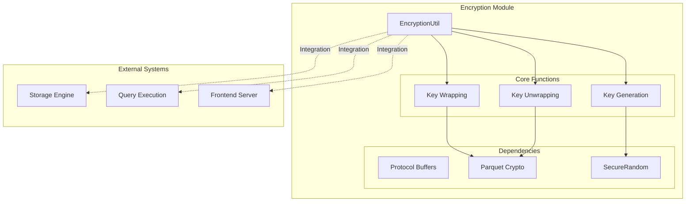
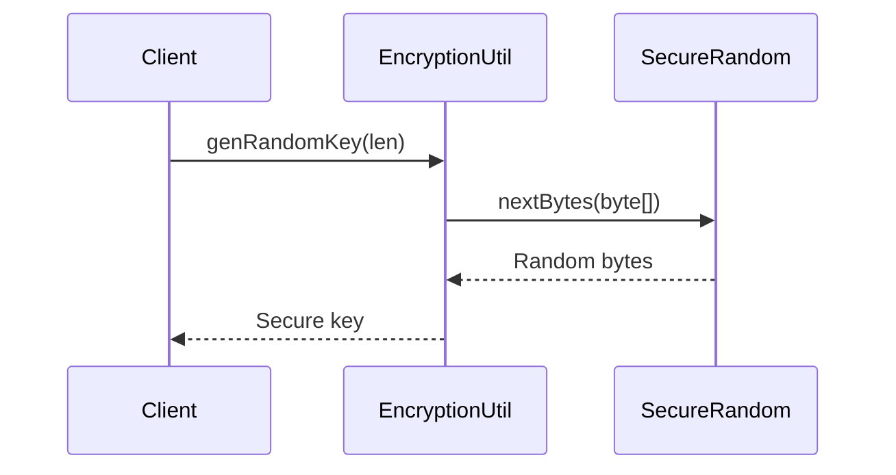
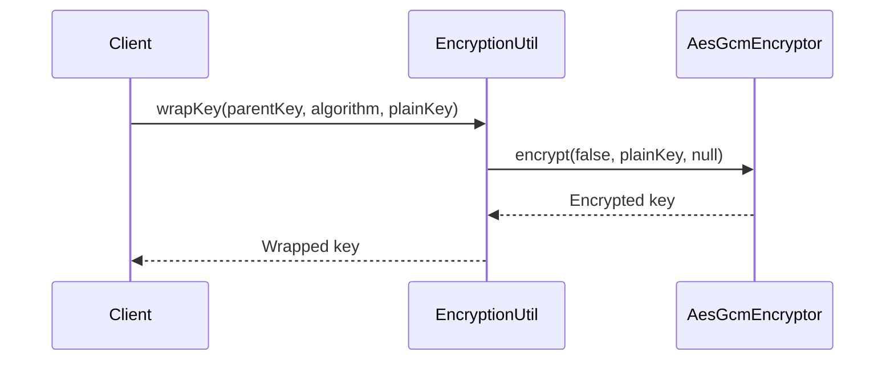
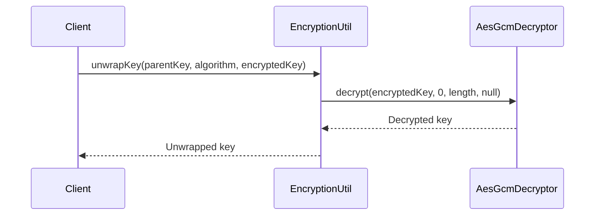
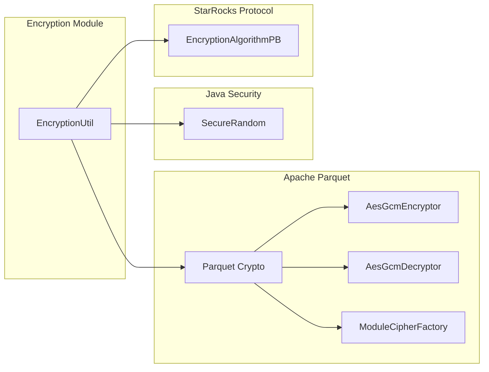

# Encryption Module Documentation

## Introduction

The encryption module provides cryptographic utilities for StarRocks, focusing on data encryption and key management functionality. This module implements secure encryption algorithms and key wrapping/unwrapping operations to protect sensitive data within the StarRocks system.

## Architecture Overview

The encryption module is designed as a centralized cryptographic service that provides:

- **Key Generation**: Secure random key generation using industry-standard algorithms
- **Key Wrapping/Unwrapping**: Secure key encryption and decryption operations
- **Algorithm Support**: Pluggable encryption algorithm framework
- **Integration Points**: Seamless integration with storage and query processing components



## Core Components

### EncryptionUtil

The `EncryptionUtil` class serves as the primary entry point for all cryptographic operations within StarRocks. It provides static methods for secure key management and encryption operations.

#### Key Features:

- **Secure Random Key Generation**: Uses `java.security.SecureRandom` for cryptographically strong random key generation
- **AES-GCM Encryption**: Implements AES-128 in GCM mode for authenticated encryption
- **Key Wrapping/Unwrapping**: Provides secure key encryption and decryption using parent keys
- **Algorithm Extensibility**: Designed to support multiple encryption algorithms through a pluggable interface

#### Core Methods:

```java
// Generate cryptographically secure random keys
static byte[] genRandomKey(int len)

// Wrap (encrypt) a key using a parent key
static byte[] wrapKey(byte[] parentPlainKey, EncryptionAlgorithmPB algorithm, byte[] plainKey)

// Unwrap (decrypt) a key using a parent key
static byte[] unwrapKey(byte[] parentPlainKey, EncryptionAlgorithmPB algorithm, byte[] encryptedKey)
```

## Data Flow

### Key Generation Process



### Key Wrapping Process



### Key Unwrapping Process



## Dependencies

### Internal Dependencies

The encryption module has minimal internal dependencies, making it a lightweight and reusable component:

- **Protocol Buffers**: Uses `EncryptionAlgorithmPB` for algorithm specification
- **Parquet Crypto**: Leverages Apache Parquet's cryptographic libraries for AES-GCM operations
- **Java Security**: Utilizes Java's built-in `SecureRandom` for secure random number generation

### External Dependencies



## Integration Points

### Storage Engine Integration

The encryption module integrates with the [storage engine](storage_engine.md) to provide:
- **Data-at-Rest Encryption**: Encrypting data files and indexes
- **Key Management**: Secure storage and retrieval of encryption keys
- **Performance Optimization**: Efficient encryption/decryption operations for large datasets

### Query Execution Integration

Integration with the [query execution](query_execution.md) module enables:
- **Runtime Encryption**: Dynamic encryption of query results
- **Secure Aggregation**: Encrypted computation of aggregate functions
- **Data Privacy**: Protection of sensitive data during query processing

### Frontend Server Integration

The [frontend server](frontend_server.md) utilizes the encryption module for:
- **Authentication Data Protection**: Secure storage of user credentials
- **Configuration Encryption**: Protection of sensitive configuration parameters
- **Audit Log Security**: Encryption of audit trail data

## Security Considerations

### Cryptographic Standards

- **AES-128-GCM**: Industry-standard authenticated encryption algorithm
- **SecureRandom**: Cryptographically secure random number generation
- **Key Derivation**: Support for secure key derivation functions

### Best Practices

- **Key Rotation**: Support for periodic key rotation
- **Secure Storage**: Integration with secure key storage systems
- **Algorithm Agility**: Designed to support future cryptographic algorithms

## Performance Characteristics

### Encryption Performance

- **AES-GCM Hardware Acceleration**: Leverages CPU instructions when available
- **Minimal Overhead**: Optimized for minimal performance impact
- **Batch Operations**: Support for bulk encryption/decryption operations

### Memory Management

- **Zero-Copy Operations**: Minimizes memory allocations during encryption
- **Secure Memory Clearing**: Ensures sensitive data is properly cleared from memory
- **Resource Pooling**: Efficient reuse of cryptographic resources

## Error Handling

### Exception Types

- **IllegalArgumentException**: Thrown for unsupported encryption algorithms
- **SecurityException**: Thrown for cryptographic operation failures
- **IllegalStateException**: Thrown for invalid key states

### Error Recovery

- **Graceful Degradation**: Falls back to secure defaults on configuration errors
- **Audit Logging**: Comprehensive logging of security-related events
- **Monitoring Integration**: Integration with system monitoring for security alerts

## Future Enhancements

### Planned Features

- **Additional Algorithms**: Support for AES-256, ChaCha20-Poly1305
- **Hardware Security Module (HSM) Integration**: Support for enterprise-grade key management
- **Key Escrow**: Support for key backup and recovery procedures
- **Performance Monitoring**: Detailed metrics for encryption operations

### Extensibility

The module is designed with extensibility in mind:
- **Plugin Architecture**: Support for custom encryption algorithms
- **Configuration-Driven**: Runtime configuration of encryption parameters
- **API Stability**: Stable public API for long-term compatibility

## References

- [Storage Engine Module](storage_engine.md) - Data storage and retrieval
- [Query Execution Module](query_execution.md) - Query processing and optimization
- [Frontend Server Module](frontend_server.md) - System coordination and management
- [Apache Parquet Crypto](https://parquet.apache.org/) - Columnar storage encryption
- [Java Cryptography Architecture](https://docs.oracle.com/en/java/javase/11/security/java-cryptography-architecture-jca-reference-guide.html) - Java security framework