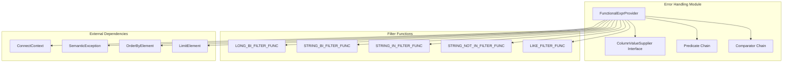
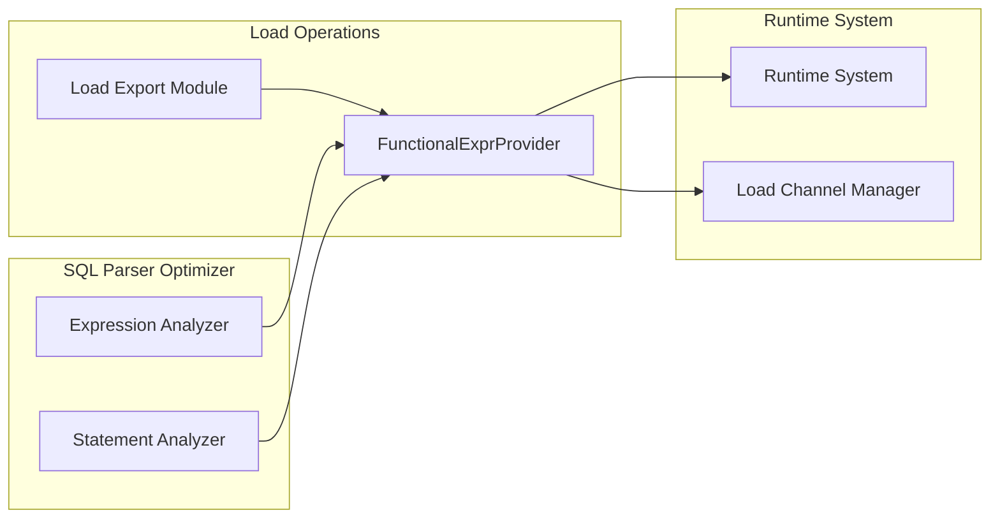
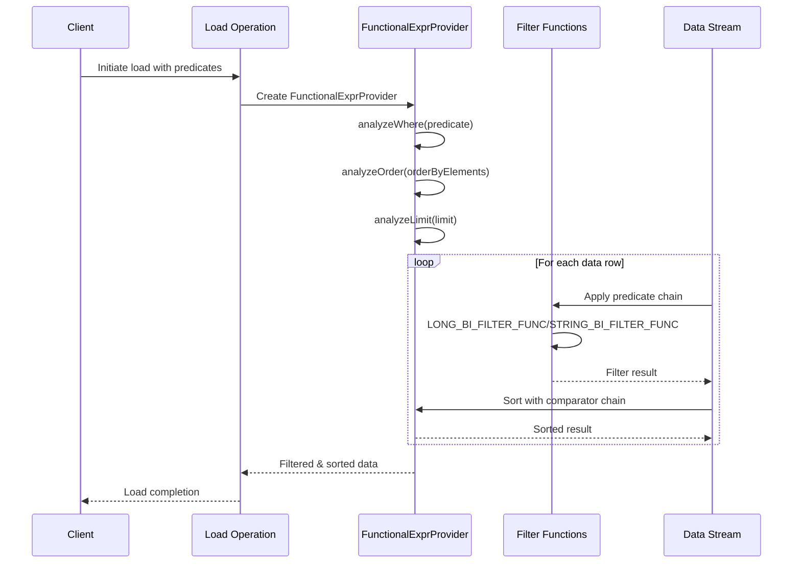

# Error Handling Module Documentation

## Introduction

The error_handling module in StarRocks provides a comprehensive framework for managing functional expressions and error handling during data loading operations. This module is primarily responsible for processing SQL-like predicates and expressions in load operations, enabling sophisticated filtering, sorting, and data validation capabilities.

## Core Functionality

The module's primary component, `FunctionalExprProvider`, serves as a foundation for:
- **Predicate Chain Processing**: Building and executing complex filter conditions
- **Comparator Chain Management**: Handling sorting operations with multiple criteria
- **Type-Safe Expression Evaluation**: Supporting various data types (STRING, BIGINT, DATETIME)
- **SQL-like Clause Support**: Processing WHERE, ORDER BY, LIMIT clauses in load operations

## Architecture Overview



## Component Relationships



## Data Flow Architecture



## Key Components

### FunctionalExprProvider<U>
The main class that provides predicate chains and comparator chains for filtering and sorting operations on data streams.

**Key Methods:**
- `analyze()`: Main entry point for processing SQL-like expressions
- `analyzeWhere()`: Processes WHERE clause predicates
- `analyzeOrder()`: Handles ORDER BY sorting logic
- `analyzeLimit()`: Manages LIMIT and OFFSET operations

### ColumnValueSupplier<E> Interface
Defines the contract for column value extraction during streaming operations:
- `getColumnName()`: Returns column identifier
- `getColumnType()`: Provides type information
- `getColumnValue(E row)`: Extracts typed values from data rows

### Filter Functions
Specialized BiPredicate implementations for different data types:
- **LONG_BI_FILTER_FUNC**: Handles numeric comparisons (EQ, NE, LE, GE, LT, GT)
- **STRING_BI_FILTER_FUNC**: Manages string equality operations
- **STRING_IN_FILTER_FUNC**: Processes IN clause filtering
- **STRING_NOT_IN_FILTER_FUNC**: Handles NOT IN operations
- **LIKE_FILTER_FUNC**: Implements pattern matching with LIKE syntax

## Supported Operations

### Predicate Types
1. **Binary Predicates**: Support for =, !=, <, <=, >, >= operations
2. **LIKE Predicates**: Pattern matching with wildcard support
3. **IN/NOT IN Predicates**: Set-based filtering operations
4. **Compound Predicates**: AND-only logical combinations

### Data Type Support
- **STRING/VARCHAR**: Case-insensitive string operations
- **BIGINT**: Numeric comparisons and arithmetic
- **DATETIME**: Time-based filtering with string conversion

### Limitations
- Only AND operators supported in compound predicates
- Limited to specific column types in WHERE clauses
- RValue restrictions (string or integer only for certain operations)

## Integration with Load Operations

The error_handling module integrates closely with the [load_export](load_export.md) module, providing essential functionality for:
- **Data Validation**: Filtering invalid records during load
- **Data Transformation**: Sorting and limiting loaded data
- **Error Reporting**: Generating meaningful error messages for failed operations

## Error Handling Strategy

The module implements a comprehensive error handling approach:

1. **Semantic Validation**: Early detection of invalid expressions
2. **Type Checking**: Ensures compatibility between operators and data types
3. **Runtime Filtering**: Graceful handling of null values and edge cases
4. **Exception Propagation**: Meaningful error messages for debugging

## Performance Considerations

- **Parallel Processing**: Uses parallel streams for IN clause operations
- **Lazy Evaluation**: Predicate chains built incrementally
- **Memory Efficiency**: Streaming approach minimizes memory footprint
- **Type Safety**: Compile-time type checking reduces runtime overhead

## Dependencies

The error_handling module relies on several other StarRocks components:

- **[sql_parser_optimizer](sql_parser_optimizer.md)**: For expression parsing and validation
- **[load_export](load_export.md)**: Integration point for load operations
- **[frontend_server](frontend_server.md)**: Access to catalog and metadata information
- **[runtime_system](runtime_system.md)**: Execution environment and context management

## Usage Examples

### Basic Predicate Processing
```java
FunctionalExprProvider<RowType> provider = new CustomExprProvider();
provider.analyze(connectContext, wherePredicate, orderByElements, limitElement);
Predicate<RowType> filter = provider.getPredicateChain();
Comparator<RowType> sorter = provider.getOrderComparator();
```

### Custom ColumnValueSupplier Implementation
```java
protected ImmutableList<ColumnValueSupplier<U>> delegateWhereSuppliers() {
    return ImmutableList.of(
        new ColumnValueSupplier<U>() {
            public String getColumnName() { return "column_name"; }
            public PrimitiveType getColumnType() { return PrimitiveType.VARCHAR; }
            public String getColumnValue(U row) { return row.getStringValue(); }
        }
    );
}
```

## Future Enhancements

Potential areas for module expansion include:
- Support for additional SQL operators (OR, NOT)
- Extended data type support (DECIMAL, JSON)
- Performance optimizations for large-scale filtering
- Integration with query optimization frameworks
- Enhanced error reporting and diagnostics

## Conclusion

The error_handling module provides a robust foundation for functional expression processing in StarRocks load operations. Its type-safe, extensible design enables sophisticated data filtering and transformation while maintaining performance and reliability standards required for production data warehouse operations.