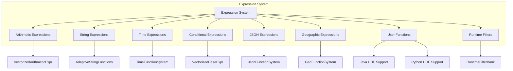
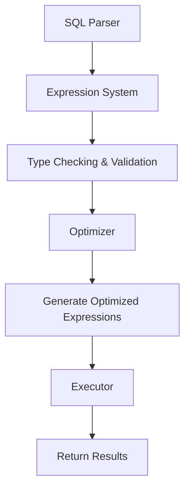

# Expression System Module Documentation

## Overview

The expression system module is a core component of StarRocks that handles the evaluation and processing of expressions in SQL queries. It provides a comprehensive framework for parsing, optimizing, and executing various types of expressions including arithmetic operations, string manipulations, date/time functions, and complex data type operations.

## Architecture

## Core Components

### 1. Expression Framework

The expression system is built around a base `Expr` class that provides:
- Expression tree construction and evaluation
- Type checking and validation
- Vectorized execution capabilities
- JIT compilation support
- Memory management and lifecycle control

### 2. Expression Types

#### Arithmetic Expressions
- **VectorizedArithmeticExpr**: Handles basic arithmetic operations (add, subtract, multiply, divide)
- **VectorizedModArithmeticExpr**: Modulo operations
- **VectorizedDivArithmeticExpr**: Division with overflow handling
- **VectorizedBitArithmeticExpr**: Bitwise operations

For detailed information, see [Arithmetic Expressions](arithmetic_expressions.md)

#### String Expressions
- **AdaptiveTrimFunction**: Optimized string trimming with SIMD support
- **StringFunctions**: Comprehensive string manipulation (concat, substring, replace, etc.)
- **LocateCaseSensitiveUTF8**: Efficient string searching with UTF-8 support
- **NgramFunctionImpl**: N-gram based string similarity functions

For detailed information, see [String Functions](string_functions.md)

#### Time and Date Expressions
- **TimeFunctions**: Date/time arithmetic, formatting, and extraction
- **TeradataFormatState**: Support for Teradata-style date formats
- **ConvertTzCtx**: Timezone conversion utilities

#### Conditional Expressions
- **VectorizedCaseExpr**: CASE-WHEN-THEN-ELSE expressions
- **VectorizedIfNullExpr**: IFNULL function implementation
- **VectorizedNullIfExpr**: NULLIF function implementation
- **VectorizedCoalesceExpr**: COALESCE function implementation

#### JSON Expressions
- **JsonFunctions**: JSON parsing, extraction, and manipulation
- **NativeJsonState**: Optimized JSON path evaluation
- **JsonContainmentChecker**: JSON containment logic

For detailed information, see [JSON Functions](json_functions.md)

#### Geographic Expressions
- **GeoFunctions**: Geographic data processing (ST_Contains, ST_Distance, etc.)
- **StContainsState**: Spatial relationship checking

### 3. Advanced Features

#### JIT Compilation
- **JITObjectCache**: LLVM-based JIT compilation for expression evaluation
- **JITEngine**: Manages JIT compilation lifecycle and optimization
- Support for arithmetic, comparison, and logical operations

For detailed information, see [JIT Compilation](jit_compilation.md)

#### Runtime Filters
- **RuntimeFilterBank**: Dynamic filter generation for join optimization
- **FilterIniter**: Filter initialization and management
- Support for Bloom filters, bitset filters, and IN filters

#### User-Defined Functions
- **JavaFunctionCallExpr**: Java UDF support with JNI integration
- **ArrowFunctionCallExpr**: Python UDF support via Arrow
- **UDFFunctionCallHelper**: UDF execution framework

#### Table Functions
- **JavaUDTFState**: Java-based table functions
- **TableFunctionMapHash**: Function resolution and mapping

## Data Flow

## Key Features

### 1. Vectorized Execution
All expressions support columnar processing for optimal performance:
- SIMD optimizations where applicable
- Batch processing of multiple rows
- Memory-efficient column operations

### 2. Type System Integration
- Comprehensive type support (primitive, complex, nested)
- Automatic type casting and conversion
- Type-specific optimizations

### 3. Performance Optimizations
- **Adaptive algorithms**: Switch between implementations based on data characteristics
- **Constant folding**: Pre-compute constant expressions
- **Null handling**: Optimized null value processing
- **Memory management**: Efficient buffer reuse and allocation

### 4. Extensibility
- Plugin architecture for custom functions
- Multi-language UDF support (Java, Python)
- Dynamic function registration

## Integration Points

### Query Engine Integration
The expression system integrates with:
- [Query Execution Module](query_execution.md): Provides expression evaluation during query processing
- [SQL Parser/Optimizer](sql_parser_optimizer.md): Receives optimized expression trees
- [Storage Engine](storage_engine.md): Applies expressions for data filtering and transformation

### External System Integration
- **Java Extensions**: UDF support via JNI
- **Python Extensions**: UDF support via Arrow
- **Connector Framework**: Expression pushdown to external systems

## Performance Characteristics

### Vectorized Operations
- Batch processing reduces function call overhead
- SIMD instructions for arithmetic and string operations
- Cache-friendly data access patterns

### Memory Efficiency
- Columnar data layout minimizes memory footprint
- Buffer reuse reduces allocation overhead
- Streaming evaluation for large datasets

### Optimization Strategies
- **JIT Compilation**: Hot paths compiled to native code
- **Adaptive Execution**: Algorithm selection based on data characteristics
- **Predicate Pushdown**: Early filtering to reduce data volume

## Error Handling

The expression system implements comprehensive error handling:
- Type validation and conversion errors
- Arithmetic overflow detection
- Memory allocation failures
- UDF execution errors
- Graceful degradation for unsupported operations

## Configuration and Tuning

### Performance Tuning
- JIT compilation thresholds
- Vectorization batch sizes
- Memory allocation strategies
- Cache size configurations

### Feature Flags
- Enable/disable specific expression types
- UDF security settings
- JIT compilation controls
- Debug and profiling modes

## Future Enhancements

### Planned Improvements
1. **GPU Acceleration**: CUDA/OpenCL support for expression evaluation
2. **Advanced JIT**: More comprehensive LLVM optimization
3. **Machine Learning Integration**: Built-in ML function library
4. **Streaming Expressions**: Continuous expression evaluation for streaming data
5. **Federated Expressions**: Cross-system expression evaluation

### Research Areas
- Automatic expression optimization using ML
- Adaptive execution based on runtime statistics
- Distributed expression evaluation
- Hardware-specific optimizations

## Related Documentation

- [Query Execution Module](query_execution.md) - Integration with query processing
- [SQL Parser/Optimizer](sql_parser_optimizer.md) - Expression parsing and optimization
- [Storage Engine](storage_engine.md) - Data filtering and transformation
- [Java Extensions](java_extensions.md) - UDF development and deployment
- [Connector Framework](connectors.md) - External system integration