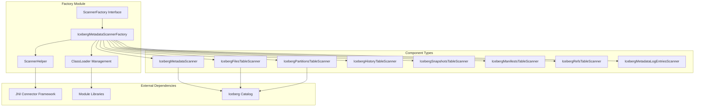
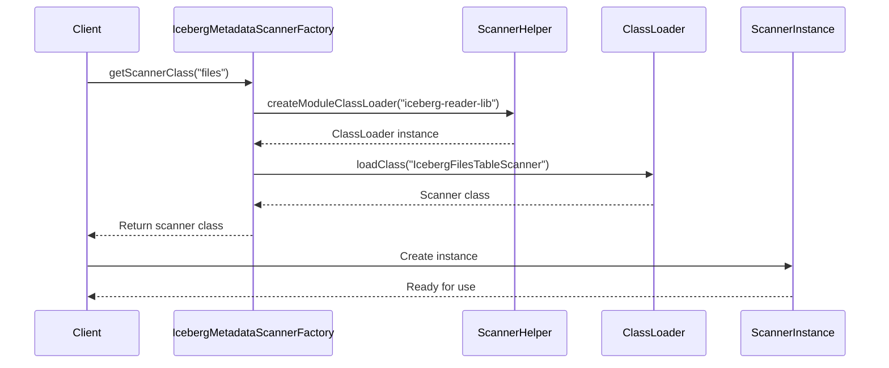
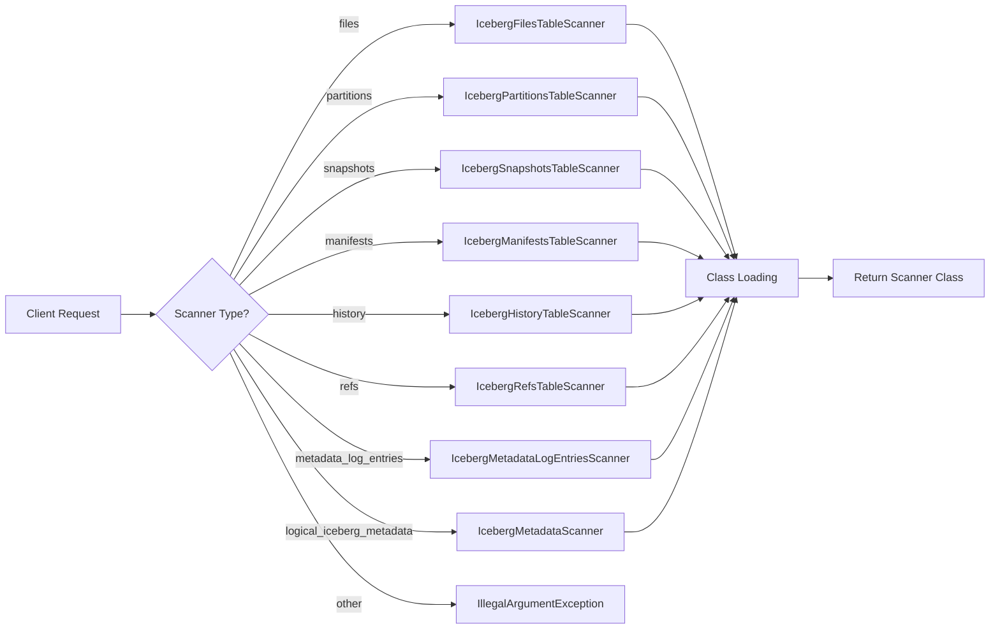
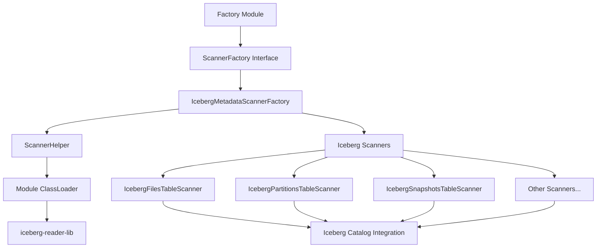
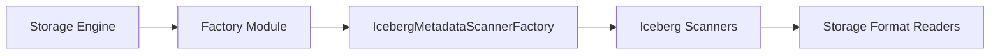
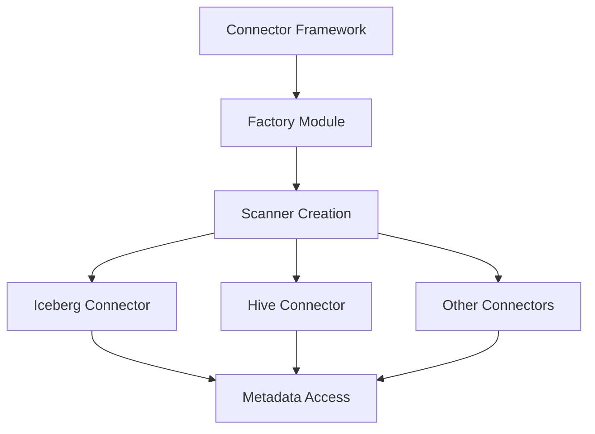
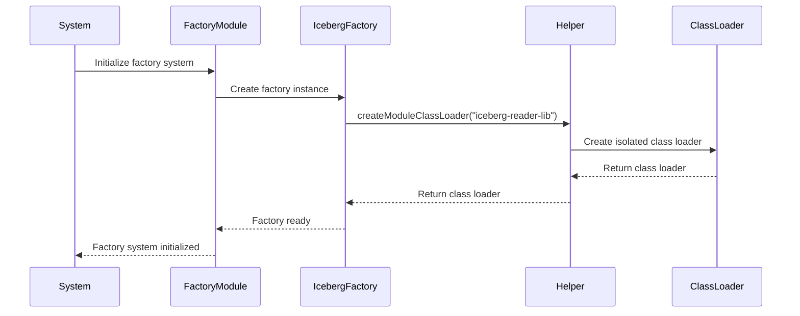
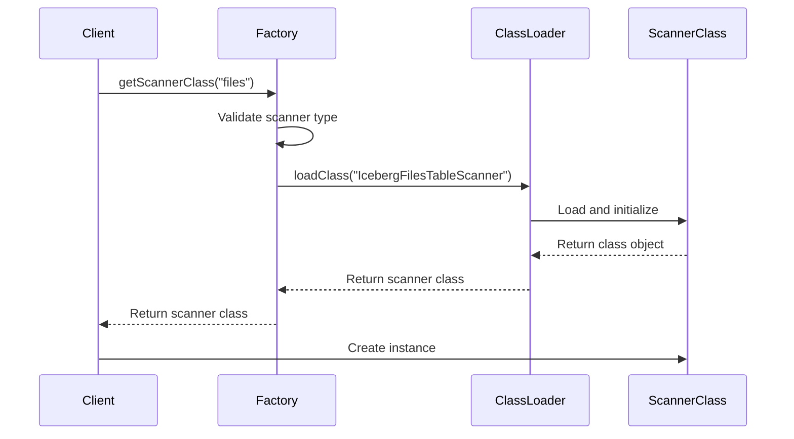

# Factory Module Documentation

## Overview

The Factory module serves as a central component creation and management system within the StarRocks architecture. It provides standardized interfaces for instantiating various types of scanners, connectors, and system components across different storage formats and data sources. The module implements the Factory design pattern to decouple object creation from business logic, enabling flexible and extensible component management.

## Purpose and Core Functionality

The Factory module's primary responsibilities include:

- **Component Instantiation**: Providing standardized factory interfaces for creating various system components
- **Type-based Creation**: Supporting dynamic component creation based on type identifiers and configuration parameters
- **Resource Management**: Handling class loading, lifecycle management, and resource allocation for created components
- **Extensibility**: Enabling easy addition of new component types without modifying existing code
- **Abstraction**: Decoupling component creation logic from usage patterns throughout the system

## Architecture

### High-Level Architecture



### Component Interaction Diagram



## Core Components

### IcebergMetadataScannerFactory

The `IcebergMetadataScannerFactory` is the primary implementation of the `ScannerFactory` interface, specializing in creating Iceberg metadata scanner instances. It manages the dynamic loading and instantiation of various Iceberg table scanners based on scanner type identifiers.

**Key Features:**
- Dynamic class loading using isolated module class loaders
- Type-based scanner selection and instantiation
- Error handling and resource management
- Support for multiple Iceberg metadata table types

**Supported Scanner Types:**
- `logical_iceberg_metadata`: General metadata scanner
- `refs`: References table scanner
- `history`: History table scanner  
- `metadata_log_entries`: Metadata log entries scanner
- `snapshots`: Snapshots table scanner
- `manifests`: Manifests table scanner
- `files`: Files table scanner
- `partitions`: Partitions table scanner

### ScannerFactory Interface

The `ScannerFactory` interface defines the contract for all scanner factory implementations within the system. It provides a standardized method for obtaining scanner classes based on type identifiers.

**Interface Definition:**
```java
public interface ScannerFactory {
    Class getScannerClass(String scannerType) throws ClassNotFoundException;
}
```

### ScannerHelper

The `ScannerHelper` utility class provides common functionality for scanner operations, including class loader creation and module management. It serves as a helper utility for factory implementations.

## Data Flow

### Scanner Creation Flow



### Module Integration Flow



## Dependencies

### Internal Dependencies

The Factory module relies on several internal components:

- **[JNI Connector Framework](jni_connector.md)**: Provides the `ScannerFactory` interface and `ScannerHelper` utilities
- **[Iceberg Integration](iceberg_connector.md)**: Supplies the actual scanner implementations for Iceberg metadata tables
- **[Module System](module_system.md)**: Manages class loading and module isolation

### External Dependencies

- **Iceberg Reader Library**: External module containing scanner implementations
- **Java ClassLoader System**: For dynamic class loading and isolation
- **JNI Framework**: For native integration capabilities

## Integration with Other Modules

### Storage Engine Integration

The Factory module integrates with the [storage_engine](storage_engine.md) module to provide scanner instances for various storage formats:



### Connector Framework Integration

The module works closely with the [connectors](connectors.md) framework to support various data source types:



## Process Flows

### Scanner Factory Initialization



### Runtime Scanner Creation



## Configuration and Usage

### Basic Usage Pattern

```java
// Obtain factory instance
ScannerFactory factory = new IcebergMetadataScannerFactory();

// Request specific scanner class
Class scannerClass = factory.getScannerClass("files");

// Create scanner instance
Object scanner = scannerClass.getDeclaredConstructor().newInstance();
```

### Error Handling

The Factory module implements comprehensive error handling:

- **ClassNotFoundException**: Thrown when requested scanner class cannot be loaded
- **IllegalArgumentException**: Thrown for unknown scanner type identifiers
- **Runtime Exceptions**: Properly wrapped and propagated for debugging

## Extension Points

### Adding New Scanner Types

To add support for new scanner types:

1. Implement the scanner class following the existing pattern
2. Add the new type to the `getScannerClass` method switch statement
3. Ensure the scanner class is available in the module class loader
4. Update documentation and tests

### Custom Factory Implementations

New factory implementations can be created by:

1. Implementing the `ScannerFactory` interface
2. Managing appropriate class loaders for the component types
3. Implementing type-based creation logic
4. Registering with the factory system

## Performance Considerations

### Class Loading Optimization

- **Module Isolation**: Uses isolated class loaders to prevent conflicts
- **Caching**: Class objects are loaded once and reused
- **Lazy Loading**: Classes are loaded only when requested

### Memory Management

- **Resource Cleanup**: Proper cleanup of class loader resources
- **Garbage Collection**: Facilitates proper garbage collection of unused classes
- **Memory Isolation**: Prevents memory leaks through proper class loader management

## Security Considerations

### Class Loading Security

- **Isolated Class Loaders**: Prevents class conflicts and security issues
- **Module Boundaries**: Enforces module boundaries for security
- **Access Control**: Proper access control for factory operations

### Resource Access

- **Controlled Access**: Factory controls access to scanner implementations
- **Permission Management**: Proper permission management for class loading
- **Audit Trail**: Supports audit trail for security monitoring

## Testing and Quality Assurance

### Unit Testing

- **Factory Method Testing**: Comprehensive testing of factory methods
- **Error Condition Testing**: Testing of error conditions and exceptions
- **Integration Testing**: Testing with actual scanner implementations

### Performance Testing

- **Load Testing**: Testing under high load conditions
- **Memory Testing**: Memory usage and leak testing
- **Concurrency Testing**: Thread safety and concurrency testing

## Future Enhancements

### Planned Improvements

- **Generic Factory Framework**: Extension to support other component types
- **Configuration-driven Creation**: Support for configuration-driven factory behavior
- **Dynamic Registration**: Runtime registration of new scanner types
- **Performance Monitoring**: Built-in performance monitoring and metrics

### Scalability Enhancements

- **Factory Pooling**: Pooling of factory instances for performance
- **Distributed Factories**: Support for distributed factory patterns
- **Caching Improvements**: Enhanced caching strategies for better performance

## Conclusion

The Factory module provides a robust, extensible foundation for component creation and management within the StarRocks system. Its implementation of the Factory design pattern enables clean separation of concerns, promotes code reusability, and facilitates system extensibility. The module's focus on Iceberg metadata scanners demonstrates its capability to handle complex, type-specific component creation while maintaining flexibility for future enhancements.