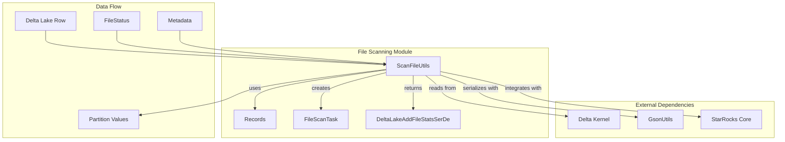
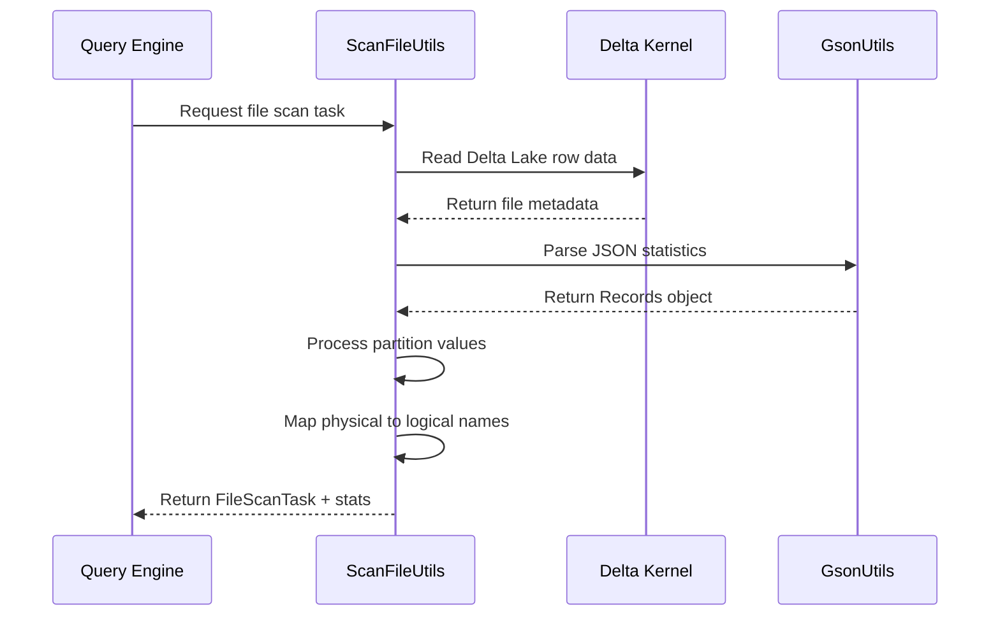
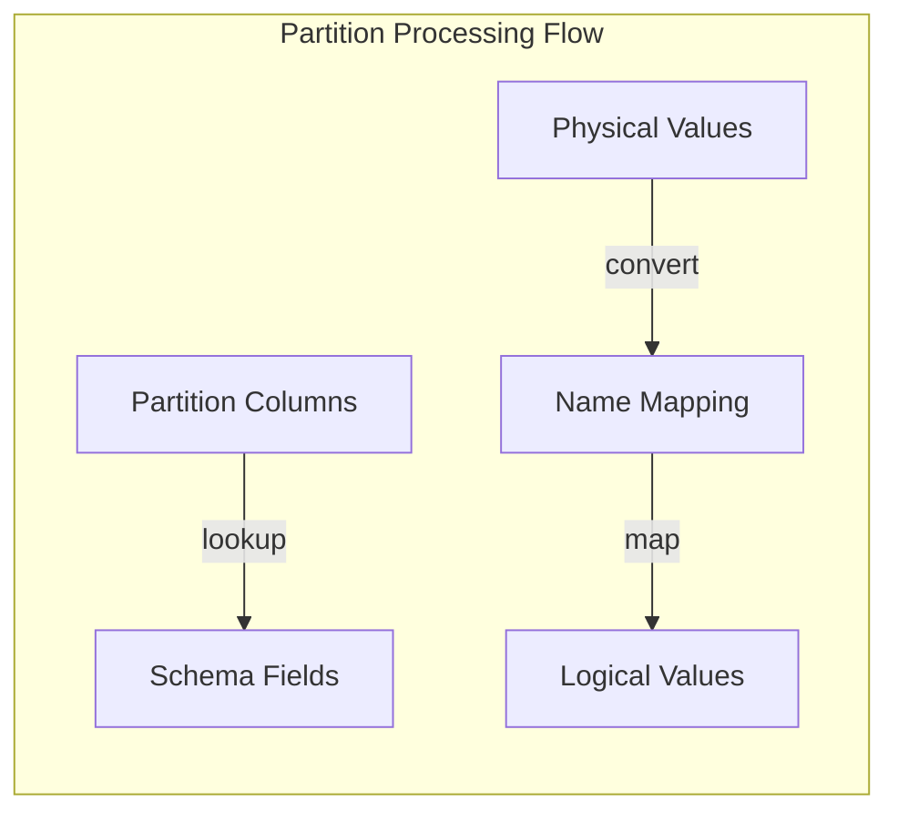

# File Scanning Module Documentation

## Introduction

The file_scanning module is a core component of the StarRocks storage engine that provides efficient file-level scanning capabilities for Delta Lake tables. This module is responsible for reading and processing file metadata, statistics, and partition information from Delta Lake format files, enabling optimized query execution and data access patterns.

## Module Overview

The file_scanning module serves as a bridge between the Delta Lake storage format and StarRocks' query execution engine. It handles the conversion of Delta Lake file metadata into StarRocks-compatible file scan tasks, providing essential functionality for:

- File-level statistics extraction and processing
- Partition value mapping and conversion
- Row count estimation for query optimization
- Column statistics retrieval for cost-based optimization
- Integration with Delta Lake's column mapping features

## Core Architecture

### Component Structure



### Key Components

#### 1. ScanFileUtils Class
The main utility class that provides static methods for file scanning operations:

- **Primary Function**: Converts Delta Lake file metadata into StarRocks file scan tasks
- **Key Methods**:
  - `getFileRows()`: Extracts row count information from file statistics
  - `getColumnStatistics()`: Retrieves column-level statistics for optimization
  - `convertFromRowToFileScanTask()`: Main conversion method for creating file scan tasks

#### 2. Records Class
A simple data container for file-level statistics:

```java
public static class Records {
    @SerializedName(value = "numRecords")
    public long numRecords;
}
```

- **Purpose**: Stores the number of records in a Delta Lake file
- **Usage**: Deserialized from JSON statistics stored in Delta Lake metadata

## Data Flow Architecture



## Integration Points

### 1. Delta Lake Integration
The module integrates deeply with Delta Lake's kernel API:

- **File Status Retrieval**: Uses `InternalScanFileUtils.getAddFileStatus()`
- **Partition Values**: Extracts via `InternalScanFileUtils.getPartitionValues()`
- **Column Mapping**: Handles Delta Lake's column mapping feature for partition columns

### 2. StarRocks Core Integration
Connects with various StarRocks subsystems:

- **GsonUtils**: For JSON serialization/deserialization
- **FileScanTask**: Creates StarRocks-compatible scan tasks
- **DeltaLakeAddFileStatsSerDe**: For detailed statistics handling

### 3. Partition Processing
Implements sophisticated partition value handling:



## Key Features

### 1. Statistics-Based Optimization
- Extracts file-level row counts for query planning
- Retrieves column statistics for cost-based optimization
- Provides fallback estimation when statistics are unavailable

### 2. Column Mapping Support
- Handles Delta Lake's column mapping feature
- Converts between physical and logical column names
- Ensures partition values are correctly mapped

### 3. Flexible File Processing
- Supports both statistics-based and estimation-based row counting
- Handles deletion vectors for data skipping
- Provides case-insensitive schema field matching

## Error Handling

The module implements robust error handling for common scenarios:

- **Missing Schema Fields**: Throws `StarRocksConnectorException` when partition columns are not found
- **Null File Entries**: Validates file existence before processing
- **Invalid Statistics**: Gracefully falls back to size-based estimation

## Performance Considerations

### 1. Statistics Utilization
- Prioritizes actual file statistics over estimations
- Minimizes JSON parsing overhead through efficient Gson usage
- Caches frequently accessed metadata

### 2. Memory Efficiency
- Uses streaming approaches for large file lists
- Implements efficient data structures for partition mapping
- Minimizes object creation during processing

### 3. Optimization Opportunities
- Row count estimation based on file size when statistics unavailable
- Early termination for invalid file entries
- Efficient column name resolution using case-insensitive maps

## Dependencies

### Internal Dependencies
- [storage_engine.md](storage_engine.md) - For file storage and retrieval operations
- [sql_parser_optimizer.md](sql_parser_optimizer.md) - For query planning integration
- [frontend_server.md](frontend_server.md) - For metadata management

### External Dependencies
- Delta Lake Kernel API for file metadata access
- Gson for JSON serialization
- Apache Commons for case-insensitive map operations

## Usage Examples

### Basic File Scanning
```java
// Convert Delta Lake row to file scan task
Row fileRow = // ... obtain from Delta Lake
Metadata metadata = // ... table metadata
long estimateRowSize = 1024; // estimated row size in bytes

Pair<FileScanTask, DeltaLakeAddFileStatsSerDe> result = 
    ScanFileUtils.convertFromRowToFileScanTask(
        true, fileRow, metadata, estimateRowSize, null);
```

### Statistics Retrieval
```java
// Get file row count
long rowCount = ScanFileUtils.getFileRows(fileRow, fileStatus, estimateRowSize);

// Get detailed column statistics
DeltaLakeAddFileStatsSerDe stats = 
    ScanFileUtils.getColumnStatistics(fileRow, fileStatus, estimateRowSize);
```

## Future Enhancements

### 1. Advanced Statistics
- Support for more detailed column statistics (min/max, null counts, etc.)
- Integration with StarRocks' cost-based optimizer
- Histogram and cardinality estimation

### 2. Performance Optimizations
- Parallel processing for large file lists
- Caching layer for frequently accessed metadata
- Streaming processing for memory efficiency

### 3. Extended Format Support
- Support for additional file formats beyond Delta Lake
- Integration with cloud storage optimizations
- Enhanced deletion vector processing

## Conclusion

The file_scanning module is a critical component that enables StarRocks to efficiently process Delta Lake files. By providing robust file metadata extraction, statistics processing, and partition handling capabilities, it forms the foundation for optimized query execution in Delta Lake table environments. The module's design emphasizes performance, reliability, and seamless integration with both Delta Lake and StarRocks ecosystems.