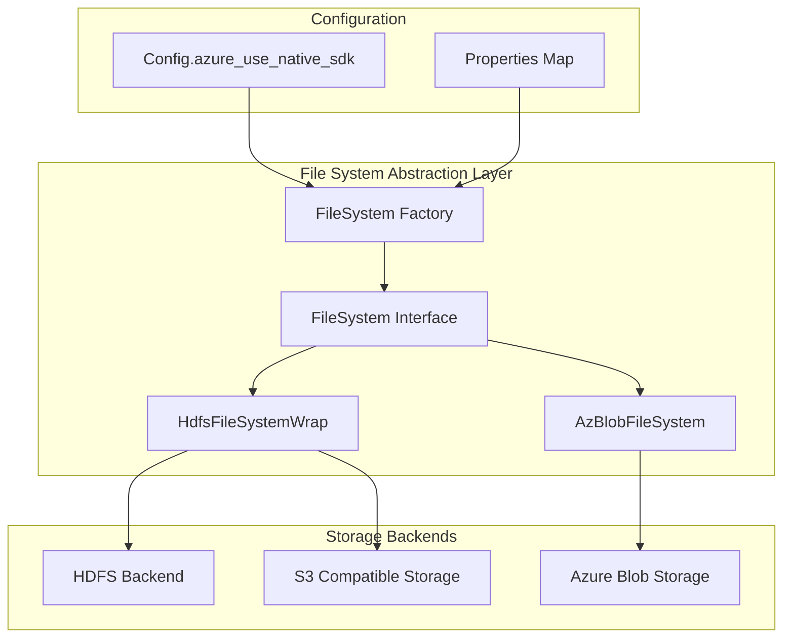
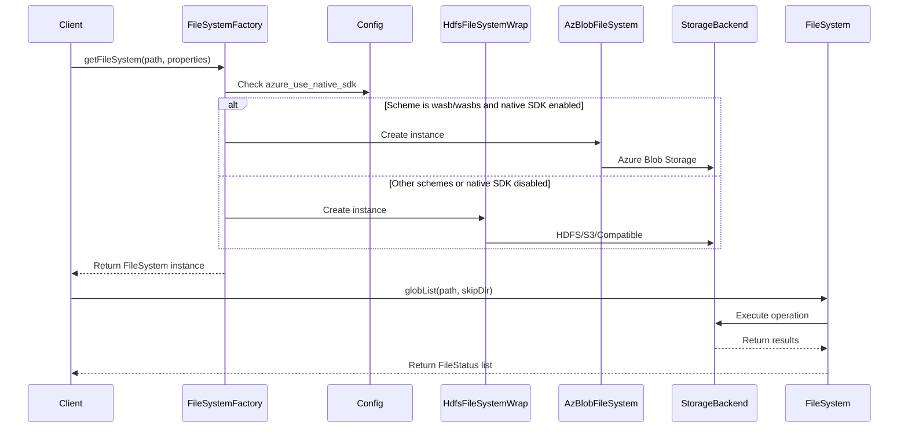

# File System Abstraction Module

## Introduction

The file system abstraction module provides a unified interface for interacting with different types of file systems in StarRocks. It serves as a bridge between the storage engine and various underlying file system implementations, including HDFS, Azure Blob Storage, and other cloud storage systems. This abstraction layer enables StarRocks to work seamlessly with different storage backends while maintaining a consistent API for file operations.

## Module Overview

The file system abstraction module is located within the frontend server (`fe`) component and provides a factory-based approach to handle different file system types. It supports both traditional HDFS-compatible file systems and cloud-native storage solutions like Azure Blob Storage.

## Core Architecture

### Component Structure



### Key Components

#### 1. FileSystem Interface
The core abstraction that defines the contract for all file system implementations:

- **Factory Method**: `getFileSystem(String path, Map<String, String> properties)`
- **Glob Listing**: `globList(String path, boolean skipDir)`
- **HDFS Properties**: `getHdfsProperties(String path)`

#### 2. FileSystem Factory
The factory method in the `FileSystem` interface determines which concrete implementation to use based on:
- URI scheme analysis (wasb, wasbs, hdfs)
- Configuration settings (`Config.azure_use_native_sdk`)
- Provided properties map

#### 3. Concrete Implementations

##### HdfsFileSystemWrap
- Handles HDFS-compatible file systems
- Supports traditional HDFS, S3-compatible storage, and other Hadoop-compatible systems
- Provides fallback for non-Azure storage schemes

##### AzBlobFileSystem  
- Native Azure Blob Storage implementation
- Used when Azure native SDK is enabled and URI scheme is wasb/wasbs
- Optimized for Azure-specific operations

## Data Flow Architecture



## Integration with Other Modules

### Storage Engine Integration
The file system abstraction integrates with the storage engine module to provide:
- Unified file access for data loading and querying
- Consistent file metadata operations
- Support for different storage backends in lake storage scenarios

### Configuration Management
The module relies on the configuration system for:
- Azure native SDK enablement (`Config.azure_use_native_sdk`)
- File system specific properties
- Connection parameters and credentials

### Connector Framework Integration
The file system abstraction works with the connector framework to support:
- External table access
- Data lake scenarios
- Cloud storage integration

## Key Features

### 1. Unified Interface
Provides a single interface for different storage systems, simplifying client code and reducing complexity.

### 2. Scheme-Based Routing
Automatically selects the appropriate implementation based on URI scheme and configuration settings.

### 3. Cloud-Native Support
Native support for Azure Blob Storage with optimized performance when using Azure native SDK.

### 4. HDFS Compatibility
Maintains compatibility with traditional HDFS and Hadoop-compatible file systems.

### 5. Glob Pattern Support
Supports glob-style pattern matching for file listing operations across all supported file systems.

## Usage Patterns

### Basic File System Creation
```java
// Create file system for Azure Blob Storage
Map<String, String> properties = new HashMap<>();
FileSystem fs = FileSystem.getFileSystem("wasbs://container@account.blob.core.windows.net/path", properties);

// Create file system for HDFS
FileSystem hdfsFs = FileSystem.getFileSystem("hdfs://namenode:9000/path", properties);
```

### File Listing Operations
```java
// List files with glob pattern
List<FileStatus> files = fs.globList("/data/2024/*.parquet", false);

// Get HDFS properties for backend
THdfsProperties props = fs.getHdfsProperties("/data/table1");
```

## Configuration

### Azure Native SDK Configuration
- **Key**: `azure_use_native_sdk`
- **Type**: Boolean
- **Default**: Varies by deployment
- **Description**: Enables native Azure SDK for wasb/wasbs schemes

### File System Properties
Properties map can contain:
- Authentication credentials
- Connection parameters
- File system specific settings
- Performance tuning options

## Error Handling

The module uses `StarRocksException` for error reporting:
- Invalid URI schemes
- Missing configuration
- Connection failures
- Permission issues

## Performance Considerations

### Azure Native SDK Benefits
When `azure_use_native_sdk` is enabled:
- Better performance for Azure Blob Storage
- Native Azure optimizations
- Reduced latency for Azure operations

### HDFS Compatibility Mode
For other storage systems:
- Standard Hadoop FileSystem API
- Consistent performance across compatible systems
- Support for various Hadoop distributions

## Security

The module supports various security mechanisms:
- Authentication through properties map
- Credential management integration
- Secure connection protocols
- Access control delegation

## Future Enhancements

Potential areas for expansion:
- Additional cloud storage providers (GCP, AWS native)
- Enhanced performance optimizations
- Advanced caching mechanisms
- Multi-cloud federation support

## Related Documentation

- [Storage Engine Module](storage_engine.md) - For storage backend integration
- [Configuration Management](frontend_server.md#common_config) - For configuration details
- [Connector Framework](connectors.md) - For external table integration
- [Lake Storage](frontend_server.md#lake_storage) - For data lake scenarios

## Dependencies

### Internal Dependencies
- `com.starrocks.common.Config` - Configuration management
- `com.starrocks.common.StarRocksException` - Exception handling
- `com.starrocks.fs.azure.AzBlobFileSystem` - Azure implementation
- `com.starrocks.fs.hdfs.HdfsFileSystemWrap` - HDFS implementation
- `com.starrocks.fs.hdfs.WildcardURI` - URI parsing
- `com.starrocks.thrift.THdfsProperties` - Thrift properties

### External Dependencies
- Apache Hadoop FileSystem API
- Azure Storage SDK (when native SDK enabled)
- Google Guava for utility functions

This abstraction layer provides the foundation for StarRocks to work with diverse storage systems while maintaining a consistent and simple interface for the rest of the system.