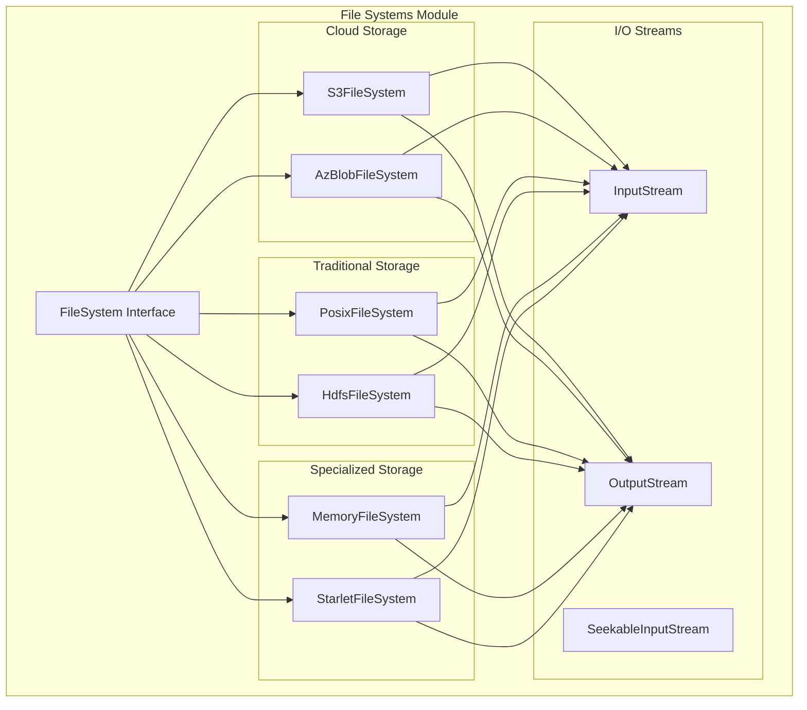

# File Systems Module Documentation

## Overview

The file_systems module provides a comprehensive abstraction layer for various storage backends in StarRocks. It implements a unified interface that supports multiple file system types including local POSIX file systems, cloud storage (S3, Azure Blob), HDFS, and memory-based storage. This module is crucial for StarRocks' ability to work with diverse data sources and storage environments.

## Architecture

The file_systems module follows a plugin-based architecture with a common FileSystem interface that all implementations adhere to. This design allows StarRocks to seamlessly interact with different storage backends without requiring changes to the core engine.



## Core Components

### File System Implementations

The module provides six main file system implementations:

1. **PosixFileSystem** - Local file system operations using POSIX APIs
2. **S3FileSystem** - Amazon S3 and S3-compatible object storage
3. **AzBlobFileSystem** - Microsoft Azure Blob Storage
4. **HdfsFileSystem** - Hadoop Distributed File System
5. **MemoryFileSystem** - In-memory file system for testing and temporary storage
6. **StarletFileSystem** - StarOS integration for distributed storage

### I/O Stream Abstractions

Each file system implementation provides standardized I/O streams:
- **InputStream** - Sequential read operations
- **OutputStream** - Sequential write operations  
- **SeekableInputStream** - Random access read operations with seek capability

## Sub-modules

The file_systems module is organized into several specialized sub-modules:

### [Azure Blob Storage](azure_blob_storage.md)
Handles Microsoft Azure Blob Storage integration with support for multiple authentication methods and efficient multipart uploads.

### [S3 Object Storage](s3_object_storage.md)
Provides Amazon S3 and S3-compatible storage support with advanced features like multipart uploads, retry mechanisms, and path-style access.

### [HDFS Distributed Storage](hdfs_distributed_storage.md)
Implements Hadoop Distributed File System integration with support for hedged reads, caching, and HDFS-specific optimizations.

### [Memory File System](memory_file_system.md)
In-memory file system implementation primarily used for testing, development, and temporary storage scenarios.

### [POSIX Local Storage](posix_local_storage.md)
Local file system implementation using standard POSIX APIs with support for direct I/O, caching, and platform-specific optimizations.

### [Starlet Distributed Storage](starlet_distributed_storage.md)
StarOS integration layer providing distributed storage capabilities with caching and throttling support.

## Key Features

### Unified Interface
All file systems implement a common interface providing consistent APIs for:
- File creation, reading, writing, and deletion
- Directory operations
- Metadata queries (size, modification time, permissions)
- Streaming I/O operations

### Cloud Storage Optimizations
- **Multipart Uploads** - Efficient handling of large files
- **Retry Mechanisms** - Automatic retry with exponential backoff
- **Connection Pooling** - Reuse of client connections
- **Read-ahead Caching** - Intelligent prefetching of data

### Performance Features
- **I/O Profiling** - Detailed performance metrics collection
- **Caching Layer** - File descriptor and data caching
- **Direct I/O** - Bypass OS cache for large operations
- **Throttling** - Rate limiting for resource management

### Security and Authentication
- **Encryption Support** - Client-side encryption for sensitive data
- **Multiple Auth Methods** - Support for various cloud provider authentication schemes
- **Credential Management** - Secure handling of access keys and tokens

## Integration Points

The file_systems module integrates with other StarRocks components:

- **Storage Engine** - Provides low-level storage operations
- **Query Execution** - Enables reading from various data sources
- **Data Loading** - Supports writing data to different storage systems
- **Backup/Restore** - Facilitates data movement between storage systems

## Configuration

File system behavior can be configured through various parameters:
- Connection timeouts and retry settings
- Buffer sizes and caching policies
- Authentication credentials and endpoints
- Performance tuning parameters

## Error Handling

The module implements comprehensive error handling:
- Translation of system-specific errors to StarRocks status codes
- Retry logic for transient failures
- Detailed error reporting with context information
- Graceful degradation for unsupported operations

## Usage Examples

### Creating a File System
```cpp
// S3 File System
FSOptions s3_options;
auto s3_fs = new_fs_s3(s3_options);

// Local File System
auto posix_fs = new_fs_posix();

// HDFS File System
FSOptions hdfs_options;
auto hdfs_fs = new_fs_hdfs(hdfs_options);
```

### Reading a File
```cpp
auto file_result = fs->new_random_access_file(file_path);
if (file_result.ok()) {
    auto file = std::move(file_result.value());
    // Read operations...
}
```

### Writing a File
```cpp
auto file_result = fs->new_writable_file(file_path);
if (file_result.ok()) {
    auto file = std::move(file_result.value());
    // Write operations...
}
```

## Performance Considerations

- **Connection Pooling** - Reuse connections to reduce overhead
- **Buffer Sizes** - Optimize read/write buffer sizes for your workload
- **Caching** - Enable appropriate caching levels based on access patterns
- **Multipart Operations** - Use multipart uploads for large files
- **Read-ahead** - Configure read-ahead for sequential access patterns

## Monitoring and Observability

The module provides extensive monitoring capabilities:
- I/O operation counters and timing
- Error rates and retry statistics
- Connection pool metrics
- Cache hit rates and performance

These metrics are exposed through StarRocks' monitoring infrastructure for operational visibility.