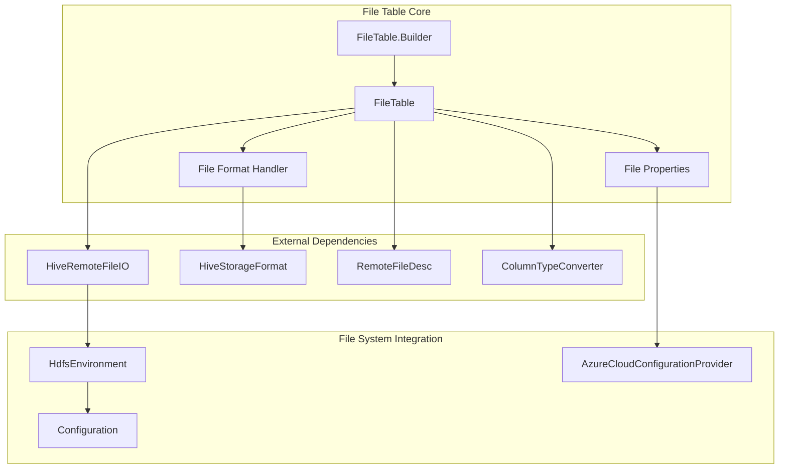
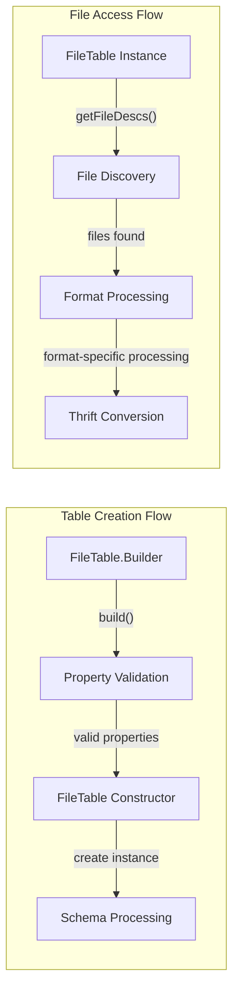
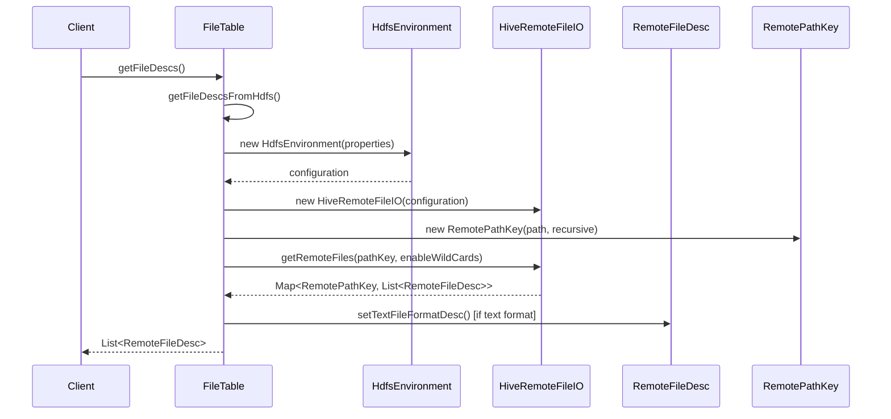
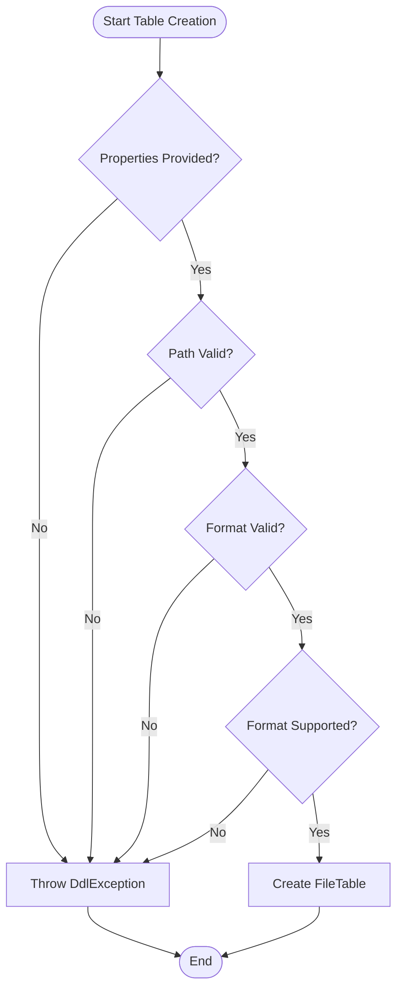
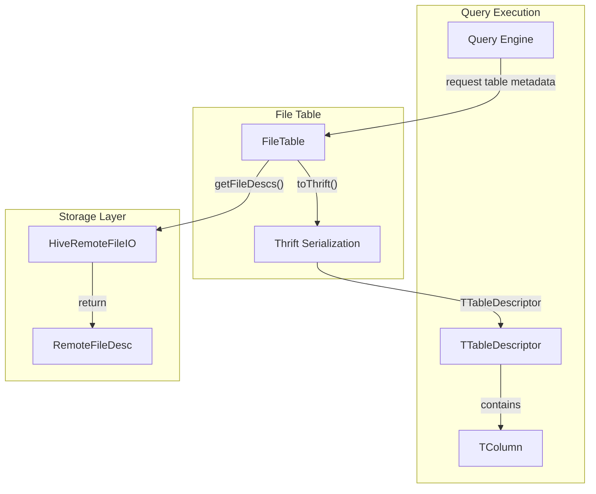

# File Table Module Documentation

## Overview

The File Table module provides functionality for creating and managing external tables that directly reference files stored in distributed file systems (HDFS, S3, Azure Blob Storage, etc.). It enables StarRocks to query data files without requiring data ingestion into the native storage format, supporting various file formats including Parquet, ORC, Text, Avro, and more.

## Purpose and Core Functionality

The File Table module serves as a bridge between StarRocks' query engine and external file-based data sources. Its primary responsibilities include:

- **External File Access**: Providing a table abstraction over files stored in distributed file systems
- **Format Support**: Supporting multiple file formats (Parquet, ORC, Text, Avro, RCFile, SequenceFile)
- **Schema Management**: Handling schema inference and column mapping for external files
- **File Discovery**: Automatically discovering and cataloging files based on path patterns
- **Text Format Configuration**: Supporting customizable delimiters for text-based formats
- **Integration**: Seamlessly integrating with StarRocks' query execution engine

## Architecture

### Core Components



### Component Relationships



## Data Flow

### File Discovery and Processing



### Table Creation and Validation



## Key Features

### Supported File Formats

The module supports the following file formats through the `RemoteFileInputFormat` mapping:

| Format | File Extension | Input Format | Description |
|--------|---------------|--------------|-------------|
| Parquet | .parquet | PARQUET | Columnar storage format |
| ORC | .orc | ORC | Optimized Row Columnar format |
| Text | .txt, .csv | TEXTFILE | Plain text with customizable delimiters |
| Avro | .avro | AVRO | Row-oriented data serialization |
| RC Text | .rc | RCTEXT | Record Columnar Text format |
| RC Binary | .rc | RCBINARY | Record Columnar Binary format |
| Sequence | .seq | SEQUENCE | Hadoop SequenceFile format |

### Text File Configuration

For text files, the module supports customizable delimiters:

- **Column Separator**: Default tab (`\t`)
- **Row Delimiter**: Default newline (`\n`)
- **Collection Delimiter**: Default comma (`,`)
- **Map Delimiter**: Default colon (`:`)

### File Discovery Options

- **Recursive Directory Listing**: Enable/disable recursive file discovery
- **Wildcard Support**: Enable/disable wildcard pattern matching in file paths
- **Path Validation**: Ensure proper path formatting for directory vs file access

## Integration with StarRocks Ecosystem

### Query Engine Integration



### Type System Integration

The module integrates with StarRocks' type system through:

- **Column Type Conversion**: Using `ColumnTypeConverter.toHiveType()` for external format compatibility
- **Schema Mapping**: Converting StarRocks column types to appropriate external representations
- **Type Adaptation**: Handling special cases like `varchar(65533)` to `string` conversion for Hive compatibility

## Error Handling

### Validation Errors

The module implements comprehensive validation with specific error messages:

- **Missing Properties**: "Please set properties of file table, they are path and format"
- **Null Path**: "path is null. Please add properties(path='xxx') when create table"
- **Null Format**: "format is null. Please add properties(format='xxx') when create table"
- **Unsupported Format**: "not supported format: [format_name]"
- **File Not Found**: "No file exists for FileTable: [table_name]"
- **Path Mismatch**: "the path is a directory but didn't end with '/'"

### Exception Handling

- **DdlException**: For table creation and validation errors
- **StarRocksConnectorException**: For file system access errors, wrapped in DdlException

## Configuration and Properties

### Required Properties

```properties
path=/path/to/files
format=parquet
```

### Optional Properties

```properties
enable_recursive_listing=true
enable_wildcards=true
column_separator=,
row_delimiter=\n
collection_delimiter=,
map_delimiter=:
```

### Azure-Specific Configuration

The module automatically handles Azure storage configuration by extracting storage account information from the file path and storing it in the `AZURE_PATH_KEY` property.

## Performance Considerations

### File Discovery Optimization

- **Caching**: File metadata can be cached to reduce repeated file system calls
- **Parallel Processing**: File discovery can be parallelized for large directories
- **Incremental Updates**: Support for incremental file discovery based on modification time

### Format-Specific Optimizations

- **Columnar Formats**: Leverage predicate pushdown and column pruning for Parquet and ORC
- **Text Formats**: Optimize delimiter parsing and type conversion
- **Compression**: Support for compressed file formats

## Security and Access Control

### File System Security

- **Credential Management**: Integration with cloud provider credential systems
- **Access Control**: Respect file system-level permissions and access controls
- **Path Validation**: Prevent directory traversal attacks through proper path validation

### Data Security

- **Encryption**: Support for encrypted file systems and transport encryption
- **Audit Logging**: Log file access operations for security auditing
- **Network Security**: Secure connections to remote file systems

## Related Modules

### Storage Engine Integration

The File Table module integrates with the [storage_engine](storage_engine.md) module for:
- File format handling
- Column type conversion
- Predicate pushdown optimization

### Connector Framework

Integration with the [connectors](connectors.md) module provides:
- Unified connector interface
- File system abstraction
- Credential management

### Query Execution

Works with the [query_execution](query_execution.md) module for:
- Scan operator implementation
- Runtime filter application
- Parallel execution coordination

## Usage Examples

### Basic Table Creation

```sql
CREATE EXTERNAL TABLE file_table (
    id INT,
    name VARCHAR(100),
    created_date DATE
)
PROPERTIES (
    "path" = "hdfs://cluster/path/to/files/",
    "format" = "parquet"
);
```

### Text File with Custom Delimiters

```sql
CREATE EXTERNAL TABLE csv_table (
    col1 STRING,
    col2 INT,
    col3 DOUBLE
)
PROPERTIES (
    "path" = "s3://bucket/path/to/files/",
    "format" = "text",
    "column_separator" = ",",
    "row_delimiter" = "\n"
);
```

### Recursive File Discovery

```sql
CREATE EXTERNAL TABLE recursive_table (
    data STRING
)
PROPERTIES (
    "path" = "hdfs://cluster/data/",
    "format" = "orc",
    "enable_recursive_listing" = "true"
);
```

## Future Enhancements

### Planned Features

- **Schema Evolution**: Support for schema changes in external files
- **Partitioning**: Automatic partition discovery and pruning
- **Statistics Collection**: Automatic statistics gathering for external files
- **Caching Layer**: Intelligent caching of frequently accessed files
- **Write Support**: Ability to write query results back to external files

### Performance Improvements

- **Vectorized Reading**: Enhanced vectorized processing for better performance
- **Async I/O**: Asynchronous file I/O operations
- **Prefetching**: Intelligent data prefetching based on query patterns
- **Compression Optimization**: Better support for various compression codecs