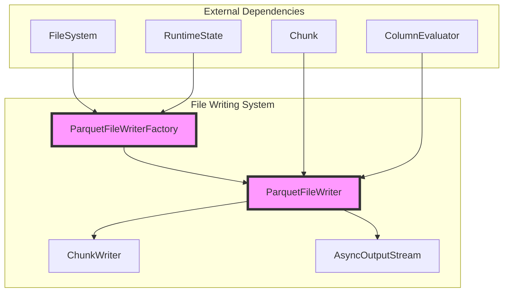
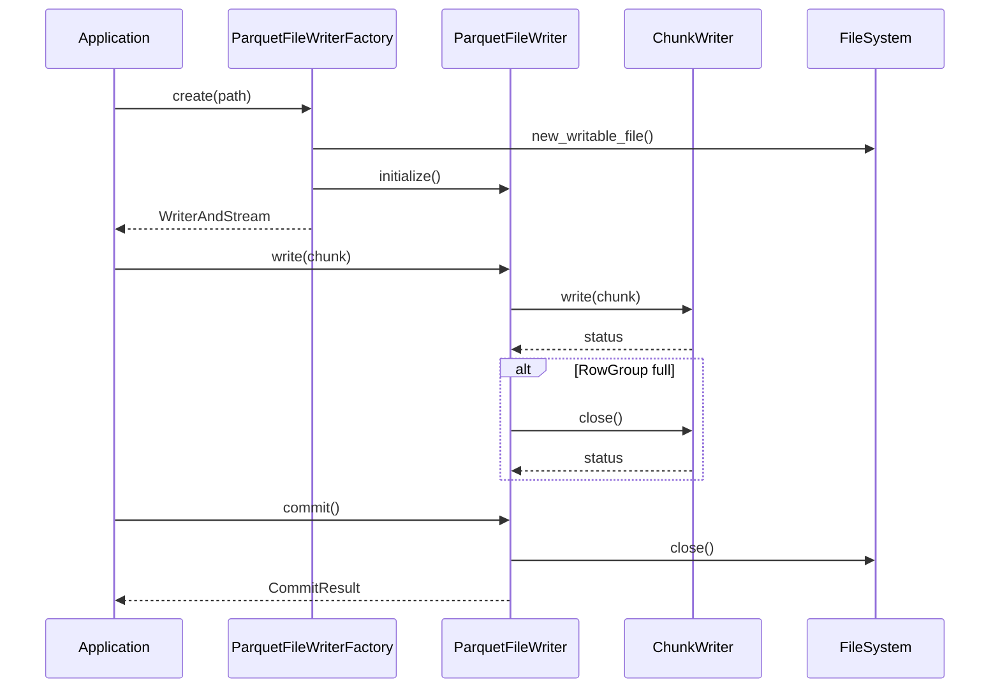
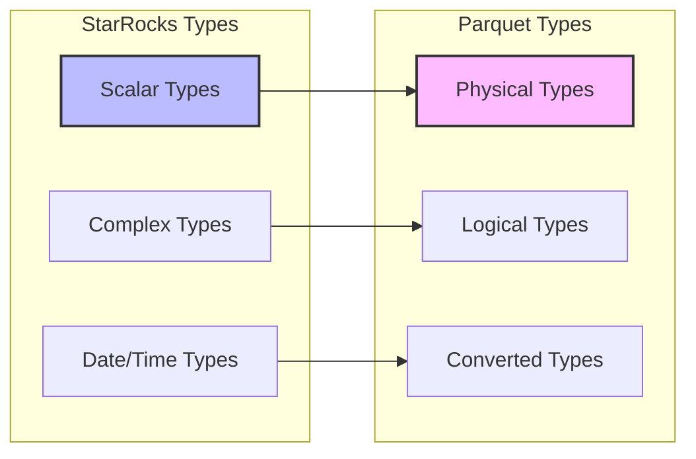
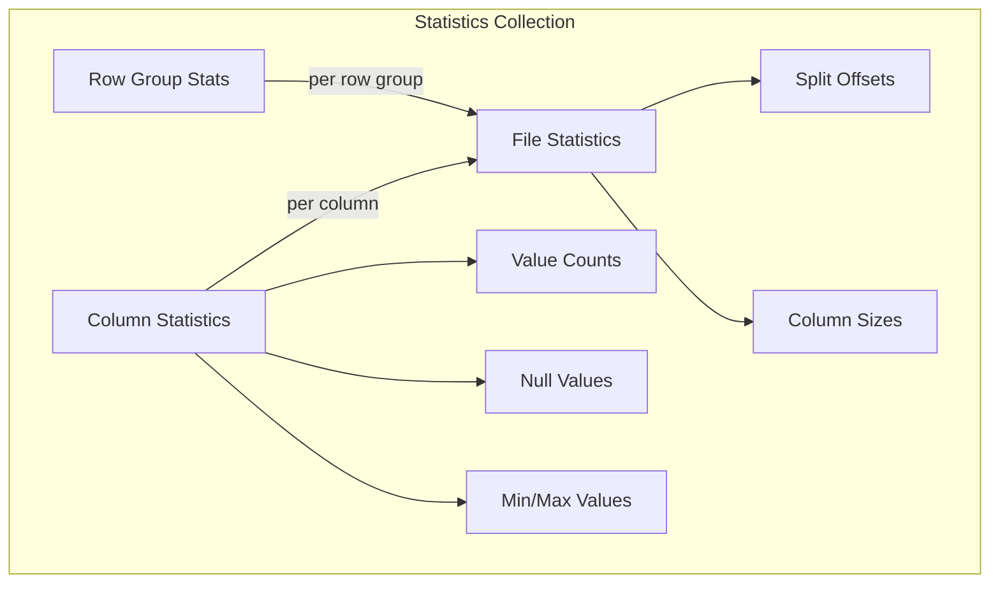
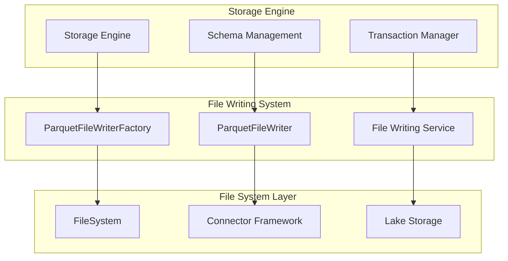

# File Writing System Documentation

## Introduction

The File Writing System is a critical component of StarRocks' storage engine that handles the serialization and persistence of data chunks to various file formats, with a primary focus on Parquet format. This system serves as the bridge between in-memory data structures and durable storage, providing efficient, scalable, and format-compliant data writing capabilities for analytical workloads.

The system is designed to handle high-throughput data ingestion scenarios, supporting various compression algorithms, encoding schemes, and data types while maintaining compatibility with industry-standard file formats like Apache Parquet.

## Architecture Overview



## Core Components

### ParquetFileWriter

The `ParquetFileWriter` class is the main implementation of the file writing functionality. It provides a high-level interface for writing data chunks to Parquet files with the following key responsibilities:

- **Data Serialization**: Converts in-memory chunks to Parquet format
- **Schema Management**: Handles type mapping between StarRocks and Parquet types
- **Compression**: Supports multiple compression algorithms (SNAPPY, GZIP, ZSTD, LZ4)
- **Statistics Collection**: Gathers file-level and column-level statistics
- **Memory Management**: Efficient memory allocation and buffer management

#### Key Methods

```cpp
Status write(Chunk* chunk)                    // Write data chunk to file
FileWriter::CommitResult commit()            // Finalize and commit the file
int64_t get_written_bytes()                  // Get total bytes written
int64_t get_allocated_bytes()                // Get memory allocation info
```

### ParquetFileWriterFactory

The factory class responsible for creating configured `ParquetFileWriter` instances. It handles:

- **Configuration Parsing**: Interprets writer options and settings
- **Resource Management**: Manages file system connections and thread pools
- **Error Handling**: Provides rollback mechanisms for failed writes

### ChunkWriter

An internal component that handles the actual data writing process:

- **Row Group Management**: Controls row group size and flushing
- **Data Encoding**: Applies appropriate encoding schemes
- **Buffer Management**: Manages write buffers and memory usage

## Data Flow Architecture



## Type System Integration

The file writing system integrates with StarRocks' type system through comprehensive type mapping:



### Type Mapping Examples

| StarRocks Type | Parquet Type | Encoding |
|----------------|--------------|----------|
| TYPE_INT | INT32 | Plain/Dictionary |
| TYPE_BIGINT | INT64 | Plain/Dictionary |
| TYPE_VARCHAR | BYTE_ARRAY | String Logical Type |
| TYPE_DECIMAL128 | FIXED_LEN_BYTE_ARRAY | Decimal Logical Type |
| TYPE_ARRAY | GroupNode | List Logical Type |
| TYPE_MAP | GroupNode | Map Logical Type |
| TYPE_STRUCT | GroupNode | Nested Structure |

## Compression and Encoding

The system supports multiple compression algorithms and encoding schemes:

### Supported Compression Types
- **UNCOMPRESSED**: No compression
- **SNAPPY**: Fast compression/decompression
- **GZIP**: High compression ratio
- **ZSTD**: Modern compression with good performance
- **LZ4_HADOOP**: LZ4 variant for Hadoop compatibility

### Encoding Strategies
- **Plain Encoding**: Direct value storage
- **Dictionary Encoding**: For repeated values
- **RLE Encoding**: For run-length compression
- **Bit Packing**: For boolean and small integer types

## Statistics Collection

The system collects comprehensive statistics for query optimization:



### Collected Statistics
- **Row Count**: Total number of records
- **Column Sizes**: Compressed size per column
- **Value Counts**: Number of non-null values
- **Null Value Counts**: Number of null values
- **Min/Max Bounds**: Value ranges for predicate pushdown
- **Split Offsets**: File positions for parallel reading

## Memory Management

The system implements sophisticated memory management:

### Memory Pool Architecture
- **Arrow Memory Pool**: Integration with Apache Arrow's memory management
- **Custom Allocators**: StarRocks-specific memory allocation strategies
- **Buffer Management**: Efficient buffer reuse and lifecycle management

### Memory Tracking
- **Allocated Bytes Tracking**: Real-time memory usage monitoring
- **Memory Limits**: Configurable memory constraints
- **Garbage Collection**: Automatic cleanup of unused resources

## Error Handling and Recovery

The system provides robust error handling mechanisms:

### Exception Handling
- **Parquet Exceptions**: Catches and converts Parquet library exceptions
- **IO Error Handling**: Manages file system errors
- **Memory Errors**: Handles allocation failures

### Rollback Mechanisms
- **File Deletion**: Automatic cleanup of partial files
- **Resource Cleanup**: Proper disposal of allocated resources
- **State Restoration**: Recovery to consistent states

## Performance Optimizations

### Batch Processing
- **Chunk-based Writing**: Processes data in efficient chunks
- **Row Group Sizing**: Configurable row group sizes for optimal performance
- **Page Size Optimization**: Tuned page sizes for different data types

### Parallel Processing
- **Async I/O**: Non-blocking I/O operations
- **Thread Pool Integration**: Configurable thread pools for concurrent operations
- **Pipeline Processing**: Streamlined data processing pipelines

### Caching Strategies
- **Dictionary Caching**: Reuse of dictionary encodings
- **Buffer Pooling**: Reuse of memory buffers
- **Metadata Caching**: Cached file metadata for quick access

## Integration with Storage Engine

The file writing system integrates with the broader storage engine:



## Configuration Options

### Writer Options
- **Compression Type**: Configurable compression algorithm
- **Row Group Size**: Target size for row groups
- **Page Size**: Size of data pages within row groups
- **Dictionary Page Size**: Size limit for dictionary pages
- **Version**: Parquet format version (1.0, 2.4, 2.6)

### Encoding Options
- **Use Legacy Decimal Encoding**: Compatibility with older systems
- **Use INT96 Timestamp Encoding**: Timestamp encoding format
- **Enable Page Index**: Enable page-level indexing
- **Write Batch Size**: Batch size for write operations

## Monitoring and Observability

### Metrics Collection
- **Write Throughput**: Bytes written per second
- **Compression Ratio**: Effectiveness of compression
- **Memory Usage**: Memory allocation patterns
- **Error Rates**: Frequency of write failures

### Logging
- **Debug Information**: Detailed operation logs
- **Performance Metrics**: Timing information for operations
- **Error Details**: Comprehensive error reporting

## Dependencies

### Internal Dependencies
- [Storage Engine](storage_engine.md): Core storage functionality
- [Type System](type_system.md): Data type definitions and conversions
- [File System](file_systems.md): File system abstraction layer
- [Memory Management](memory_management.md): Memory allocation and tracking

### External Dependencies
- **Apache Parquet**: Core Parquet format implementation
- **Apache Arrow**: Memory management and type system
- **Boost**: Configuration parsing and utility functions

## Best Practices

### Performance Optimization
1. **Choose appropriate compression** based on data characteristics
2. **Configure optimal row group sizes** for your workload
3. **Enable dictionary encoding** for columns with repeated values
4. **Use appropriate page sizes** for different data types

### Reliability
1. **Implement proper error handling** in application code
2. **Use rollback mechanisms** for transaction safety
3. **Monitor memory usage** to prevent OOM conditions
4. **Validate file integrity** after writes

### Maintenance
1. **Regular monitoring** of write performance metrics
2. **Periodic cleanup** of temporary files
3. **Version compatibility** checks for format upgrades
4. **Capacity planning** based on data growth patterns

## Future Enhancements

### Planned Features
- **Additional Format Support**: ORC, Avro formats
- **Advanced Encoding**: Bit packing optimizations
- **Encryption Support**: Data-at-rest encryption
- **Columnar Compression**: Per-column compression strategies

### Performance Improvements
- **Vectorized Operations**: SIMD optimizations
- **Parallel Compression**: Multi-threaded compression
- **Predictive Encoding**: Machine learning-based encoding
- **Adaptive Algorithms**: Dynamic algorithm selection