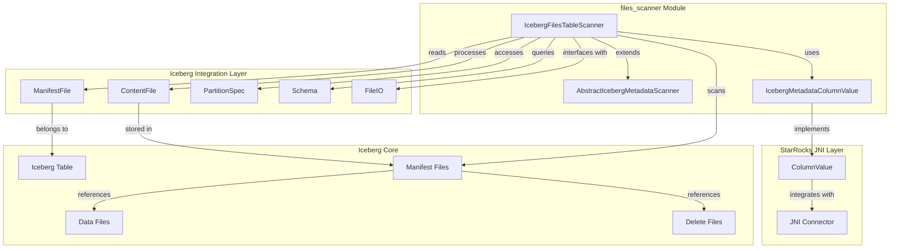
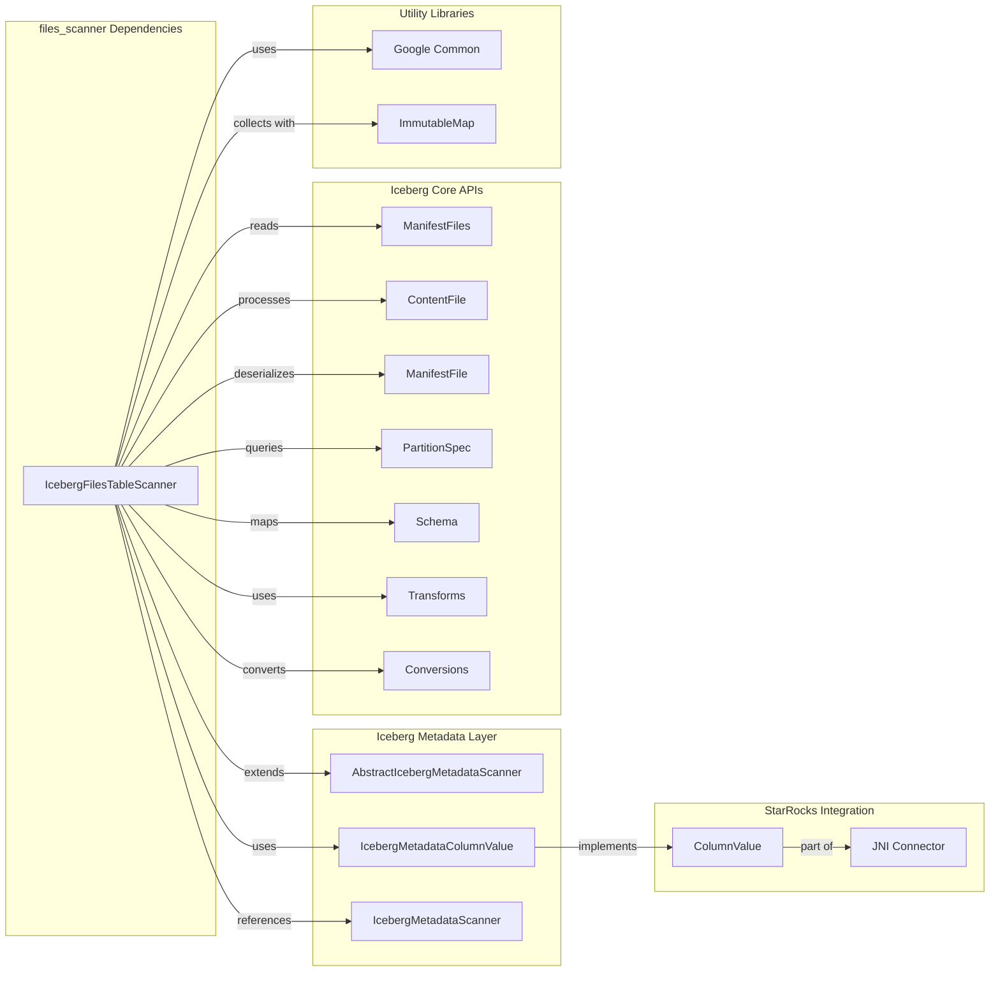
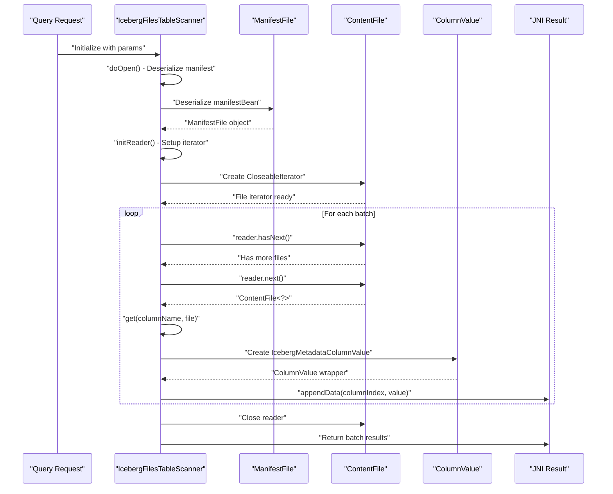
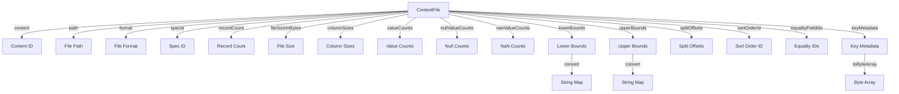
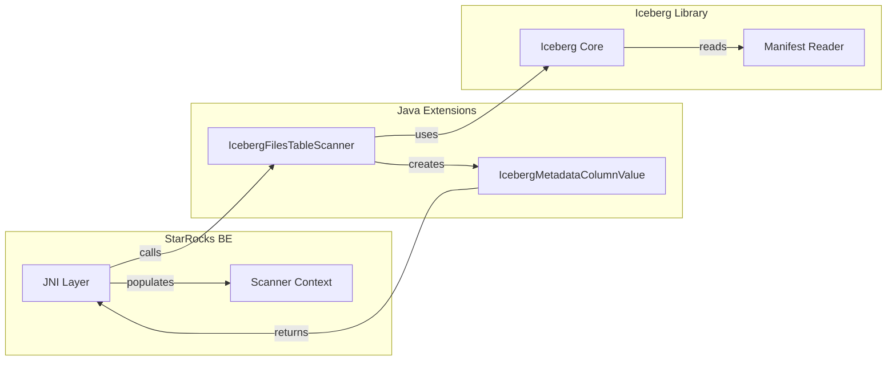

# Files Scanner Module Documentation

## Overview

The files_scanner module is a specialized component within the StarRocks iceberg-metadata-reader system that provides functionality for scanning and reading Iceberg table metadata files. This module implements the `IcebergFilesTableScanner` class, which is responsible for extracting file-level metadata from Iceberg manifest files, enabling efficient metadata queries and table introspection capabilities.

## Purpose and Core Functionality

The primary purpose of the files_scanner module is to:

1. **Scan Iceberg Manifest Files**: Read and parse Iceberg manifest files that contain metadata about data files and delete files
2. **Extract File Metadata**: Retrieve comprehensive file-level statistics and properties including file paths, formats, record counts, and column statistics
3. **Support Column Statistics**: Optionally load detailed column-level statistics for query optimization
4. **Handle Both Data and Delete Files**: Process both data files and delete files (for GDPR compliance and data deletion)
5. **Provide Type-Safe Data Access**: Convert Iceberg's internal data types to StarRocks-compatible formats

## Architecture and Component Relationships

### Module Architecture



### Component Dependencies



## Data Flow Architecture



## Core Components

### IcebergFilesTableScanner

The main scanner class that implements the metadata scanning functionality:

```java
public class IcebergFilesTableScanner extends AbstractIcebergMetadataScanner
```

**Key Responsibilities:**
- Manifest file deserialization and management
- Content file iteration and processing
- Column value extraction and conversion
- Statistics collection and formatting
- Resource cleanup and lifecycle management

**Core Methods:**

| Method | Purpose | Input | Output |
|--------|---------|-------|--------|
| `doOpen()` | Initialize scanner with manifest data | manifestBean parameter | Deserialized ManifestFile |
| `doGetNext()` | Process next batch of files | requiredFields array | Number of rows processed |
| `doClose()` | Clean up resources | None | Closed reader |
| `initReader()` | Setup file iterator | Manifest content type | Configured CloseableIterator |
| `get()` | Extract column values | Column name, ContentFile | Extracted field data |

### Data Extraction Process

The scanner extracts the following metadata fields from Iceberg files:



## Integration with StarRocks System

### Module Dependencies

The files_scanner module integrates with several key StarRocks modules:

1. **[iceberg_connector](iceberg_connector.md)**: Provides Iceberg table access and API conversion
2. **[java_extensions](java_extensions.md)**: Hosts the scanner within the Java extensions framework
3. **[connector_framework](connector_framework.md)**: Integrates with the unified connector architecture

### JNI Integration



## Configuration and Parameters

### Scanner Initialization Parameters

| Parameter | Type | Purpose | Default |
|-----------|------|---------|---------|
| `fetchSize` | int | Batch size for file processing | Configured by caller |
| `split_info` | String | Serialized manifest file data | Required |
| `load_column_stats` | String | Enable column statistics loading | "false" |

### Column Selection Modes

The scanner supports different column selection strategies based on manifest content:

```java
// For data files
SCAN_COLUMNS = ["content", "file_path", "file_format", ...]
SCAN_WITH_STATS_COLUMNS = SCAN_COLUMNS + ["column_sizes", "value_counts", ...]

// For delete files  
DELETE_SCAN_COLUMNS = ["content", "file_path", "file_format", ...]
DELETE_SCAN_WITH_STATS_COLUMNS = DELETE_SCAN_COLUMNS + ["column_sizes", ...]
```

## Error Handling and Edge Cases

### Exception Handling

The scanner implements comprehensive error handling for:

1. **IOException**: During manifest file reading and iterator operations
2. **IllegalArgumentException**: For unrecognized column names in the `get()` method
3. **NullPointerException**: Protection against null field values and metadata

### Data Type Conversion

Special handling for complex data types:

- **ByteBuffer to String**: Conversion of bounds data using Iceberg's type system
- **Nested Type Mapping**: Recursive traversal of complex schema structures
- **Null Safety**: Proper null checking for optional metadata fields

## Performance Considerations

### Memory Management

- **Streaming Processing**: Uses CloseableIterator for memory-efficient file processing
- **Batch Processing**: Configurable batch size to balance memory usage and performance
- **Resource Cleanup**: Explicit resource management in `doClose()` method

### Optimization Strategies

1. **Selective Column Reading**: Only reads required columns based on query needs
2. **Type Mapping Caching**: Caches Iceberg ID to type mapping for repeated access
3. **Immutable Collections**: Uses ImmutableMap for efficient data collection

## Usage Examples

### Basic File Scanning

```java
// Initialize scanner with manifest data
Map<String, String> params = new HashMap<>();
params.put("split_info", serializedManifestData);
params.put("load_column_stats", "true");

IcebergFilesTableScanner scanner = new IcebergFilesTableScanner(1000, params);
scanner.doOpen();

// Process files in batches
int rowsProcessed;
do {
    rowsProcessed = scanner.doGetNext();
    // Handle results through JNI layer
} while (rowsProcessed > 0);

scanner.doClose();
```

### Column Value Extraction

```java
// Extract specific metadata field
ContentFile<?> file = // ... get file from iterator
Object filePath = scanner.get("file_path", file);
Object recordCount = scanner.get("record_count", file);
Object fileSize = scanner.get("file_size_in_bytes", file);
```

## References

- **[iceberg_connector](iceberg_connector.md)**: Iceberg integration and API conversion
- **[java_extensions](java_extensions.md)**: Java extensions framework hosting this scanner
- **[connector_framework](connector_framework.md)**: Unified connector architecture
- **[iceberg_metadata_reader](iceberg_metadata_reader.md)**: Parent module containing all Iceberg metadata scanners

## Future Enhancements

Potential areas for improvement:

1. **Parallel Processing**: Multi-threaded file processing for large manifests
2. **Caching Layer**: Cache frequently accessed manifest metadata
3. **Predicate Pushdown**: Support for filtering files based on metadata predicates
4. **Statistics Aggregation**: Enhanced column statistics processing and caching