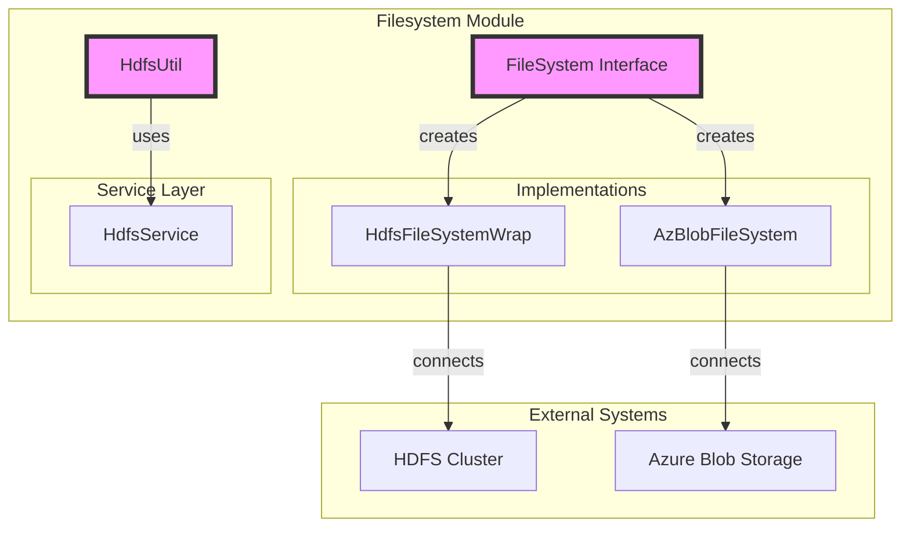
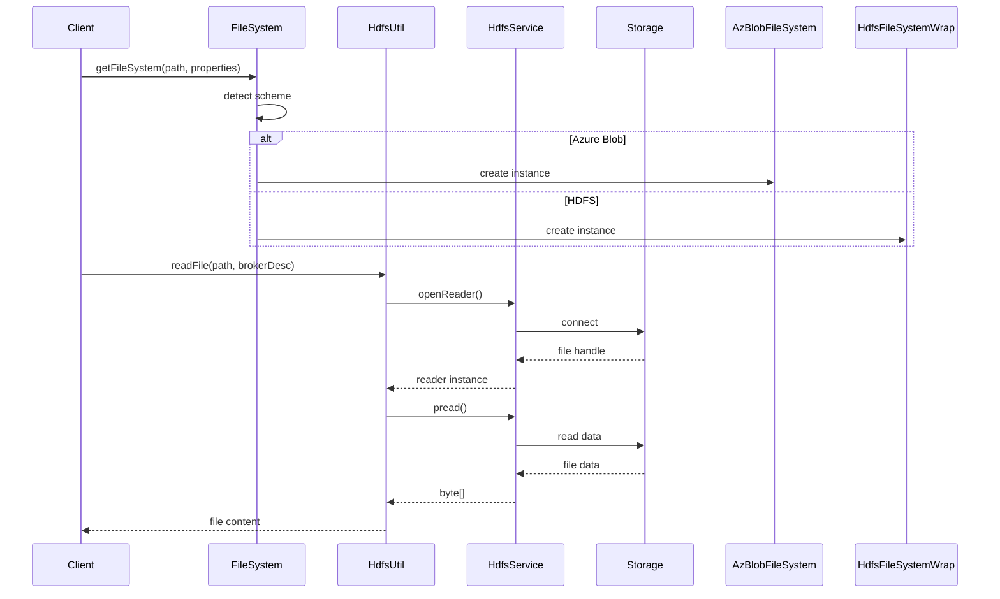

# Filesystem Module Documentation

## Overview

The filesystem module provides a unified abstraction layer for accessing different types of file systems in StarRocks. It serves as the central interface for file operations across various storage backends, including HDFS, Azure Blob Storage, and other cloud storage systems. The module is designed to handle the complexity of different storage protocols while providing a consistent API for the rest of the system.

## Architecture

## Core Components

### FileSystem Interface
The `FileSystem` interface is the main entry point that provides a unified abstraction for different file system implementations. It uses a factory pattern to create appropriate file system instances based on the URI scheme.

**Key Features:**
- Factory method for creating file system instances
- Support for glob-style path listing
- HDFS properties extraction for backend communication
- Automatic scheme detection and implementation selection

**Supported Schemes:**
- `hdfs://` - HDFS file system
- `wasb://` / `wasbs://` - Azure Blob Storage
- Local file system paths

### HdfsUtil Class
The `HdfsUtil` class provides utility methods for file operations using the broker service. It acts as a high-level wrapper around the HDFS service, providing convenient methods for common file operations.

**Key Capabilities:**
- File reading and writing operations
- Path existence checking
- File metadata parsing
- Column extraction from file paths
- File copying between local and remote systems

## Sub-modules

### 1. [File System Abstraction](file_system_abstraction.md)
Provides the core interface and factory pattern for creating file system instances. This sub-module handles the logic for determining which file system implementation to use based on the provided URI.

### 2. [HDFS Integration](hdfs_integration.md)
Implements HDFS-specific functionality including:
- HDFS client wrapper implementation
- HDFS service communication
- File status and metadata handling
- Thrift protocol integration for backend communication

### 3. [Azure Blob Storage Integration](azure_blob_integration.md)
Provides native Azure Blob Storage support when the configuration enables it, offering optimized performance for Azure cloud deployments.

### 4. [Utility Operations](utility_operations.md)
Common file operations including:
- File reading/writing with streaming support
- Path parsing and validation
- Column extraction from structured paths
- File existence checking and metadata retrieval

## Data Flow

## Integration Points

### With Storage Engine Module
The filesystem module integrates closely with the [storage_engine](storage_engine.md) module, providing the underlying file access capabilities for:
- Data file reading during query execution
- Write operations for data ingestion
- Metadata file access for table management

### With Connector Framework
Integration with the [connectors](connectors.md) module enables:
- External table file access
- Data lake integration (Hive, Iceberg, Delta Lake)
- Cloud storage connectivity

### With Backend Services
The module communicates with backend services through:
- Thrift protocol for file operations
- HDFS properties transmission
- File status and metadata exchange

## Configuration

Key configuration options that affect filesystem behavior:

- `azure_use_native_sdk`: Enables native Azure SDK for better performance
- `broker_client_timeout_ms`: Timeout for broker operations
- Various HDFS and cloud storage connection parameters

## Error Handling

The module implements comprehensive error handling:
- Scheme validation and error reporting
- Connection failure handling
- File operation error propagation
- Resource cleanup on failures

## Performance Considerations

- **Connection Pooling**: Reuses file system connections where possible
- **Streaming Operations**: Supports large file operations without loading entire files into memory
- **Native SDK Support**: Uses optimized native libraries when available (e.g., Azure SDK)
- **Buffer Management**: Configurable buffer sizes for read/write operations

## Security

- Supports various authentication mechanisms for different storage systems
- Credential management through configuration
- Secure connection protocols (HTTPS, SSL/TLS)
- Access control integration with storage systems

## Future Enhancements

Potential areas for improvement:
- Additional cloud storage provider support
- Enhanced caching mechanisms
- Improved error recovery and retry logic
- Performance optimizations for specific use cases