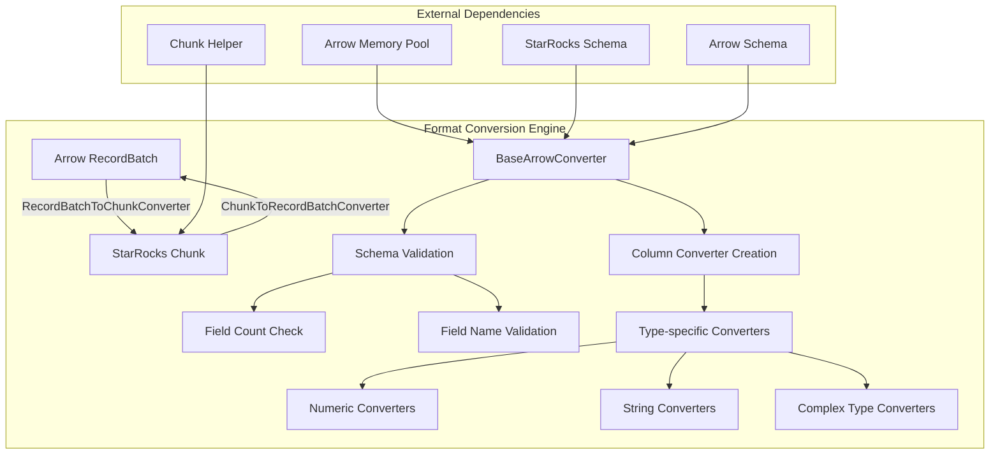
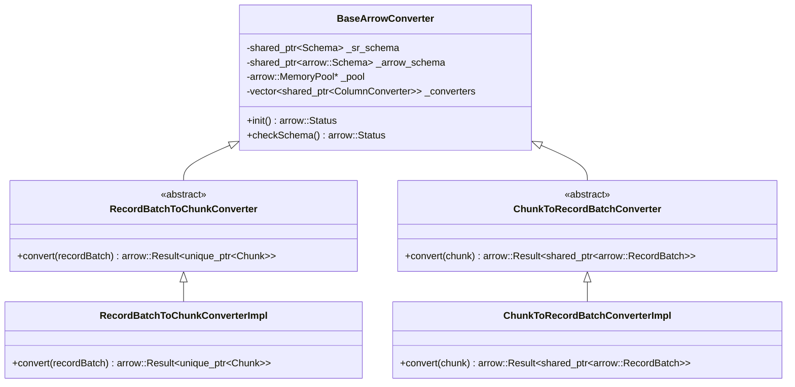
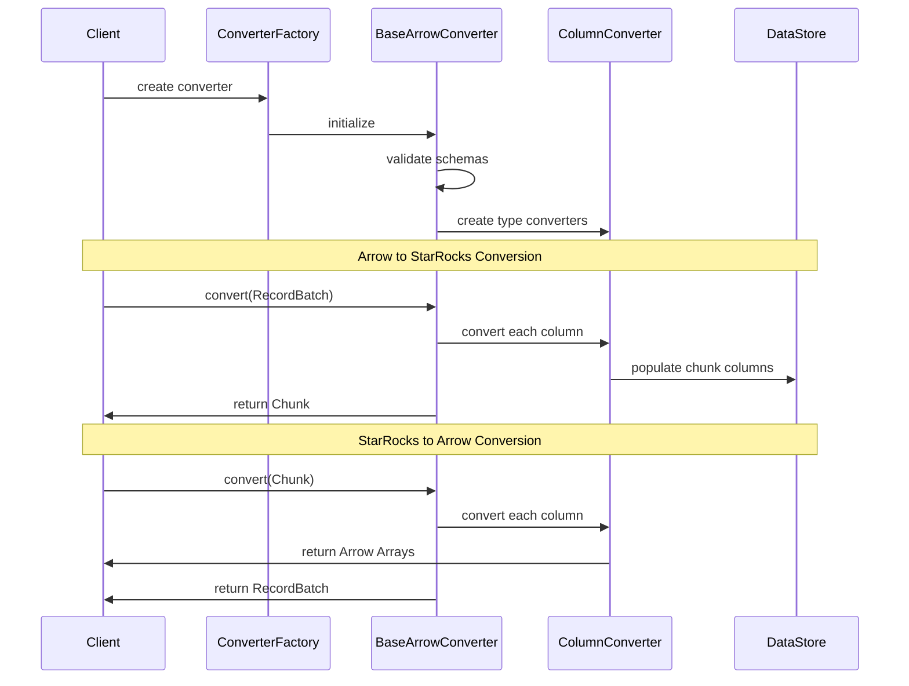
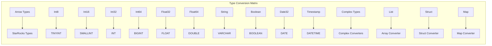

# Format Conversion Engine Module

## Introduction

The Format Conversion Engine module provides bidirectional data conversion capabilities between Apache Arrow format and StarRocks' native chunk format. This module serves as a critical bridge for data interoperability, enabling seamless data exchange between Arrow-based systems and StarRocks storage engine.

## Core Functionality

The module implements two primary conversion pathways:
- **Arrow to StarRocks**: Converts Apache Arrow RecordBatches to StarRocks Chunks
- **StarRocks to Arrow**: Converts StarRocks Chunks to Apache Arrow RecordBatches

## Architecture Overview



## Component Architecture

### Core Converter Classes



## Data Flow Architecture

### Conversion Process Flow



## Key Components

### 1. BaseArrowConverter
The foundational class that provides common functionality for all format converters:
- **Schema Validation**: Ensures Arrow and StarRocks schemas are compatible
- **Field Mapping**: Maps corresponding fields between the two formats
- **Converter Management**: Creates and manages type-specific column converters
- **Memory Management**: Handles Arrow memory pool allocation

### 2. RecordBatchToChunkConverterImpl
Implements Arrow RecordBatch to StarRocks Chunk conversion:
- **Input Validation**: Validates input RecordBatch structure
- **Column-wise Conversion**: Converts each Arrow column to StarRocks format
- **Chunk Assembly**: Assembles converted columns into a complete Chunk
- **Error Handling**: Provides detailed error reporting for conversion failures

### 3. ChunkToRecordBatchConverterImpl
Implements StarRocks Chunk to Arrow RecordBatch conversion:
- **Column Extraction**: Extracts columns from StarRocks Chunk
- **Array Creation**: Creates Arrow Arrays from StarRocks data
- **Batch Assembly**: Assembles Arrow Arrays into RecordBatch
- **Memory Efficiency**: Optimizes memory usage during conversion

## Type System Integration

The conversion engine integrates with StarRocks' type system through specialized column converters:



## Integration Points

### Storage Engine Integration
The module integrates with StarRocks storage engine through:
- **Chunk Helper**: Utilizes `ChunkHelper::new_chunk()` for efficient chunk creation
- **Schema System**: Leverages StarRocks schema definitions for type mapping
- **Column Management**: Works with StarRocks column abstractions

### Arrow Ecosystem Integration
Provides seamless integration with Apache Arrow:
- **Memory Management**: Uses Arrow memory pools for efficient allocation
- **Schema Compatibility**: Supports Arrow schema evolution and compatibility
- **Array Types**: Handles all standard Arrow array types

## Performance Characteristics

### Conversion Efficiency
- **Zero-copy Operations**: Minimizes data copying where possible
- **Vectorized Processing**: Leverages columnar operations for performance
- **Memory Pool Management**: Efficient memory allocation and deallocation
- **Batch Processing**: Optimized for batch conversion operations

### Scalability Features
- **Parallel Conversion**: Supports concurrent column conversion
- **Streaming Support**: Handles large datasets through streaming
- **Memory Efficiency**: Minimal memory footprint during conversion
- **Error Recovery**: Graceful handling of conversion failures

## Error Handling and Validation

### Schema Validation
- **Field Count Verification**: Ensures matching field counts between schemas
- **Field Name Validation**: Validates field name correspondence
- **Type Compatibility**: Checks type compatibility between formats
- **Nullability Handling**: Properly handles nullable vs non-nullable fields

### Runtime Error Handling
- **Conversion Error Reporting**: Detailed error messages for failed conversions
- **Memory Allocation Failures**: Graceful handling of memory allocation issues
- **Data Integrity Checks**: Validates data integrity during conversion
- **Exception Safety**: Strong exception safety guarantees

## Usage Patterns

### Basic Conversion Example
```cpp
// Arrow to StarRocks conversion
auto converter = RecordBatchToChunkConverter::create(sr_schema, arrow_schema, pool);
auto result = converter->convert(record_batch);
if (result.ok()) {
    auto chunk = std::move(result).ValueOrDie();
    // Use the converted chunk
}

// StarRocks to Arrow conversion
auto converter = ChunkToRecordBatchConverter::create(sr_schema, arrow_schema, pool);
auto result = converter->convert(chunk);
if (result.ok()) {
    auto record_batch = std::move(result).ValueOrDie();
    // Use the converted record batch
}
```

## Dependencies

### Internal Dependencies
- **Storage Engine**: [storage_engine.md](storage_engine.md) - Provides chunk data structures
- **Type System**: [type_system.md](type_system.md) - Defines StarRocks type mappings
- **Schema Management**: [schema_management.md](schema_management.md) - Handles schema definitions

### External Dependencies
- **Apache Arrow**: Core Arrow library for data format handling
- **Memory Management**: Arrow memory pool for efficient allocation

## Future Enhancements

### Planned Features
- **Schema Evolution**: Support for schema evolution during conversion
- **Compression Support**: Integration with compression codecs
- **Nested Types**: Enhanced support for complex nested types
- **Performance Optimization**: Further performance optimizations for large-scale conversions

### Extension Points
- **Custom Converters**: Plugin architecture for custom type converters
- **Streaming API**: Enhanced streaming conversion capabilities
- **Batch Optimization**: Advanced batch processing optimizations
- **Monitoring**: Conversion performance monitoring and metrics

## Best Practices

### Performance Optimization
- **Batch Processing**: Process data in batches for optimal performance
- **Memory Management**: Use appropriate memory pool sizes
- **Schema Caching**: Cache converter instances for repeated conversions
- **Type Mapping**: Understand type mapping implications

### Error Handling
- **Validation First**: Always validate schemas before conversion
- **Error Checking**: Check conversion results for errors
- **Resource Cleanup**: Properly manage converter lifecycle
- **Logging**: Implement comprehensive logging for debugging

This module serves as a critical component in StarRocks' data integration strategy, enabling seamless interoperability with the broader Apache Arrow ecosystem while maintaining the performance and efficiency characteristics required for analytical workloads.