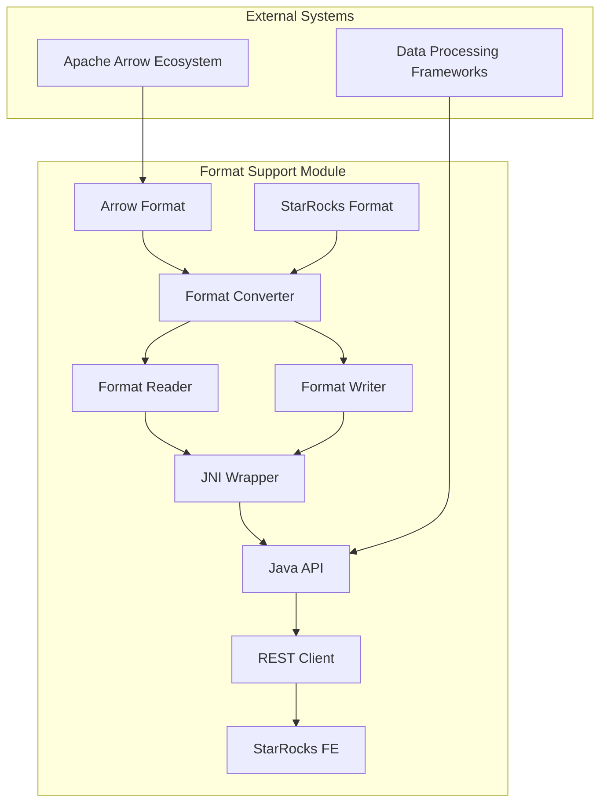
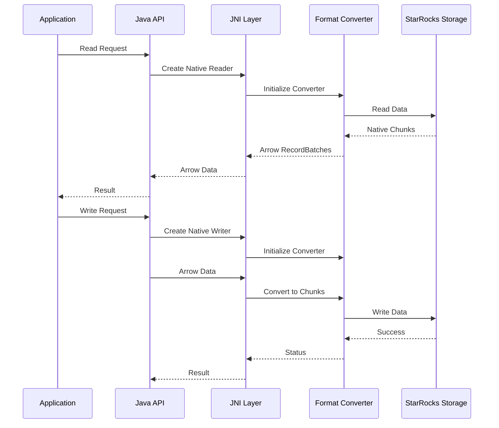

# Format Support Module Documentation

## Overview

The format_support module provides a comprehensive framework for data format conversion and I/O operations in StarRocks. It serves as a bridge between different data formats (particularly Arrow and StarRocks native formats) and enables efficient data exchange with external systems.

## Purpose and Core Functionality

The format_support module is designed to:
- Provide bidirectional conversion between Apache Arrow format and StarRocks native chunk format
- Enable reading and writing StarRocks data through standardized format interfaces
- Support integration with external data processing frameworks
- Facilitate data exchange between StarRocks and other systems through format conversion

## Architecture Overview



## Sub-modules

### 1. Format Conversion Engine
Handles bidirectional conversion between Apache Arrow and StarRocks native formats.

**Key Components:**
- `RecordBatchToChunkConverterImpl`: Converts Arrow RecordBatches to StarRocks Chunks
- `ChunkToRecordBatchConverterImpl`: Converts StarRocks Chunks to Arrow RecordBatches

**Responsibilities:**
- Schema validation and mapping between Arrow and StarRocks types
- Data type conversion and compatibility checking
- Memory management during conversion operations
- Error handling for format mismatches

**Detailed Documentation:** [format_conversion_engine.md](format_conversion_engine.md)

### 2. Format I/O Operations
Provides reading and writing capabilities for StarRocks data in standardized formats.

**Key Components:**
- `StarRocksFormatReaderImpl`: Reads StarRocks data and outputs in Arrow format
- `StarRocksFormatWriterImpl`: Writes Arrow data to StarRocks storage

**Responsibilities:**
- Integration with StarRocks storage engine
- Predicate pushdown and query optimization
- Transaction management for write operations
- Support for various storage backends (S3, HDFS, local)

**Detailed Documentation:** [format_io_operations.md](format_io_operations.md)

### 3. JNI Integration Layer
Provides Java Native Interface for cross-language interoperability.

**Key Components:**
- `ArrowArray`: Native Arrow array handling
- JNI wrapper functions for reader/writer operations

**Responsibilities:**
- Bridge between Java and C++ implementations
- Memory management across language boundaries
- Error propagation and exception handling
- Performance optimization for data transfer

**Detailed Documentation:** [jni_integration_layer.md](jni_integration_layer.md)

### 4. Java API Layer
Provides high-level Java interfaces for format operations.

**Key Components:**
- `StarRocksReader`: Java interface for reading operations
- `StarRocksWriter`: Java interface for writing operations
- `DataAccessor`: Base class for data access operations

**Responsibilities:**
- User-friendly API for format operations
- Resource management and lifecycle handling
- Configuration management
- Integration with Arrow Java library

**Detailed Documentation:** [java_api_layer.md](java_api_layer.md)

### 5. Configuration Management
Manages configuration options for format operations.

**Key Components:**
- `Config.Builder`: Configuration builder pattern implementation

**Responsibilities:**
- Connection configuration (FE endpoints, credentials)
- Format-specific options (chunk size, column UID usage)
- Storage backend configuration (S3, HDFS settings)
- Performance tuning parameters

**Detailed Documentation:** [configuration_management.md](configuration_management.md)

### 6. REST Client Integration
Provides HTTP-based communication with StarRocks Frontend.

**Key Components:**
- `RestClient`: HTTP client for FE communication
- `ResponseContent`: Response wrapper with error handling

**Responsibilities:**
- Query plan retrieval
- Schema information access
- Transaction management
- Partition metadata operations

**Detailed Documentation:** [rest_client_integration.md](rest_client_integration.md)

### 7. Native Library Management
Handles loading and management of native libraries.

**Key Components:**
- `LibraryHelper`: Native library loading and management

**Responsibilities:**
- Dynamic library loading with fallback mechanisms
- Library extraction from JAR files
- Version compatibility checking
- Cross-platform library support

**Detailed Documentation:** [native_library_management.md](native_library_management.md)

## Data Flow Architecture



## Integration Points

### With Storage Engine
- Integrates with [storage_engine.md](storage_engine.md) for data persistence
- Uses lake storage format for cloud-native deployments
- Supports predicate pushdown for query optimization

### With Query Execution
- Provides data format conversion for [query_execution.md](query_execution.md)
- Enables external data source integration
- Supports runtime filter application

### With Connectors
- Serves as foundation for [connectors.md](connectors.md) format support
- Enables integration with external data processing frameworks
- Provides standardized format interfaces

## Performance Considerations

### Memory Management
- Zero-copy operations where possible
- Memory pool management for Arrow arrays
- Resource cleanup and lifecycle management

### Optimization Strategies
- Columnar data processing for analytical workloads
- Vectorized operations for batch processing
- Parallel processing support for large datasets

### Caching Mechanisms
- Metadata caching for schema information
- Connection pooling for REST client operations
- Buffer reuse for frequent operations

## Error Handling

### Exception Types
- `NativeOperateException`: JNI-related errors
- `RequestException`: REST API communication errors
- Format conversion errors with detailed diagnostics

### Recovery Mechanisms
- Automatic retry for transient failures
- Graceful degradation for unsupported features
- Comprehensive logging for debugging

## Security Features

### Authentication
- Support for username/password authentication
- Integration with StarRocks authentication system
- Secure credential management

### Data Protection
- Encryption support for data in transit
- Access control integration
- Audit logging for operations

## Configuration Reference

### Essential Configuration Options
```java
Config.newBuilder()
    .feHttpUrl("http://fe-host:8030")
    .database("default_db")
    .username("user")
    .password("password")
    .build();
```

### Storage Backend Options
```java
Config.newBuilder()
    .s3Endpoint("s3.amazonaws.com")
    .s3AccessKey("access-key")
    .s3SecretKey("secret-key")
    .s3PathStyleAccess(true)
    .build();
```

### Performance Tuning
```java
Config.newBuilder()
    .unreleasedWarningThreshold(128)
    .queryPlan("encoded-query-plan")
    .usingColumnUid(true)
    .build();
```

## Usage Examples

### Basic Reading Operation
```java
Config config = Config.newBuilder()
    .feHttpUrl("http://fe-host:8030")
    .database("test_db")
    .username("user")
    .password("password")
    .build();

try (StarRocksReader reader = new StarRocksReader(
        tabletId, tabletPath, version, 
        requiredSchema, outputSchema, config)) {
    reader.open();
    while (reader.hasNext()) {
        VectorSchemaRoot data = reader.next();
        // Process data
    }
}
```

### Basic Writing Operation
```java
try (StarRocksWriter writer = new StarRocksWriter(
        tabletId, tabletPath, txnId, schema, config)) {
    writer.open();
    writer.write(data);
    writer.flush();
    writer.finish();
}
```

## Best Practices

### Resource Management
- Always use try-with-resources for automatic cleanup
- Monitor unreleased instances warning threshold
- Implement proper error handling and recovery

### Performance Optimization
- Batch operations for better throughput
- Use appropriate chunk sizes for your workload
- Leverage predicate pushdown when possible

### Error Handling
- Implement comprehensive exception handling
- Use appropriate retry mechanisms
- Log errors with sufficient context for debugging

## Future Enhancements

### Planned Features
- Support for additional data formats (ORC, Parquet)
- Enhanced compression options
- Improved vectorization support
- Better integration with cloud storage services

### Performance Improvements
- Optimized memory allocation strategies
- Enhanced parallel processing capabilities
- Better caching mechanisms
- Reduced conversion overhead

## Related Documentation
- [storage_engine.md](storage_engine.md) - Storage engine integration
- [connectors.md](connectors.md) - External system integration
- [query_execution.md](query_execution.md) - Query processing integration