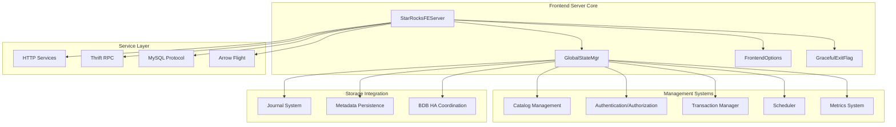

# Frontend Server Module Overview

## Purpose

The `frontend_server` module is the central coordination and management layer of the StarRocks distributed database system. It serves as the primary entry point for client connections, SQL query processing, metadata management, and cluster coordination. This module orchestrates all frontend operations including query planning, authentication, transaction management, and system administration while maintaining high availability and consistency across the distributed cluster.

## Architecture

## Core Components

### 1. Server Lifecycle Management
- **StarRocksFEServer**: Main entry point managing server startup, shutdown, and service initialization
- **GlobalStateMgr**: Central state coordinator handling node roles, metadata loading, and distributed consensus
- **FrontendOptions**: Network configuration manager for IP/FQDN resolution and address management
- **GracefulExitFlag**: Atomic coordination mechanism for controlled shutdown procedures

### 2. Catalog Management System
Comprehensive metadata management including:
- **Column Management**: Type system, statistics, and schema validation
- **Partition Management**: Partition schemes, boundaries, and MV synchronization
- **Distribution Management**: Hash and random distribution strategies
- **Table Structure**: Schema definitions, indexes, and tablet management
- **Complex Types**: Array, Map, and Struct type support
- **System Catalog**: Information schema and system table framework
- **Materialized Views**: Pre-computed query results and refresh management

### 3. Authentication and Authorization
Multi-method security framework featuring:
- **AuthenticationHandler**: Chain-of-responsibility pattern for multiple authentication methods
- **AuthenticationProviderFactory**: Extensible authentication provider creation
- **ColumnPrivilege**: Fine-grained column-level access control
- Integration with LDAP, OAuth2, and native authentication systems

### 4. Query Processing Coordination
Integration with query execution pipeline:
- **SQL Parser & Optimizer**: Query analysis, planning, and optimization
- **Query Execution**: Distributed query coordination and resource management
- **Storage Engine**: Metadata coordination for data access operations

### 5. High Availability and Fault Tolerance
- **BDBHA**: Berkeley DB-based leader election and replication coordination
- **StateChangeExecutor**: Managed state transitions across cluster nodes
- **Journal System**: Write-ahead logging for metadata persistence and recovery

## Key Features

### Multi-Service Architecture
The frontend server hosts multiple network services:
- **HTTP/HTTPS**: REST API and web interface for administration
- **Thrift RPC**: High-performance communication with backend nodes
- **MySQL Protocol**: Client compatibility and standard SQL interface
- **Arrow Flight SQL**: High-performance data transfer protocol

### Distributed Coordination
- **Leader Election**: Automatic master node selection using BDB JE consensus
- **Metadata Replication**: Consistent metadata distribution across frontend nodes
- **Fault Detection**: Health monitoring and failure recovery mechanisms
- **Load Balancing**: Intelligent query distribution and resource allocation

### Extensible Framework
- **Plugin System**: Dynamic loading and management of external components
- **Connector Framework**: Unified interface for external data sources
- **Configuration Management**: Centralized system configuration with runtime updates
- **Metrics and Monitoring**: Comprehensive observability and performance tracking

## Integration Points

### Storage Engine Integration
Coordinates with storage layer for:
- Metadata persistence and consistency
- Tablet management and distribution
- Data locality optimization
- Storage engine lifecycle management

### Backend Server Communication
Provides RPC interface for:
- Query fragment distribution
- Task execution coordination
- Resource management
- Status reporting and monitoring

### External System Integration
Supports connectivity with:
- Cloud storage systems (S3, Azure, GCS)
- External databases via JDBC
- Data lake formats (Hive, Iceberg, Delta Lake)
- Message queues and streaming systems

## Configuration and Management

### Key Configuration Areas
- **Network Settings**: Service ports, SSL/TLS configuration, connection limits
- **Resource Management**: Memory allocation, thread pool sizing, queue management
- **Security Settings**: Authentication methods, authorization policies, encryption
- **Performance Tuning**: Query optimization parameters, caching strategies, timeout values

### Administrative Interfaces
- **SQL Commands**: System administration through standard SQL interface
- **HTTP APIs**: RESTful management and monitoring endpoints
- **System Tables**: Real-time system state and performance metrics
- **Command-Line Tools**: Administrative utilities for system management

## Performance and Scalability

### Optimization Strategies
- **Connection Pooling**: Efficient resource reuse for client connections
- **Metadata Caching**: Intelligent caching of frequently accessed metadata
- **Parallel Processing**: Multi-threaded query coordination and planning
- **Incremental Updates**: Efficient metadata change propagation

### Scalability Features
- **Horizontal Scaling**: Multi-node frontend cluster support
- **Resource Isolation**: Warehouse-based resource management
- **Dynamic Configuration**: Runtime parameter adjustment without restart
- **Partition-aware Operations**: Distributed metadata management

This comprehensive frontend server module provides the foundation for StarRocks' distributed database operations, ensuring reliable coordination, efficient query processing, and robust system management across the entire cluster.