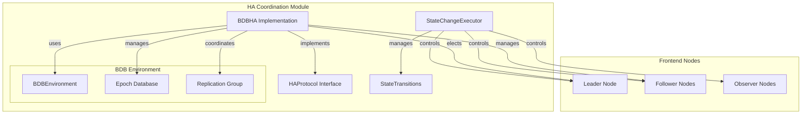
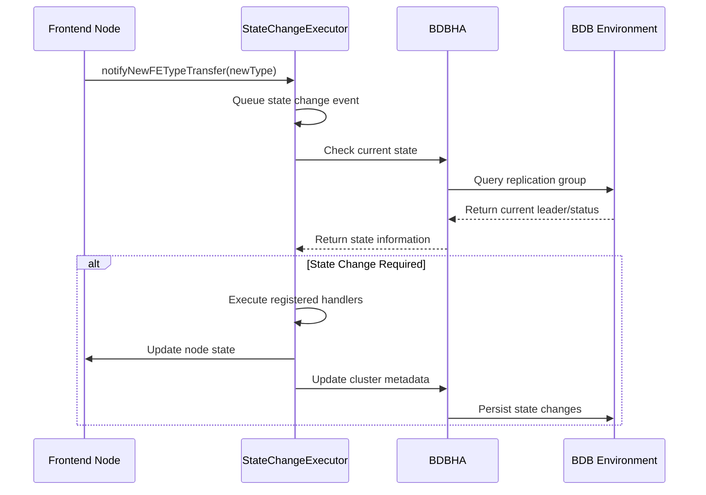

# HA Coordination Module Documentation

## Overview

The HA (High Availability) Coordination module is a critical component of the StarRocks system that manages fault tolerance, leader election, and state transitions across the distributed frontend nodes. This module ensures system reliability and consistency by implementing sophisticated coordination mechanisms using Berkeley DB Java Edition (BDB JE) for replication and consensus.

## Purpose and Core Functionality

The HA Coordination module serves as the backbone for maintaining system availability and consistency in StarRocks' distributed architecture. It provides essential services for:

- **Leader Election**: Automatic selection of master nodes among frontend instances
- **State Management**: Coordinated transitions between different node states (INIT, FOLLOWER, LEADER, OBSERVER, UNKNOWN)
- **Fault Detection**: Monitoring and handling of node failures and network partitions
- **Replication Coordination**: Managing data replication across cluster nodes using BDB JE
- **Cluster Membership**: Dynamic management of node addition and removal

## Architecture Overview

## Core Components

### 1. BDBHA (Berkeley DB High Availability)

The `BDBHA` class is the primary implementation of the `HAProtocol` interface, providing the core functionality for high availability coordination using Berkeley DB Java Edition's replication features.

**Key Responsibilities:**
- **Fencing Mechanism**: Implements leader fencing using epoch-based coordination to prevent split-brain scenarios
- **Node Management**: Handles addition, removal, and monitoring of cluster nodes
- **Leader Election**: Coordinates the election process for selecting master nodes
- **Replication Group Management**: Manages the BDB JE replication group configuration

**Core Features:**
- Epoch-based fencing with retry mechanisms
- Unstable node tracking for graceful cluster scaling
- Dynamic electable group size adjustment
- Conflict resolution for node address changes

### 2. StateChangeExecutor

The `StateChangeExecutor` manages the lifecycle and state transitions of frontend nodes, ensuring coordinated changes across the cluster.

**Key Responsibilities:**
- **State Transition Management**: Orchestrates transitions between INIT, FOLLOWER, LEADER, OBSERVER, and UNKNOWN states
- **Event Processing**: Handles asynchronous state change events through a queue-based system
- **Execution Coordination**: Manages registered state change executions

**State Transition Logic:**
- INIT → LEADER: Transfers to leader role with full initialization
- INIT → FOLLOWER/OBSERVER: Transfers to non-leader roles
- FOLLOWER → LEADER: Handles leader promotion scenarios
- LEADER → OTHER: Triggers system exit to prevent split-brain

## Sub-modules

### BDB Coordination Engine
**Documentation**: [bdb_coordination_engine.md](bdb_coordination_engine.md)

The BDB Coordination Engine provides the low-level coordination primitives using Berkeley DB Java Edition. It manages the replication environment, handles epoch-based fencing, and provides the foundation for distributed consensus.

**Key Components:**
- **BDBHA Implementation**: Core coordination logic using BDB JE replication
- **Epoch Management**: Fencing mechanism for leader election
- **Node Lifecycle**: Addition, removal, and monitoring of cluster nodes
- **Replication Group**: Management of BDB JE replication groups

### State Management System
**Documentation**: [state_management_system.md](state_management_system.md)

The State Management System orchestrates high-level state transitions across the cluster. It provides the framework for managing node lifecycles and ensures coordinated state changes during failures, recoveries, and administrative operations.

**Key Components:**
- **StateChangeExecutor**: Central coordinator for state transitions
- **Transition Logic**: Rules for valid state changes
- **Event Processing**: Asynchronous handling of state change events
- **Execution Framework**: Pluggable architecture for state change handlers

## Data Flow and Interactions

## Integration with Other Modules

### Journal System Integration
The HA Coordination module works closely with the [journal_system](journal.md) to ensure consistent state persistence across the cluster. State changes are logged through the journal system before being applied.

### Frontend Server Integration
Coordinates with the [frontend_server](frontend_server.md) module for node lifecycle management and service availability. The frontend server relies on HA coordination for determining active services and handling client requests.

### Global State Management
Integrates with the GlobalStateMgr for cluster-wide state synchronization and metadata consistency. This ensures that all nodes have a consistent view of the cluster state.

## Configuration and Deployment

### BDB Environment Configuration
- **Replication Group Size**: Configurable based on cluster size and availability requirements
- **Election Timeout**: Adjustable for different network conditions
- **Unstable Node Handling**: Configurable grace periods for node stabilization

### State Change Parameters
- **Transition Intervals**: Configurable delays between state transitions
- **Retry Mechanisms**: Adjustable retry counts and backoff strategies
- **Failure Handling**: Configurable responses to transition failures

## Monitoring and Observability

### Key Metrics
- **Leader Election Latency**: Time taken to elect new leaders
- **State Transition Duration**: Time taken for state changes
- **Node Availability**: Percentage of time nodes are available
- **Replication Lag**: Delay in data replication across nodes

### Logging and Debugging
- Comprehensive logging of state transitions and coordination events
- Detailed error reporting for troubleshooting cluster issues
- Performance metrics for coordination operations

## Best Practices and Considerations

### Deployment Guidelines
1. **Minimum Cluster Size**: Ensure adequate nodes for quorum-based operations
2. **Network Configuration**: Maintain stable network connectivity between nodes
3. **Resource Allocation**: Provide sufficient resources for BDB JE operations
4. **Monitoring Setup**: Implement comprehensive monitoring for early issue detection

### Operational Considerations
- **Graceful Shutdown**: Use proper shutdown procedures to avoid false failure detection
- **Rolling Updates**: Coordinate updates to maintain cluster availability
- **Disaster Recovery**: Implement backup strategies for BDB environments
- **Capacity Planning**: Plan for cluster growth and node additions

## Related Documentation
- [Frontend Server Module](frontend_server.md) - Node lifecycle and service management
- [Journal System](journal.md) - State persistence and recovery
- [Storage Engine](storage_engine.md) - Data storage and replication coordination
- [Query Execution](query_execution.md) - Query coordination in distributed environment