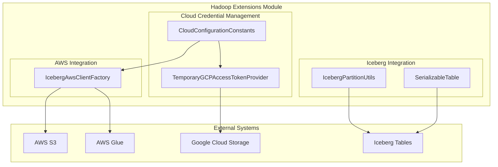

# Hadoop Extensions Module Documentation

## Overview

The Hadoop Extensions module provides cloud storage integration capabilities for StarRocks, enabling seamless access to various cloud storage systems and data lake formats. This module serves as a bridge between StarRocks and cloud storage providers, offering authentication, configuration management, and data access abstractions.

## Purpose and Core Functionality

The module's primary purpose is to:
- Provide unified access to cloud storage systems (AWS S3, Azure Blob Storage, Google Cloud Storage)
- Enable integration with data lake formats (Iceberg, Delta Lake, Hive)
- Manage cloud credentials and authentication mechanisms
- Support temporary and permanent credential providers
- Facilitate secure data access across different cloud platforms

## Architecture Overview



## Sub-modules

### 1. Cloud Credential Management
Manages authentication and configuration for various cloud providers.
- **CloudConfigurationConstants**: Defines configuration keys for AWS, Azure, GCP, and other cloud providers
- **TemporaryGCPAccessTokenProvider**: Handles temporary GCP access tokens for Google Cloud Storage

See [Cloud Credential Management Documentation](cloud_credential_management.md) for detailed information.

### 2. AWS Integration
Provides comprehensive AWS service integration capabilities.
- **IcebergAwsClientFactory**: Factory for creating AWS clients (S3, Glue, STS) with various authentication methods

See [AWS Integration Documentation](aws_integration.md) for detailed information.

### 3. Iceberg Integration
Supports Apache Iceberg table format integration.
- **IcebergPartitionUtils**: Utilities for working with Iceberg partition fields and specifications
- **SerializableTable**: Serializable wrapper for Iceberg tables with lazy loading capabilities

See [Iceberg Integration Documentation](iceberg_integration.md) for detailed information.

## Key Features

### Multi-Cloud Support
- AWS S3 and Glue integration with multiple authentication methods
- Azure Blob Storage and Data Lake support
- Google Cloud Storage with temporary token support
- HDFS and Kerberos authentication

### Authentication Methods
- AWS SDK default behavior
- Instance profile credentials
- Web identity token files
- Static access keys with optional session tokens
- IAM role assumption with external IDs
- Azure managed identity and OAuth2
- GCP service account and compute engine authentication

### Data Lake Integration
- Iceberg table format support
- Partition field management and deduplication
- Serializable table operations for distributed processing
- AWS client factory for S3, Glue, and STS services

## Configuration

The module uses a comprehensive set of configuration constants defined in `CloudConfigurationConstants` to manage:
- AWS credentials and regions
- Azure storage endpoints and authentication
- GCP service account settings
- HDFS security parameters
- Cross-cloud compatibility settings

## Dependencies

This module integrates with:
- [Storage Engine Module](storage_engine.md) for data persistence
- [Connector Framework](connectors.md) for external system integration
- [Java Extensions](java_extensions.md) for UDF and scanner functionality

## Usage Patterns

### Cloud Storage Access
```
1. Configure cloud credentials using CloudConfigurationConstants
2. Initialize appropriate client factory (e.g., IcebergAwsClientFactory)
3. Create service clients (S3, Glue, etc.)
4. Perform data operations
```

### Iceberg Table Operations
```
1. Create SerializableTable wrapper
2. Access table metadata and schema
3. Use IcebergPartitionUtils for partition management
4. Perform read-only operations (write operations not supported in serialized mode)
```

## Security Considerations

- All credential information is handled through configuration properties
- Support for temporary credentials with expiration management
- IAM role assumption with external ID validation
- Secure token refresh mechanisms
- No hardcoded credentials in the codebase

## Performance Optimizations

- Lazy loading for Iceberg table metadata
- Caching of AWS credential providers
- Efficient partition field deduplication
- Minimal serialization overhead for distributed processing