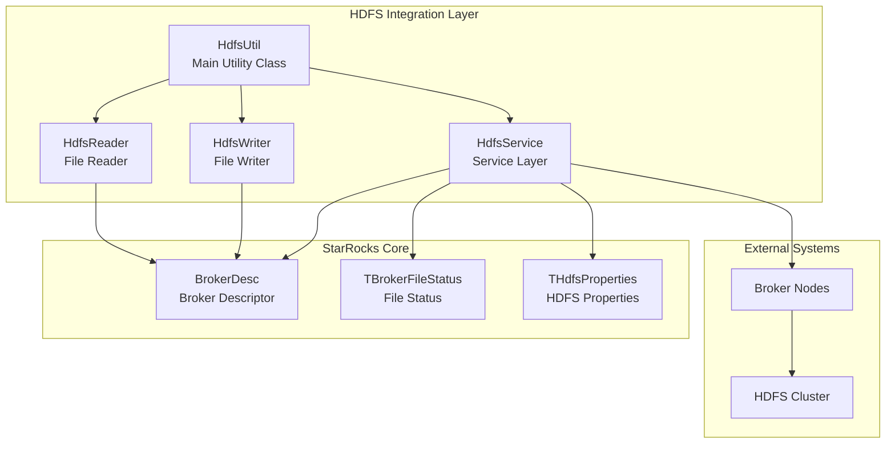
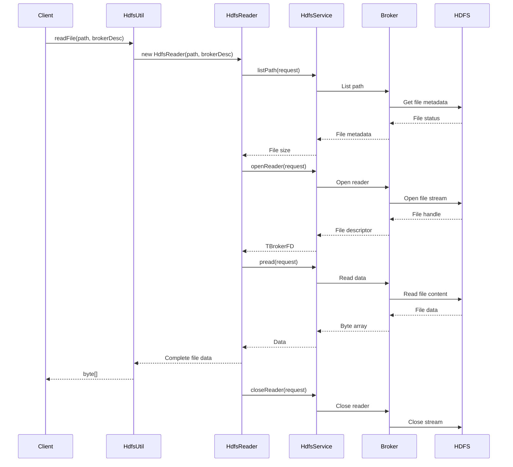
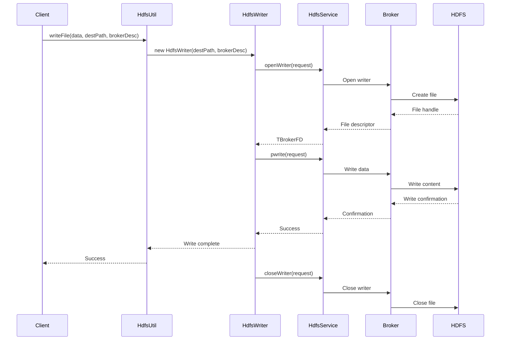

# HDFS Integration Module Documentation

## Overview

The HDFS Integration module provides comprehensive Hadoop Distributed File System (HDFS) connectivity and operations for StarRocks. This module serves as a critical bridge between StarRocks and HDFS, enabling seamless data access, file operations, and metadata management for distributed storage environments.

## Purpose and Core Functionality

The HDFS Integration module is designed to:

- **Provide unified HDFS access**: Abstract HDFS operations through a consistent API interface
- **Enable data ingestion**: Support reading and writing data from/to HDFS for ETL operations
- **Facilitate metadata operations**: Handle file status, path operations, and directory listings
- **Support broker-based operations**: Integrate with StarRocks broker system for distributed file access
- **Ensure fault tolerance**: Implement robust error handling and recovery mechanisms

## Architecture

### Component Structure



### Core Components

#### HdfsUtil Class
The main utility class providing static methods for HDFS operations:

- **File Operations**: `readFile()`, `writeFile()`, `copyToLocal()`, `copyFromLocal()`
- **Path Management**: `deletePath()`, `checkPathExist()`, `rename()`, `parseFile()`
- **Metadata Operations**: `listFileMeta()`, `parseColumnsFromPath()`, `getTProperties()`

#### HdfsReader Class
Encapsulates file reading operations with broker integration:

- **Stream Management**: Opens and manages HDFS file streams
- **Buffered Reading**: Implements efficient buffered reading with configurable buffer sizes
- **Error Handling**: Provides robust error handling and resource cleanup

#### HdfsWriter Class
Handles file writing operations to HDFS:

- **Stream Writing**: Manages HDFS write streams
- **Buffer Management**: Implements efficient buffer-based writing
- **Resource Cleanup**: Ensures proper resource deallocation

## Data Flow

### File Reading Process



### File Writing Process



## Key Features

### 1. Broker-Based Architecture
The module leverages StarRocks' broker system for distributed file operations:

- **Load Balancing**: Brokers distribute file operations across the cluster
- **Fault Tolerance**: Automatic failover between brokers
- **Security**: Centralized authentication and authorization

### 2. Path Column Parsing
Advanced path parsing for extracting partition columns:

```java
// Example: Extract columns from path like /data/year=2023/month=12/day=15/
List<String> columns = HdfsUtil.parseColumnsFromPath(
    "/data/year=2023/month=12/day=15/file.parquet", 
    Arrays.asList("year", "month", "day")
);
// Result: ["2023", "12", "15"]
```

### 3. File Metadata Operations
Comprehensive file system operations:

- **File Listing**: Recursive directory traversal with filtering
- **Status Checking**: File existence and permission verification
- **Path Operations**: Rename, delete, and move operations

### 4. Streaming I/O Support
Efficient streaming for large file operations:

- **Buffered Reading**: Configurable buffer sizes for optimal performance
- **Chunked Writing**: Support for large file writes with memory management
- **Progress Tracking**: Real-time operation progress monitoring

## Integration Points

### With Storage Engine
The HDFS integration works closely with the [storage_engine](storage_engine.md) module:

- **Data Loading**: Provides file access for data ingestion pipelines
- **Backup Operations**: Supports backup and restore functionality
- **Metadata Sync**: Synchronizes file metadata with storage metadata

### With Query Execution
Integration with [query_execution](query_execution.md) for external table access:

- **External Tables**: Enables HDFS-backed external tables
- **Scan Operations**: Provides file reading capabilities for query execution
- **Predicate Pushdown**: Supports filtering at the file level

### With Connector Framework
Works with [connectors](connectors.md) for unified data access:

- **Hive Integration**: Supports Hive table access via HDFS
- **Iceberg Support**: Enables Iceberg table operations
- **Delta Lake**: Provides underlying file access for Delta tables

## Configuration

### Key Configuration Parameters

```properties
# Broker client timeout in milliseconds
broker_client_timeout_ms=10000

# HDFS read buffer size
hdfs_read_buffer_size_mb=1

# Maximum retry attempts for failed operations
hdfs_max_retry_attempts=3
```

### Security Configuration

The module supports various security mechanisms:

- **Kerberos Authentication**: Full Kerberos support for secure clusters
- **SSL/TLS**: Encrypted communication with HDFS
- **Access Control**: Integration with Ranger and Sentry

## Error Handling

### Exception Types

- **StarRocksException**: General HDFS operation failures
- **IOException**: Network and I/O related errors
- **SecurityException**: Authentication and authorization failures

### Retry Mechanism

The module implements intelligent retry logic:

- **Exponential Backoff**: Progressive delay between retries
- **Circuit Breaker**: Prevents cascading failures
- **Dead Letter Queue**: Handles permanently failed operations

## Performance Optimization

### 1. Connection Pooling
- Reuses broker connections to reduce overhead
- Configurable pool sizes based on workload
- Automatic connection health checking

### 2. Buffer Management
- Optimized buffer sizes for different file types
- Memory-mapped files for large operations
- Streaming for memory-constrained environments

### 3. Parallel Operations
- Concurrent file operations for better throughput
- Configurable parallelism levels
- Load balancing across available brokers

## Monitoring and Observability

### Metrics Collection

- **Operation Latency**: Track read/write operation times
- **Throughput Monitoring**: Measure data transfer rates
- **Error Rates**: Monitor failure rates by operation type
- **Connection Health**: Track broker connection status

### Logging

- **Structured Logging**: JSON-formatted logs for analysis
- **Log Levels**: Configurable verbosity levels
- **Correlation IDs**: Track operations across components

## Best Practices

### 1. File Size Considerations
- Optimal file sizes: 128MB - 1GB for better parallelism
- Avoid small files to reduce metadata overhead
- Use compression for large text files

### 2. Path Organization
- Use meaningful directory structures
- Include partition columns in paths for efficient pruning
- Avoid deep directory hierarchies

### 3. Error Handling
- Implement proper exception handling in client code
- Use retry mechanisms for transient failures
- Monitor error rates and set up alerts

## Dependencies

### Internal Dependencies
- [filesystem](filesystem.md): Base file system abstractions
- [common_utilities](common_utilities.md): Shared utility functions
- [connector_framework](connector_framework.md): Connector infrastructure

### External Dependencies
- Apache Hadoop HDFS Client
- Apache Thrift (for broker communication)
- Google Guava (for utility functions)

## Future Enhancements

### Planned Features
- **Async I/O**: Non-blocking file operations
- **Caching Layer**: Intelligent data caching for frequently accessed files
- **Compression Support**: Built-in compression/decompression
- **Multi-Cloud Support**: Unified interface for cloud storage systems

### Performance Improvements
- **Zero-Copy Operations**: Reduce data copying overhead
- **Vectorized I/O**: Batch operations for better throughput
- **Predictive Prefetching**: Intelligent data prefetching based on access patterns

## Conclusion

The HDFS Integration module provides a robust, scalable, and efficient interface for HDFS operations within StarRocks. Its broker-based architecture ensures reliability and performance while maintaining compatibility with various HDFS distributions and configurations. The module's comprehensive feature set makes it suitable for a wide range of use cases, from simple file operations to complex data pipeline integrations.