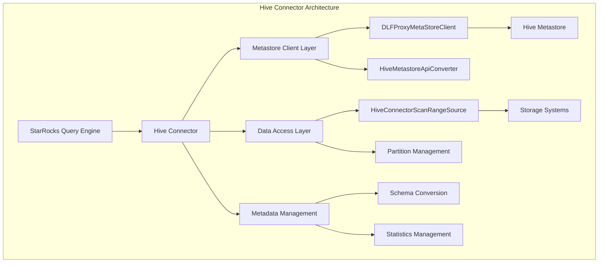

# Hive Connector Module Documentation

## Overview

The Hive Connector module serves as the primary interface between StarRocks and Apache Hive data warehouses. It enables StarRocks to query and analyze data stored in Hive tables across various storage systems including HDFS, S3, and other cloud storage platforms. The module provides comprehensive support for Hive table formats, partitioning strategies, and metadata management.

## Architecture

## Core Functionality

### 1. Metastore Integration
The Hive Connector provides robust integration with Hive Metastore through multiple client implementations:

- **DLFProxyMetaStoreClient**: A proxy client that supports both Alibaba Cloud DLF (Data Lake Formation) and traditional Hive Metastore, providing failover capabilities and unified access patterns.
- **HiveMetastoreApiConverter**: Handles conversion between Hive Metastore API objects and StarRocks internal representations.

### 2. Data Scanning and Partitioning
- **HiveConnectorScanRangeSource**: Manages scan range generation for distributed query execution, supporting various file formats and partitioning strategies.
- **Partition Management**: Handles Hive partitioning schemes including static and dynamic partitioning.

### 3. Schema and Type Management
- **Schema Conversion**: Converts between Hive and StarRocks type systems
- **Column Statistics**: Manages column-level statistics for query optimization

## Sub-modules

### [Metastore Client Layer](metastore_client_layer.md)
Handles communication with Hive Metastore services, providing unified access to metadata across different Hive deployments.

### [Data Access Layer](data_access_layer.md)
Manages physical data access, file format handling, and scan range generation for optimal query performance.

### [Schema Management](schema_management.md)
Handles type conversion, schema evolution, and metadata synchronization between Hive and StarRocks.

### [Partition Management](partition_management.md)
Manages Hive partitioning schemes, partition pruning, and dynamic partition discovery.

### [Write Operations](write_operations.md)
Manages data write operations, staging directories, and file creation for Hive table modifications.

## Key Features

### Multi-Format Support
- **Text Files**: Delimited text with configurable separators
- **Parquet**: Columnar storage format with predicate pushdown
- **ORC**: Optimized Row Columnar format with advanced compression
- **Avro**: Schema evolution support
- **RCFile**: Record Columnar File format

### Cloud Storage Integration
- **Amazon S3**: Full S3 compatibility with various endpoint configurations
- **Alibaba Cloud OSS**: Native OSS support
- **Azure Blob Storage**: Azure cloud storage integration
- **HDFS**: Traditional Hadoop Distributed File System

### Advanced Capabilities
- **Predicate Pushdown**: Pushes filtering operations to the storage layer
- **Partition Pruning**: Eliminates unnecessary partition scans
- **Column Pruning**: Reads only required columns
- **Statistics Integration**: Leverages Hive statistics for query optimization

## Integration Points

### With Storage Engine Module
The Hive Connector integrates closely with the [storage_engine](storage_engine.md) module for:
- File format parsing and decoding
- Compression algorithm support
- Storage layer optimizations

### With Query Execution Module
Integration with [query_execution](query_execution.md) provides:
- Distributed scan coordination
- Runtime filter application
- Adaptive query execution

### With Connector Framework
Works within the broader [connectors](connectors.md) framework for:
- Unified connector interface
- Credential management
- Cloud configuration handling

## Configuration and Deployment

### Required Dependencies
- Hive Metastore client libraries
- Hadoop client libraries
- Cloud storage SDKs (for cloud deployments)

### Configuration Parameters
- **hive.metastore.uris**: Hive Metastore connection string
- **hive.metastore.timeout**: Connection timeout settings
- **hive.storage.format**: Default storage format
- **hive.partition.mode**: Partition handling strategy

## Performance Considerations

### Optimization Strategies
1. **Metadata Caching**: Reduces metastore RPC calls
2. **Partition Pruning**: Minimizes data scanning
3. **File Format Selection**: Optimal format based on query patterns
4. **Scan Range Optimization**: Balances parallelism and overhead

### Monitoring and Metrics
- Metastore connection health
- Query execution statistics
- Data scanning performance
- Cache hit rates

## Security and Access Control

### Authentication Methods
- **Kerberos**: Enterprise-grade authentication
- **LDAP**: Directory service integration
- **Cloud IAM**: Cloud-native identity management

### Authorization
- **Hive SQL Standard**: GRANT/REVOKE syntax
- **Ranger Integration**: Apache Ranger support
- **Sentry Integration**: Cloudera Sentry support

## Troubleshooting

### Common Issues
1. **Metastore Connection Failures**: Check network connectivity and credentials
2. **Permission Denied**: Verify user permissions in Hive Metastore
3. **Format Not Supported**: Ensure file format compatibility
4. **Partition Not Found**: Check partition existence and naming

### Debug Tools
- **Query Execution Plans**: Analyze scan range distribution
- **Metastore Logs**: Debug metadata operations
- **Connector Metrics**: Monitor performance indicators

## Future Enhancements

### Planned Features
- **Iceberg Table Support**: Apache Iceberg integration
- **Delta Lake Support**: Delta Lake table format
- **Real-time Streaming**: CDC and streaming ingestion
- **Advanced Caching**: Multi-level caching strategies

### Performance Improvements
- **Vectorized Execution**: Enhanced batch processing
- **Adaptive Execution**: Dynamic optimization based on runtime statistics
- **Multi-cloud Support**: Enhanced cloud storage integration