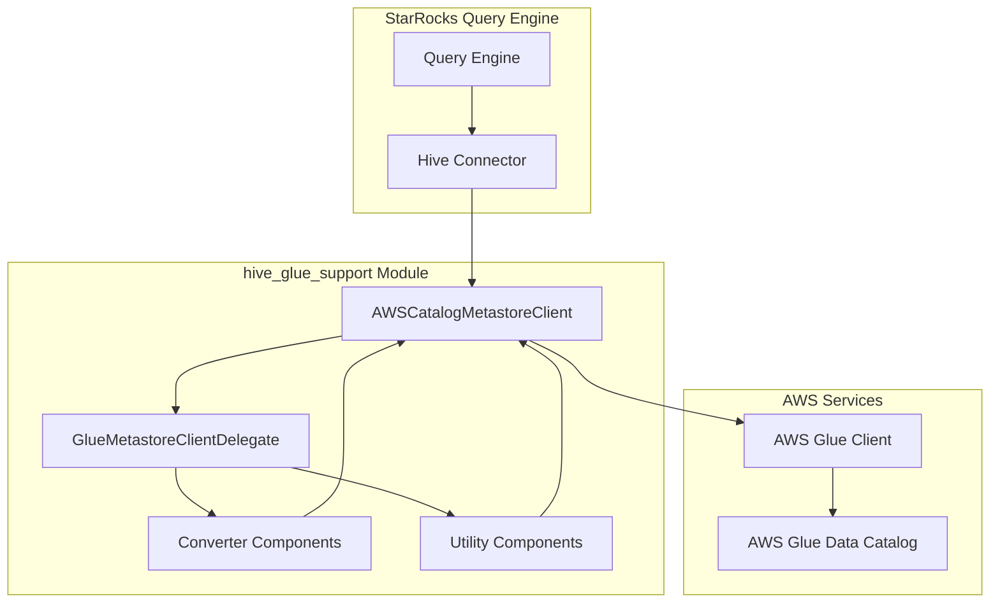
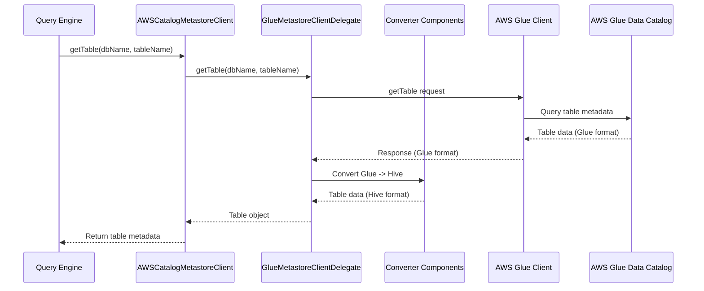

# Hive Glue Support Module

## Overview

The `hive_glue_support` module provides comprehensive integration between StarRocks and AWS Glue Data Catalog, enabling seamless access to Hive metadata stored in AWS Glue. This module serves as a bridge between StarRocks' query engine and AWS Glue's metastore services, allowing users to query external Hive tables managed by AWS Glue without requiring a separate Hive metastore deployment.

## Purpose and Core Functionality

The primary purpose of this module is to:
- Enable StarRocks to connect to and interact with AWS Glue Data Catalog
- Provide a Hive-compatible metastore client interface that translates between AWS Glue API calls and Hive metastore operations
- Support all standard Hive metastore operations including database, table, and partition management
- Handle the conversion between AWS Glue data models and Hive metastore data models
- Implement efficient batch operations for partition management
- Provide robust error handling and logging for AWS Glue operations

## Architecture Overview

## Module Structure

The hive_glue_support module is organized into several key sub-modules:

### 1. [Metastore Client Layer](metastore_client_layer.md)
The core client implementation that provides the Hive metastore interface:
- **AWSCatalogMetastoreClient**: Main client class implementing IMetaStoreClient interface
- **GlueMetastoreClientDelegate**: Delegates operations to AWS Glue services
- Handles connection management, authentication, and request routing

**See detailed documentation: [metastore_client_layer.md](metastore_client_layer.md)**

### 2. [Data Conversion Layer](data_conversion_layer.md)
Responsible for converting between AWS Glue and Hive data models:
- **CatalogToHiveConverter**: Converts AWS Glue objects to Hive format
- **HiveToCatalogConverter**: Converts Hive objects to AWS Glue format
- **GlueInputConverter**: Prepares input objects for AWS Glue API calls
- **ConverterUtils**: Utility functions for data conversion

**See detailed documentation: [data_conversion_layer.md](data_conversion_layer.md)**

### 3. [Utility and Support Components](utility_support_components.md)
Supporting utilities and helper classes:
- **AWSGlueConfig**: Configuration constants and parameters
- **ExpressionHelper**: Handles Hive expression conversion for AWS Glue
- **PartitionUtils**: Partition management utilities
- **BatchDeletePartitionsHelper**: Efficient batch partition deletion
- **MetastoreClientUtils**: General metastore client utilities
- **LoggingHelper**: Centralized logging utilities

**See detailed documentation: [utility_support_components.md](utility_support_components.md)**

## Key Features

### AWS Glue Integration
- Full compatibility with AWS Glue Data Catalog API
- Support for all major AWS Glue operations (databases, tables, partitions)
- Efficient batch operations for partition management
- Proper error handling and exception mapping

### Hive Compatibility
- Implements standard Hive metastore client interface (IMetaStoreClient)
- Maintains compatibility with existing Hive-based tools and workflows
- Supports all standard Hive DDL operations
- Handles Hive-specific data types and formats

### Performance Optimizations
- Connection pooling and reuse
- Batch operations for partition management
- Caching support for frequently accessed metadata
- Asynchronous operations where appropriate

### Security and Authentication
- AWS credential management integration
- Support for IAM roles and policies
- Secure connection handling
- Proper access control integration

## Data Flow

## Integration Points

### With StarRocks Query Engine
- Integrates with the Hive connector module
- Provides metadata for query planning and optimization
- Supports partition pruning and predicate pushdown

### With AWS Services
- Direct integration with AWS Glue Data Catalog
- Compatible with AWS security and authentication mechanisms
- Supports AWS best practices for API usage

### With Other Modules
- **hive_connector**: Provides the main Hive integration layer
- **connector_framework**: Integrates with the general connector architecture
- **sql_parser_optimizer**: Supports query optimization with external metadata

## Configuration

The module supports various configuration options through:
- AWS Glue-specific configuration parameters
- Hive metastore compatibility settings
- Connection and performance tuning options
- Security and authentication configurations

## Error Handling

The module implements comprehensive error handling:
- AWS Glue API error mapping to Hive exceptions
- Graceful degradation for unsupported operations
- Detailed logging and debugging information
- Retry mechanisms for transient failures

## Performance Considerations

- **Connection Management**: Reuses AWS Glue client connections
- **Batch Operations**: Groups multiple operations for efficiency
- **Caching**: Supports metadata caching to reduce API calls
- **Asynchronous Processing**: Uses thread pools for parallel operations

## Dependencies

This module depends on:
- AWS SDK for Java (Glue services)
- Apache Hive metastore APIs
- StarRocks connector framework
- Google Guava for utility functions

## Related Documentation

- [Hive Connector Module](hive_connector.md) - Main Hive integration
- [Connector Framework](connector_framework.md) - General connector architecture
- [Storage Engine](storage_engine.md) - Underlying storage integration
- [Query Execution](query_execution.md) - Query processing integration