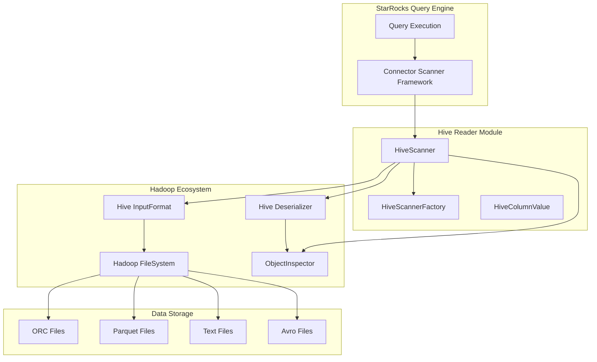
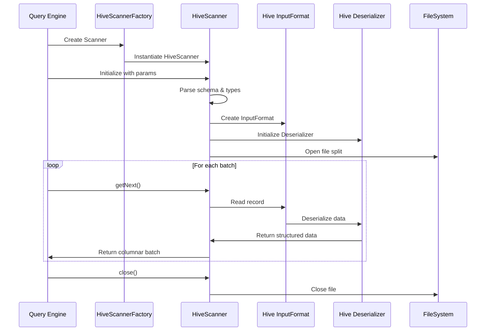

# Hive Reader Module Documentation

## Overview

The `hive_reader` module is a specialized Java extension component within the StarRocks ecosystem designed to provide efficient data reading capabilities from Apache Hive tables. This module serves as a bridge between StarRocks' query execution engine and Hive's storage layer, enabling seamless integration and data access from Hive data sources.

## Purpose and Core Functionality

The primary purpose of the hive_reader module is to:
- **Data Integration**: Enable StarRocks to read and process data stored in Hive tables across various file formats
- **Performance Optimization**: Provide optimized data scanning and deserialization for Hive datasets
- **Format Support**: Handle multiple Hive file formats including ORC, Parquet, Text, and Avro
- **Schema Evolution**: Support Hive table schema changes and complex data types
- **Partition Pruning**: Efficiently handle Hive partition pruning for query optimization

## Architecture Overview



## Module Components

### Core Components

#### 1. HiveScanner
The main scanner implementation that handles:
- **File Format Detection**: Automatically detects and handles different Hive file formats
- **Schema Mapping**: Maps Hive column types to StarRocks internal types
- **Data Deserialization**: Converts Hive data formats to StarRocks columnar format
- **Partition Processing**: Handles Hive partition information and pruning
- **Error Handling**: Provides comprehensive error handling and logging

For detailed implementation details, see [scanner_core.md](scanner_core.md).

#### 2. HiveScannerFactory
Factory class responsible for:
- **Scanner Instantiation**: Creates HiveScanner instances with proper class loading
- **Module Isolation**: Ensures proper classloader isolation for Hive dependencies
- **Configuration Management**: Handles scanner-specific configuration parameters

For detailed factory implementation, see [scanner_factory.md](scanner_factory.md).

### Data Flow Architecture



## Key Features

### 1. Multi-Format Support
The module supports reading from various Hive file formats:
- **ORC (Optimized Row Columnar)**: High-performance columnar format
- **Parquet**: Columnar storage format optimized for analytics
- **Text**: Plain text files with configurable delimiters
- **Avro**: Schema-evolution friendly binary format

### 2. Schema Handling
- **Type Mapping**: Converts Hive data types to StarRocks internal representations
- **Complex Types**: Supports nested structures, arrays, maps, and structs
- **Schema Evolution**: Handles schema changes in Hive tables
- **Column Pruning**: Only reads required columns for query optimization

### 3. Performance Optimizations
- **Batch Processing**: Processes data in configurable batch sizes
- **Memory Management**: Efficient off-heap memory usage
- **Parallel Reading**: Supports parallel scanning of file splits
- **Predicate Pushdown**: Pushes filtering operations to the storage layer

## Integration Points

### Connector Framework Integration
The hive_reader module integrates with StarRocks' connector framework through:
- **ScannerFactory Interface**: Implements the factory pattern for scanner creation
- **ConnectorScanner Base Class**: Extends the base scanner functionality
- **JNI Bridge**: Provides Java Native Interface for C++ integration

### Configuration Parameters
Key configuration parameters include:
- `hive_column_names`: Comma-separated list of Hive column names
- `hive_column_types`: Hash-separated list of Hive column types
- `required_fields`: Comma-separated list of fields to read
- `data_file_path`: Path to the Hive data file
- `block_offset` & `block_length`: File split boundaries
- `serde`: Hive serializer/deserializer class name
- `input_format`: Hive InputFormat class name

## Error Handling and Logging

The module implements comprehensive error handling:
- **Exception Management**: Proper exception propagation and handling
- **Resource Cleanup**: Ensures proper cleanup of file handles and resources
- **Logging**: Detailed logging for debugging and monitoring
- **Error Context**: Provides meaningful error messages with context

## Performance Characteristics

### Throughput
- Supports configurable batch sizes for optimal memory usage
- Efficient columnar data conversion
- Minimal data copying through direct buffer access

### Scalability
- Thread-safe scanner instances
- Support for parallel file processing
- Efficient memory management for large datasets

## Dependencies

### External Dependencies
- **Hadoop Libraries**: Core Hadoop FileSystem and I/O libraries
- **Hive SerDe**: Hive serialization/deserialization libraries
- **Apache Commons**: Utility libraries for configuration and logging

### Internal Dependencies
- **JNI Connector**: StarRocks JNI connector framework
- **Scanner Framework**: Base scanner functionality and interfaces
- **Type System**: StarRocks type conversion utilities

## Usage Examples

### Basic Scanner Creation
```java
Map<String, String> params = new HashMap<>();
params.put("hive_column_names", "id,name,age");
params.put("hive_column_types", "int#string#int");
params.put("required_fields", "id,name");
params.put("data_file_path", "/path/to/hive/file.orc");
params.put("block_offset", "0");
params.put("block_length", "1048576");
params.put("serde", "org.apache.hadoop.hive.ql.io.orc.OrcSerde");
params.put("input_format", "org.apache.hadoop.hive.ql.io.orc.OrcInputFormat");

HiveScanner scanner = new HiveScanner(4096, params);
scanner.open();
```

### Data Reading Loop
```java
while (true) {
    int rows = scanner.getNext();
    if (rows == 0) {
        break;
    }
    // Process the batch of rows
}
scanner.close();
```

## Future Enhancements

### Planned Improvements
- **Vectorized Reading**: Enhanced vectorized processing for better performance
- **Caching Layer**: Intelligent caching for frequently accessed data
- **Statistics Integration**: Better integration with Hive table statistics
- **Security**: Enhanced security features for data access control

### Performance Optimizations
- **Async I/O**: Asynchronous I/O operations for better throughput
- **Compression**: Enhanced compression support for various formats
- **Memory Pooling**: Object pooling for reduced garbage collection

## Related Documentation

For more information about related modules:
- [storage_engine.md](storage_engine.md) - Core storage engine functionality
- [connectors.md](connectors.md) - Connector framework overview
- [query_execution.md](query_execution.md) - Query execution engine
- [java_extensions.md](java_extensions.md) - Java extensions framework

## Conclusion

The hive_reader module is a critical component that enables StarRocks to seamlessly integrate with Apache Hive data sources. Through its robust architecture, comprehensive format support, and performance optimizations, it provides a reliable and efficient bridge between the two systems, enabling users to leverage their existing Hive data infrastructure while benefiting from StarRocks' powerful analytical capabilities.