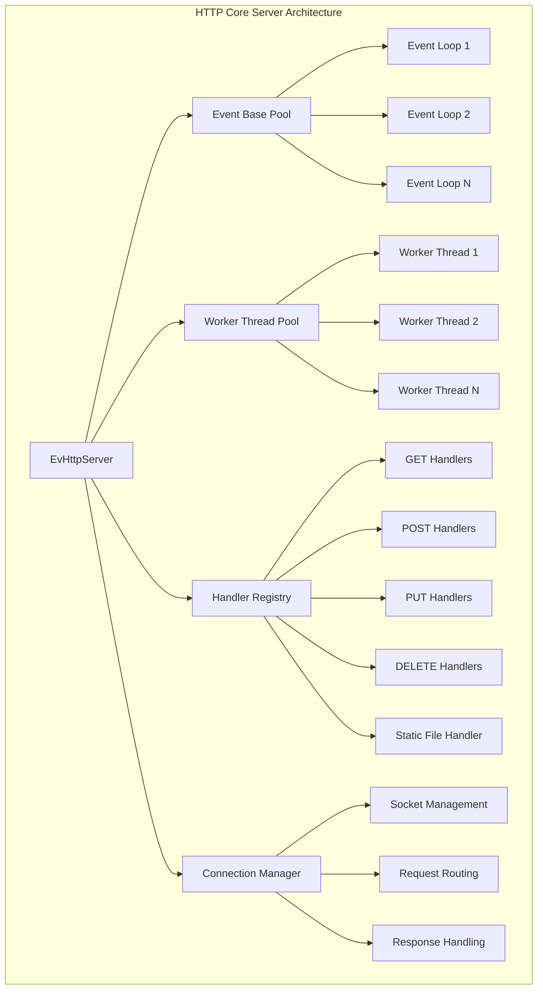
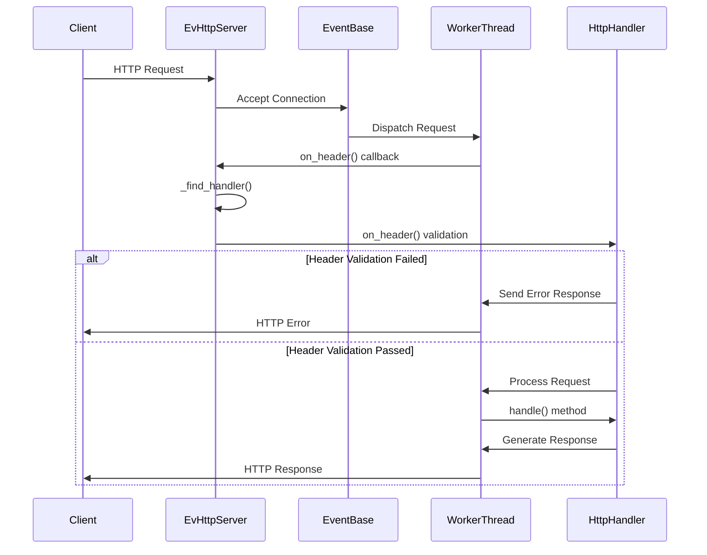
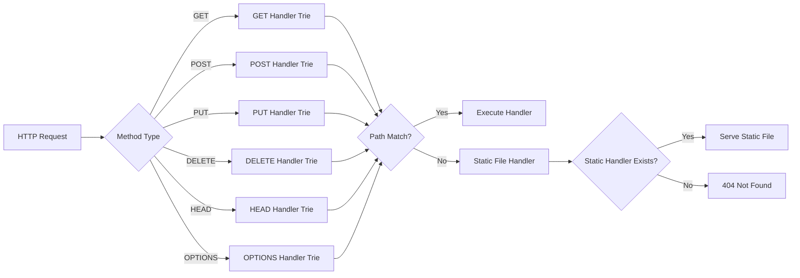
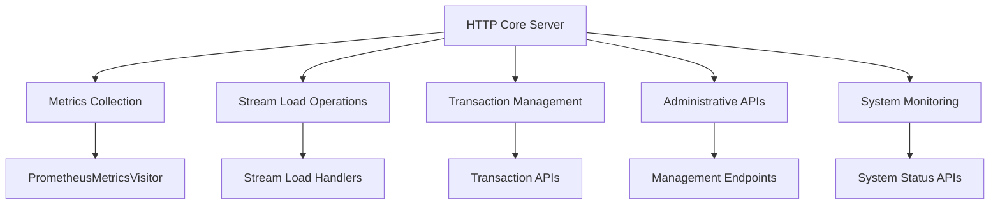

# HTTP Core Server Module Documentation

## Overview

The HTTP Core Server module provides the foundational HTTP server infrastructure for StarRocks' backend services. Built on top of libevent's evhttp, this module handles HTTP request processing, routing, and response management for various backend operations including metrics collection, stream loading, and administrative tasks.

## Architecture

### Core Components

The module centers around the `EvHttpServer` class, which implements a multi-threaded HTTP server with the following key characteristics:

- **Event-driven architecture** using libevent for high-performance I/O
- **Multi-worker thread model** for concurrent request handling
- **Thread-safe handler registration** with read-write locks
- **Progressive request processing** for large payloads
- **Comprehensive HTTP method support** (GET, POST, PUT, DELETE, HEAD, OPTIONS)

### System Architecture



## Request Processing Flow

### Request Lifecycle



### Handler Registration and Routing



## Key Features

### 1. Multi-threaded Request Processing

The server employs a worker thread pool where each worker maintains its own event base and evhttp instance:

```cpp
// Worker thread creation
for (int i = 0; i < _num_workers; ++i) {
    auto worker = [this]() {
        struct event_base* base = event_base_new();
        struct evhttp* http = evhttp_new(base);
        evhttp_accept_socket(http, _server_fd);
        evhttp_set_gencb(http, on_request, this);
        event_base_dispatch(base);
    };
    _workers.emplace_back(worker);
}
```

### 2. Thread-safe Handler Management

Handler registration and lookup use read-write locks for thread safety:

```cpp
bool EvHttpServer::register_handler(const HttpMethod& method, const std::string& path, HttpHandler* handler) {
    pthread_rwlock_wrlock(&_rw_lock);
    // Register handler in appropriate method trie
    result = root->insert(path, handler);
    pthread_rwlock_unlock(&_rw_lock);
    return result;
}
```

### 3. Progressive Request Handling

Large request bodies can be processed in chunks to avoid memory issues:

```cpp
if (handler->request_will_be_read_progressively()) {
    evhttp_request_set_chunked_cb(ev_req, on_chunked);
}
```

### 4. Request Lifecycle Management

Comprehensive request lifecycle with proper cleanup:

```cpp
static void on_free(struct evhttp_request* ev_req, void* arg) {
    auto* request = (HttpRequest*)arg;
    delete request;
}
```

## Integration Points

### HTTP Server Integration

The HTTP Core Server integrates with various backend services:



### Related Modules

- **[http_server](http_server.md)**: Higher-level HTTP server components including metrics collection and stream load management
- **[backend_server](backend_server.md)**: Backend server infrastructure that hosts the HTTP core server
- **[runtime_system](runtime_system.md)**: Runtime components that may be accessed via HTTP endpoints

## Configuration and Deployment

### Server Initialization

```cpp
EvHttpServer::EvHttpServer(int port, int num_workers) 
    : _port(port), _num_workers(num_workers), _real_port(0) {
    _host = BackendOptions::get_service_bind_address();
    auto res = pthread_rwlock_init(&_rw_lock, nullptr);
}
```

### Port Binding

The server supports both specified and dynamic port allocation:

```cpp
Status EvHttpServer::_bind() {
    butil::EndPoint point;
    auto res = butil::str2endpoint(_host.c_str(), _port, &point);
    _server_fd = butil::tcp_listen(point);
    if (_port == 0) {
        // Dynamic port allocation
        getsockname(_server_fd, (struct sockaddr*)&addr, &socklen);
        _real_port = ntohs(addr.sin_port);
    }
}
```

## Error Handling

### Connection Management

The server implements robust error handling for various scenarios:

```cpp
static int on_header(struct evhttp_request* ev_req) {
    auto request = std::unique_ptr<HttpRequest>(new HttpRequest(ev_req));
    auto res = request->init_from_evhttp();
    if (res < 0) {
        return -1; // Reject request
    }
    
    auto handler = _find_handler(request.get());
    if (handler == nullptr) {
        HttpChannel::send_reply(request.get(), HttpStatus::NOT_FOUND, "Not Found");
        return 0;
    }
}
```

### Resource Cleanup

Proper cleanup during server shutdown:

```cpp
void EvHttpServer::stop() {
    // Break event loops
    for (auto base : _event_bases) {
        event_base_loopbreak(base);
    }
    // Shutdown socket to wake up epoll_wait
    shutdown(_server_fd, SHUT_RDWR);
}
```

## Performance Considerations

### 1. Event-driven Architecture
- Non-blocking I/O using libevent
- Efficient epoll-based event notification
- Minimal thread context switching

### 2. Memory Management
- Request objects managed with smart pointers
- Automatic cleanup via on_free callbacks
- Progressive processing for large payloads

### 3. Thread Safety
- Read-write locks for handler registry
- Lock-free request processing within workers
- Minimal lock contention

### 4. Scalability
- Configurable worker thread pool size
- Independent event bases per worker
- Efficient request routing with path tries

## Security Features

### Request Validation

- Header validation before request processing
- Method-specific handler routing
- Path-based access control through handler registration

### Resource Management

- Bounded request processing
- Proper socket cleanup
- Memory leak prevention through RAII patterns

## Monitoring and Observability

### Integration Points

The HTTP Core Server provides hooks for monitoring:

- Request processing callbacks
- Error handling and logging
- Performance metrics collection

### Logging Integration

```cpp
#include "common/logging.h"
// Comprehensive logging throughout request lifecycle
LOG(WARNING) << "evhttp accept socket failed, error:" << errno_to_string(errno);
```

## Future Enhancements

### Potential Improvements

1. **HTTP/2 Support**: Upgrade to support HTTP/2 protocol features
2. **WebSocket Support**: Add WebSocket protocol handling
3. **Rate Limiting**: Implement request rate limiting per endpoint
4. **Request Middleware**: Add pluggable middleware architecture
5. **Compression**: Built-in response compression support

### Scalability Enhancements

1. **Dynamic Worker Scaling**: Auto-scale worker threads based on load
2. **Load Balancing**: Integration with external load balancers
3. **Request Queuing**: Implement request queuing for overload scenarios
4. **Circuit Breakers**: Add circuit breaker patterns for resilience

## Conclusion

The HTTP Core Server module provides a robust, high-performance foundation for StarRocks' HTTP-based services. Its event-driven architecture, multi-threaded design, and comprehensive feature set make it well-suited for handling diverse backend operations while maintaining excellent performance and reliability characteristics.

The modular design allows for easy extension and integration with various backend services, while the thread-safe implementation ensures reliable operation under high concurrency scenarios. The progressive request processing capabilities and comprehensive error handling make it suitable for both simple API endpoints and complex data ingestion operations.