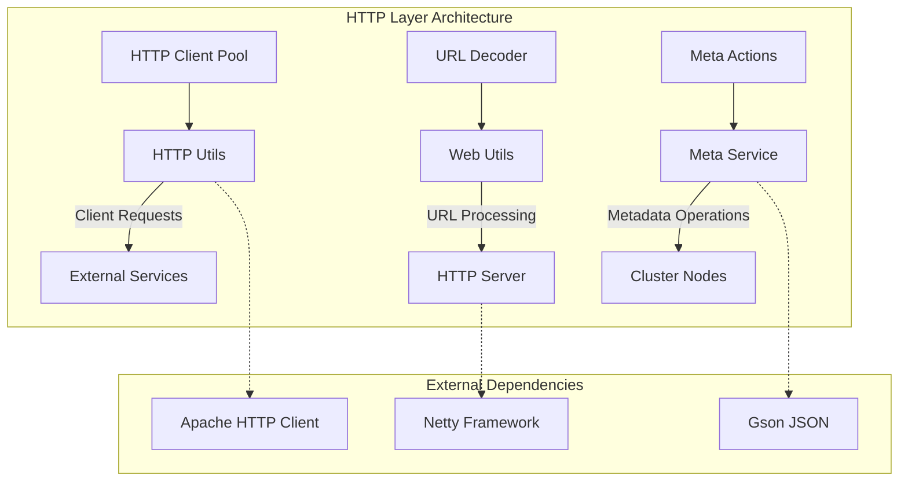
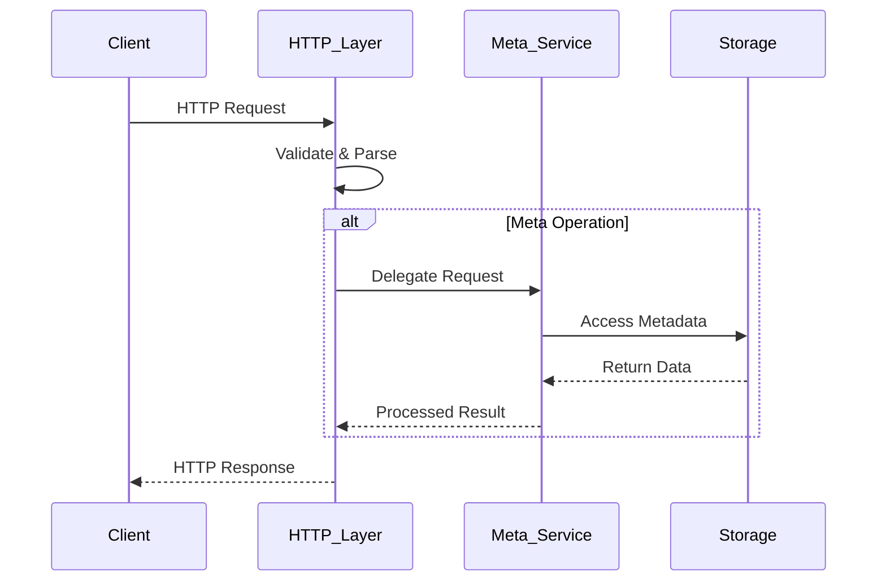

# HTTP Layer Module Documentation

## Overview

The HTTP Layer module provides HTTP communication capabilities for StarRocks, handling both client-side HTTP requests and server-side HTTP services. This module serves as the foundation for REST API interactions, metadata synchronization between nodes, and various HTTP-based operations within the StarRocks cluster.

## Architecture

## Core Components

### 1. HTTP Utils (`HttpUtils`)
Provides a singleton HTTP client with connection pooling and SSL support for making HTTP requests to external services.

**Key Features:**
- Connection pooling with configurable limits (50 per route, 100 total)
- SSL/TLS support with self-signed certificate handling
- Automatic retry mechanism (5 retries)
- Timeout configuration (5 seconds for connect, socket, and connection request)
- Support for GET and POST operations

**Dependencies:**
- Apache HTTP Client library
- SSL context management
- Connection pooling framework

### 2. Web Utils (`WebUtils`)
Handles URL encoding/decoding and HTTP request sanitization for security.

**Key Features:**
- RFC 3986 compliant URL decoding
- Performance-optimized decoding algorithm
- HTTP parameter sanitization for security
- Support for UTF-8 character encoding

**Security Features:**
- Sanitization of sensitive parameters (file_id, cluster_id, token)
- Protection against malformed escape sequences
- URI validation and parsing

### 3. Meta Service (`MetaService`)
Provides HTTP-based metadata operations for cluster management and synchronization.

**Key Features:**
- Image file management for metadata backup/restore
- Journal ID tracking for replication
- Role management for cluster nodes
- Cluster consistency checking
- Metadata dumping capabilities

**Sub-components:**
- `ImageAction`: Handles metadata image file retrieval
- `InfoAction`: Provides storage information
- `VersionAction`: Manages version information
- `PutAction`: Handles image file uploads
- `JournalIdAction`: Tracks journal replication progress
- `RoleAction`: Manages node roles in the cluster
- `CheckAction`: Validates cluster configuration
- `DumpAction`: Creates metadata dumps for debugging

For detailed information about the Meta Service implementation, see [Meta Service Documentation](meta_service.md).

## Data Flow

## Integration Points

### Frontend Server Integration
The HTTP Layer integrates with the [frontend_server](frontend_server.md) module to provide:
- REST API endpoints for cluster management
- Metadata synchronization between frontend nodes
- Administrative interfaces for system operations

### Storage Engine Integration
Coordinates with the [storage_engine](storage_engine.md) module for:
- Metadata persistence operations
- Image file management
- Backup and restore functionality

### Security Integration
Works with authentication and authorization systems to:
- Validate administrative access for sensitive operations
- Sanitize HTTP parameters to prevent injection attacks
- Manage secure communication between cluster nodes

## Configuration

### HTTP Client Configuration
- **Connection Pool Size**: 100 total connections, 50 per route
- **Timeout Settings**: 5 seconds for all timeout types
- **Retry Policy**: 5 retries with exponential backoff
- **SSL Handling**: Trusts self-signed certificates for internal communication

### Meta Service Configuration
- **Download Timeout**: 10 seconds for image file transfers
- **Image Format Support**: Both v1 and v2 formats
- **Token Validation**: Required for cluster security

## Error Handling

The HTTP Layer implements comprehensive error handling:
- **HTTP Status Codes**: Proper HTTP status code mapping
- **Exception Wrapping**: Converts internal exceptions to HTTP-friendly formats
- **Logging**: Detailed logging for debugging and monitoring
- **Retry Logic**: Automatic retry for transient failures

## Security Considerations

### Parameter Sanitization
- Sensitive parameters are automatically sanitized in URLs
- Protection against Server-Side Request Forgery (SSRF)
- Input validation for all HTTP parameters

### SSL/TLS Security
- Support for both HTTP and HTTPS protocols
- Self-signed certificate handling for internal communication
- Hostname verification can be disabled for internal clusters

## Performance Optimization

### Connection Pooling
- Reuses HTTP connections to reduce overhead
- Configurable pool sizes based on cluster size
- Automatic connection cleanup and validation

### URL Processing
- Optimized URL decoding algorithm (2x faster than standard URLDecoder)
- Minimal memory allocation for common cases
- Efficient string handling to reduce GC pressure

## Monitoring and Observability

The HTTP Layer provides monitoring capabilities through:
- Detailed logging of HTTP operations
- Performance metrics for connection pooling
- Error rate tracking and reporting
- Integration with cluster monitoring systems

## Related Documentation

- [Frontend Server](frontend_server.md) - Server lifecycle and management
- [Storage Engine](storage_engine.md) - Metadata persistence operations
- [RPC Layer](rpc_layer.md) - Alternative communication mechanism
- [Common Utilities](common_utilities.md) - Shared utility functions