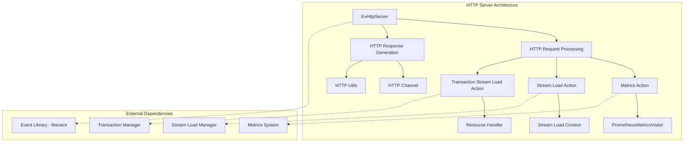
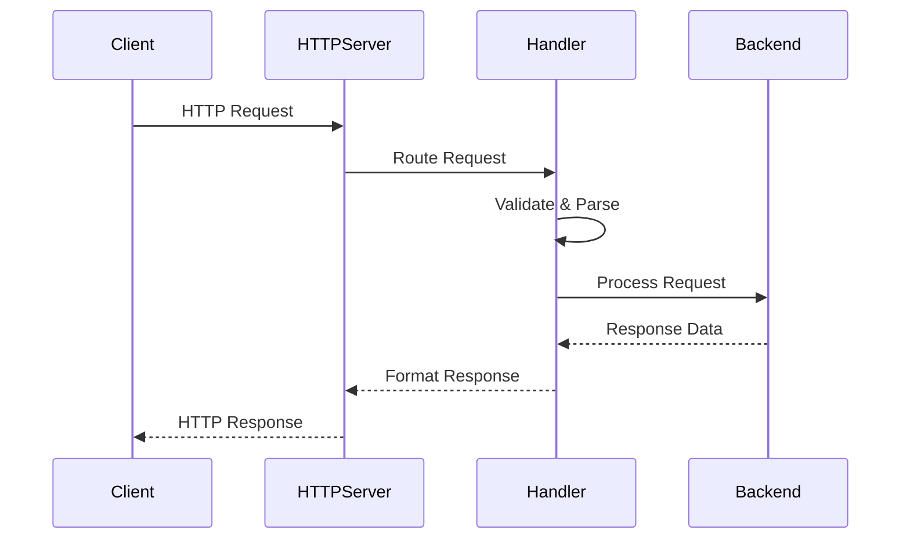

# HTTP Server Module Documentation

## Overview

The HTTP Server module in StarRocks provides a comprehensive HTTP interface for the backend system, handling various types of HTTP requests including metrics collection, stream loading, and transaction management. This module serves as the primary HTTP gateway for external clients to interact with the StarRocks backend services.

## Architecture

## Core Components

### 1. HTTP Server Core (`ev_http_server`)
The main HTTP server implementation built on top of libevent, providing:
- Multi-threaded request handling
- Connection management
- Request routing and dispatching
- Static file serving capabilities

### 2. Metrics Collection (`metrics_action`)
Handles metrics exposure in multiple formats:
- **Prometheus format**: For integration with Prometheus monitoring
- **JSON format**: For programmatic access to metrics
- **Core metrics**: Simplified metrics for basic monitoring

### 3. Stream Load Actions
Two specialized handlers for data ingestion:
- **Regular Stream Load**: For standard data loading operations
- **Transaction Stream Load**: For transactional data loading with ACID properties

### 4. HTTP Utilities (`http_request`, `utils`)
Supporting infrastructure including:
- Request parsing and validation
- Response formatting
- Authentication handling
- File serving utilities

## Sub-modules

The HTTP server module is organized into several specialized sub-modules:

### [metrics_collection](metrics_collection.md)
Comprehensive metrics collection and exposure system supporting Prometheus, JSON, and core metrics formats. Handles all monitoring-related HTTP endpoints with specialized visitors for different output formats.

### [stream_load_management](stream_load_management.md)
Advanced data ingestion system supporting both regular and transactional stream loading operations. Manages HTTP-based data loading with support for multiple formats (CSV, JSON, compressed formats) and provides transactional ACID properties for critical data operations.

### [http_core_server](http_core_server.md)
The foundational HTTP server implementation built on libevent, providing multi-threaded request handling, connection management, request routing, and static file serving capabilities with high performance and scalability.

### [http_utilities](http_utilities.md)
Essential utilities for HTTP request parsing, response generation, authentication handling, file operations, and common HTTP protocol utilities that support the entire HTTP server ecosystem.

## Key Features

### Multi-format Support
- **CSV**: Plain and compressed formats (GZIP, BZIP2, LZ4, DEFLATE, ZSTD)
- **JSON**: With configurable parsing options
- **Custom delimiters**: Flexible column and row separators

### Security Features
- Basic authentication support
- Request validation and sanitization
- Content-type validation
- Size limits and rate limiting

### Performance Optimizations
- Streaming data processing for large payloads
- Memory-efficient buffer management
- Concurrent request handling
- Connection pooling

### Monitoring Integration
- Prometheus-compatible metrics endpoint
- Real-time performance metrics
- Error tracking and reporting
- Resource utilization monitoring

## Data Flow

## Configuration

The HTTP server module supports various configuration options:

- **Port binding**: Configurable listening port
- **Worker threads**: Adjustable concurrency level
- **Request limits**: Size and rate limiting parameters
- **Timeout settings**: Connection and request timeouts
- **SSL/TLS**: Secure connection support (when configured)

## Integration Points

### With Storage Engine
- Direct integration with stream load managers
- Transaction coordination with storage layer
- Metrics collection from storage components

### With Query Execution
- HTTP-based query submission endpoints
- Result set streaming capabilities
- Query status monitoring

### With Frontend Services
- Coordination with FE for metadata operations
- Authentication and authorization integration
- Cluster state information exposure

## Error Handling

The module implements comprehensive error handling:
- **HTTP status codes**: Proper HTTP status code mapping
- **Detailed error messages**: Contextual error information
- **Graceful degradation**: Continued operation under partial failures
- **Logging integration**: Comprehensive error logging

## Performance Characteristics

- **Throughput**: Capable of handling thousands of concurrent connections
- **Latency**: Sub-millisecond response times for simple operations
- **Scalability**: Linear scaling with worker thread count
- **Memory efficiency**: Streaming processing for large payloads

## Dependencies

### External Libraries
- **libevent**: Core event-driven HTTP handling
- **RapidJSON**: JSON parsing and generation
- **Boost**: String processing and utilities

### Internal Modules
- [storage_engine](storage_engine.md): For stream load operations
- [runtime_system](runtime_system.md): For execution context management
- [metrics](metrics.md): For monitoring data collection

This HTTP server module provides a robust, scalable, and feature-rich HTTP interface that serves as a critical component in the StarRocks architecture, enabling seamless integration with external systems and providing essential operational capabilities.