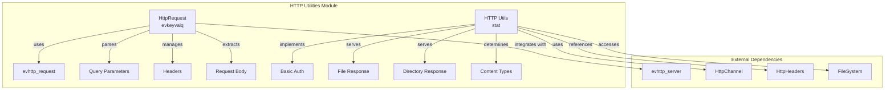
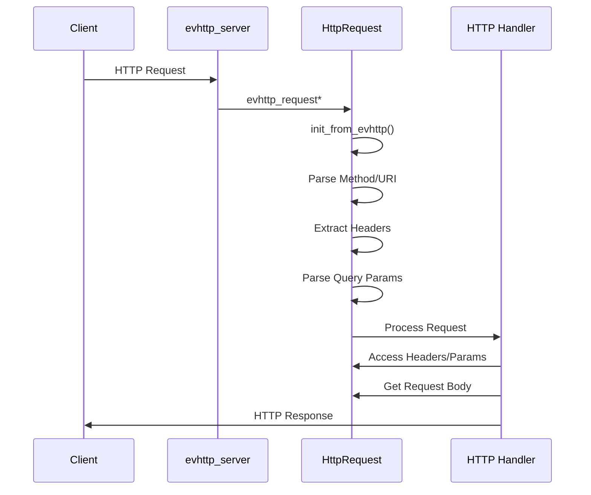
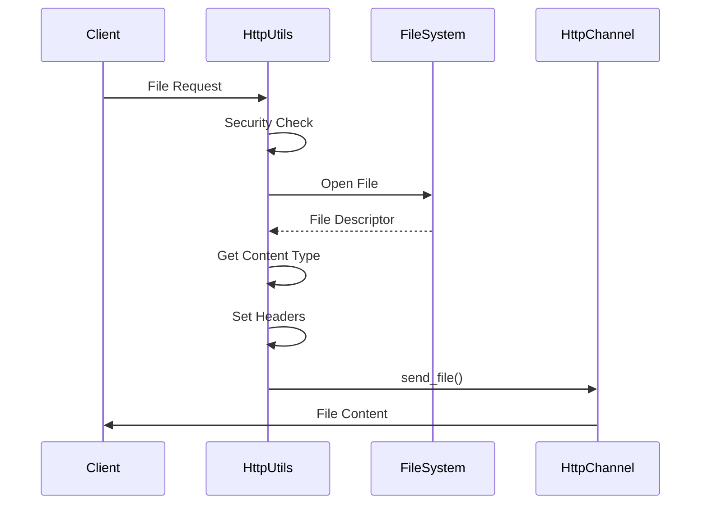

# HTTP Utilities Module Documentation

## Overview

The HTTP Utilities module provides essential HTTP request handling and utility functions for StarRocks' backend HTTP server infrastructure. This module serves as a foundational component for HTTP-based operations, including REST API endpoints, metrics collection, and file serving capabilities.

## Purpose and Core Functionality

The HTTP Utilities module is designed to:

1. **HTTP Request Processing**: Parse and manage HTTP requests, including headers, query parameters, and request bodies
2. **Authentication Handling**: Implement Basic Authentication parsing and validation
3. **File Serving**: Provide secure file and directory response capabilities
4. **Content Type Management**: Determine appropriate MIME types for file responses
5. **HTTP Header Management**: Handle HTTP headers for both requests and responses

## Architecture

### Component Structure



### Core Components

#### 1. HttpRequest (evkeyvalq)

The `HttpRequest` class encapsulates HTTP request processing functionality:

- **Request Parsing**: Extracts method, URI, headers, and query parameters from `evhttp_request`
- **Parameter Management**: Merges query parameters with other request parameters
- **Header Access**: Provides convenient access to HTTP headers
- **Body Extraction**: Handles request body reading and caching
- **Debug Support**: Offers comprehensive request debugging information

**Key Methods**:
- `init_from_evhttp()`: Initializes request from libevent HTTP request
- `header()`: Retrieves specific header values
- `param()`: Accesses request parameters
- `get_request_body()`: Extracts and caches request body
- `debug_string()`: Generates detailed request information

#### 2. HTTP Utils (stat)

The utility functions provide common HTTP operations:

- **Authentication**: Basic authentication parsing and validation
- **File Serving**: Secure file response with content type detection
- **Directory Listing**: Directory content enumeration and response
- **Content Type Detection**: MIME type determination based on file extensions

**Key Functions**:
- `encode_basic_auth()`: Creates Basic authentication headers
- `parse_basic_auth()`: Extracts authentication credentials
- `do_file_response()`: Serves file content securely
- `do_dir_response()`: Provides directory listings
- `get_content_type()`: Determines appropriate MIME types

## Data Flow

### HTTP Request Processing Flow



### File Serving Flow



## Security Considerations

### Path Traversal Protection

The file serving functionality implements security measures:

```cpp
// Prevents directory traversal attacks
if (file_path.find("..") != std::string::npos) {
    LOG(WARNING) << "Not allowed to read relative path: " << file_path;
    HttpChannel::send_error(req, HttpStatus::FORBIDDEN);
    return;
}
```

### Authentication Security

Basic authentication implementation includes:
- Base64 decoding with error handling
- User/cluster separation with '@' delimiter
- IP address tracking for security auditing

## Integration Points

### HTTP Server Integration

The module integrates with StarRocks' HTTP server infrastructure:

- **evhttp_server**: Uses libevent for high-performance HTTP handling
- **HttpChannel**: Provides response sending capabilities
- **HttpHeaders**: Standardizes header constants

### File System Integration

File operations integrate with the storage layer:

- **FileSystem**: Abstracts file system operations
- **Path Utilities**: Ensures secure path handling
- **Status Handling**: Provides comprehensive error reporting

## Error Handling

### Request Processing Errors

- **Method Validation**: Rejects unknown HTTP methods
- **Query Parsing**: Handles malformed query strings gracefully
- **Header Access**: Returns empty strings for missing headers

### File Operation Errors

- **File Not Found**: Returns 404 status with proper logging
- **Permission Denied**: Returns 403 status for restricted access
- **System Errors**: Returns 500 status for internal failures

## Performance Considerations

### Request Body Caching

Request bodies are cached after first access to avoid multiple buffer reads:

```cpp
std::string HttpRequest::get_request_body() {
    if (!_request_body.empty()) {
        return _request_body;  // Return cached version
    }
    // ... extract from buffer and cache
}
```

### Efficient Header Access

Headers are stored in unordered_map for O(1) access time:

```cpp
std::unordered_map<std::string, std::string> _headers;
```

## Usage Examples

### Basic Request Processing

```cpp
HttpRequest request(evhttp_request);
if (request.init_from_evhttp() != 0) {
    // Handle initialization error
}

// Access request components
std::string method = request.method();
std::string uri = request.uri();
std::string auth_header = request.header(HttpHeaders::AUTHORIZATION);
```

### File Response

```cpp
void handle_file_request(HttpRequest* req) {
    std::string file_path = req->param("file");
    do_file_response(file_path, req);
}
```

### Authentication

```cpp
AuthInfo auth;
if (parse_basic_auth(*req, &auth)) {
    // Process authenticated request
    std::string user = auth.user;
    std::string cluster = auth.cluster;
}
```

## Dependencies

### Internal Dependencies

- **HttpChannel**: For sending responses
- **HttpHeaders**: For header constants
- **FileSystem**: For file operations
- **Status**: For error handling

### External Dependencies

- **libevent**: For HTTP server functionality
- **Boost**: For string algorithms
- **Standard Library**: For containers and utilities

## Future Enhancements

### Planned Improvements

1. **Range Request Support**: Implement HTTP range requests for partial content
2. **Conditional Requests**: Add If-Modified-Since header support
3. **Compression**: Enable gzip compression for responses
4. **Rate Limiting**: Implement request rate limiting
5. **CORS Support**: Add Cross-Origin Resource Sharing headers

### Extension Points

- **Custom Authentication**: Plugin system for authentication methods
- **Content Types**: Extensible MIME type detection
- **Response Filters**: Middleware for response processing

## Related Documentation

- [HTTP Server](http_server.md) - Core HTTP server implementation
- [File System](filesystem.md) - File system abstraction layer
- [Authentication](authentication.md) - Authentication and authorization system
- [Network Utilities](network_utils.md) - Network utility functions

## Conclusion

The HTTP Utilities module provides a robust foundation for HTTP-based operations in StarRocks. Its design emphasizes security, performance, and extensibility while maintaining clean integration with the broader system architecture. The module's comprehensive error handling and security measures make it suitable for production deployments requiring reliable HTTP communication.