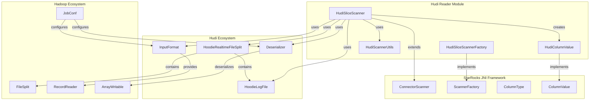
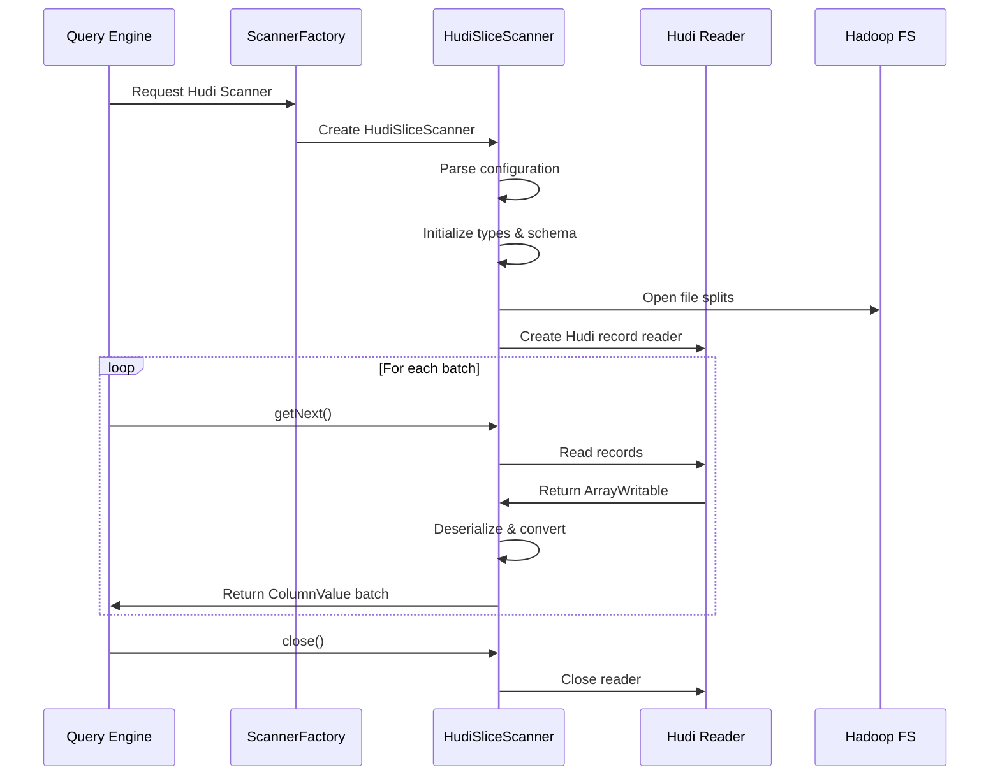

# Hudi Reader Module Documentation

## Overview

The Hudi Reader module is a specialized component within StarRocks' Java Extensions framework designed to read and process Apache Hudi (Hadoop Upserts Deletes and Incrementals) table data. This module provides native integration with Hudi's real-time data format, enabling StarRocks to query Hudi tables efficiently with support for both Copy-on-Write (CoW) and Merge-on-Read (MoR) table types.

## Purpose and Core Functionality

The Hudi Reader module serves as a bridge between StarRocks' query execution engine and Apache Hudi's storage format, providing:

- **Real-time Data Access**: Direct reading of Hudi's MoR (Merge-on-Read) format with support for real-time views
- **Incremental Processing**: Efficient processing of Hudi's incremental data changes
- **Schema Evolution**: Support for Hudi's schema evolution capabilities
- **Time Travel Queries**: Access to historical versions of data through Hudi's timeline
- **Column Pruning**: Intelligent column selection to minimize data transfer and processing
- **Predicate Pushdown**: Optimization through early filtering at the storage layer

## Architecture Overview

## Module Components

### 1. HudiSliceScanner
The core scanner implementation that handles the actual data reading from Hudi files. It manages:
- File split processing for both base and log files
- Record reading through Hadoop's InputFormat interface
- Data deserialization using Hive SerDes
- Column projection and type conversion
- Integration with StarRocks' off-heap memory management

**Detailed documentation**: [scanner_core.md](scanner_core.md)

### 2. HudiSliceScannerFactory
Factory class responsible for creating HudiSliceScanner instances with proper classloader isolation to handle Hadoop version conflicts between Hudi dependencies and StarRocks' internal Hadoop libraries.

**Detailed documentation**: [scanner_factory.md](scanner_factory.md)

### 3. HudiScannerUtils
Utility class providing:
- Type mapping between Hudi/Parquet types and StarRocks types
- Timestamp conversion utilities for different precision levels
- Column type transformation for complex data types (struct, array, map)
- Hive type string generation for schema compatibility

**Detailed documentation**: [scanner_utils.md](scanner_utils.md)

### 4. HudiColumnValue
Handles the conversion of Hudi data values to StarRocks' column value format, managing type-specific transformations and null handling.

## Data Flow Architecture

## Key Features

### Merge-on-Read (MoR) Support
The module excels at reading Hudi's MoR tables, which store data in a combination of:
- **Base files**: Columnar storage files (Parquet) containing the bulk of data
- **Log files**: Row-based storage containing recent updates and inserts

The scanner efficiently merges these two storage formats to provide a consistent real-time view of the data.

### Schema Evolution
Supports Hudi's schema evolution features including:
- Column addition and removal
- Type changes (where compatible)
- Column renaming
- Nested field changes in complex types

### Time Travel Queries
Leverages Hudi's timeline functionality to query data as of specific commit times, enabling:
- Historical data analysis
- Audit and compliance queries
- Data recovery scenarios

### Performance Optimizations
- **Column Pruning**: Only reads required columns from storage
- **Predicate Pushdown**: Applies filters at the storage level
- **Vectorized Processing**: Batch processing for improved throughput
- **Off-heap Memory**: Direct memory access to reduce GC pressure

## Integration with StarRocks

The Hudi Reader integrates seamlessly with StarRocks' query execution pipeline:

1. **Connector Framework**: Implements the ConnectorScanner interface for uniform data access
2. **Type System**: Converts Hudi types to StarRocks' native type system
3. **Memory Management**: Uses StarRocks' off-heap table writer for efficient data transfer
4. **Error Handling**: Provides comprehensive error reporting and recovery

## Configuration and Usage

The scanner accepts various configuration parameters including:
- `hive_column_names`: Comma-separated list of column names
- `hive_column_types`: Column type definitions
- `required_fields`: Fields to read (enables column pruning)
- `nested_fields`: Nested field specifications for complex types
- `instant_time`: Hudi commit time for time travel queries
- `delta_file_paths`: Paths to Hudi log files
- `data_file_path`: Path to base data file
- `serde`: Hive serializer/deserializer class
- `input_format`: Hadoop InputFormat class
- `fs_options_props`: Filesystem configuration options

## Dependencies and Compatibility

The module is designed to work with:
- Apache Hudi 0.10.x and later
- Hadoop 2.x and 3.x (with classloader isolation)
- Hive SerDes for data deserialization
- Parquet file format for columnar storage

## Error Handling and Monitoring

Comprehensive error handling includes:
- File system error recovery
- Schema mismatch detection
- Memory management and cleanup
- Detailed logging for debugging
- Performance metrics collection

## Related Documentation

- [Connector Framework](../connectors.md) - General connector architecture
- [Hive Reader](../hive_reader.md) - Similar reader for Hive tables
- [Iceberg Reader](../iceberg_reader.md) - Reader for Apache Iceberg tables
- [JNI Framework](../java_extensions.md) - Java Native Interface framework
- [Storage Engine](../storage_engine.md) - StarRocks storage layer integration