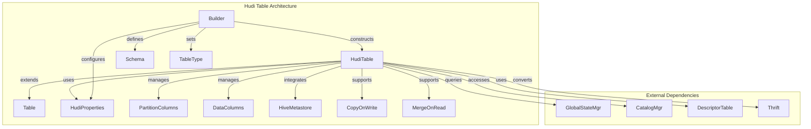
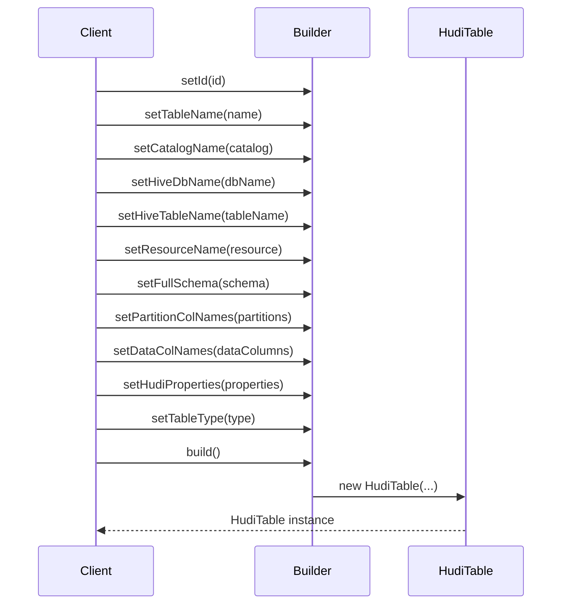
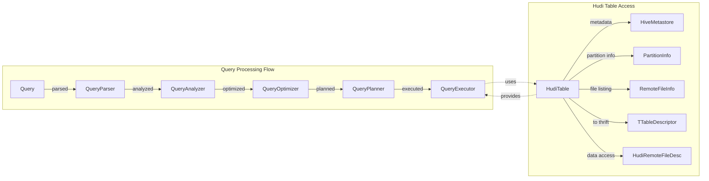
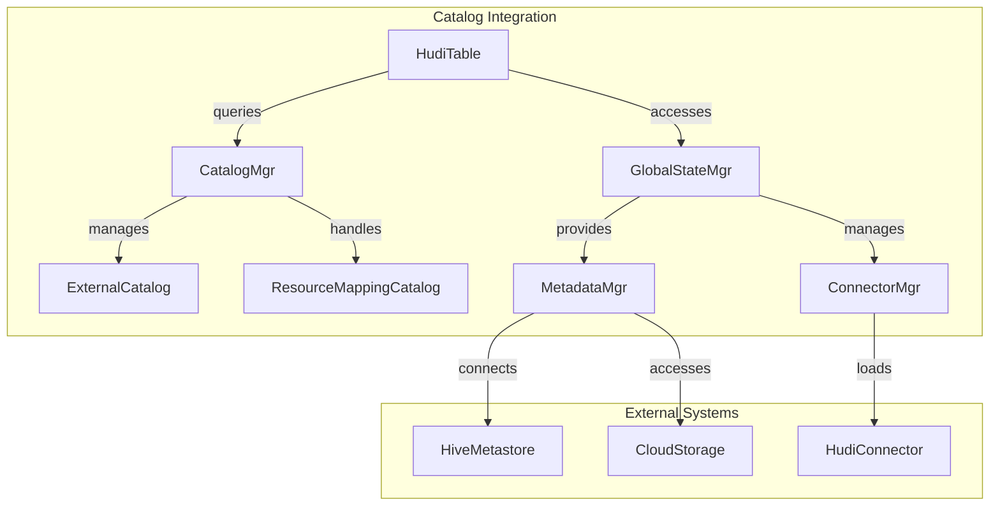

# Hudi Table Module Documentation

## Introduction

The Hudi Table module provides comprehensive support for Apache Hudi tables within the StarRocks system. It enables StarRocks to query and manage Hudi datasets, supporting both Copy-on-Write (COW) and Merge-on-Read (MOR) table types. The module integrates with Hive Metastore for metadata management and provides efficient data access patterns for analytical workloads.

## Architecture Overview

The Hudi Table module is built around the `HudiTable` class, which extends the base `Table` class and provides specialized functionality for Hudi datasets. The architecture follows a builder pattern for flexible table construction and integrates with multiple StarRocks subsystems.



## Core Components

### HudiTable Class

The `HudiTable` class is the central component that represents a Hudi table in StarRocks. It encapsulates all Hudi-specific properties and behaviors:

- **Table Type Support**: Handles both COW and MOR table types
- **Schema Management**: Manages partition and data columns separately
- **Property Management**: Stores Hudi-specific configuration properties
- **Metadata Integration**: Works with Hive Metastore for table metadata
- **Thrift Serialization**: Converts table information for distributed execution

### Builder Pattern

The `HudiTable.Builder` class provides a fluent interface for constructing HudiTable instances:



## Data Flow Architecture



## Key Features

### Table Type Detection

The module automatically detects Hudi table types based on input format:

- **COW Tables**: `HoodieParquetInputFormat` or legacy `HoodieInputFormat`
- **MOR Tables**: `HoodieParquetRealtimeInputFormat` or legacy `HoodieRealtimeInputFormat`

### Partition Management

Hudi tables support partitioning with:
- Dynamic partition column detection
- Partition key expression handling
- Partition location management
- Partition statistics integration

### Schema Handling

The module maintains separate tracking of:
- **Partition Columns**: Used for partitioning data
- **Data Columns**: Non-partition columns containing actual data
- **Full Schema**: Complete table schema for query planning

### Time Travel Support

For MOR tables, the module supports time travel queries by:
- Tracking the latest Hudi instant
- Managing instant timestamps
- Providing consistent snapshot views

## Integration Points

### Catalog Integration



### Query Engine Integration

The HudiTable integrates with the query engine through:
- **Thrift Serialization**: Converts table metadata for distributed execution
- **Partition Pruning**: Optimizes queries by eliminating unnecessary partitions
- **Predicate Pushdown**: Pushes filters to the storage layer
- **Column Projection**: Only reads required columns

## Configuration Properties

### Core Hudi Properties

| Property | Description | Values |
|----------|-------------|---------|
| `hudi.table.type` | Table type (COW/MOR) | COW, MOR |
| `hudi.table.base.path` | Base path of the table | HDFS/S3 path |
| `hudi.table.input.format` | Input format class | Java class name |
| `hudi.table.serde.lib` | Serialization library | Java class name |
| `hudi.table.column.names` | Column names | Comma-separated list |
| `hudi.table.column.types` | Column types | Comma-separated list |

### Input Format Constants

- **COW Input Format**: `org.apache.hudi.hadoop.HoodieParquetInputFormat`
- **MOR Read-Optimized**: `org.apache.hudi.hadoop.HoodieParquetInputFormat`
- **MOR Real-time**: `org.apache.hudi.hadoop.realtime.HoodieParquetRealtimeInputFormat`

## Error Handling

The module implements comprehensive error handling for:
- **Metadata Access**: Handles Hive Metastore connection issues
- **File Access**: Manages cloud storage access problems
- **Schema Mismatches**: Validates schema compatibility
- **Partition Issues**: Handles missing or invalid partitions

## Performance Optimizations

### Metadata Caching
- Caches table metadata to reduce Hive Metastore calls
- Maintains partition information in memory
- Reuses file listings across queries

### Predicate Pushdown
- Pushes filters to the storage layer
- Reduces data transfer
- Improves query performance

### Partition Pruning
- Eliminates unnecessary partition scans
- Uses partition statistics for optimization
- Supports dynamic partition pruning

## Dependencies

The Hudi Table module depends on several other StarRocks modules:

- **[Catalog Management](catalog_management.md)**: For table registration and metadata
- **[Connector Framework](connector_framework.md)**: For external system integration
- **[Query Engine](query_engine.md)**: For query processing and optimization
- **[Storage Engine](storage_engine.md)**: For data access and management

## Usage Examples

### Table Creation

```java
HudiTable table = HudiTable.builder()
    .setId(12345)
    .setTableName("hudi_orders")
    .setCatalogName("hudi_catalog")
    .setHiveDbName("default")
    .setHiveTableName("orders")
    .setResourceName("hudi_resource")
    .setFullSchema(schema)
    .setPartitionColNames(Arrays.asList("dt", "country"))
    .setDataColNames(Arrays.asList("order_id", "customer_id", "amount"))
    .setHudiProperties(hudiProps)
    .setTableType(HudiTableType.COW)
    .build();
```

### Query Processing

The HudiTable participates in query processing by:
1. Providing schema information to the query planner
2. Supplying partition information for partition pruning
3. Converting to Thrift format for distributed execution
4. Managing file access through RemoteFileInfo

## Future Enhancements

Potential improvements to the Hudi Table module include:
- **Incremental Query Support**: Better support for incremental data processing
- **Schema Evolution**: Enhanced handling of schema changes
- **Performance Metrics**: Detailed performance monitoring and statistics
- **Advanced Indexing**: Integration with Hudi's indexing capabilities
- **Multi-Version Support**: Enhanced time travel and versioning features