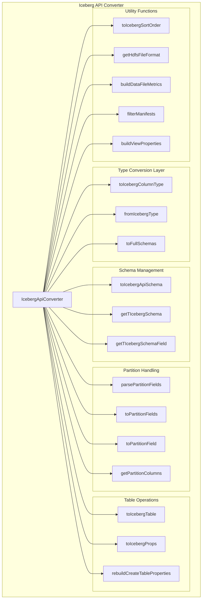
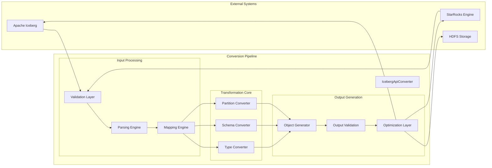
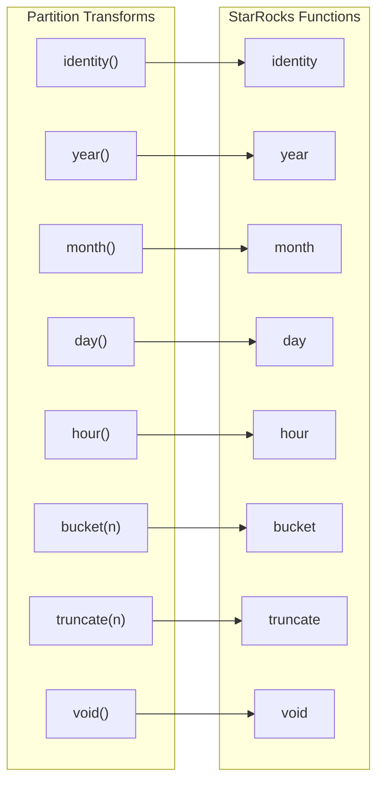
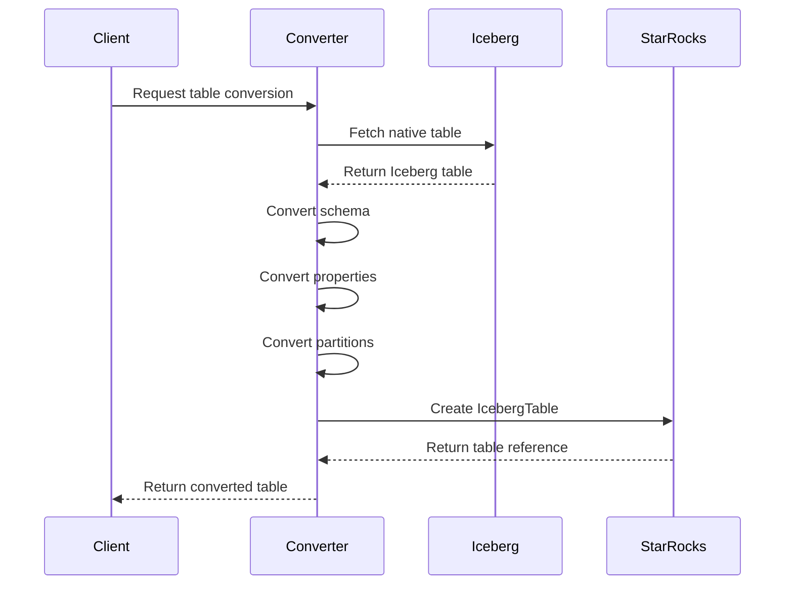

# Iceberg API Converter Module

## Overview

The Iceberg API Converter module serves as a critical bridge between StarRocks and Apache Iceberg table formats, providing comprehensive type conversion, schema mapping, and metadata transformation capabilities. This module enables StarRocks to seamlessly integrate with Iceberg tables by converting between StarRocks native representations and Iceberg API objects.

## Purpose and Core Functionality

The primary purpose of this module is to facilitate bidirectional communication between StarRocks and Iceberg ecosystems. It handles the complex task of translating data types, schemas, partition specifications, and table metadata between the two systems while maintaining data integrity and semantic consistency.

### Key Responsibilities

- **Type System Mapping**: Converts between StarRocks and Iceberg data types
- **Schema Transformation**: Transforms table schemas between native representations
- **Partition Specification**: Handles partition field mapping and transformation
- **Metadata Conversion**: Converts table properties and metadata formats
- **View Management**: Supports Iceberg view creation and management
- **File Format Handling**: Manages file format compatibility and compression settings

## Architecture

### Component Structure

### Data Flow Architecture

## Core Components

### IcebergApiConverter Class

The central class that provides static methods for all conversion operations between StarRocks and Iceberg representations.

#### Key Methods

**Table Conversion**
- `toIcebergTable()`: Converts native Iceberg table to StarRocks IcebergTable representation
- `toIcebergApiSchema()`: Converts StarRocks columns to Iceberg schema format
- `toFullSchemas()`: Extracts complete schema information from Iceberg schema

**Type System Conversion**
- `toIcebergColumnType()`: Maps StarRocks types to Iceberg column types
- `fromIcebergType()`: Converts Iceberg types back to StarRocks types (referenced from ColumnTypeConverter)

**Partition Management**
- `parsePartitionFields()`: Parses partition specifications with transform support
- `toPartitionFields()`: Converts partition spec to field list
- `getPartitionColumns()`: Extracts partition column information

**Metadata Handling**
- `toIcebergProps()`: Transforms table properties
- `buildDataFileMetrics()`: Constructs metrics from data file information
- `rebuildCreateTableProperties()`: Rebuilds properties for table creation

## Type System Mapping

### Scalar Type Conversions

```mermaid
graph TD
    subgraph "StarRocks Types"
        SR_BOOL["BOOLEAN"]
        SR_TINY["TINYINT"]
        SR_SMALL["SMALLINT"]
        SR_INT["INT"]
        SR_BIG["BIGINT"]
        SR_FLOAT["FLOAT"]
        SR_DOUBLE["DOUBLE"]
        SR_DATE["DATE"]
        SR_DATETIME["DATETIME"]
        SR_VARCHAR["VARCHAR"]
        SR_CHAR["CHAR"]
        SR_VARBINARY["VARBINARY"]
        SR_DECIMAL["DECIMAL"]
        SR_TIME["TIME"]
    end
    
    subgraph "Iceberg Types"
        ICE_BOOL["BooleanType"]
        ICE_INT["IntegerType"]
        ICE_LONG["LongType"]
        ICE_FLOAT["FloatType"]
        ICE_DOUBLE["DoubleType"]
        ICE_DATE["DateType"]
        ICE_TS["TimestampType"]
        ICE_STRING["StringType"]
        ICE_BINARY["BinaryType"]
        ICE_DECIMAL["DecimalType"]
        ICE_TIME["TimeType"]
    end
    
    SR_BOOL --> ICE_BOOL
    SR_TINY --> ICE_INT
    SR_SMALL --> ICE_INT
    SR_INT --> ICE_INT
    SR_BIG --> ICE_LONG
    SR_FLOAT --> ICE_FLOAT
    SR_DOUBLE --> ICE_DOUBLE
    SR_DATE --> ICE_DATE
    SR_DATETIME --> ICE_TS
    SR_VARCHAR --> ICE_STRING
    SR_CHAR --> ICE_STRING
    SR_VARBINARY --> ICE_BINARY
    SR_DECIMAL --> ICE_DECIMAL
    SR_TIME --> ICE_TIME
```

### Complex Type Handling

The converter supports complex types including:
- **Arrays**: `ArrayType` ↔ `ListType`
- **Maps**: `MapType` ↔ `MapType` 
- **Structs**: `StructType` ↔ `StructType`

Each complex type undergoes recursive conversion of its component types.

## Partition Transformation Support

### Supported Partition Transforms

## Integration Points

### Connector Framework Integration

The module integrates with the broader connector framework through:
- [Connector Type Converter](connector_framework.md#column-type-converter)
- [Iceberg Metadata Management](iceberg_connector.md#iceberg-metadata)
- [Partition Trait System](partition_traits.md#iceberg-partition-traits)

### Storage Engine Integration

References storage engine components for:
- File format handling ([Storage Engine - Rowset Management](storage_engine.md#rowset-management))
- Compression codec support ([Storage Engine - Data Structures](storage_engine.md#data-structures))
- Metadata persistence ([Storage Engine - Schema and Types](storage_engine.md#schema-and-types))

## Error Handling and Validation

### Exception Management

The converter implements comprehensive error handling through:
- `StarRocksConnectorException`: For connector-specific errors
- `SemanticException`: For schema and semantic validation errors
- `IllegalArgumentException`: For invalid parameter validation

### Validation Layers

1. **Input Validation**: Validates incoming data structures
2. **Type Compatibility**: Ensures type mapping validity
3. **Schema Consistency**: Verifies schema integrity
4. **Output Validation**: Confirms conversion accuracy

## Performance Considerations

### Optimization Strategies

- **Caching**: Utilizes concurrent hash maps for spec caching
- **Lazy Evaluation**: Defers expensive operations until needed
- **Batch Processing**: Handles multiple conversions efficiently
- **Memory Management**: Optimizes buffer operations with in-place reversal

### Concurrent Access

The module is designed for thread-safe operations using:
- Atomic references for shared state
- Concurrent data structures for caching
- Immutable collections where appropriate

## Usage Patterns

### Typical Conversion Flow

### Schema Evolution Support

The converter handles schema evolution by:
1. Detecting schema changes
2. Mapping new types appropriately
3. Maintaining backward compatibility
4. Preserving partition specifications

## Dependencies

### Internal Dependencies

- [Column Type Converter](connector_framework.md): For bidirectional type mapping
- [Iceberg Metadata](iceberg_connector.md): For metadata operations
- [Connector Utilities](connector_framework.md): For common connector functions

### External Dependencies

- Apache Iceberg API: Core table format operations
- Google Guava: Collection utilities and caching
- Apache Commons: String and validation utilities

## Configuration

### Key Properties

- `ICEBERG_CATALOG_TYPE`: Specifies the catalog implementation type
- `FILE_FORMAT`: Controls the default file format (PARQUET, ORC, AVRO)
- `COMPRESSION_CODEC`: Defines compression settings
- `FORMAT_VERSION`: Specifies Iceberg format version

### Environment Variables

The converter respects system properties for:
- Debug logging levels
- Performance tuning parameters
- Compatibility mode settings

## Monitoring and Observability

### Metrics Collection

The module provides metrics for:
- Conversion operation counts
- Type mapping statistics
- Error rates and types
- Performance timing data

### Logging Integration

Comprehensive logging through Log4j includes:
- Debug information for conversion operations
- Warning messages for compatibility issues
- Error details for failed conversions
- Performance metrics for optimization

## Future Enhancements

### Planned Improvements

- Enhanced support for Iceberg V2 format features
- Improved performance through vectorized operations
- Extended partition transform support
- Better schema evolution handling
- Advanced caching strategies

### Compatibility Roadmap

The module maintains compatibility with:
- Multiple Iceberg versions
- Various catalog implementations
- Different file format combinations
- Evolving partition specifications

This comprehensive approach ensures robust integration between StarRocks and Apache Iceberg while maintaining performance, reliability, and extensibility for future enhancements.