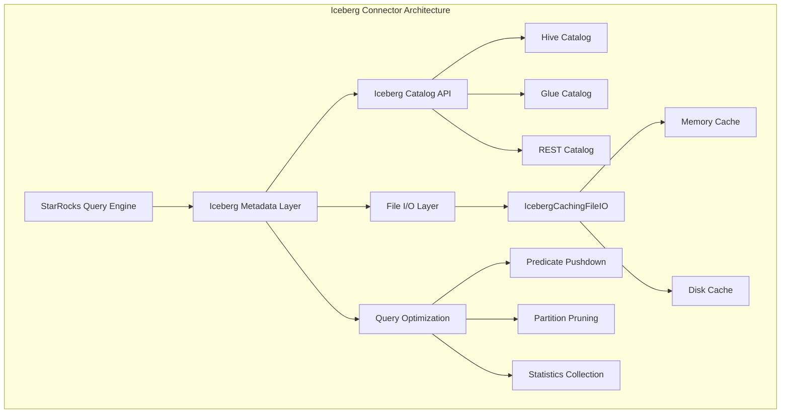

# Iceberg Connector Module Documentation

## Overview

The Iceberg Connector module provides comprehensive integration with Apache Iceberg table format, enabling StarRocks to query and manage Iceberg tables efficiently. This module serves as a bridge between StarRocks' query engine and Iceberg's table format, supporting various catalog types including Hive, Glue, and REST catalogs.

## Architecture



## Core Functionality

### 1. Metadata Management
The connector provides comprehensive metadata management capabilities:
- **Table Discovery**: Automatic discovery of Iceberg tables across different catalog types
- **Schema Evolution**: Support for Iceberg's schema evolution features
- **Partition Management**: Advanced partition handling with transform support
- **Snapshot Management**: Version control and time-travel queries

### 2. Query Optimization
- **Predicate Pushdown**: Converts StarRocks predicates to Iceberg expressions
- **Partition Pruning**: Intelligent partition elimination based on query predicates
- **Statistics Collection**: Column-level statistics for query optimization
- **Min/Max Optimization**: Leveraging Iceberg's column statistics

### 3. File I/O Optimization
- **Caching Layer**: Two-level caching system (memory + disk) for metadata
- **Async Operations**: Non-blocking file operations for better performance
- **Cloud Storage**: Support for various cloud storage systems

## Sub-modules

### [API Conversion Layer](iceberg_api_converter.md)
Handles conversion between StarRocks and Iceberg data types, schemas, and expressions. This module provides the foundational translation layer that enables seamless interoperability between StarRocks' type system and Iceberg's data model.

### [Metadata Management](iceberg_metadata.md)
Manages table metadata, snapshots, and catalog operations. The metadata management system handles the complete lifecycle of Iceberg tables, from creation and schema evolution to snapshot management and table optimization.

### [Partition Utilities](iceberg_partition_utils.md)
Provides partition transformation and predicate generation capabilities. This module implements sophisticated partition handling including time-based transforms (year, month, day, hour), bucketing, and truncation operations.

### [File I/O System](iceberg_io_system.md)
Implements caching and optimization for file operations. The I/O system features a two-level caching architecture with both memory and disk caches to optimize metadata access patterns and reduce catalog API overhead.

### [Query Expression Translation](iceberg_expression_translation.md)
Converts StarRocks scalar operators to Iceberg expressions. This module enables predicate pushdown by translating StarRocks query predicates into Iceberg's native expression format for efficient data pruning.

### [Security and Authentication](iceberg_security.md)
Handles OAuth2 authentication for REST catalog connections. The security module provides comprehensive authentication support including token management, credential handling, and secure communication with REST-based Iceberg catalogs.

## Key Features

### Catalog Support
- **Hive Catalog**: Integration with Hive Metastore
- **AWS Glue Catalog**: Native AWS Glue support
- **REST Catalog**: Generic REST-based catalog support

### Data Format Support
- **Parquet**: Primary columnar format
- **ORC**: Optimized row columnar format
- **Avro**: Schema evolution support

### Partition Transforms
- **Identity**: Direct column partitioning
- **Time-based**: Year, month, day, hour transforms
- **Bucketing**: Hash-based partitioning
- **Truncation**: Prefix-based partitioning

### Performance Optimizations
- **Metadata Caching**: Reduces catalog API calls
- **Predicate Pushdown**: Minimizes data scanning
- **Parallel Processing**: Multi-threaded file scanning
- **Incremental Scans**: Efficient change data capture

## Integration Points

### With Storage Engine
The connector integrates with StarRocks' storage engine through:
- [Storage Engine Module](../storage_engine.md) - Provides underlying storage abstractions
- [Lake Storage Sub-module](../storage_engine.md#lake_storage) - Handles lakehouse storage patterns

### With Query Execution
Integration with query execution through:
- [Query Execution Module](../query_execution.md) - Query planning and execution
- [Connector Scan Node](../query_execution.md#connector_scan_node) - Specialized scanning logic

### With Catalog System
Part of the broader connector ecosystem:
- [Connectors Module](../connectors.md) - Unified connector framework
- [Connector Catalog](../connectors.md#connector_catalog) - Catalog management

## Configuration

### Catalog Properties
```properties
# Basic configuration
iceberg.catalog.type=hive|glue|rest
iceberg.catalog.uri=<catalog-uri>
iceberg.catalog.warehouse=<warehouse-path>

# Authentication
iceberg.catalog.credential=<credential>
iceberg.catalog.oauth2.token=<token>

# Performance tuning
iceberg.metadata.cache.enabled=true
iceberg.metadata.cache.size=1GB
iceberg.metadata.cache.expiration=3600
```

### Session Variables
```sql
-- Enable column statistics
SET enable_iceberg_column_statistics = true;

-- Control planning parallelism
SET iceberg_job_planning_thread_num = 8;

-- Enable distributed planning
SET enable_distributed_iceberg_planning = true;
```

## Usage Examples

### Creating Iceberg Catalog
```sql
CREATE EXTERNAL CATALOG iceberg_catalog
PROPERTIES (
    "type" = "iceberg",
    "iceberg.catalog.type" = "hive",
    "iceberg.catalog.uri" = "thrift://hive-metastore:9083",
    "iceberg.catalog.warehouse" = "s3://bucket/warehouse"
);
```

### Querying Iceberg Tables
```sql
-- Time-travel query
SELECT * FROM iceberg_catalog.db.table FOR VERSION AS OF 1234567890;

-- Temporal query
SELECT * FROM iceberg_catalog.db.table FOR TIMESTAMP AS OF '2023-01-01 00:00:00';
```

### Partition Pruning
```sql
-- Automatic partition pruning
SELECT * FROM iceberg_catalog.db.table 
WHERE dt >= '2023-01-01' AND dt < '2023-02-01';
```

## Performance Considerations

### Metadata Caching
- Enable metadata caching for frequently accessed tables
- Configure appropriate cache sizes based on cluster resources
- Monitor cache hit rates for optimization

### Predicate Pushdown
- Design queries to leverage partition transforms
- Use appropriate data types for partition columns
- Consider partition evolution impact on query performance

### Statistics Collection
- Enable column statistics for better query planning
- Regularly update statistics for optimal performance
- Consider statistics collection overhead vs. query benefit

## Monitoring and Troubleshooting

### Key Metrics
- **Cache Hit Rate**: Metadata and data cache effectiveness
- **Scan Efficiency**: Amount of data pruned vs. scanned
- **Catalog API Calls**: Frequency of metadata operations
- **Query Latency**: End-to-end query performance

### Common Issues
- **Catalog Connection**: Verify catalog configuration and network connectivity
- **Permission Issues**: Check catalog and storage access permissions
- **Schema Mismatch**: Ensure compatibility between StarRocks and Iceberg schemas
- **Performance Degradation**: Monitor cache effectiveness and statistics freshness

## Future Enhancements

### Planned Features
- **Write Support**: Full DML operations on Iceberg tables
- **Materialized Views**: Integration with StarRocks MV framework
- **Advanced Caching**: Intelligent cache preloading and eviction
- **Multi-Catalog**: Cross-catalog query support

### Optimization Opportunities
- **Vectorized Reading**: Enhanced columnar data processing
- **Adaptive Scanning**: Dynamic scan strategy based on data characteristics
- **Predictive Caching**: ML-based cache prediction models
- **Distributed Planning**: Enhanced distributed query planning

## References

- [Apache Iceberg Documentation](https://iceberg.apache.org/docs/)
- [StarRocks Connector Framework](../connectors.md)
- [Storage Engine Integration](../storage_engine.md)
- [Query Execution Pipeline](../query_execution.md)