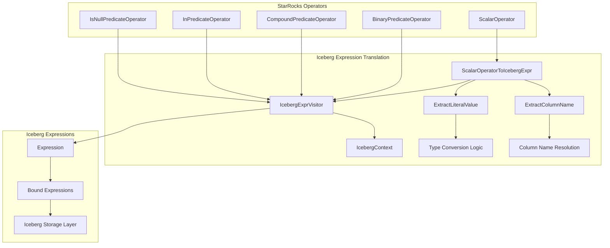
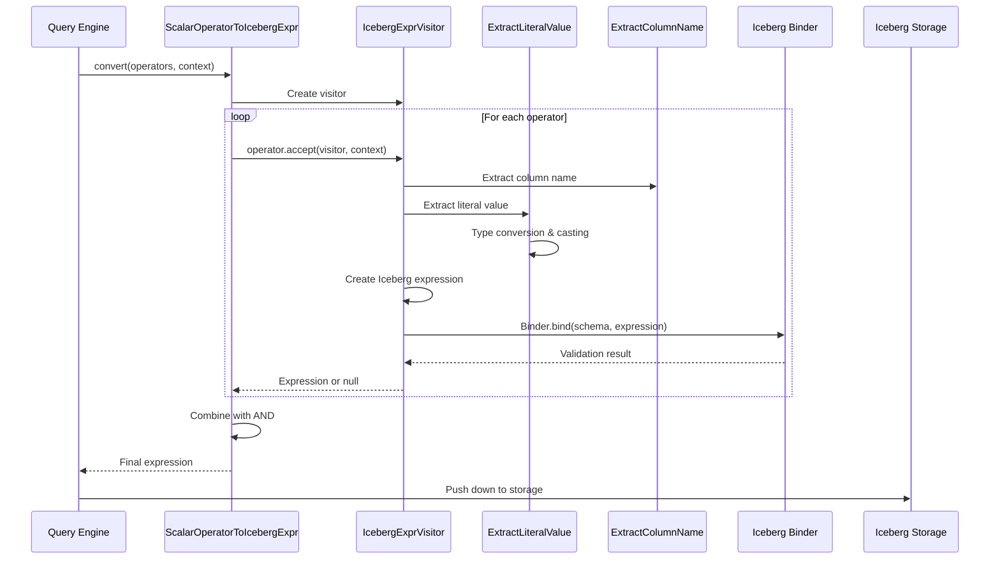
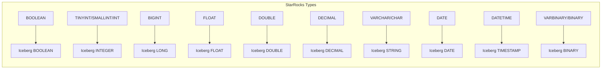
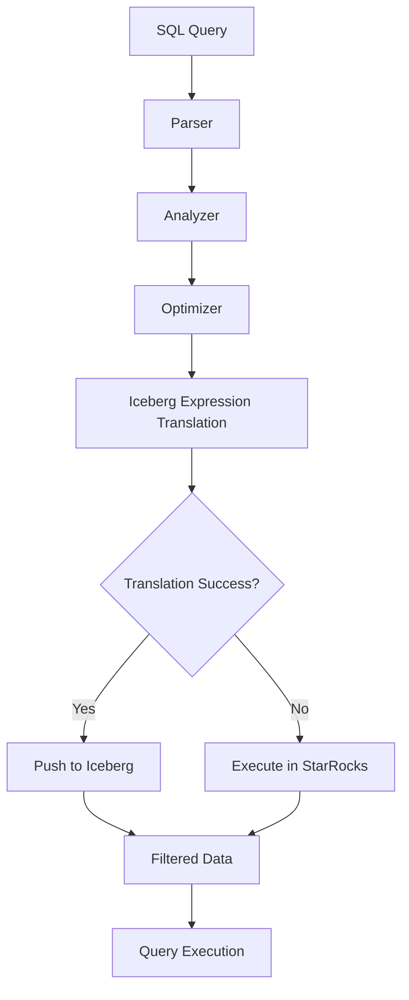

# Iceberg Expression Translation Module

## Overview

The Iceberg Expression Translation module provides the critical functionality for converting StarRocks SQL expressions into Apache Iceberg-compatible expressions. This module serves as a bridge between StarRocks' query optimization engine and Iceberg's predicate pushdown capabilities, enabling efficient query execution by pushing filters directly to Iceberg table formats.

## Purpose and Core Functionality

The primary purpose of this module is to enable **predicate pushdown optimization** for Iceberg tables. By translating StarRocks scalar operators into Iceberg expressions, the system can:

- **Reduce data transfer**: Filter data at the storage level before it reaches the query engine
- **Improve query performance**: Leverage Iceberg's built-in indexing and partitioning
- **Enable partition pruning**: Eliminate unnecessary partition scans
- **Support complex predicates**: Handle compound expressions, nested fields, and type conversions

## Architecture

### Core Components



### Expression Translation Flow



## Supported Expression Types

### Predicate Expressions

The module supports translation of the following StarRocks predicate types to Iceberg expressions:

| StarRocks Operator | Iceberg Expression | Description |
|-------------------|-------------------|-------------|
| `IsNullPredicateOperator` | `isNull()` / `notNull()` | NULL value checks |
| `BinaryPredicateOperator.EQ` | `equal()` | Equality comparison |
| `BinaryPredicateOperator.NE` | `notEqual()` | Not equal comparison |
| `BinaryPredicateOperator.LT` | `lessThan()` | Less than comparison |
| `BinaryPredicateOperator.LE` | `lessThanOrEqual()` | Less than or equal |
| `BinaryPredicateOperator.GT` | `greaterThan()` | Greater than comparison |
| `BinaryPredicateOperator.GE` | `greaterThanOrEqual()` | Greater than or equal |
| `InPredicateOperator` | `in()` / `notIn()` | Set membership |
| `LikePredicateOperator` | `startsWith()` | Prefix matching (limited LIKE support) |

### Compound Expressions

| StarRocks Operator | Iceberg Expression | Description |
|-------------------|-------------------|-------------|
| `CompoundPredicateOperator.AND` | `and()` | Logical AND |
| `CompoundPredicateOperator.OR` | `or()` | Logical OR |
| `CompoundPredicateOperator.NOT` | `not()` | Logical NOT |

## Type System Integration

### Type Mapping and Conversion



### Type Conversion Logic

The `ExtractLiteralValue` class handles complex type conversions:

- **Decimal scaling**: Preserves precision and scale for decimal types
- **Timestamp zone handling**: Converts between different timezone representations
- **String/numeric separation**: Prevents invalid comparisons between strings and numbers
- **Cast validation**: Ensures type compatibility before conversion

## Key Implementation Details

### Column Name Resolution

The `ExtractColumnName` visitor supports:
- **Simple column references**: Direct column names
- **Nested field access**: Dot-separated paths (e.g., `user.address.city`)
- **Cast operations**: Extracts underlying column names from cast expressions
- **Subfield operations**: Complex nested structure navigation

### Literal Value Extraction

The `ExtractLiteralValue` visitor provides:
- **Type-aware conversion**: Converts StarRocks constants to Iceberg-compatible values
- **Timezone handling**: Proper timestamp conversion with zone awareness
- **Decimal precision**: Maintains decimal scale and precision
- **Null safety**: Handles null values appropriately

### Schema Binding and Validation

The module includes comprehensive validation:
- **Schema compatibility**: Ensures expressions match table schema
- **Type validation**: Verifies type compatibility for operations
- **Error handling**: Graceful degradation when expressions cannot be pushed down
- **Logging**: Detailed logging for debugging pushdown failures

## Integration with Query Engine

### Predicate Pushdown Flow



### Performance Benefits

- **Reduced I/O**: Filters applied at storage level
- **Partition pruning**: Eliminates unnecessary partition scans
- **Index utilization**: Leverages Iceberg's built-in indexes
- **Network efficiency**: Less data transferred to query engine

## Error Handling and Fallback

### Translation Failures

When expression translation fails, the system:
1. **Logs the failure**: Detailed error messages for debugging
2. **Returns null**: Indicates expression cannot be pushed down
3. **Falls back gracefully**: Executes filtering in StarRocks engine
4. **Maintains correctness**: Ensures query results remain accurate

### Common Failure Scenarios

- **Unsupported functions**: Complex expressions not supported by Iceberg
- **Type mismatches**: Incompatible type combinations
- **Schema changes**: Column name or type mismatches
- **Nested complexity**: Overly complex nested expressions

## Dependencies

### Internal Dependencies

- **[sql_parser_optimizer](../sql_parser_optimizer.md)**: Provides scalar operators and expression trees
- **[connectors](../connectors.md)**: Iceberg connector integration and metadata access
- **[frontend_server](../frontend_server.md)**: Query planning and optimization framework

### External Dependencies

- **Apache Iceberg**: Expression API and runtime library
- **Google Guava**: Utility libraries for collections and caching

## Usage Examples

### Simple Predicate Translation

```java
// StarRocks: col1 = 100
BinaryPredicateOperator eqOp = new BinaryPredicateOperator(
    BinaryPredicateOperator.BinaryType.EQ,
    new ColumnRefOperator("col1", Type.INT),
    new ConstantOperator(100, Type.INT)
);

// Translation result: equal("col1", 100)
Expression icebergExpr = converter.convert(Lists.newArrayList(eqOp), context);
```

### Complex Compound Predicate

```java
// StarRocks: (col1 > 10 AND col2 <= 20) OR col3 IS NULL
CompoundPredicateOperator complexOp = new CompoundPredicateOperator(
    CompoundPredicateOperator.CompoundType.OR,
    new CompoundPredicateOperator(
        CompoundPredicateOperator.CompoundType.AND,
        new BinaryPredicateOperator(BinaryPredicateOperator.BinaryType.GT, col1Ref, const10),
        new BinaryPredicateOperator(BinaryPredicateOperator.BinaryType.LE, col2Ref, const20)
    ),
    new IsNullPredicateOperator(false, col3Ref)
);

// Translation result: or(and(greaterThan("col1", 10), lessThanOrEqual("col2", 20)), isNull("col3"))
```

## Testing and Validation

### Unit Testing Strategy

- **Expression coverage**: Test all supported operator types
- **Type combinations**: Validate type conversion accuracy
- **Edge cases**: Handle null values, empty collections, type boundaries
- **Error scenarios**: Verify graceful failure handling

### Integration Testing

- **End-to-end queries**: Validate complete query execution
- **Performance benchmarks**: Measure pushdown effectiveness
- **Compatibility testing**: Ensure version compatibility with Iceberg

## Future Enhancements

### Planned Improvements

- **Extended function support**: More complex expression translation
- **Performance optimization**: Faster translation algorithms
- **Enhanced debugging**: Better visibility into translation decisions
- **Version compatibility**: Support for multiple Iceberg versions

### Potential Extensions

- **Custom expressions**: Support for user-defined functions
- **Advanced predicates**: Range predicates and complex comparisons
- **Metadata integration**: Better schema awareness and optimization

## Conclusion

The Iceberg Expression Translation module is a critical component that enables StarRocks to leverage Iceberg's advanced filtering capabilities. By providing seamless translation between StarRocks expressions and Iceberg predicates, it significantly improves query performance while maintaining full compatibility with the StarRocks query ecosystem. The module's robust error handling and fallback mechanisms ensure reliable operation even when translation is not possible, making it a production-ready solution for enterprise data lakehouse architectures.