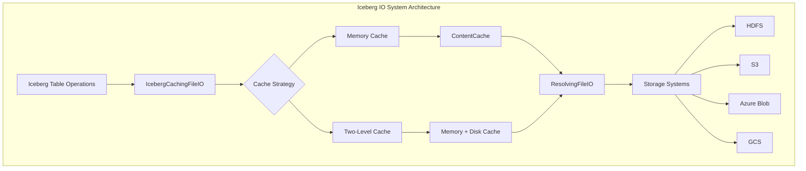
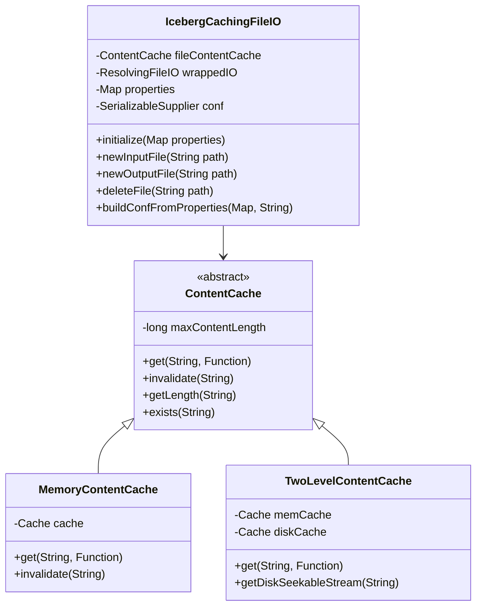
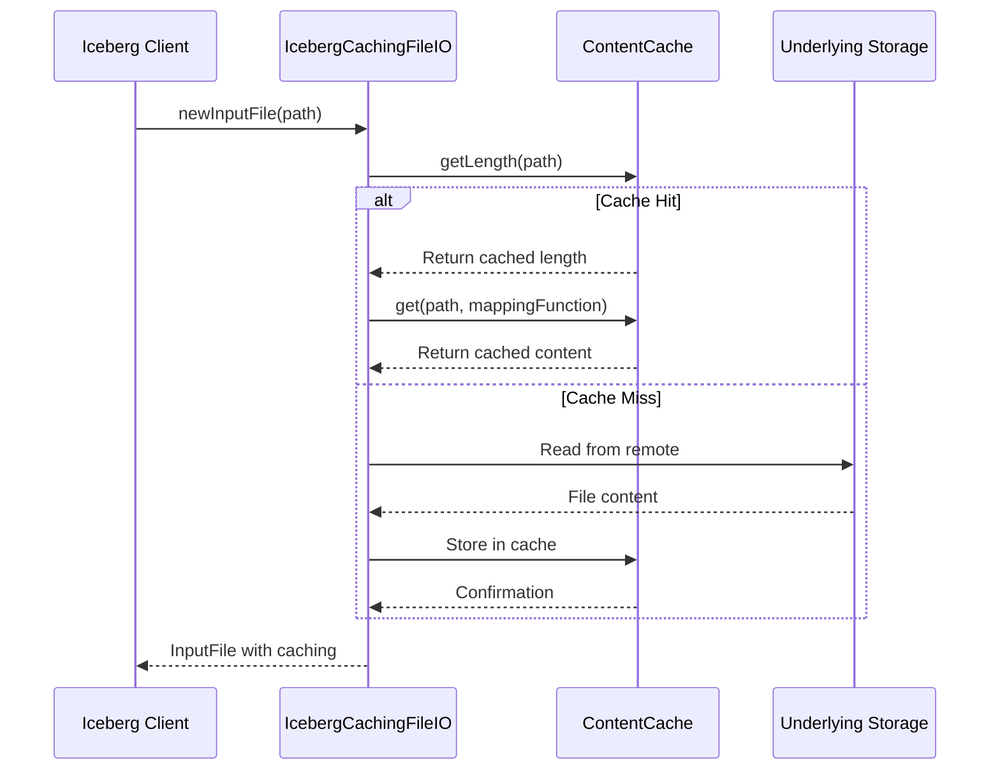
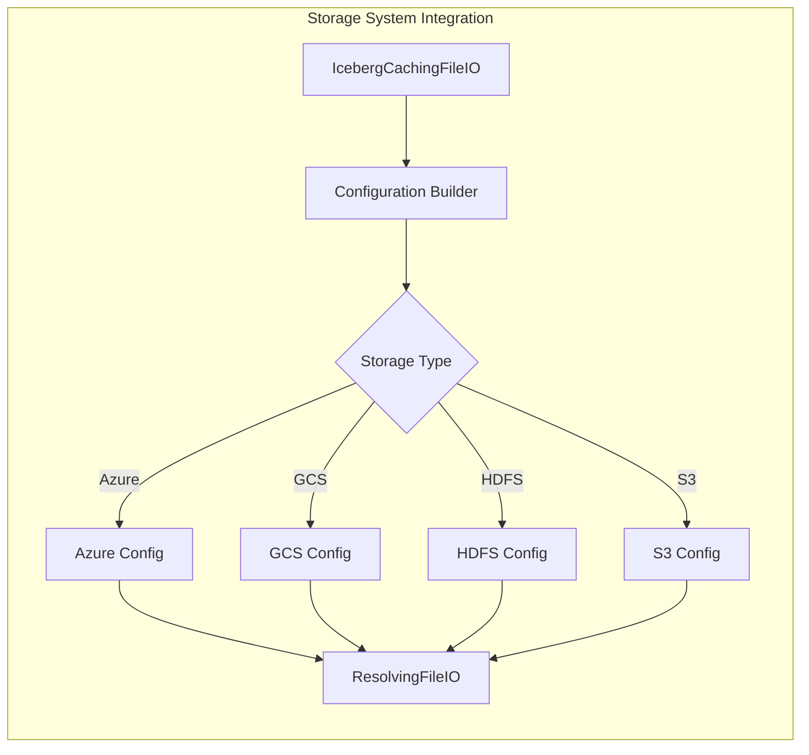

# Iceberg IO System Module Documentation

## Introduction

The Iceberg IO System module provides a sophisticated caching layer for Iceberg table metadata operations in StarRocks. It implements a high-performance file I/O abstraction that optimizes metadata access patterns through intelligent caching strategies, supporting both memory and disk-based caching mechanisms. This module is crucial for efficient query performance when working with Iceberg tables by reducing redundant metadata reads from remote storage systems.

## Architecture Overview

The Iceberg IO System implements a multi-tier caching architecture that sits between the Iceberg table format and the underlying storage systems. It provides transparent caching capabilities while maintaining compatibility with the Iceberg FileIO interface.



## Core Components

### IcebergCachingFileIO

The primary component that implements the `FileIO` interface from Iceberg while adding caching capabilities. It wraps the standard `ResolvingFileIO` and intercepts file operations to provide intelligent caching.

**Key Responsibilities:**
- Initialize and manage caching strategies
- Handle configuration for different storage systems
- Provide transparent caching for metadata files
- Support both memory-only and two-level caching modes



### ContentCache Abstraction

An abstract base class that defines the caching interface with support for both memory-only and two-level caching implementations.

**Key Features:**
- Configurable maximum content length for cacheable files
- File existence checking
- Cache invalidation capabilities
- Length retrieval for cached content

### MemoryContentCache

Implements a pure memory-based caching strategy using Caffeine cache library.

**Configuration Parameters:**
- `MEMORY_CACHE_CAPACITY`: Maximum memory cache size
- `MEMORY_CACHE_EXPIRATION_SECONDS`: Cache entry expiration time
- `CACHE_MAX_ENTRY_SIZE`: Maximum size for individual cache entries

### TwoLevelContentCache

Implements a sophisticated two-level caching strategy that combines memory and disk caching for optimal performance and resource utilization.

**Key Features:**
- Automatic promotion/demotion between memory and disk
- Persistent disk cache across restarts
- Pin/unpin mechanism for disk cache entries
- Background loading of existing disk cache on startup

## Data Flow



## Configuration and Storage Integration

The module provides sophisticated configuration handling for different storage systems:

### Azure Storage Support
- ADLS SAS token handling
- Azure Blob SAS token management
- Automatic configuration detection from properties

### Google Cloud Storage Support
- GCS access token management
- Token expiration handling
- Custom access token provider integration

### Multi-Storage Architecture



## Caching Strategies

### Memory-Only Strategy
- Suitable for smaller metadata files
- Fast access with no disk I/O
- Configurable memory limits and expiration

### Two-Level Strategy
- Optimal for large metadata files
- Automatic memory pressure management
- Persistent disk cache for metadata
- Background cache warming on startup

## Performance Optimizations

### Metadata File Filtering
The system intelligently filters out certain metadata files from caching:
- Hadoop catalog metadata JSON files (version-specific naming)
- Files exceeding maximum cache entry size
- Non-metadata files that don't benefit from caching

### Chunk-Based Reading
Implements 4MB chunk-based reading for efficient memory usage:
- Reduces memory pressure for large files
- Enables streaming processing
- Optimizes network utilization

### Concurrent Access Management
- Thread-safe cache operations
- Proper resource cleanup
- Exception handling with fallback mechanisms

## Error Handling and Resilience

The module implements comprehensive error handling:
- Graceful fallback to non-cached operations
- Proper resource cleanup on failures
- Detailed logging for debugging
- Exception translation to StarRocks connector exceptions

## Integration with StarRocks Ecosystem

The Iceberg IO System integrates seamlessly with other StarRocks components:

### Configuration Management
- Uses StarRocks configuration system for cache settings
- Integrates with credential providers for cloud storage
- Supports dynamic configuration updates

### Monitoring and Observability
- Cache statistics collection
- Performance metrics integration
- Debug logging capabilities

## Dependencies

This module depends on several key components:

- **Iceberg Core**: For FileIO interface and related classes
- **Hadoop FileSystem**: For underlying storage operations
- **Caffeine Cache**: For high-performance caching
- **StarRocks Configuration**: For cache configuration management
- **Cloud Credential Providers**: For storage authentication

## Usage Patterns

### Basic Usage
```java
// Initialize with properties
IcebergCachingFileIO fileIO = new IcebergCachingFileIO();
fileIO.initialize(properties);

// Use like regular FileIO
InputFile inputFile = fileIO.newInputFile(path);
```

### Configuration Example
```properties
# Memory cache settings
iceberg.metadata.memory.cache.capacity=1073741824
iceberg.metadata.memory.cache.expiration.seconds=3600

# Disk cache settings
iceberg.metadata.disk.cache.enabled=true
iceberg.metadata.disk.cache.path=/tmp/iceberg-cache
iceberg.metadata.disk.cache.capacity=10737418240
```

## Future Enhancements

Potential areas for improvement:
- Distributed cache coordination
- Adaptive cache sizing based on workload
- Enhanced metrics and monitoring
- Support for additional storage systems
- Cache prefetching strategies

## Related Documentation

- [Iceberg Connector Module](iceberg_connector.md) - For Iceberg table integration
- [Storage Engine Module](storage_engine.md) - For underlying storage operations
- [Configuration Management](frontend_server.md#common_config) - For configuration details
- [Cloud Credential Management](credential_cloud.md) - For storage authentication