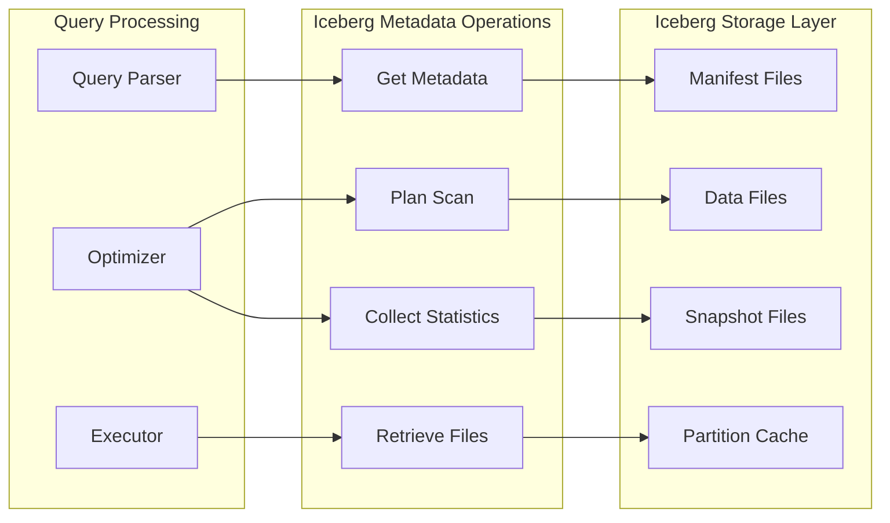
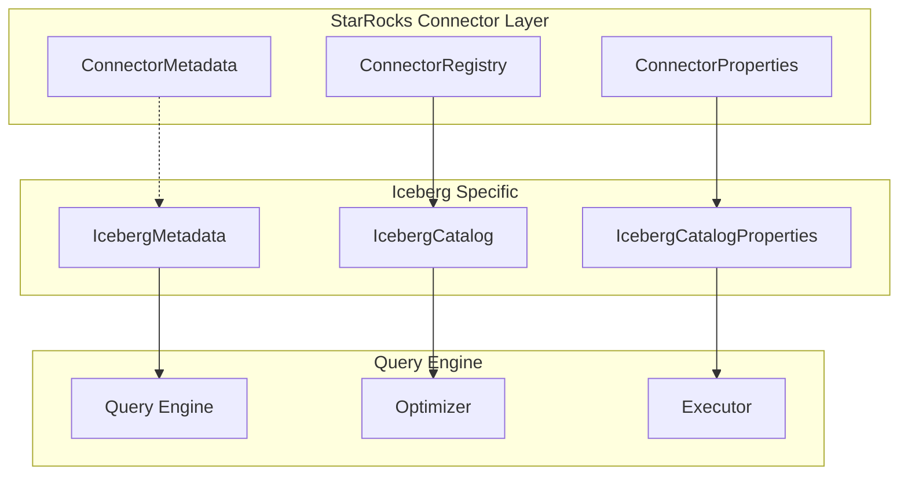
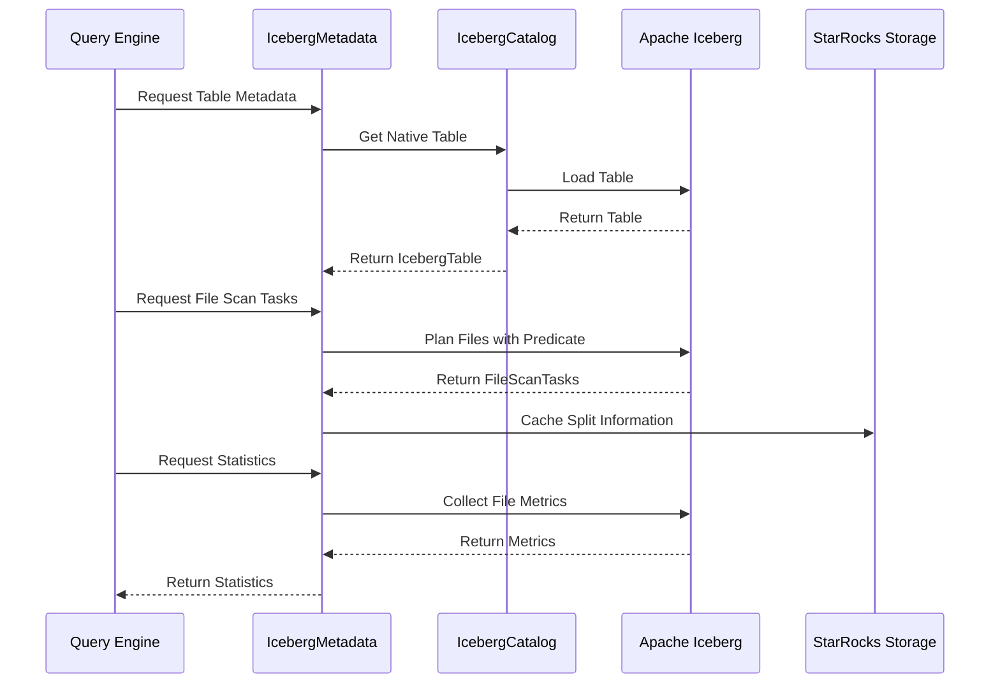
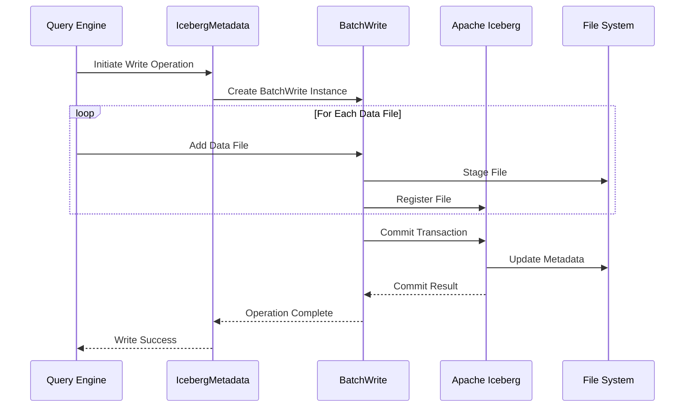

# Iceberg Metadata Module Documentation

## Overview

The Iceberg Metadata module is a core component of StarRocks' connector framework that provides comprehensive metadata management and operations for Apache Iceberg tables. This module serves as the bridge between StarRocks' query engine and Iceberg's table format, enabling seamless integration with Iceberg's advanced features including time travel, schema evolution, and partition management.

## Purpose and Core Functionality

The primary purpose of the Iceberg Metadata module is to:

- **Metadata Management**: Handle all metadata operations for Iceberg tables including table creation, alteration, and deletion
- **Data Discovery**: Provide efficient table and partition discovery mechanisms
- **Version Management**: Support Iceberg's time travel capabilities with snapshot-based versioning
- **Statistics Collection**: Gather and maintain table statistics for query optimization
- **File Management**: Coordinate file operations and remote file information retrieval
- **Write Operations**: Handle data ingestion with support for append, overwrite, and rewrite operations

## Architecture and Component Relationships

### Core Architecture

```mermaid
graph TB
    subgraph "Iceberg Metadata Module"
        IM[IcebergMetadata]
        ICE[IcebergCatalog]
        ISP[IcebergStatisticProvider]
        IMR[IcebergMetricsReporter]
        IAC[IcebergApiConverter]
        IATE[IcebergAlterTableExecutor]
        IPR[IcebergProcedureRegistry]
    end

    subgraph "Core Data Structures"
        IT[IcebergTable]
        IRI[IcebergRemoteFileInfo]
        ISST[IcebergSplitScanTask]
        ISE[IcebergSinkExtra]
    end

    subgraph "External Dependencies"
        CM[ConnectorMetadata]
        AT[Apache Iceberg Table]
        FS[FileIO System]
        SS[StarRocks Storage]
    end

    IM --> ICE
    IM --> ISP
    IM --> IMR
    IM --> IAC
    IM --> IATE
    IM --> IPR
    
    IM --> IT
    IM --> IRI
    IM --> ISST
    IM --> ISE
    
    IM -.-> CM
    IM -.-> AT
    IM -.-> FS
    IM -.-> SS
```



### Data Flow Architecture



## Key Components and Responsibilities

### IcebergMetadata Class

The central orchestrator that implements the `ConnectorMetadata` interface, providing:

- **Table Lifecycle Management**: Create, alter, drop tables and views
- **Metadata Caching**: Efficient caching of table metadata and file scan tasks
- **Statistics Management**: Integration with StarRocks' statistics framework
- **Write Operations**: Support for append, overwrite, and rewrite operations
- **Version Control**: Time travel support through snapshot management

### IcebergSinkExtra

A specialized data structure that tracks files during write operations:

```java
public static class IcebergSinkExtra {
    private final Set<DataFile> scannedDataFiles;
    private final Set<DeleteFile> appliedDeleteFiles;
}
```

This component is crucial for:
- **Rewrite Operations**: Tracking which data files were scanned and modified
- **Delete File Management**: Managing equality delete files in merge-on-read scenarios
- **Transaction Integrity**: Ensuring atomic commit operations

### BatchWrite Implementations

Three specialized write strategies:

1. **Append**: Standard append operations for new data
2. **DynamicOverwrite**: Partition-level overwrite operations
3. **RewriteData**: Full table rewrite with delete file support

## Integration with StarRocks Ecosystem

### Connector Framework Integration



### Statistics Integration

The module integrates with StarRocks' cost-based optimizer through:

- **Column Statistics**: Per-column cardinality and distribution statistics
- **Partition Statistics**: Partition-level data distribution
- **File-level Metrics**: Row counts, null values, and bounds information
- **Dynamic Sampling**: Runtime statistics collection during query execution

## Data Flow and Processing

### Query Planning Flow



### Write Operation Flow



## Advanced Features

### Time Travel Support

The module provides comprehensive time travel capabilities:

```java
public static long getSnapshotIdFromVersion(org.apache.iceberg.Table table, ConnectorTableVersion version) {
    switch (version.getPointerType()) {
        case TEMPORAL:
            return getSnapshotIdFromTemporalVersion(table, version.getConstantOperator());
        case VERSION:
            return getTargetSnapshotIdFromVersion(table, version.getConstantOperator());
    }
}
```

### Partition Evolution

Handles complex partition transformations:
- **Identity Partitions**: Direct column mapping
- **Transformed Partitions**: Date/time transformations
- **Partition Evolution**: Schema changes over time

### Merge-on-Read (MOR) Support

Advanced support for Iceberg's MOR pattern:
- **Delete File Management**: Equality and positional deletes
- **File Filtering**: Predicate pushdown on delete files
- **Async Processing**: Parallel processing of delete files

## Performance Optimizations

### Caching Strategy

Multi-level caching approach:

1. **Table Metadata Cache**: In-memory table metadata
2. **File Scan Task Cache**: Cached split information
3. **Schema Cache**: Reused schema and partition spec strings
4. **Statistics Cache**: Aggregated statistics per table

### Parallel Processing

```java
private final ExecutorService jobPlanningExecutor;
private final ExecutorService refreshOtherFeExecutor;
```

Dedicated thread pools for:
- **Metadata Operations**: Parallel table planning
- **Cache Refresh**: Background metadata updates
- **Statistics Collection**: Concurrent stats gathering

### Predicate Pushdown

Advanced predicate optimization:
- **Iceberg Expression Conversion**: StarRocks to Iceberg predicate translation
- **Residual Evaluation**: Post-scan filtering
- **Partition Pruning**: Eliminate unnecessary partitions

## Error Handling and Recovery

### Transaction Management

Robust transaction handling with:
- **Commit State Validation**: Ensure transaction integrity
- **Rollback Support**: Automatic cleanup on failure
- **Unknown State Handling**: Graceful handling of commit uncertainties

### Exception Handling

Comprehensive error handling for:
- **Table Not Found**: Graceful degradation
- **Schema Mismatch**: Validation and reporting
- **Network Issues**: Retry mechanisms
- **Permission Errors**: Clear error messaging

## Monitoring and Observability

### Metrics Collection

Integrated metrics reporting:
- **Scan Metrics**: File counts, data sizes, timing information
- **Cache Metrics**: Hit rates, eviction counts
- **Error Metrics**: Failure rates by operation type

### Tracing Support

Detailed tracing for debugging:
```java
try (Timer ignored = Tracers.watchScope(tracers, EXTERNAL, "ICEBERG.processSplit." + key)) {
    collectTableStatisticsAndCacheIcebergSplit(key, table, predicate, limit, tracers, connectContext);
}
```

## Security and Access Control

### Cloud Configuration

Secure cloud storage integration:
- **Credential Management**: Encrypted credential storage
- **Access Control**: Fine-grained permissions
- **Audit Logging**: Comprehensive access logs

### Data Privacy

Privacy-preserving operations:
- **Metadata Isolation**: Separate metadata and data access
- **Encryption Support**: End-to-end encryption
- **Compliance**: GDPR and CCPA compliance features

## Dependencies and Integration Points

### External Dependencies

- **Apache Iceberg**: Core table format library
- **Hadoop Ecosystem**: File system abstraction
- **Cloud Storage**: S3, Azure, GCS integrations
- **Authentication**: Kerberos, OAuth support

### Internal Dependencies

- **Connector Framework**: Base connector interfaces
- **Query Engine**: Statistics and optimization integration
- **Catalog System**: Metadata persistence
- **Security Framework**: Authentication and authorization

## Future Enhancements

### Planned Features

- **Branch Support**: Multi-branch table management
- **View Support**: Iceberg view integration
- **Streaming Integration**: Real-time data ingestion
- **Advanced Statistics**: Histogram and sketch support

### Performance Improvements

- **Vectorized Operations**: SIMD-optimized processing
- **Async I/O**: Non-blocking I/O operations
- **Memory Management**: Improved memory pooling
- **Network Optimization**: Reduced metadata transfer

## References

- [Apache Iceberg Documentation](https://iceberg.apache.org/docs/)
- [StarRocks Connector Framework](connector_framework.md)
- [Query Execution Engine](query_execution.md)
- [Storage Engine](storage_engine.md)
- [Catalog Management](frontend_server.md#catalog-management)

## Conclusion

The Iceberg Metadata module represents a sophisticated integration between StarRocks and Apache Iceberg, providing enterprise-grade features for modern data lakehouse architectures. Its comprehensive feature set, performance optimizations, and robust error handling make it suitable for production deployments requiring reliable and efficient Iceberg table management.