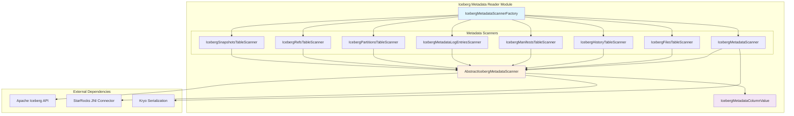
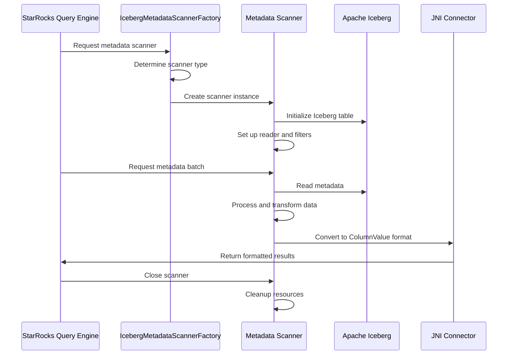

# Iceberg Metadata Reader Module

## Overview

The `iceberg_metadata_reader` module is a specialized Java extension within the StarRocks system designed to read and process Apache Iceberg table metadata. This module provides efficient access to Iceberg's rich metadata layer, enabling StarRocks to query table metadata without scanning the actual data files.

## Purpose and Core Functionality

The primary purpose of this module is to:
- **Metadata Access**: Provide read access to Apache Iceberg table metadata including files, manifests, snapshots, partitions, and history
- **Query Optimization**: Enable metadata-only queries for better query planning and optimization
- **Table Introspection**: Support inspection of table structure, partitioning, and data distribution
- **Performance Enhancement**: Reduce query overhead by accessing metadata directly instead of scanning data files

## Architecture Overview

## Component Architecture

The module follows a hierarchical design pattern with clear separation of concerns:

### Core Components

#### 1. [IcebergMetadataScannerFactory](factory.md)
- **Purpose**: Factory class for creating appropriate metadata scanner instances
- **Location**: `java-extensions.iceberg-metadata-reader.src.main.java.com.starrocks.connector.iceberg.IcebergMetadataScannerFactory`
- **Key Responsibilities**:
  - Scanner type resolution based on input parameters
  - Dynamic class loading using isolated classloader
  - Scanner instance creation and management

#### 2. AbstractIcebergMetadataScanner
- **Purpose**: Base class providing common functionality for all metadata scanners
- **Key Features**:
  - Common initialization and lifecycle management
  - Shared data processing utilities
  - JNI connector integration
  - Error handling and resource management

#### 3. Specialized Metadata Scanners
Each scanner is optimized for specific metadata types:

- **[IcebergFilesTableScanner](files_scanner.md)**: Reads file-level metadata including file paths, formats, sizes, and statistics
- **[IcebergHistoryTableScanner](history_scanner.md)**: Accesses table history and snapshot lineage
- **[IcebergManifestsTableScanner](manifests_scanner.md)**: Processes manifest files containing file metadata
- **[IcebergMetadataLogEntriesScanner](metadata_log_scanner.md)**: Reads metadata log entries for audit and debugging
- **[IcebergPartitionsTableScanner](partitions_scanner.md)**: Analyzes partition information and statistics
- **[IcebergRefsTableScanner](refs_scanner.md)**: Manages table references (branches and tags)
- **[IcebergSnapshotsTableScanner](snapshots_scanner.md)**: Accesses snapshot metadata and commit information

## Data Flow Architecture

## Key Features and Capabilities

### 1. Multi-Metadata Type Support
The module supports reading various Iceberg metadata types through specialized scanners:

- **[File Metadata](files_scanner.md)**: File paths, formats, sizes, record counts, column statistics
- **[Partition Metadata](partitions_scanner.md)**: Partition values, boundaries, statistics  
- **[Snapshot Metadata](snapshots_scanner.md)**: Commit information, parent-child relationships, operations
- **[Manifest Metadata](manifests_scanner.md)**: File listings, partition summaries, data file counts
- **[History Metadata](history_scanner.md)**: Table history and snapshot lineage
- **[Reference Metadata](refs_scanner.md)**: Branch and tag information, retention policies
- **[Metadata Log Entries](metadata_log_scanner.md)**: Audit trail of metadata changes

Each scanner is optimized for its specific metadata type and provides efficient access patterns.

### 2. Efficient Data Processing
- **Batch Processing**: Processes metadata in configurable batch sizes
- **Column Pruning**: Only reads required columns to minimize I/O
- **Predicate Pushdown**: Applies filters at the metadata level
- **Lazy Loading**: Defers expensive operations until necessary

### 3. Serialization and Type Conversion
- **Kryo Integration**: Efficient serialization for complex metadata objects
- **Type Mapping**: Automatic conversion between Iceberg and StarRocks types
- **Timezone Handling**: Proper timestamp and timezone conversions

## Integration with StarRocks Ecosystem

The module integrates with several other StarRocks components:

### Dependencies
- **[JNI Connector](jni_connector.md)**: Provides the interface between Java and native C++ code
- **[Iceberg Connector](iceberg_connector.md)**: Higher-level Iceberg integration and table management
- **[Query Execution](query_execution.md)**: Supports metadata-only queries and query optimization

### Usage Patterns
1. **Metadata Queries**: Direct queries on Iceberg metadata tables
2. **Query Planning**: Access to file listings and statistics for query optimization
3. **Table Management**: Schema evolution and partition management
4. **Data Lineage**: Tracking table changes and audit trails

## Performance Characteristics

### Optimization Strategies
- **Manifest Caching**: Reuses manifest file readers where possible
- **Column Statistics**: Optional loading of column-level statistics
- **Partition Pruning**: Skips irrelevant partitions based on query predicates
- **Parallel Processing**: Supports concurrent metadata scanning

### Resource Management
- **Memory Efficiency**: Streaming processing to handle large metadata sets
- **Connection Pooling**: Reuses Iceberg table connections
- **Error Recovery**: Graceful handling of corrupted or incomplete metadata

## Configuration and Usage

### Scanner Factory Configuration
The [factory](factory.md) supports multiple scanner types:
- `logical_iceberg_metadata`: General metadata scanner
- `refs`: Table references (branches/tags)
- `history`: Table history
- `metadata_log_entries`: Metadata change log
- `snapshots`: Snapshot information
- `manifests`: Manifest file details
- `files`: Individual file metadata
- `partitions`: Partition information

### Parameters
- `fetch_size`: Number of rows to process in each batch
- `split_info`: Serialized manifest or table information
- `serialized_predicate`: Optional predicate for filtering
- `load_column_stats`: Whether to load column-level statistics
- `timezone`: Timezone for timestamp conversions

## Error Handling and Resilience

The module implements comprehensive error handling:
- **Metadata Corruption**: Detection and reporting of corrupted metadata
- **Missing Files**: Graceful handling of missing metadata files
- **Type Mismatches**: Safe conversion between Iceberg and StarRocks types
- **Resource Cleanup**: Proper cleanup of file handles and connections

## Future Enhancements

Potential areas for improvement:
- **Incremental Metadata Loading**: Support for incremental metadata updates
- **Caching Layer**: Metadata caching for frequently accessed tables
- **Parallel Scanning**: Enhanced parallel processing capabilities
- **Metrics Collection**: Performance metrics and monitoring integration

## Related Documentation

- [Iceberg Connector](iceberg_connector.md) - Higher-level Iceberg table integration
- [JNI Connector](jni_connector.md) - Java-native interface components
- [Query Execution](query_execution.md) - Query processing and optimization
- [Storage Engine](storage_engine.md) - Underlying storage layer integration